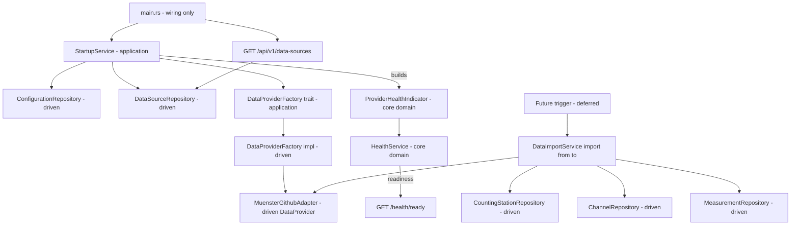

# Architectural Plan: External Data Sources Baseline

Status: implemented

## Goal

Define the baseline for importing measurements, channels and counting-stations from
external data sources:

1. Data sources are configured in `config.toml` as an array. Each data source has a
   **name** and a **single provider** with **key-value provider vars** (nested TOML).
2. Each data provider can check its **health-status** and is listed in the readiness
   health report. **Startup is only blocked on configuration errors** (never on an
   unreachable provider).
3. Providers are called to provide measurements in a time window: **`from`** (start
   datetime, optional → unset means all data from the beginning) and **`to`** (end
   datetime, optional → unset means all available data up to now). The channel is
   **always required** for a measurements call.
4. Providers expose `getAllCountingStations`, `getAllChannels` and
   `getMeasurements`. A **`max_batch_size`** is part of the measurement call; the
   provider has a `max_measurement_batch_size()` getter returning the configured
   default. The result includes the measurements, the **last measurement datetime**
   and a boolean **`batch_size_limit_reached`** so the caller can page.
5. `CountingStation` and `Channel` gain an `external_datasource_id` so the domain can
   detect new vs. already-known entities.
6. Data sources are **persisted in the database** and **synchronised at startup**
   (added if configured, removed if no longer configured). The `data_sources` table
   holds `id` (UUID v5 hashed from the name), `name` (**UNIQUE** at DB level) and
   `provider_type`. Every counting station gets an **optional** link to a data source;
   renaming a data source must never cause data loss.
7. Data sources are listed via `GET /api/v1/data-sources` and the root HATEOAS
   endpoint + Swagger are updated. **No POST/scrape endpoint and no CLI trigger in
   this task** — the `import(from, to)` capability is built and tested; the runtime
   trigger (CLI / scheduling) is a separate, deferred feature.
8. **Startup orchestration lives in the domain/application layer** (`StartupService`).
   `main.rs` is pure dependency wiring: it constructs adapters and calls
   `StartupService::run()` — it never decides what to do at startup.

## Config schema (nested, multi-data-source)

```toml
database_url = "postgres://localhost:5432"
database_user = "postgres"
database_password = "postgres"
database_name = "bike_counter"

[[data_sources]]
name = "Münster"

[data_sources.provider]
type = "münster_opendata_github_provider"

[data_sources.provider.vars]
url = "https://github.com/od-ms/radverkehr-zaehlstellen/archive/refs/heads/main.zip"
max_measurement_batch_size = "500"
```

- Data source names must be unique (duplicate names = configuration error → blocks startup).
- Provider var values are **strings** in TOML (e.g. `max_measurement_batch_size = "500"`).

## Architecture



## Layering (hexagonal, mirrors existing structure)

- **Core domain:** `src/core/domain/data_source/` (new: `provider.rs`,
  `data_source.rs`, `repository.rs`, `health_indicator.rs`) + additions to
  `configuration`, `health`, `counting_stations`, `channels`.
- **Core application:** `src/core/application/` (new):
  `startup_service.rs`, `data_import_service.rs`, `data_provider_factory.rs` (trait).
- **Driven adapters:** `configuration_toml_adapter.rs`, `data_provider_factory.rs` (impl),
  `muenster_github_adapter.rs`, `postgres_data_source_repository.rs` (new), Postgres
  station/channel repositories.
- **Driving adapter (REST):** `GET /api/v1/data-sources` + root link + Swagger.

## Provider interface (core domain)

```rust
// src/core/domain/data_source/provider.rs
pub struct MeasurementQuery {
    pub channel: Channel,             // always required
    pub from: Option<DateTime<Utc>>,  // optional start; None = all data
    pub to: Option<DateTime<Utc>>,    // optional end; None = all data up to now
    pub max_batch_size: usize,        // limit for this call
}

pub struct MeasurementBatch {
    pub measurements: Vec<Measurement>,
    pub last_measurement_datetime: Option<DateTime<Utc>>, // last item's timestamp
    pub batch_size_limit_reached: bool, // true when more data may remain
}

pub trait DataProvider: Send + Sync {
    fn check_health(&self) -> HealthStatus;
    fn get_all_counting_stations(&self) -> Result<Vec<CountingStation>, ProviderError>;
    fn get_all_channels(&self) -> Result<Vec<Channel>, ProviderError>;
    fn get_measurements(&self, query: MeasurementQuery) -> Result<MeasurementBatch, ProviderError>;
    fn max_measurement_batch_size(&self) -> usize; // configured default for max_batch_size
}
```

Paging contract: the caller repeats `get_measurements` with
`from = batch.last_measurement_datetime` while `batch.batch_size_limit_reached` is true;
it stops when the flag is false or the batch is empty.

## DataProviderFactory (application trait + driven impl)

The startup decision "build a provider for every configured data source" belongs to the
domain/application layer, so it depends on an **abstraction**:

```rust
// src/core/application/data_provider_factory.rs (trait)
pub trait DataProviderFactory: Send + Sync {
    /// Takes the full data-source values (name, provider type, vars) and returns
    /// a concrete provider. Unknown provider_type => ConfigError (blocks startup).
    fn build(&self, config: &DataSourceConfiguration)
        -> Result<Arc<dyn DataProvider>, ConfigError>;
}
```

```rust
// src/adapter/driven/data_provider_factory.rs (impl)
pub struct DataProviderFactoryImpl { /* registry of known provider types */ }
impl DataProviderFactory for DataProviderFactoryImpl { /* maps "münster_opendata_github_provider" -> MuensterGithubAdapter */ }
```

For this baseline it maps `"münster_opendata_github_provider"` → `MuensterGithubAdapter`.

## Startup orchestration (application layer)

`StartupService` decides what happens at startup; `main.rs` only wires dependencies
and calls `run()`.

```rust
// src/core/application/startup_service.rs
pub struct StartupResult {
    pub data_source_runtimes: Vec<DataSourceRuntime>,
    pub provider_health_indicators: Vec<Arc<dyn ServiceHealthIndicator>>,
}

pub struct StartupService {
    configuration_repository: Arc<dyn ConfigurationRepository>,
    data_source_repository: Arc<dyn DataSourceRepository>,
    data_provider_factory: Arc<dyn DataProviderFactory>,
}

impl StartupService {
    pub fn run(&self) -> Result<StartupResult, ConfigError> {
        // 1. read configuration -> Vec<DataSourceConfiguration>
        // 2. for each: build provider via factory, compute data_source_id
        //    (UUID v5 hashed from name), upsert into DataSourceRepository
        // 3. remove persisted data sources no longer configured (delete by id)
        // 4. wrap each provider in ProviderHealthIndicator
        // returns runtimes + provider health indicators
    }
}
```

`main.rs` then combines `PostgresHealthCheck` + `provider_health_indicators` into the
`HealthService` and passes the repositories into the REST adapter. The runtimes are
kept so the deferred import feature can build a `DataImportService`.

## Step-by-Step Implementation

### 1. Config schema + example
- Replace top-level `github_data_url` in [`config.toml`](config.toml) with the
  `data_sources` array above.
- Configuration is **only** through `config.toml` files - no environment variables and
  no `.env` file (neither for the database nor for data sources).
  [`docker/entrypoint.sh`](docker/entrypoint.sh) requires a mounted `config.toml` and uses
  it as-is.

### 2. Configuration domain
- In [`src/core/domain/configuration/configuration.rs`](src/core/domain/configuration/configuration.rs:1)
  add value objects:
  - `DataSourceConfiguration { name: String, provider: DataProviderConfiguration }`
  - `DataProviderConfiguration { provider_type: String, vars: HashMap<String, String> }`
- Validation returning `Result<_, ConfigError>`: non-empty name/type, unique data source names.
- Remove `RawGithubDataUrl` / `github_data_url`; `Configuration::new` takes database
  config + `Vec<DataSourceConfiguration>`; add `Configuration::data_sources()`.

### 3. Config adapter
- Extend [`src/adapter/driven/configuration_toml_adapter.rs`](src/adapter/driven/configuration_toml_adapter.rs:1):
  `ConfigurationDto` gains `data_sources: Vec<DataSourceDto>` with nested
  `DataSourceDto { name, provider: DataProviderDto }`,
  `DataProviderDto { #[serde(rename = "type")] provider_type, vars: HashMap<String,String> }`.
  `#[serde(default)]` on `data_sources` keeps existing files valid.

### 4. Core data_source domain: provider types (new module)
- `src/core/domain/data_source/provider.rs`: `DataProvider`, `MeasurementQuery`,
  `MeasurementBatch`, `ProviderError` (interface above).

### 5. Core data_source domain: ProviderHealthIndicator (pure core)
- `src/core/domain/data_source/health_indicator.rs`:
  ```rust
  pub struct ProviderHealthIndicator { name: String, provider: Arc<dyn DataProvider> }
  impl ServiceHealthIndicator for ProviderHealthIndicator {
      fn name(&self) -> String { self.name.clone() }      // "<data_source_name>/<provider_type>"
      fn check(&self) -> HealthStatus { self.provider.check_health() }
  }
  ```
  Pure domain (no I/O), so it lives in core, not in driven.

### 6. Core data_source domain: DataSource entity + repository
- `src/core/domain/data_source/data_source.rs`:
  ```rust
  pub struct DataSource {
      pub id: Id,                 // UUID v5 hashed from the name (deterministic)
      pub name: Name,
      pub provider_type: ProviderType,
  }
  ```
  plus `DataSource::id_from_name(&str) -> Id` (UUID v5 with a fixed namespace).
- `src/core/domain/data_source/repository.rs`: `DataSourceRepository`
  (`upsert`, `find_by_id`, `find_by_name`, `find_all`, `delete`).
- `mod.rs`; register `pub mod data_source;` in
  [`src/core/domain/mod.rs`](src/core/domain/mod.rs:1).
- Remove the dead, uncompiled
  [`src/core/domain/measurements/provider.rs`](src/core/domain/measurements/provider.rs:1).

### 7. Health trait supports dynamic names
- Change [`ServiceHealthIndicator::name()`](src/core/domain/health/indicator.rs:30) to
  return `String`; update [`HealthService`](src/core/domain/health/service.rs:1),
  [`PostgresHealthCheck`](src/adapter/driven/postgres_health_check.rs:26) and REST mocks.

### 8. Domain entities
- Add `ExternalDatasourceId` value object to
  [`counting_station.rs`](src/core/domain/counting_stations/counting_station.rs:1) and
  [`channel.rs`](src/core/domain/channels/channel.rs:1); add
  `external_datasource_id: Option<ExternalDatasourceId>` to both.
- Add optional `data_source_id: Option<Id>` to `CountingStation` (link to the persisted
  data source; nullable → no data loss on rename).

### 9. Repository traits
- Add `find_by_external_datasource_id` to
  [`CountingStationRepository`](src/core/domain/counting_stations/repository.rs:1) and
  [`ChannelRepository`](src/core/domain/channels/repository.rs:1) returning
  `Result<Option<Entity>, DomainError>`.
- Add `DataSourceRepository` (see step 6).

### 10. Migration V2
- `migrations/V2__add_data_sources.sql`:
  ```sql
  CREATE TABLE data_sources (
      id UUID PRIMARY KEY,
      name TEXT NOT NULL UNIQUE,          -- unique at DB level
      provider_type TEXT NOT NULL
  );

  ALTER TABLE counting_stations ADD COLUMN external_datasource_id TEXT;
  ALTER TABLE counting_stations ADD COLUMN data_source_id UUID
      REFERENCES data_sources(id) ON DELETE SET NULL;   -- optional link, no data loss
  ALTER TABLE channels ADD COLUMN external_datasource_id TEXT;

  CREATE UNIQUE INDEX idx_counting_stations_external_datasource_id
      ON counting_stations (external_datasource_id);
  CREATE UNIQUE INDEX idx_channels_external_datasource_id
      ON channels (external_datasource_id);
  ```

### 11. Postgres repositories
- Update [`PostgresCountingStationRepository`](src/adapter/driven/postgres_counting_station_repository.rs:1)
  and [`PostgresChannelRepository`](src/adapter/driven/postgres_channel_repository.rs:1):
  save/read `external_datasource_id`; implement `find_by_external_datasource_id`;
  save/read `data_source_id` on stations.
- Add `src/adapter/driven/postgres_data_source_repository.rs` implementing
  `DataSourceRepository` with `INSERT ... ON CONFLICT (id) DO UPDATE SET name,
  provider_type` upsert and a `DELETE` for stale data sources.

### 12. DataProviderFactory
- Application trait `src/core/application/data_provider_factory.rs`
  (`build(&DataSourceConfiguration) -> Result<Arc<dyn DataProvider>, ConfigError>`).
- Driven impl `src/adapter/driven/data_provider_factory.rs`; unknown `provider_type` →
  `ConfigError::InvalidFormat` (blocks startup). Register in
  [`src/adapter/driven/mod.rs`](src/adapter/driven/mod.rs:1).

### 13. MuensterGithubAdapter (rewrite)
- Rewrite [`muenster_github_adapter.rs`](src/adapter/driven/muenster_github_adapter.rs:1)
  to implement `DataProvider`:
  - `new(&DataSourceConfiguration) -> Result<Self, ConfigError>`: parse required `url`,
    optional `max_measurement_batch_size` (default e.g. 500).
  - `check_health()`: real reachability probe of the URL.
  - `max_measurement_batch_size()`: returns the configured default.
  - `get_all_*` / `get_measurements`: baseline stubs returning empty data
    (`batch_size_limit_reached = false`). GitHub download + CSV parsing is the follow-up.

### 14. StartupService (application)
- `src/core/application/startup_service.rs` (see orchestration above):
  `run() -> Result<StartupResult, ConfigError>` decides what happens at startup —
  read config, build providers, sync data sources (upsert + remove stale), build
  provider health indicators.
- `DataSourceRuntime { configuration, data_source_id, provider }` lives here (shared
  with `DataImportService`).

### 15. DataImportService (application)
- `src/core/application/data_import_service.rs`:
  ```rust
  pub struct DataImportService {
      counting_station_repository: Arc<dyn CountingStationRepository>,
      channel_repository: Arc<dyn ChannelRepository>,
      measurement_repository: Arc<dyn MeasurementRepository>,
      runtimes: Vec<DataSourceRuntime>,
  }

  impl DataImportService {
      pub fn import(&self, from: Option<DateTime<Utc>>, to: Option<DateTime<Utc>>)
          -> Result<ImportSummary, DomainError>;
  }
  ```
  - Per runtime:
    1. sync counting stations: `get_all_counting_stations` → save those whose
       `external_datasource_id` is new, with `data_source_id` set.
    2. sync channels: `get_all_channels` → resolve station by external id, save new ones.
    3. measurements per channel: page
       `get_measurements(query with channel, from, to, max_batch_size = provider.max_measurement_batch_size())`,
       `save_batch`, continue while `batch_size_limit_reached`, advancing
       `from = last_measurement_datetime`.
  - Returns `ImportSummary` (counts). Not triggered in this task.

### 16. Application registration + dead code
- Register `pub mod application;` in [`src/core/mod.rs`](src/core/mod.rs:1);
  replace the broken [`station_import_service.rs`](src/core/application/station_import_service.rs:1).

### 17. Wiring (main.rs - pure dependency wiring only)
- [`src/main.rs`](src/main.rs:1):
  - Construct driven adapters (configuration, postgres repos incl. data sources, factory impl).
  - Build `StartupService` and call `run()` (`expect` on config errors → fail fast).
  - Assemble `HealthService` = `PostgresHealthCheck` + returned provider indicators.
  - Pass repos + `DataSourceRepository` + `HealthService` into the REST adapter; serve.
  - **No startup decision logic in main.rs.**

### 18. REST driving adapter
- [`src/adapter/driving/rest/dto.rs`](src/adapter/driving/rest/dto.rs):
  `DataSourceDto` (id, name, provider_type), `DataSourceListDto`.
- [`src/adapter/driving/rest/handlers.rs`](src/adapter/driving/rest/handlers.rs):
  - `GET /api/v1/data-sources`: list persisted data sources from `DataSourceRepository`.
  - `AppState` gains `data_source_repository`.
- [`src/adapter/driving/rest/mod.rs`](src/adapter/driving/rest/mod.rs): route + constructor.
- Root [`ApiRootDto`](src/adapter/driving/rest/dto.rs): add HATEOAS link to
  `data-sources`.
- **No POST / scrape endpoint** (removed per request).

### 19. OpenAPI / Swagger
- [`src/adapter/driving/rest/openapi.rs`](src/adapter/driving/rest/openapi.rs): register
  `list_data_sources` and `get_data_source_by_id` paths, `DataSourceDto`/`DataSourceListDto`
  schemas, a `Data Sources` tag.
- Verify the root endpoint and Swagger document (add a REST test asserting `/api/v1`
  links and the new path appear in `openapi.json`).

### 20. Docker + documentation
- [`docker/entrypoint.sh`](docker/entrypoint.sh) requires a mounted `config.toml` (TOML-only
  configuration; no environment variables, no `.env` file).
- [`docker-compose.yml`](docker-compose.yml) mounts `./config.toml:/app/config.toml:ro` and
  hardcodes the database development defaults.
- Update [`README.md`](README.md) and [`ToDo.md`](ToDo.md).

### 21. Tests
- Config adapter: parse nested `data_sources`; reject unknown/missing fields.
- Configuration domain: empty name/type and duplicate names rejected.
- Factory: known type builds provider; unknown type → config error.
- Provider health: `MuensterGithubAdapter::check_health` up/down;
  `ProviderHealthIndicator` name/status.
- `StartupService` with mocks: `run()` upserts configured data sources, removes stale
  ones, and returns one health indicator per data source.
- `DataImportService` with mocks: `import` saves new stations/channels once and pages
  measurements on `last_measurement_datetime` / `batch_size_limit_reached`.
- REST tests: list data sources, root endpoint links, Swagger contains the new path;
  update `MockServiceHealthIndicator` to `String` names.

## Verification

- `cargo fmt`, `cargo clippy`, `cargo test` (repository tests need the Postgres test container).
- Manual: check `/api/v1`, `/api/v1/data-sources`, Swagger UI after startup.
- The `import(from, to)` capability is covered by unit tests with mocks; the runtime
  trigger is a separate, deferred feature.
