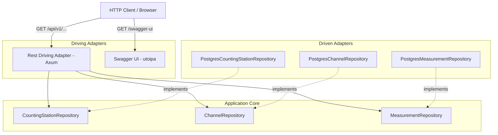

# Architectural Plan: REST-Ful READ ONLY API with HATEOAS & Swagger UI

## Overview
This plan describes the implementation of a driving REST adapter for the bike counter application using `axum` and `utoipa`. The API is strictly READ-ONLY (`GET` endpoints), follows a flat URL hierarchy starting at `/api/v1`, includes HATEOAS hypermedia links (`_links`), and serves interactive Swagger UI documentation at `/swagger-ui`.

## Architecture Diagram

## Step-by-Step Implementation Steps

1. **Add Dependencies in [`Cargo.toml`](Cargo.toml)**
   - Add `tokio` (with `full` features).
   - Add `axum` for HTTP routing.
   - Add `utoipa` (with `axum_extras`, `uuid`, `chrono` features) for automatic OpenAPI spec generation.
   - Add `utoipa-swagger-ui` (with `axum` feature) for serving Swagger UI.
   - Add `serde_json` for JSON serialization.

2. **Define HATEOAS DTOs in [`src/adapter/driving/rest/dto.rs`](src/adapter/driving/rest/dto.rs)**
   - `LinkDto`: Hypermedia link structure containing `href` and `rel`.
   - `CountingStationDto`: Contains `id`, `name`, `description`, and `_links` map (e.g. `self`, `channels`).
   - `ChannelDto`: Contains `id`, `counting_station_id`, `name`, `description`, and `_links` map (e.g. `self`, `counting_station`, `measurements`).
   - `MeasurementDto`: Contains `id`, `value`, `channel_id`, `timestamp`, and `_links` map (e.g. `self`, `channel`).

3. **Implement REST Handlers & OpenAPI Schemas in [`src/adapter/driving/rest/mod.rs`](src/adapter/driving/rest/mod.rs)**
   - `GET /api/v1/counting-stations`: List all counting stations.
   - `GET /api/v1/counting-stations/{id}`: Get counting station by ID.
   - `GET /api/v1/channels`: List channels (optional filter by `counting_station_id`).
   - `GET /api/v1/channels/{id}`: Get channel by ID.
   - `GET /api/v1/measurements`: Query measurements (optional filters by `channel_id`, `from`, `to`).
   - `GET /api/v1/measurements/{id}`: Get measurement by ID.

4. **Integrate OpenAPI & Swagger UI**
   - Annotate handlers with `#[utoipa::path(...)]`.
   - Define `#[derive(OpenApi)]` struct `ApiDoc` aggregating all endpoints and schemas.
   - Mount `SwaggerUi::new("/swagger-ui").url("/api-docs/openapi.json", ApiDoc::openapi())` on the Axum router.

5. **Wire Up Application Server in [`src/main.rs`](src/main.rs)**
   - Initialize driven PostgreSQL repositories.
   - Set up Axum router with state.
   - Start Tokio async server listening on `0.0.0.0:8080`.
