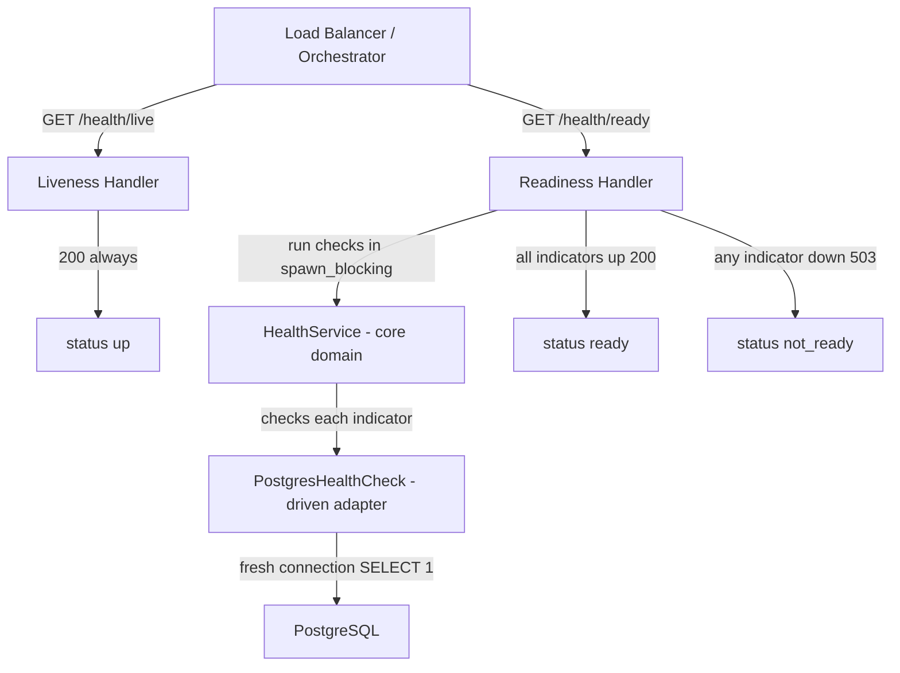

# Architectural Plan: Health-Check (Liveness + Readiness)

Status: implemented

## Overview
Add operational health endpoints to the bike-counter REST service:
- `GET /health/live` — liveness: always `200` while the backend process is running.
- `GET /health/ready` — readiness: performs a real PostgreSQL check (`SELECT 1` on a fresh connection) and returns `200` only when the downstream service is available, otherwise `503`.

The app keeps its existing fail-fast-on-startup behaviour when PostgreSQL is unreachable, so readiness detects runtime DB outages after startup. A Docker `HEALTHCHECK` is added using `curl` against `/health/ready`.

## Architecture Diagram

## Layering (hexagonal, mirrors existing structure)

- Core domain: `src/core/domain/health/` — trait + value types + aggregator.
- Driven adapter: `src/adapter/driven/postgres_health_check.rs` — real DB probe.
- Driving adapter (REST): DTOs, handlers, routes, OpenAPI in `src/adapter/driving/rest/`.

## Step-by-Step Implementation Steps

1. **Core domain health module** — `src/core/domain/health/`
   - `indicator.rs`: `HealthStatus` enum (`Up`, `Down(String)`), `HealthComponent` struct (`name`, `status`), and the `ServiceHealthIndicator` trait (`fn name() -> &'static str`, `fn check() -> HealthStatus`). Add `HealthStatus::is_up()` helper.
   - `service.rs`: `HealthService` aggregator holding `Vec<Arc<dyn ServiceHealthIndicator + Send + Sync>>`; `check()` runs every indicator and returns `Vec<HealthComponent>` plus an overall `is_ready()` result. Purely synchronous so it can run inside `spawn_blocking`.
   - `mod.rs` declaring submodules; register `pub mod health;` in `src/core/domain/mod.rs`.

2. **PostgresHealthCheck driven adapter** — `src/adapter/driven/postgres_health_check.rs`
   - `new(DatabaseConfiguration)` (config is `Clone`), implement `ServiceHealthIndicator` with `name() = "postgres"`.
   - `check()` builds a fresh `postgres::Config` from the configuration, connects with `NoTls`, runs `SELECT 1`, and returns `HealthStatus::Up` or `HealthStatus::Down(message)`. A new connection per probe keeps it stateless and independent of the shared `Mutex<Client>` repository clients.
   - Register in `src/adapter/driven/mod.rs`.

3. **Health DTOs** — `src/adapter/driving/rest/dto.rs`
   - `HealthComponentDto`: `name`, `status`, optional `error` (`#[serde(skip_serializing_if = "Option::is_none")]`).
   - `HealthDto`: `status` string plus `components` vector. Both derive `Serialize`/`Deserialize`/`ToSchema`.
   - Liveness reuses a small `HealthDto` with only `status = "up"` (no components) or a dedicated shape — implementer chooses the cleanest option.

4. **Handlers + AppState** — `src/adapter/driving/rest/handlers.rs`
   - Add `health_check: Arc<dyn ServiceHealthIndicator + Send + Sync>` (or `health_service: Arc<HealthService>`) to `AppState`.
   - `get_health_live()`: stateless, returns `200` with `{"status":"up"}`.
   - `get_health_ready(State(state))`: runs the health check inside `tokio::task::spawn_blocking` (the sync `postgres` crate cannot run on a tokio worker), maps a `JoinError` to a down component ("backend check task failed"), builds the DTO, and returns `200` when ready / `503` when not.
   - Annotate both with `#[utoipa::path]`.

5. **Routes + constructor** — `src/adapter/driving/rest/mod.rs`
   - Extend `RestApiAdapter::new(...)` to accept the health check and store it in `AppState`.
   - Add `.route("/health/live", get(get_health_live))` and `.route("/health/ready", get(get_health_ready))` outside the versioned `/api/v1` namespace.

6. **OpenAPI** — `src/adapter/driving/rest/openapi.rs`
   - Add `get_health_live` / `get_health_ready` to `paths`, `HealthDto` / `HealthComponentDto` to `schemas`, and a `Health` tag.

7. **Wiring** — `src/main.rs`
   - Construct `Arc::new(PostgresHealthCheck::new(configuration.database().clone()))` and pass it to `RestApiAdapter::new`.

8. **Tests**
   - Core domain unit tests: `HealthStatus::is_up`, `HealthService` aggregation with mock indicators (all up => ready; any down => not ready).
   - Driven adapter test: `PostgresHealthCheck` against the Postgres test container (assert `Up` when reachable; optionally assert `Down` when pointed at a port with no listener).
   - REST tests: add `MockServiceHealthIndicator` (configurable up/down) to `src/adapter/driving/rest/tests/mocks.rs`; extend `TestApp` to inject it; add `src/adapter/driving/rest/tests/health.rs` covering:
     - `/health/live` returns `200` with `status = up`.
     - `/health/ready` returns `200` + up components when the indicator is up.
     - `/health/ready` returns `503` + down components (with error) when the indicator is down.
     - OpenAPI document contains `/health/live` and `/health/ready`.
   - Register the `health` test module in `src/adapter/driving/rest/tests/mod.rs`.

9. **Docker health-check**
   - `Dockerfile` runtime stage: install `curl`, add `HEALTHCHECK --interval=30s --timeout=5s --start-period=10s --retries=3 CMD curl --fail --silent http://localhost:8080/health/ready || exit 1`.
   - `docker-compose.yml`: add an explicit `healthcheck` block for the `app` service (matching the Dockerfile values) for clarity.

10. **Documentation** — `README.md`: document `/health/live`, `/health/ready` and the Docker health-check.

11. **Verification** — run `cargo fmt`, `cargo clippy`, `cargo test adapter::driving::rest::tests`, and `cargo test` (repository tests need Docker for the Postgres test container).
