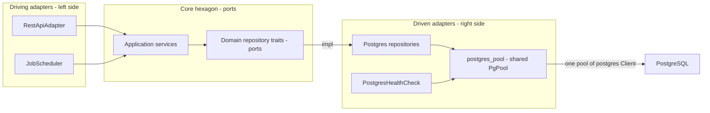

# Architectural Plan: Optimize the Persistence Adapter

## Goal

Optimize the Postgres-driven persistence layer without changing the domain
traits or the async/blocking call pattern. The current design opens **five
independent synchronous `postgres::Client` connections** (one per repository),
each wrapped in a `std::sync::Mutex` and each running the full migration set at
construction. That serializes every query per repository, wastes startup work,
and prevents concurrent DB access.

Target outcomes:

1. **One shared connection pool** for all five repositories and the Postgres
   health check instead of five independent `Mutex<Client>` connections.
2. **Migrations run exactly once** at startup instead of once per repository.
3. **Concurrent queries** — reads/writes no longer serialized behind a per-
   repository `Mutex`; independent operations use different pooled connections.
4. **Faster bulk measurement ingestion** — `save_batch` uses a single multi-row
   `INSERT` instead of N round trips inside a transaction.
5. **Index-friendly job filtering** — `job_type`/`status` filters pushed down to
   the SQL `WHERE` clause (the existing `idx_jobs_type_status` index is used)
   instead of loading all rows and filtering in Rust.

Scope is deliberately minimal: the **synchronous** `postgres` crate is kept, the
domain repository traits stay synchronous, and every blocking call keeps using
`tokio::task::spawn_blocking` (still required by the sync `postgres` crate). A
full async migration to `tokio-postgres`/`deadpool-postgres` is explicitly **out
of scope** and documented as a possible future task.

## Current State

All five repositories follow the same pattern:

- [`postgres_channel_repository.rs`](../src/adapter/driven/postgres_channel_repository.rs:14)
- [`postgres_counting_station_repository.rs`](../src/adapter/driven/postgres_counting_station_repository.rs:14)
- [`postgres_data_source_repository.rs`](../src/adapter/driven/postgres_data_source_repository.rs:15)
- [`postgres_job_repository.rs`](../src/adapter/driven/postgres_job_repository.rs:28)
- [`postgres_measurement_repository.rs`](../src/adapter/driven/postgres_measurement_repository.rs:14)

Each:

- Holds `client: Mutex<Client>` — serializes all DB work for that repository.
- Runs the identical `PostgresConfig::from_str(...) + user/password/dbname +
  connect(NoTls)` bootstrap in its `new(&DatabaseConfiguration)`.
- Runs `migrations::runner().run(&mut client)` in its constructor (5x per boot).
- Calls `embed_migrations!("migrations")` locally (duplicated in 5 files).

Supporting code:

- [`postgres_health_check.rs`](../src/adapter/driven/postgres_health_check.rs:16)
  opens a **fresh connection per probe** to avoid contending with the repository
  `Mutex`s.
- [`main.rs`](../src/main.rs:50) constructs each repository with the same
  `&DatabaseConfiguration`, producing 5 connections.
- [`Cargo.toml`](../Cargo.toml:10) uses `postgres 0.19` (sync) + `refinery 0.8`;
  no pooling crate present.

## Proposed Architecture (hexagonal)

The project is a hexagonal (ports-and-adapters) architecture. This task
**only touches the right-side driven ring**; the core domain ports (repository
traits) and the application services are left untouched.



Hexagonal view of the change:

- **Core domain (unchanged):** the five repository *ports*
  [`CountingStationRepository`](../src/core/domain/counting_stations/repository.rs:1),
  [`ChannelRepository`](../src/core/domain/channels/repository.rs:1),
  [`DataSourceRepository`](../src/core/domain/data_source/repository.rs:1),
  [`JobRepository`](../src/core/domain/jobs/repository.rs:1) and
  [`MeasurementRepository`](../src/core/domain/measurements/repository.rs:1) stay
  synchronous. The application services
  ([`DataImportService`](../src/core/application/data_import_service.rs:47),
  [`DataSourceUpdateService`](../src/core/application/data_source_update_service.rs:1),
  [`HealthService`](../src/core/domain/health/service.rs:8)) depend only on these
  ports, so nothing in the hexagon changes.
- **Driven adapters (right side, changed):** the five `Postgres*Repository`
  implementations plus [`PostgresHealthCheck`](../src/adapter/driven/postgres_health_check.rs:16)
  swap their internal `Mutex<Client>` for a shared `PgPool`. The `r2d2` pool is
  an infrastructure concern that lives **inside the driven adapter**, behind the
  same ports — it never leaks into the core.
- **Driving adapters (left side, unchanged):** [`RestApiAdapter`](../src/adapter/driving/rest/mod.rs:1)
  and [`job_scheduler.rs`](../src/adapter/driving/job_scheduler.rs:1) keep their
  existing `tokio::task::spawn_blocking` wrappers around the synchronous port
  calls.
- **Composition root:** [`src/main.rs`](../src/main.rs:50) builds the single pool
  and injects it into the driven adapters.

## Layering

- **Driven adapter (new):** `src/adapter/driven/postgres_pool.rs` — `PgPool`
  type alias, `create_pool()` factory, single migration run. Infrastructure only;
  not referenced by any domain or application code.
- **Driven adapters (changed):** the five Postgres repositories + the Postgres
  health check — swap `Mutex<Client>` for `PgPool`, preserving their
  `impl XxxRepository` / `impl ServiceHealthIndicator` traits exactly.
- **Core domain:** unchanged (repository traits stay synchronous).
- **Driving adapters:** unchanged.
- **Composition root:** `src/main.rs` builds one pool and clones it into the five
  repositories and the health check.

## Step-by-Step Implementation

### 1. Dependencies ([`Cargo.toml`](../Cargo.toml:10))
- Add `r2d2 = "0.8"`.
- Add `r2d2_postgres = "0.19"` (pairs with `postgres 0.19`, provides
  `PostgresConnectionManager<NoTls>`).

### 2. New `postgres_pool` module
Create `src/adapter/driven/postgres_pool.rs`:

```rust
use std::str::FromStr;
use postgres::{Config as PostgresConfig, NoTls};
use r2d2::Pool;
use r2d2_postgres::PostgresConnectionManager;
use refinery::embed_migrations;

use crate::core::domain::configuration::configuration::value_objects::DatabaseConfiguration;
use crate::core::domain::error::DomainError;

embed_migrations!("migrations");

/// Shared synchronous Postgres connection pool.
pub type PgPool = Pool<PostgresConnectionManager<NoTls>>;

/// Default max connections; configurable via TOML is a follow-up, not this task.
pub const DEFAULT_POOL_MAX_SIZE: u32 = 10;
/// Bound how long `pool.get()` waits for a connection (keeps readiness probes
/// from hanging when the pool is exhausted).
pub const POOL_CONNECTION_TIMEOUT_SECS: u64 = 5;

pub fn create_pool(configuration: &DatabaseConfiguration) -> Result<PgPool, DomainError> {
    let mut config = PostgresConfig::from_str(configuration.database_url())
        .map_err(|error| DomainError::Database(error.to_string()))?;
    config.user(configuration.user());
    config.password(configuration.password());
    config.dbname(configuration.database_name());

    // Run migrations exactly once on a dedicated connection before building the
    // pool (all pooled connections then see the migrated schema).
    {
        let mut client = config
            .connect(NoTls)
            .map_err(|error| DomainError::Database(error.to_string()))?;
        migrations::runner()
            .run(&mut client)
            .map_err(|error| DomainError::Database(error.to_string()))?;
    }

    let manager = PostgresConnectionManager::new(config, NoTls);
    Pool::builder()
        .max_size(DEFAULT_POOL_MAX_SIZE)
        .connection_timeout(std::time::Duration::from_secs(POOL_CONNECTION_TIMEOUT_SECS))
        .build(manager)
        .map_err(|error| DomainError::Database(error.to_string()))
}
```

- Remove `embed_migrations!`, `refinery`, `Mutex`, and the migration-run from
  each repository (they no longer need them).
- Register `pub mod postgres_pool;` in
  [`src/adapter/driven/mod.rs`](../src/adapter/driven/mod.rs:1).

### 3. Refactor the five repositories
For each of [`postgres_channel_repository.rs`](../src/adapter/driven/postgres_channel_repository.rs:14),
[`postgres_counting_station_repository.rs`](../src/adapter/driven/postgres_counting_station_repository.rs:14),
[`postgres_data_source_repository.rs`](../src/adapter/driven/postgres_data_source_repository.rs:15),
[`postgres_job_repository.rs`](../src/adapter/driven/postgres_job_repository.rs:28),
[`postgres_measurement_repository.rs`](../src/adapter/driven/postgres_measurement_repository.rs:14):

- Replace the field `client: Mutex<Client>` with `pool: PgPool`.
- Replace the constructor `new(configuration: &DatabaseConfiguration)` with
  `new(pool: &PgPool) -> Result<Self, DomainError>` (clone the pool; no longer
  connects or migrates).
- Replace every `self.client.lock().map_err(...)?` with
  `self.pool.get().map_err(|error| DomainError::Database(error.to_string()))?`.
  `PooledConnection` derefs mutably to `postgres::Client`, so all existing
  `client.execute(...)` / `query(...)` / `query_opt(...)` / `transaction()`
  calls keep working unchanged.
- The `save_batch` transaction in the measurement repository must acquire its
  pooled connection first, then `transaction()`, then `commit()` before the
  connection is returned to the pool.

### 4. Bulk measurement insert ([`postgres_measurement_repository.rs`](../src/adapter/driven/postgres_measurement_repository.rs:54))
Rewrite `save_batch` to issue a single multi-row `INSERT` inside the existing
transaction:

- Build placeholders `($1,$2,$3,$4),($5,$6,$7,$8),...` and bind all parameters
  from the batch (`Uuid`, `i64`, `DateTime<Utc>` are all `ToSql`).
- Early-return `Ok(())` on an empty batch.
- The 65 535 parameter cap allows ~16 383 rows per statement; provider batch
  sizes (e.g. 500) are far below this, so no chunking is required.
- Keeps the transaction so a partial batch failure rolls back atomically.

The `COPY` protocol would be even faster but needs manual text serialization of
`Uuid`/`chrono` values; multi-row `INSERT` is type-safe and easily testable. COPY
is a possible follow-up, not part of this task.

### 5. Job filter pushdown ([`postgres_job_repository.rs`](../src/adapter/driven/postgres_job_repository.rs:194))
Rewrite `find_all(job_type, status)` to filter in SQL and drop the in-memory
`retain` calls:

```sql
SELECT id, name, job_type, status, started_at, finished_at,
       failure_message, metadata, lifetime_until, max_lifetime_exceeded
FROM jobs
WHERE ($1::text IS NULL OR job_type = $1)
  AND ($2::text IS NULL OR status = $2)
ORDER BY created_at DESC
```

Bind `Option<&str>` for `job_type` and `status.as_str()` — the `postgres` crate
maps `Option<T>` to `NULL`, so no dynamic SQL string building is needed and the
`idx_jobs_type_status` index can be used. Keep `map_row` unchanged.

### 6. Health check ([`postgres_health_check.rs`](../src/adapter/driven/postgres_health_check.rs:16))
- Hold `pool: PgPool` instead of `configuration: DatabaseConfiguration`.
- `new(pool: PgPool) -> Self`.
- `check()`: `self.pool.get()` → `client.simple_query("SELECT 1")`. A `get()`
  failure (including the 5s connection timeout) reports `HealthStatus::Down`.
- This removes the per-probe connection churn while staying independent of any
  single repository's in-flight work.

### 7. Wiring ([`src/main.rs`](../src/main.rs:50))
- Build one pool: `let pool = create_pool(&database_configuration).unwrap_or_else(panic)`.
- Construct each repository with `::new(pool.clone())`.
- Construct the health check with `PostgresHealthCheck::new(pool.clone())`.

### 8. Tests
- Update all five repository test modules (including `TestDb` in
  [`postgres_job_repository.rs`](../src/adapter/driven/postgres_job_repository.rs:291))
  to build a pool via `create_pool(&configuration)` and pass `&pool` to each
  constructor.
- Update [`postgres_health_check.rs`](../src/adapter/driven/postgres_health_check.rs:53)
  tests to build a pool for the "up" case; the "down" case (unreachable port)
  can assert the pool-backed check reports `Down`.
- Existing behavior tests (round-trips, lifecycle, paging) must pass unchanged;
  the multi-row `save_batch` and the SQL `find_all` filters are covered by the
  existing integration tests.

### 9. Format / lint / test
- `cargo fmt`
- `cargo clippy --all-targets`
- `cargo test` (repository tests require the Postgres test container via
  `testcontainers`).

## Notes / Non-Goals

- **Prepared statements:** the `postgres::Client` already caches prepared
  statements per connection; pooling preserves that cache across calls because
  connections are reused. Sharing a single `Statement` across pooled connections
  is not safe and is not attempted.
- **Pool size configurability:** `DEFAULT_POOL_MAX_SIZE` is a constant; adding a
  `max_connections` value to `DatabaseConfiguration`/TOML is a possible follow-up
  and touches config parsing, so it is out of scope here.
- **Async migration:** converting to `tokio-postgres` + `deadpool-postgres`
  (async repository traits, no `spawn_blocking`) is a separate, larger task.
- **Unbounded reads:** `MeasurementRepository::find_all` /
  `find_by_channel_id` still return all rows; pagination is an API/domain concern
  and out of scope.

## Verification

- `cargo fmt`, `cargo clippy --all-targets`, `cargo test` all pass.
- Startup opens **one** pool; migrations run once (visible by constructing the
  app and confirming a single `refinery_schema_history` migration pass).
- Readiness probe (`GET /health/ready`) reports Postgres `up` using a pooled
  connection.
- Concurrent REST requests no longer serialize behind a single `Mutex`.
- Measurement imports still round-trip; `find_all` on jobs with
  `job_type`/`status` filters returns the same rows as before.
