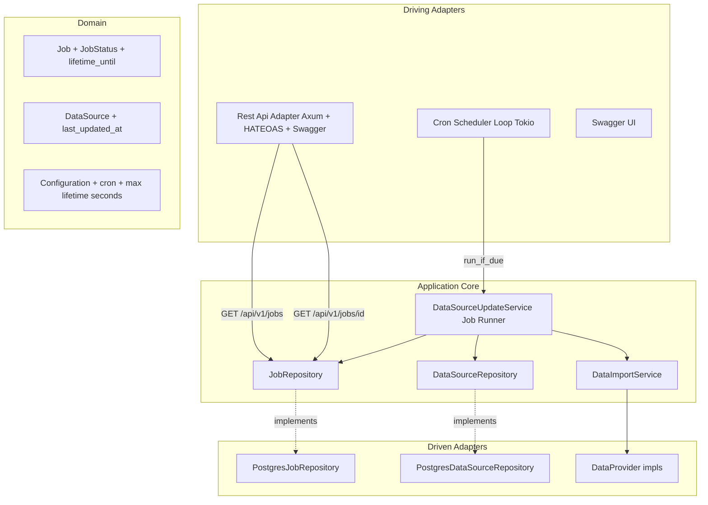
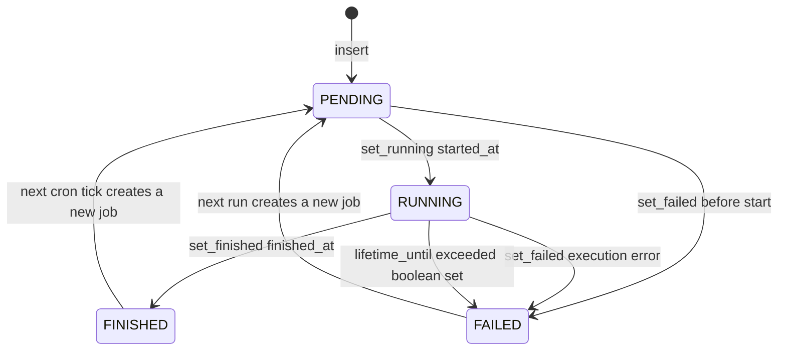

# Architectural Plan: Generic Job Tracking, Cron Scheduler & Data Source Updater

## Overview

This plan adds ShedLock-style generic job tracking plus a cron-driven background
scheduler that keeps the external data sources up to date. Jobs are persisted in a
generic table, tracked through their lifecycle (PENDING -> RUNNING -> FINISHED / FAILED),
carry a free-form key/value metadata map (JSONB), and are exposed through a read-only
REST API with HATEOAS links and Swagger UI — consistent with the existing REST adapter.

Each job carries a **required `lifetime_until` deadline** (ShedLock `lockAtMostFor`,
no default anywhere): a RUNNING job blocks other runs of the same type **only until**
that absolute timestamp. If the deadline is exceeded, the stale RUNNING job is
flagged with a boolean (`max_lifetime_exceeded = true`) and moved to FAILED, so the
next job can run. Inserting a job without a future `lifetime_until` fails. A job may
also transition directly from PENDING to FAILED.

Scheduling semantics (confirmed with the user):

- On startup, run the data-source update job immediately if it has never succeeded.
- Afterwards, re-trigger on the configured CRON schedule (default: every hour).
- If a job of the same type is still RUNNING and within its `lifetime_until`, print a
  warning and do NOT start again.
- `data_sources.last_updated_at` is advanced to the last processed measurement
  timestamp (incremental, no reprocessing).

## Architecture Diagram



## Job Lifecycle



- Every run creates a **new** job row (history is kept).
- A RUNNING job blocks other runs of the same type only until its absolute
  `lifetime_until` deadline; afterwards the scheduler flips it to FAILED with
  `max_lifetime_exceeded = true` and the next job may start.
- `set_failed` is allowed from both RUNNING and PENDING (PENDING -> FAILED is a
  valid transition per requirement).
- Metadata map is updated in-place (`processed_measurements` key) between batches.

## Database Schema (migration V3)

```sql
CREATE TABLE jobs (
    id UUID PRIMARY KEY,
    name TEXT NOT NULL,
    job_type TEXT NOT NULL,
    status TEXT NOT NULL DEFAULT 'PENDING'
        CHECK (status IN ('PENDING', 'RUNNING', 'FINISHED', 'FAILED')),
    started_at TIMESTAMPTZ,
    finished_at TIMESTAMPTZ,
    failure_message TEXT,
    metadata JSONB NOT NULL DEFAULT '{}'::jsonb,
    lifetime_until TIMESTAMPTZ NOT NULL,
    max_lifetime_exceeded BOOLEAN NOT NULL DEFAULT FALSE,
    created_at TIMESTAMPTZ NOT NULL DEFAULT now()
);

CREATE INDEX idx_jobs_type_status ON jobs (job_type, status);
CREATE INDEX idx_jobs_status ON jobs (status);

ALTER TABLE data_sources ADD COLUMN last_updated_at TIMESTAMPTZ;
```

## Step-by-Step Implementation

1. **[`Cargo.toml`](../Cargo.toml)**
   - Add `cron = "0.12"` (CRON parsing, next-fire computation).
   - Add `with-serde_json-1` to the `postgres` features (JSONB metadata round-trip).

2. **[`migrations/V3__add_jobs.sql`](../migrations/V3__add_jobs.sql)** (new)
   - `jobs` table + `data_sources.last_updated_at` column as above.
   - `lifetime_until` uses the native Postgres **`TIMESTAMPTZ`** type (an absolute
     deadline), `NOT NULL` **without a default**: inserting a job without an explicit
     future deadline fails at the database level too (mirrors the domain rule).
   - Existing repositories run `migrations::runner()` on connect, so V3 is applied automatically.

3. **Jobs domain module** — [`src/core/domain/jobs/`](../src/core/domain/jobs)
   - [`job.rs`](../src/core/domain/jobs/job.rs): `Job` entity (id, name, job_type, status,
     started_at, finished_at, failure_message, metadata `serde_json::Map`,
     `lifetime_until: DateTime<Utc>` (required, no default), `max_lifetime_exceeded`),
     `JobStatus` enum
     (`Pending|Running|Finished|Failed`, serde rename to UPPERCASE, `ToSchema`/`Deserialize`),
     helpers (`is_running`, `is_successful`, `lifetime_exceeded(now)` = `now > lifetime_until`).
   - [`repository.rs`](../src/core/domain/jobs/repository.rs): `JobRepository` trait:
     `insert` (**requires a future `lifetime_until`; fails with a domain error
     otherwise**), `set_running`, `set_finished`, `set_failed` (allowed from PENDING and
     RUNNING), `update_metadata(id, key, value)`, `find_by_id`, `find_all(job_type, status)`,
     `find_running_by_type`, `find_last_finished_by_type`, and
     `expire_running_jobs(job_type, now)` which atomically flips RUNNING jobs whose
     `lifetime_until < now` to FAILED with `max_lifetime_exceeded = true` and a failure
     message (returns the count expired).
   - Register `pub mod jobs;` in [`src/core/domain/mod.rs`](../src/core/domain/mod.rs).

4. **Driven Postgres jobs** — [`src/adapter/driven/postgres_job_repository.rs`](../src/adapter/driven/postgres_job_repository.rs) (new)
   - Follows the existing `Mutex<Client>` + `DomainError` pattern; JSONB via
     `serde_json::Value` (`jsonb_set` for metadata upserts).
   - Maps `TIMESTAMPTZ` directly to/from `chrono::DateTime<Utc>` (no INTERVAL conversion).
   - `insert` rejects a `lifetime_until <= now` (a job must "live" into the future).
   - `expire_running_jobs` implemented as a single atomic `UPDATE ... WHERE job_type=$1
     AND status='RUNNING' AND lifetime_until < $2`.
   - Register in [`src/adapter/driven/mod.rs`](../src/adapter/driven/mod.rs).

5. **Data source last-updated indicator**
   - Add `last_updated_at: Option<DateTime<Utc>>` to
     [`src/core/domain/data_source/data_source.rs`](../src/core/domain/data_source/data_source.rs) (default `None`).
   - Add `update_last_updated_at(&self, id, timestamp)` to
     [`src/core/domain/data_source/repository.rs`](../src/core/domain/data_source/repository.rs).
   - Implement in [`src/adapter/driven/postgres_data_source_repository.rs`](../src/adapter/driven/postgres_data_source_repository.rs).
   - **Not** exposed in the REST `DataSourceDto` (DB-only).

6. **Configuration values**
   - Add `data_source_update_cron` (default `"0 0 * * * *"` = every hour) and the
     **required** `data_source_update_max_lifetime_seconds` (no default; must be a
     positive integer) to
     [`src/core/domain/configuration/configuration.rs`](../src/core/domain/configuration/configuration.rs);
     validate the cron with `cron::Schedule::from_str` and the lifetime as `> 0`.
     The seconds value is converted to `chrono::Duration` and used to compute each
     job's `lifetime_until` deadline (`insert_time + max_lifetime`).
   - Parse in [`src/adapter/driven/configuration_toml_adapter.rs`](../src/adapter/driven/configuration_toml_adapter.rs)
     with `#[serde(default = ...)]` for the cron only; the max lifetime has no default
     and a missing/invalid value is a configuration error.
   - Update [`config.toml.example`](../config.toml.example) (shows the required lifetime).

7. **Incremental data source update** — [`src/core/application/data_import_service.rs`](../src/core/application/data_import_service.rs)
   - Add `update_data_source(runtime, from, on_batch)`:
     stations first, then channels, then page measurements from `from` calling
     `save_batch` per page and invoking the `on_batch` progress callback after each
     persisted batch; returns a `DataSourceUpdate { processed_measurements, last_measurement_timestamp }`.

8. **Job runner** — [`src/core/application/data_source_update_service.rs`](../src/core/application/data_source_update_service.rs) (new)
   - `JOB_TYPE = "data_source_update"`, `JOB_NAME = "Data source update"`.
   - `run_if_due(startup: bool)`:
     - **Expire stale runs**: call `expire_running_jobs(JOB_TYPE, now)`; any RUNNING job
       past its `lifetime_until` is moved to FAILED (boolean set) and releases the block.
     - If a RUNNING job of the type still exists (within `lifetime_until`) -> print warning,
       skip (never start twice).
     - `startup &&` no prior FINISHED job -> execute immediately.
     - cron tick (`startup == false`) -> execute.
   - `execute(now)` lifecycle:
     - insert a PENDING job with `lifetime_until = now + max_lifetime` (from the
       configured seconds); the insert fails if it is missing or not positive
       -> `set_running(now)` (on failure, mark PENDING -> FAILED).
     - For **each** data source runtime, run these steps **in strict order**:
       1. **Update counting stations** (idempotent upsert by `external_datasource_id`).
       2. **Update channels** (idempotent upsert by `external_datasource_id`).
       3. **Update measurements**: page `get_measurements` starting from the data
          source's `last_updated_at`, calling `save_batch` after **each** page, then
          invoke the progress callback so `processed_measurements` is persisted to the
          job metadata immediately after each batch. Measurements reference channels,
          so stations and channels must be persisted first.
       4. Advance `data_sources.last_updated_at` to the last processed measurement
          timestamp for that data source.
     - `set_finished(now)` on success; `set_failed(now, message)` on error (PENDING or
       RUNNING source state both valid).

9. **Cron scheduler driver** — [`src/adapter/driving/job_scheduler.rs`](../src/adapter/driving/job_scheduler.rs) (new)
   - Async loop: fire startup check immediately, then `tokio::time::sleep_until(next)`
     per CRON, calling `run_if_due` via `spawn_blocking` (blocking repos).
   - Wire in [`src/main.rs`](../src/main.rs): construct `PostgresJobRepository`,
     `DataSourceUpdateService`, pass `job_repository` to `RestApiAdapter`, spawn scheduler.

10. **REST jobs endpoints**
    - [`src/adapter/driving/rest/dto.rs`](../src/adapter/driving/rest/dto.rs):
      `JobDto` (includes `lifetime_until` (absolute deadline) and `max_lifetime_exceeded`),
      `JobListDto`, `JobQueryParams { job_type, status }`, conversions + HATEOAS links
      (self, collection, root).
    - [`src/adapter/driving/rest/handlers.rs`](../src/adapter/driving/rest/handlers.rs):
      `list_jobs` (filters via query params, invalid status -> 400), `get_job_by_id`;
      add `job_repository` to `AppState`.
    - [`src/adapter/driving/rest/mod.rs`](../src/adapter/driving/rest/mod.rs):
      routes `/api/v1/jobs` and `/api/v1/jobs/:id`; extend `RestApiAdapter::new`.
    - [`src/adapter/driving/rest/openapi.rs`](../src/adapter/driving/rest/openapi.rs):
      add paths, schemas, "Jobs" tag.
    - Root [`ApiRootDto`](../src/adapter/driving/rest/dto.rs) gains a `jobs` link.
    - Extend [`src/core/domain/error.rs`](../src/core/domain/error.rs) with
      `InvalidQuery(String)` mapped to 400.

11. **REST tests**
    - [`tests/mocks.rs`](../src/adapter/driving/rest/tests/mocks.rs): `MockJobRepository`.
    - [`tests/fixtures.rs`](../src/adapter/driving/rest/tests/fixtures.rs): `sample_job_repository()`.
    - [`tests/mod.rs`](../src/adapter/driving/rest/tests/mod.rs): pass job mock through `TestApp`.
    - [`tests/jobs.rs`](../src/adapter/driving/rest/tests/jobs.rs) (new): list empty/items,
      filter by job_type + status, invalid status -> 400, get by id, 404, OpenAPI paths,
      root contains jobs link, `lifetime_until`/`max_lifetime_exceeded` serialized.

12. **Tests (application / config / postgres)**
    - `DataSourceUpdateService`: decision (running-within-lifetime -> skip + warn,
      expired running -> moved to FAILED + boolean + next job proceeds, never-succeeded+
      startup -> run, cron tick -> run), lifecycle (PENDING->RUNNING->FINISHED,
      PENDING->FAILED, RUNNING->FAILED), metadata after each batch, last_updated_at.
    - `DataImportService::update_data_source`: incremental `from`, per-batch progress,
      order (stations before channels before measurements).
    - Config: CRON default + invalid CRON rejection; max lifetime is required (no
      default), missing or non-positive value rejected.
    - `PostgresJobRepository`: testcontainer test (insert with future deadline, TIMESTAMPTZ
      round-trip, transitions, JSONB metadata, filters, latest-finished lookup,
      insert-without-future-deadline fails, `expire_running_jobs` flips only expired
      RUNNING jobs and sets the boolean).
    - `ConfigurationTomlAdapter`: reads cron + required lifetime; defaults the cron when
      missing; rejects invalid cron, non-positive lifetime, and a missing lifetime.

13. **Docker Compose end-to-end test** — [`scripts/docker-compose-test.sh`](../scripts/docker-compose-test.sh) (new)
    - Boots the real [`docker-compose.yml`](../docker-compose.yml) stack (`docker compose up -d --build`),
      waits for the `app` readiness (`/health/ready`), then asserts the running application:
      - `GET /api/v1/jobs` and `GET /api/v1/data-sources` return `200` (proves migration V3
        applied and the jobs API is live).
      - The scheduler recorded a `data_source_update` job exposing `lifetime_until`.
      - The `jobs` table exists with `lifetime_until TIMESTAMPTZ NOT NULL` and
        `data_sources.last_updated_at` exists as `TIMESTAMPTZ` — verified via a `psql`
        query in the `db` container.
    - Creates a temporary `config.toml` (backing up any existing one) and tears the stack
      down with `docker compose down` on success and failure.

14. **Formatting test** — [`scripts/fmt-test.sh`](../scripts/fmt-test.sh) (new)
    - CI-style gate that runs `cargo fmt --check` (fails if any file is not `rustfmt`-clean)
      and `cargo clippy --all-targets -- -D warnings` (fails on any lint warning).
    - Exits non-zero on any drift so it can be wired into CI later.

15. **Docs**
    - Update [`ToDo.md`](../ToDo.md), [`README.md`](../README.md), this plan.

## API Contract

```
GET /api/v1/jobs?job_type=data_source_update&status=RUNNING
GET /api/v1/jobs/{id}
```

Example `JobDto`:

```json
{
  "id": "3fa85f64-5717-4562-b3fc-2c963f66afa6",
  "name": "Data source update",
  "job_type": "data_source_update",
  "status": "FAILED",
  "started_at": "2026-08-22T15:00:00Z",
  "finished_at": "2026-08-22T16:00:00Z",
  "failure_message": "Max lifetime exceeded",
  "metadata": { "processed_measurements": 1200 },
  "lifetime_until": "2026-08-22T17:00:00Z",
  "max_lifetime_exceeded": true,
  "_links": {
    "self": { "href": "/api/v1/jobs/3fa85f64-5717-4562-b3fc-2c963f66afa6" },
    "collection": { "href": "/api/v1/jobs" },
    "root": { "href": "/api/v1" }
  }
}
```

## Key Design Decisions

- **Blocking repos + spawn_blocking**: matches the existing pattern (sync `postgres` client
  must not run on a tokio worker thread); both REST handlers and the scheduler call domain
  services via `spawn_blocking`.
- **New job row per run**: keeps full history; the latest FINISHED job per type tells the
  scheduler whether the job has ever succeeded.
- **`lifetime_until` = ShedLock lock-at-most-for as an absolute TIMESTAMPTZ deadline**:
  a RUNNING job only blocks until its `lifetime_until` timestamp; `expire_running_jobs`
  (atomic SQL) then flips it to FAILED with `max_lifetime_exceeded = true`, allowing the
  next run to proceed even if a worker crashed mid-run. Stored as a native Postgres
  **`TIMESTAMPTZ`** (`NOT NULL`, no default), modelled as `DateTime<Utc>` in the domain,
  computed as `insert_time + data_source_update_max_lifetime()` from the configured
  seconds, and exposed as `lifetime_until` in the DTO. There is **no default**: the config
  must provide a positive lifetime and `insert` fails without a future deadline, so a job
  can never be created without a deadline.
- **Metadata as JSONB + `serde_json::Map`**: fully generic, future-renderable as a table.
- **`last_updated_at` incremental**: paging starts at the last processed measurement
  timestamp, so consecutive runs do not reprocess data.
