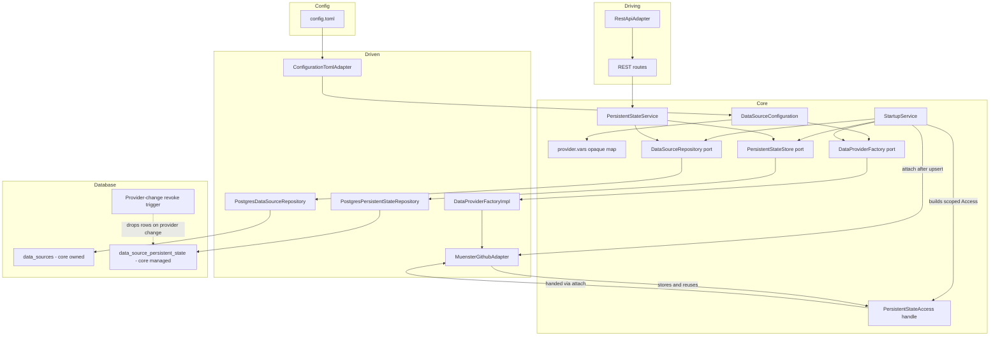

# Plan: Data source persistent-state storage + REST API through the core (Clean Hexagonal)

## Overview

Provider adapters sometimes need to remember **runtime state** that is specific to
themselves and scoped to a single data source, and that must survive process
restarts. The concrete motivating case is the Münster GitHub provider's archive
cache (last download/extract timestamps, content checksum, obscured temp paths) —
but the archive cache consumer and the CSV parsing are **follow-up plans**. This
plan delivers the storage mechanism, the two-phase handover wiring, and
the `persistent_state` REST API through the core, so the follow-up can consume the
handle directly without further architectural change.

1. **A dedicated core port** — `PersistentStateStore` — owns the opaque key-value
   storage, separate from `DataSourceRepository`. The driven layer implements it
   over Postgres.
2. **Two-phase capability handover.** Phase 1 — construction: the core builds a
   provider with **no** state handle (`DataProviderFactory::build(config)` stays
   single-argument), so construction is DB-free and the adapter cannot touch state
   prematurely. Phase 2 — activation: once the data source row is persisted, the
   core attaches a **scoped, owned `PersistentStateAccess`** (an `Arc` handle
   pre-bound to that data source) via a new `attach_persistent_state` method on
   `DataProvider`. The adapter stores the handle for later reuse. The adapter
   never holds the repository, a connection, or its own id.
3. **The new REST endpoints go through the core.** The `persistent_state`
   endpoints call a core application service (`PersistentStateService`). The
   pre-existing read endpoints are **not** touched in this plan — migrating them
   to core services is a separate, follow-up plan (`rest_through_core_plan.md`).
4. **Opaque semantics** — neither the core nor REST interprets provider keys or
   values; provider-specific parsing stays inside the concrete provider adapter.
5. **Provider-state revocation is enforced at the DB level** — an `AFTER UPDATE OF
   provider_type` trigger on `data_sources` drops the persistent-state rows
   whenever a data source changes provider, so no stale memory survives a
   provider switch.

## Naming

Every identifier uses the `persistent_state` stem; the DB object carries the full
`data_source_persistent_state` name.

| Layer | Name |
|---|---|
| Migration / table | `data_source_persistent_state` |
| Core domain module | `src/core/domain/data_source/persistent_state.rs` |
| Core domain port trait | `PersistentStateStore` |
| Core domain handle trait | `PersistentStateAccess` |
| Scoped handle implementation | `ScopedPersistentState` |
| Application service | `PersistentStateService` |
| Driven repository | `PostgresPersistentStateRepository` |
| REST path | `/api/v1/data-sources/{id}/persistent_state` |

## The two categories of adapter-specific information

| Category | Examples | Home | Core awareness |
|---|---|---|---|
| Static provider settings (inputs) | `url`, `max_measurement_batch_size`, `cache_duration` (default 300 s) | `config.toml` → `provider.vars` → concrete adapter | Opaque map, already correct |
| Runtime provider state (mutable, persisted) | e.g. `archive_downloaded_at`, `archive_checksum`, `archive_file`, `archive_extracted_dir` | `data_source_persistent_state` table via `PersistentStateStore` | Opaque KV map, core-owned; scoped handle attached after the upsert |

## Architecture Diagram



## Key design decisions

1. **Separate table, not a column on `data_sources`.** The `data_sources` table
   keeps its core-owned columns (id, name, provider_type, last_updated_at).
   Persistent state lives in its own table.

2. **Separate `PersistentStateStore` port.** State access is its own core-domain
   port, independent of `DataSourceRepository`, so the two can vary and be tested
   independently. `DataSourceRepository` is untouched.

3. **Two-phase capability handover.** Phase 1 (construction):
   `DataProviderFactory::build(config)` is unchanged and receives no state handle,
   so construction is DB-free. Phase 2 (activation): after the data source is
   upserted, `StartupService` builds a `ScopedPersistentState` (store + data source
   id) per configured data source and attaches it as an `Arc<dyn
   PersistentStateAccess + Send + Sync>` via `DataProvider::attach_persistent_state`
   — a new method with a **default no-op implementation**, so existing provider
   implementations and mocks are unaffected. The adapter overrides it to store the
   handle and reuse it later. No per-call threading.

4. **Semantically opaque.** `PersistentStateStore` moves arbitrary `key`/`value`
   strings; neither the core nor REST interprets them. Only the provider adapter
   understands its keys.

5. **Surrogate UUID per record, scoped by `data_source_id`.** Each row gets its
   own random `id` UUID (application-generated via `Uuid::new_v4()`, mirroring the
   `jobs` table) purely for later identification — no business meaning. A data
   source has exactly one provider, so `data_source_id` fully determines the
   provider and there is no `provider_type` column. `UNIQUE (data_source_id, key)`
   enforces one value per key.

6. **Whole-store clear.** Besides single-key ops,
   `PersistentStateStore::clear` wipes all state for a data source; it is exposed
   on the handle (`clear()`) and as a `DELETE` on the collection endpoint, so a
   data source can be fully reset.

7. **DB-level revocation on delete and change.** Deleting a data source cascades
   to its state via the FK `ON DELETE CASCADE`. Changing a data source's
   `provider_type` triggers `AFTER UPDATE OF provider_type` on `data_sources`,
   which deletes that source's persistent-state rows — so a different provider
   never inherits the previous provider's memory. No application code needs to do
   this.

8. **Static config stays in TOML.** Provider inputs remain in `config.toml`; only
   mutable runtime state goes to the database.

9. **The new REST endpoints go through the core; the existing read endpoints are
   untouched in this plan.** `AppState` gains only a `persistent_state_service`.
   The pre-existing read endpoints keep calling their repository ports directly
   until the follow-up plan (`rest_through_core_plan.md`) migrates them to thin
   application services.

10. **FK ordering is guaranteed by the two-phase handover.** The provider is
    constructed **without** a state handle (phase 1), so it physically cannot touch
    persistent state during construction — there is no handle to write with. The
    handle is attached (phase 2) only **after** `StartupService` has upserted the
    data source row, so the `data_source_persistent_state.data_source_id` FK always
    resolves when the adapter writes. State access additionally only happens from
    blocking contexts — the scheduler already runs the data-source update in
    `spawn_blocking` (`job_scheduler.rs`) and the readiness handler runs the
    health check in `spawn_blocking` (`handlers.rs`), so the synchronous Postgres
    store is safe there.

## Database Schema (migration V4)

```sql
CREATE TABLE data_source_persistent_state (
    id UUID PRIMARY KEY,
    data_source_id UUID NOT NULL
        REFERENCES data_sources(id) ON DELETE CASCADE,
    key TEXT NOT NULL,
    value TEXT NOT NULL,
    updated_at TIMESTAMPTZ NOT NULL DEFAULT now(),
    CONSTRAINT uq_data_source_persistent_state_key
        UNIQUE (data_source_id, key)
);

-- FK lookups and cascade cleanup.
CREATE INDEX idx_data_source_persistent_state_data_source_id
    ON data_source_persistent_state (data_source_id);

-- Revoke persistent state at the DB level when a data source changes provider.
CREATE OR REPLACE FUNCTION revoke_persistent_state_on_provider_change()
RETURNS TRIGGER AS $$
BEGIN
    IF OLD.provider_type IS DISTINCT FROM NEW.provider_type THEN
        DELETE FROM data_source_persistent_state WHERE data_source_id = NEW.id;
    END IF;
    RETURN NEW;
END;
$$ LANGUAGE plpgsql;

CREATE TRIGGER trg_revoke_persistent_state_on_provider_change
AFTER UPDATE OF provider_type ON data_sources
FOR EACH ROW
EXECUTE FUNCTION revoke_persistent_state_on_provider_change();
```

`id` is a random application-generated UUID (via `Uuid::new_v4()`) that exists
purely as a stable record identifier for later identification/debugging; it
carries no business meaning. A data source has exactly one provider, so
`data_source_id` alone scopes the state; `UNIQUE (data_source_id, key)` enforces
one value per key per data source. The explicit index on `data_source_id` serves
FK lookups, the `ON DELETE CASCADE` cleanup, and the provider-change trigger.
`value` is `TEXT`: adapters store RFC 3339 timestamps, hashes/etags, or any
scalar.

## The PersistentStateStore port (core domain)

A new port in
[`src/core/domain/data_source/persistent_state.rs`](../src/core/domain/data_source/persistent_state.rs)
(register in [`data_source/mod.rs`](../src/core/domain/data_source/mod.rs)):

```rust
/// Opaque persistent key-value store for provider state, scoped per data source.
pub trait PersistentStateStore: Send + Sync {
    fn get(&self, data_source_id: Id) -> Result<HashMap<String, String>, DomainError>;
    fn set(&self, data_source_id: Id, key: &str, value: &str) -> Result<(), DomainError>;
    fn delete(&self, data_source_id: Id, key: &str) -> Result<(), DomainError>;
    fn clear(&self, data_source_id: Id) -> Result<(), DomainError>;
}
```

## The PersistentStateAccess handle (core domain)

In [`src/core/domain/data_source/provider.rs`](../src/core/domain/data_source/provider.rs):

```rust
/// Opaque, pre-scoped state access handed to a provider at construction time.
pub trait PersistentStateAccess: Send + Sync {
    fn load(&self) -> Result<HashMap<String, String>, ProviderError>;
    fn store(&self, key: &str, value: &str) -> Result<(), ProviderError>;
    fn delete(&self, key: &str) -> Result<(), ProviderError>;
    fn clear(&self) -> Result<(), ProviderError>;
}

/// Concrete scoped handle: wraps the store plus the data source id and maps
/// DomainError into ProviderError::Storage. Built by StartupService per data source.
pub struct ScopedPersistentState { ... }
impl PersistentStateAccess for ScopedPersistentState { ... }
```

The **`DataProvider` trait gains one additive method** — the handle is attached
after construction, not per call:

```rust
/// Optional capability: a provider that needs persistent state stores the
/// pre-scoped handle here. The default is a no-op, so providers without state
/// (and all existing mocks) are unaffected.
fn attach_persistent_state(
    &self,
    _state: Arc<dyn PersistentStateAccess + Send + Sync>,
) {}
```

`ProviderError` gains a `Storage(String)` variant so `ScopedPersistentState` can map
`DomainError` from the store into the provider error type.

## The DataProviderFactory is unchanged

[`src/core/application/data_provider_factory.rs`](../src/core/application/data_provider_factory.rs)
keeps its current signature — the handle is **not** passed through the factory:

```rust
pub trait DataProviderFactory: Send + Sync {
    fn build(&self, config: &DataSourceConfiguration)
    -> Result<Arc<dyn DataProvider>, ConfigError>;
}
```

[`DataProviderFactoryImpl`](../src/adapter/driven/data_provider_factory.rs) stays a
unit struct and is unchanged; the phase-2 attachment is performed by
`StartupService` directly on the built `Arc<dyn DataProvider>`.

## PersistentStateService (core application)

New [`src/core/application/persistent_state_service.rs`](../src/core/application/persistent_state_service.rs):

```rust
pub struct PersistentStateService {
    store: Arc<dyn PersistentStateStore + Send + Sync>,
    data_source_repository: Arc<dyn DataSourceRepository + Send + Sync>,
}
```

with `get`/`set`/`delete`/`clear`, each resolving the data source (404 via
`DomainError::NotFound`) and then delegating to the store. Register in
[`src/core/application/mod.rs`](../src/core/application/mod.rs).

## Münster adapter changes

[`src/adapter/driven/muenster_github_adapter.rs`](../src/adapter/driven/muenster_github_adapter.rs):

- `MuensterGithubAdapter::new(config)` stays single-argument and parses only
  static config — no state handle, so construction is DB-free (phase 1).
- Override `DataProvider::attach_persistent_state` to store the
  `Arc<dyn PersistentStateAccess + Send + Sync>` handle in a new field (phase 2).
- Read a new static var `cache_duration` (seconds) from `provider.vars` with
  **default `300`** (5 minutes); an invalid value is a `ConfigError` like the
  existing `max_measurement_batch_size`.
- The data-serving methods stay as they are (empty) in this plan.
- The archive cache consumer (download/extract/cache tiers) is a follow-up plan.

## REST API (persistent_state)

All new endpoints go through `PersistentStateService` (wrapped in `spawn_blocking`),
never a repository port:

- `GET /api/v1/data-sources/{id}/persistent_state` → `200` with the full opaque
  key-value map (plus HATEOAS links). `404` if the data source is unknown.
- `PUT /api/v1/data-sources/{id}/persistent_state/{key}` with `{"value": "..."}` →
  `200` with the updated entry DTO. `404` if the data source is unknown; `400` on
  empty key.
- `DELETE /api/v1/data-sources/{id}/persistent_state/{key}` → `204`. `404` if the
  data source is unknown.
- `DELETE /api/v1/data-sources/{id}/persistent_state` → `204`, clears the whole
  store for the data source. `404` if the data source is unknown.

`AppState` (in
[`handlers.rs`](../src/adapter/driving/rest/handlers.rs:28)) gains a
`persistent_state_service` field. New DTOs in
[`dto.rs`](../src/adapter/driving/rest/dto.rs): `PersistentStateDto` (map + links),
`PersistentStateEntryDto`, `PersistentStateValueDto` (PUT body). New routes in
[`mod.rs`](../src/adapter/driving/rest/mod.rs) (two `DELETE` routes — one with
`:key`, one clearing the whole store) and OpenAPI additions in
[`openapi.rs`](../src/adapter/driving/rest/openapi.rs). The existing read endpoints
and their tests are unchanged.

## Step-by-Step Implementation

1. **Migration** — [`migrations/V4__add_data_source_persistent_state.sql`](../migrations) (new)
   - Create `data_source_persistent_state` as above (no `provider_type` column —
     a data source has exactly one provider).
   - Add the single-column index on `data_source_id`.
   - Add the provider-change revoke function + `AFTER UPDATE OF provider_type`
     trigger.
   - Migrations run automatically on pool creation via
     [`postgres_pool.rs`](../src/adapter/driven/postgres_pool.rs:20).

2. **Core domain port** — [`src/core/domain/data_source/persistent_state.rs`](../src/core/domain/data_source/persistent_state.rs) (new)
   - `PersistentStateStore` trait: `get`/`set`/`delete`/`clear` keyed by `Id`,
     opaque semantics.
   - Register `pub mod persistent_state;` in
     [`src/core/domain/data_source/mod.rs`](../src/core/domain/data_source/mod.rs).

3. **Core domain handle** — [`src/core/domain/data_source/provider.rs`](../src/core/domain/data_source/provider.rs)
   - Add `PersistentStateAccess` trait (`Send + Sync`, `load`/`store`/`delete`/`clear`).
   - Add `ScopedPersistentState` (wraps the store + id, maps `DomainError` →
     `ProviderError::Storage`).
   - Add `ProviderError::Storage(String)` and a `From<DomainError> for ProviderError`
     mapping.
   - Add `attach_persistent_state(&self, state)` with a **default no-op** impl to
     the `DataProvider` trait; all existing implementations and mocks stay valid.

4. **Driven Postgres store** — [`src/adapter/driven/postgres_persistent_state_repository.rs`](../src/adapter/driven/postgres_persistent_state_repository.rs) (new)
   - `PostgresPersistentStateRepository` implements `PersistentStateStore` over the
     shared [`PgPool`](../src/adapter/driven/postgres_pool.rs:23) (existing
     repository pattern: pool clone, `DomainError::Database` mapping).
   - `get`: `SELECT key, value FROM data_source_persistent_state WHERE data_source_id = $1`
     into a `HashMap`.
   - `set`: generate a fresh `id` via `Uuid::new_v4()`, then
     `INSERT ... ON CONFLICT ON CONSTRAINT uq_data_source_persistent_state_key
     DO UPDATE SET value = $4, updated_at = now()`.
   - `delete`: `DELETE ... WHERE data_source_id = $1 AND key = $2` (idempotent).
   - `clear`: `DELETE ... WHERE data_source_id = $1`.
   - Register in [`src/adapter/driven/mod.rs`](../src/adapter/driven/mod.rs).

5. **PersistentStateService** — [`src/core/application/persistent_state_service.rs`](../src/core/application/persistent_state_service.rs) (new)
   - `PersistentStateService` (store + data source repository): `get`/`set`/`delete`/
     `clear`, each resolving the data source (404 via `DomainError::NotFound`) and
     delegating to the store.
   - Register in [`src/core/application/mod.rs`](../src/core/application/mod.rs).

6. **Factory unchanged** — [`src/core/application/data_provider_factory.rs`](../src/core/application/data_provider_factory.rs)
   - `DataProviderFactory` and [`DataProviderFactoryImpl`](../src/adapter/driven/data_provider_factory.rs)
     keep their current signatures; the handle is not passed through the factory.

7. **Startup handover (two-phase)** — [`src/core/application/startup_service.rs`](../src/core/application/startup_service.rs)
   - Add `persistent_state_store: Arc<dyn PersistentStateStore + Send + Sync>` to
     `StartupService::new(...)`.
   - Phase 1: build the provider via `data_provider_factory.build(data_source)` —
     no state handle.
   - Persist the data source via `data_source_repository.upsert(...)`.
   - Phase 2: build a `ScopedPersistentState` for the data source's `data_source_id`,
     wrap it in `Arc<dyn PersistentStateAccess + Send + Sync>`, and attach it via
     `provider.attach_persistent_state(state)`.
   - **No provider-change cleanup code here** — the DB trigger revokes state when
     `provider_type` changes, and the FK cascades on delete.

8. **Composition root** — [`src/main.rs`](../src/main.rs)
   - Construct `Arc<PostgresPersistentStateRepository>` from the pool.
   - Inject it into `PersistentStateService::new(store, data_source_repo.clone())` and
     `StartupService::new(..., store)`.
   - Pass the service into `RestApiAdapter::new(...)`.
   - `DataImportService` is unchanged (providers carry their own handle).

9. **REST (new endpoints only)** — [`src/adapter/driving/rest/`](../src/adapter/driving/rest)
   - [`handlers.rs`](../src/adapter/driving/rest/handlers.rs): add
     `persistent_state_service: Arc<PersistentStateService>` to `AppState`; add the
     new handlers `get_persistent_state`, `put_persistent_state_entry`,
     `delete_persistent_state_entry`, `clear_persistent_state` calling
     `PersistentStateService` through `spawn_blocking` + `map_domain_error`.
   - [`dto.rs`](../src/adapter/driving/rest/dto.rs): add `PersistentStateDto`,
     `PersistentStateEntryDto`, `PersistentStateValueDto`.
   - [`mod.rs`](../src/adapter/driving/rest/mod.rs): update `RestApiAdapter::new` to
     take the service; register the `persistent_state` routes (get, put, delete —
     two `DELETE` routes: one with `:key`, one clearing the whole store).
   - [`openapi.rs`](../src/adapter/driving/rest/openapi.rs): add the new paths/schemas.
   - **Existing read endpoints are not changed** (their migration is the follow-up
     plan `rest_through_core_plan.md`).

10. **Münster adapter** — [`src/adapter/driven/muenster_github_adapter.rs`](../src/adapter/driven/muenster_github_adapter.rs)
    - `new(config)` stays single-argument (phase 1, DB-free).
    - Override `attach_persistent_state` to store the handle in a field (phase 2).
    - Read new static var `cache_duration` (seconds) from `provider.vars` with
      **default `300`**; invalid value is a `ConfigError` like the existing
      `max_measurement_batch_size`.
    - Data-serving methods stay as they are.

11. **Tests**
    - `PostgresPersistentStateRepository`: get empty for a known source, set
      round-trip + overwrite, delete one, clear all, cascade on data source delete
      (Postgres test container, consistent with existing repository tests).
    - **DB trigger**: updating a data source's `provider_type` drops its
      persistent-state rows (verified via the Postgres test container).
    - `PersistentStateService`: resolves the data source, 404 for an unknown
      source, get / set / delete / clear delegate to the store (in-memory store +
      repo).
    - `StartupService`: phase 1 builds the provider without a handle, then upserts
      the data source, then phase 2 attaches a scoped `PersistentStateAccess` via
      `provider.attach_persistent_state(state)` (no explicit provider-change
      clearing — the DB trigger handles it).
    - `DataProviderFactory` tests: unchanged signature (no state parameter).
    - Münster adapter: overrides `attach_persistent_state` to store the handle;
      `cache_duration` defaults to 300; an invalid `cache_duration` is a
      `ConfigError`; a provider that does not override the default no-op is
      unaffected.
    - REST tests in [`src/adapter/driving/rest/tests/`](../src/adapter/driving/rest/tests):
      add a new `persistent_state.rs` covering list / upsert / delete-one /
      clear-all with the agreed status codes (`200`/`200`/`204`/`204`) + `404` for
      an unknown data source + `400` for an empty key, via a mocked
      `PersistentStateService`. Existing endpoint tests keep passing unchanged.
    - **`DataProvider` mocks stay unchanged** — the new `attach_persistent_state`
      has a default no-op implementation.

12. **Docs & config**
    - [`README.md`](../README.md): document the new table, the provider-change
      revoke trigger, the `cache_duration` var (default `300`), the
      `persistent_state` endpoints (with status codes), the cascade cleanup, and
      the layering note (new endpoints through core; existing endpoints to be
      migrated in the follow-up plan).
    - [`config.toml.example`](../config.toml.example): show `cache_duration = "300"`
      under `provider.vars`.
    - [`ToDo.md`](../ToDo.md): check off the persistent-state storage and API items.
    - [`plans/README.md`](../plans/README.md): update the plan progress page.

## Verification (via the Makefile)

```bash
make check       # cargo fmt --check + cargo clippy --all-targets -- -D warnings
make test        # full suite; Postgres repository/trigger tests spin up a test container via Docker
make test-rest   # REST endpoint tests (in-memory mocks, incl. the new persistent_state routes)
make test-e2e    # end-to-end smoke test against the real docker-compose stack
```

A clean `make check` and `make test` are the acceptance gate for the storage,
port, service, and wiring changes. `make test-rest` covers the new REST endpoints
without Docker, and `make test-e2e` verifies the stack boots, migration V4
applies, and the data-source update job runs.

## Out of scope / follow-up

- **REST-through-core refactor of the existing read endpoints** → see
  [`rest_through_core_plan.md`](rest_through_core_plan.md).
- **Archive cache consumer (download/extract/cache tiers) + CSV parsing** → see
  [`archive_cache_and_parsing_plan.md`](archive_cache_and_parsing_plan.md).
  GitHub's upstream headers (`ETag` / `Last-Modified`) are unverified; time-based
  cache invalidation is the primary mechanism, upstream-change detection is
  best-effort via a `HEAD` request only if the upstream exposes such headers.
- Interpreting or validating persistent-state values in the core (kept opaque by
  design).
- Bulk-edit endpoints (e.g. PUT the whole map) — the per-key PUT is sufficient for
  now.
- Moving REST DTO conversion into the core — DTOs remain an adapter concern by
  design.
