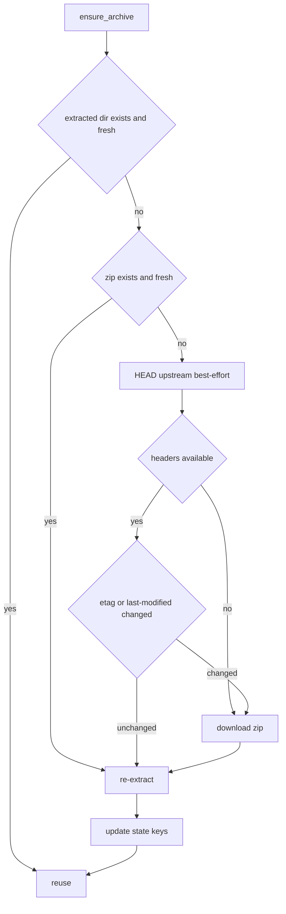

# Plan: Münster GitHub archive cache + CSV parsing

Status: completed.

## Summary

Realize the motivating case for persistent state: download the ~20 MB ZIP archive
from the configured `url`, extract it into an obscured `/tmp` folder, and serve
counting stations, channels, and measurements from the extracted files — using the
`PersistentStateAccess` handle for cache metadata. As a prerequisite, the
`DataProvider` interface is refactored so the **core owns all entity identity**:
the adapter returns external-id-only records and the core generates UUIDs when
persisting.

## Verified archive layout

The example archive `example/radverkehr-zaehlstellen-main.zip` extracts to
`radverkehr-zaehlstellen-main/` with this structure:

- `site_min.json` — authoritative station/channel metadata: an array of
  `{ "name", "directory", "start", "channels": [[id, name], ...] }`.
  - `directory` is the station's external id and the name of its subdirectory
    (e.g. `100031297`).
  - `channels[0]` is the **station aggregate** (`id == directory`).
  - The remaining entries are the real measurement channels.
- One directory per station, containing monthly CSV files named `YYYY-MM.csv`.
- CSV format:
  - Header: `Datetime,<id> (<name>),...,<id>-status,...`.
  - The first data column is the station aggregate (`id == directory`).
  - Then one column per real channel (`<channel_id> (<name>)`).
  - Then one `-status` column per data column (data-quality flag).
  - Rows: `YYYY-MM-DD HH:MM` (naive local time, 15-minute intervals) followed by
    integer counts.

## Scope

1. Refactor [`DataProvider`](../src/core/domain/data_source/provider.rs) to a
   record-based interface so entity identity stays in the core.
2. Implement the four-tier archive cache over
   [`PersistentStateAccess`](../src/core/domain/data_source/provider.rs:120).
3. Parse stations and channels from `site_min.json`; skip the station aggregate.
4. Parse measurements from the per-station `YYYY-MM.csv` files.
5. Respect `cache_duration` (default 300 s).

## Key design decisions

| # | Decision | Rationale |
|---|---|---|
| 1 | Record-based `DataProvider` interface; core generates UUIDs | Keeps DB identity unique and core-owned; adapter only moves external ids |
| 2 | Skip the station-aggregate column (`id == directory`) | It is the sum of the site's channels, so it is redundant |
| 3 | Ignore `-status` columns | The domain has no data-quality field |
| 4 | Timestamps parsed as Europe/Berlin local, converted to UTC | CSVs carry naive local time; the domain stores `DateTime<Utc>` |
| 5 | `from` is exclusive, `to` is inclusive; ascending order | Matches incremental paging without re-returning the boundary row |
| 6 | `batch_size_limit_reached == (returned == max_batch_size)` | Consistent paging contract |
| 7 | `description` fields set to `""` | No richer description exists in the source |
| 8 | Empty/non-integer measurement cells are skipped for that channel | Raw data is not cleaned |
| 9 | `archive_checksum` replaced by `archive_etag` + `archive_last_modified` | GitHub HEAD exposes ETag/Last-Modified; no local hashing needed |

## Dependencies

Add to [`Cargo.toml`](../Cargo.toml):

- `ureq` — blocking HTTP/TLS client (rustls). Alternative: `reqwest` with the
  `blocking` feature. `ureq` is chosen for a minimal footprint because all
  provider calls already run inside `spawn_blocking`.
- `zip` — read/extract the archive.
- `csv` — robust CSV parsing.
- `chrono-tz` — Europe/Berlin to UTC conversion (DST-safe).

## Cache tiers

`ensure_archive()` runs before every data-serving method, guarded by a `Mutex`
(the adapter is `Send + Sync` and may be probed by readiness while an import
runs). It reads/writes the following persistent-state keys (RFC 3339 UTC for
timestamps):

- `archive_downloaded_at`
- `archive_extracted_at`
- `archive_file` (ZIP path)
- `archive_extracted_dir` (directory path)
- `archive_etag` (optional, from a HEAD request)
- `archive_last_modified` (optional, from a HEAD request)

Decision flow:



- **Fresh** means the persisted timestamp is within `cache_duration` seconds of
  now and the path actually exists on disk. Persisted paths are best-effort
  across restarts (`/tmp` may be wiped), so existence checks drive the tiers.
- The HEAD request is best-effort and never performed merely to compute a hash:
  it only compares upstream `ETag` / `Last-Modified` with the persisted values
  before deciding whether the stale ZIP can be reused.
- Download writes to a new obscured temp file, extract writes to a new obscured
  temp directory (random names under `std::env::temp_dir()`).

## Record interface

In [`src/core/domain/data_source/provider.rs`](../src/core/domain/data_source/provider.rs):

```rust
/// External counting-station record (no database identity).
pub struct CountingStationRecord {
    pub external_id: String,
    pub name: String,
    pub description: String,
}

/// External channel record, linked to its station by external id.
pub struct ChannelRecord {
    pub external_id: String,
    pub counting_station_external_id: String,
    pub name: String,
    pub description: String,
}

/// External measurement record (no id, no channel_id).
pub struct MeasurementRecord {
    pub value: i64,
    pub timestamp: DateTime<Utc>,
}
```

The `DataProvider` trait signatures change to return records, and
`MeasurementBatch` carries records:

```rust
fn get_all_counting_stations(&self) -> Result<Vec<CountingStationRecord>, ProviderError>;
fn get_all_channels(&self) -> Result<Vec<ChannelRecord>, ProviderError>;
fn get_measurements(&self, query: MeasurementQuery) -> Result<MeasurementBatch, ProviderError>;
```

`MeasurementQuery` keeps its full `Channel`: the core passes the persisted
channel, the adapter reads `query.channel.external_datasource_id` for parsing,
and the core attaches `channel_id = query.channel.id` to the returned records.

Flow:


## DataImportService mapping

In [`src/core/application/data_import_service.rs`](../src/core/application/data_import_service.rs):

- Stations: for each `CountingStationRecord`, dedupe by `external_id`; if new,
  build `CountingStation` with `Uuid::new_v4()`, `external_datasource_id`, and
  `data_source_id`, save it, and record `external_id -> station id` in a map.
- Channels: for each `ChannelRecord`, dedupe by `external_id`; if new, resolve
  `counting_station_id` from the station map via
  `counting_station_external_id`, assign `Uuid::new_v4()` for the channel id,
  and save.
- Measurements: for each `MeasurementRecord`, build `Measurement` with
  `Uuid::new_v4()`, `channel_id = query.channel.id`, and the record's
  `value`/`timestamp`.

## Münster adapter implementation

[`src/adapter/driven/muenster_github_adapter.rs`](../src/adapter/driven/muenster_github_adapter.rs)
(optionally split into a `muenster_github/` submodule to keep the adapter small):

- Keep `new(config)` single-argument and the two-phase
  `attach_persistent_state` handover unchanged.
- Add an in-memory `ArchiveIndex` (guarded by a `Mutex`) holding:
  - parsed stations and channels from `site_min.json`,
  - a `channel_external_id -> Vec<PathBuf>` map built by reading each CSV header
    once,
  - a small per-channel measurement cache (LRU, e.g. 4 entries) so paging does
    not re-parse the same CSV files.
- `get_all_counting_stations` / `get_all_channels`: ensure the archive, then
  return records from `site_min.json`, excluding the aggregate entry
  (`id == directory`).
- `get_measurements(query)`: ensure the archive, locate the channel's CSVs,
  parse the matching column into `MeasurementRecord`s, filter
  `from < timestamp <= to`, sort ascending, take `max_batch_size`, and set
  `batch_size_limit_reached` when exactly `max_batch_size` records were taken.
- `check_health` stays a TCP reachability check (unchanged; optional HEAD-based
  upgrade noted out of scope).

## Step-by-step implementation

1. **Dependencies** — add `ureq`, `zip`, `csv`, `chrono-tz` to
   [`Cargo.toml`](../Cargo.toml).
2. **Core interface** — add the record types, change `DataProvider` and
   `MeasurementBatch` in
   [`provider.rs`](../src/core/domain/data_source/provider.rs).
3. **Core mapping** — update
   [`DataImportService`](../src/core/application/data_import_service.rs) to map
   records to entities and link channels to stations.
4. **Mocks** — update every `DataProvider` mock in the existing tests
   (`data_import_service.rs`, `data_source_update_service.rs`,
   `startup_service.rs`) to the record interface.
5. **site_min.json parsing** — parse stations and channels; skip the aggregate
   entry and the `start` field if unused.
6. **CSV parsing** — parse headers to map channel id → column index; skip
   `-status` and aggregate columns; parse timestamps via `chrono-tz`
   (`Europe/Berlin`) then convert to UTC; parse values as `i64` and skip empty
   cells.
7. **Archive cache** — implement `ensure_archive()` with the four tiers,
   download/extract, and persistent-state key updates.
8. **Data methods** — wire the three serving methods to the cache + parsers.
9. **Tests** — parser unit tests with inline fixtures (do **not** depend on the
   gitignored `example/` directory); cache-tier tests using a fake downloader
   abstraction and temp directories; adapter tests with an in-memory
   `PersistentStateAccess`.
10. **Docs** — update [`README.md`](../README.md), [`ToDo.md`](../ToDo.md), and
    [`plans/README.md`](README.md); run `make check` and `make test`.

## Tests

- `site_min.json` parser: stations + channels parsed; aggregate entry excluded.
- CSV parser: header mapping, Berlin→UTC conversion (including a DST boundary
  case), integer parsing, empty-cell skip, status-column skip, aggregate skip.
- Cache tiers: fresh-extract reuse, zip-reuse re-extract, stale re-download,
  ETag-change forced download, ETag-unchanged reuse, missing-headers fallback.
- Adapter: `get_all_counting_stations` / `get_all_channels` return the expected
  records; `get_measurements` filters by `from`/`to`, pages correctly, and never
  re-returns the boundary row.
- `DataImportService`: station/channel/measurement records become persisted
  entities with generated UUIDs and correct `counting_station_id` linkage.

## Verification

```bash
make check       # cargo fmt --check + cargo clippy --all-targets -- -D warnings
make test        # full suite
```

## Out of scope

- Persistent-state storage and its REST API (already delivered).
- REST-through-core refactor (already delivered).
- Upgrading `check_health` to an HTTP `HEAD` probe.
- Cleaning/validating raw data beyond skipping empty cells.

## Depends on

- [`provider_state_storage_plan.md`](provider_state_storage_plan.md) — delivered:
  `PersistentStateAccess` handle and the `cache_duration` var.

## Notes / open decisions

- `ureq` is the recommended HTTP client; `reqwest` with the `blocking` feature
  is the alternative if a richer client is preferred.
- The per-channel measurement cache is an optimization; the simplest correct
  start is to parse a channel's CSVs on each `get_measurements` call and add the
  LRU only if profiling shows repeated parsing is slow.
