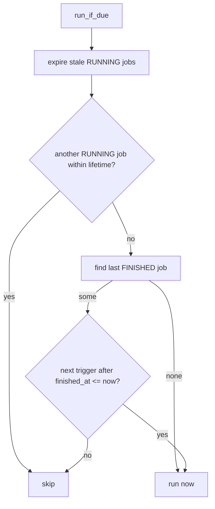

# Plan: Overdue-run for the data-source update job (no startup flag)

> Status: completed.

## Summary

The data-source update job is scheduled hourly via the cron expression
[`0 0 * * * *`](../config.toml:6). The scheduler fires **strictly on schedule while
the process is running** and does not catch up missed slots. Today the job service
decides whether to run based on a `startup: bool` flag: at startup it runs only if
the job has **never** succeeded, and on a cron tick it always runs. As a result,
when the app is down during a slot (for example a restart at 08:45 UTC that misses
the 08:00 UTC slot), the data stays stale until the next tick.

This plan removes the `startup` flag entirely and unifies the decision: the job
runs on **every** invocation when it has never succeeded **or** is overdue (at
least one scheduled trigger has been missed since the last successful run). At a
cron tick the job is always due, so tick behaviour is preserved, while the
immediate startup invocation now also catches up missed slots. The decision logic
stays in the application-layer job service
([`DataSourceUpdateService`](../src/core/application/data_source_update_service.rs:29)),
preserving the hexagonal architecture.

## Root cause recap

Verified behaviour of the current code:

- [`run_scheduler()`](../src/adapter/driving/job_scheduler.rs:18) computes the next
  trigger with `schedule.after(&now).next()`, sleeps, runs, and recomputes. It
  never replays missed triggers.
- On startup it calls [`run_if_due(true)`](../src/core/application/data_source_update_service.rs:63),
  which runs only when [`find_last_finished_by_type`](../src/core/domain/jobs/repository.rs:45)
  returns `None` (never succeeded).
- On a cron tick it calls `run_if_due(false)`, which always runs (unless a RUNNING
  job within its lifetime blocks).

Because the 07:00 UTC job finished successfully, the 08:45 UTC restart skipped the
startup run, and the 08:00 UTC slot was never executed.

## Goal

- Remove the `startup: bool` toggle and run the update job on every invocation
  when it has never succeeded **or** the last successful run is overdue.
- Keep the run/decision logic inside the application-layer job service.
- Add a single one-line log for "job started" and keep the existing single-line
  log for "job finished", both including the job name and id.

## Scope

- [`src/core/application/data_source_update_service.rs`](../src/core/application/data_source_update_service.rs:1)
  (logic + logging + tests).
- [`src/adapter/driving/job_scheduler.rs`](../src/adapter/driving/job_scheduler.rs:18)
  (drop the `true`/`false` arguments and update comments).
- No changes to [`main.rs`](../src/main.rs:33), configuration, `JobRepository`, or
  migrations.

## Key design decisions

1. **Overdue is computed from the cron schedule.** "Overdue" means: the first
   trigger strictly after the last successful `finished_at` is in the past. This
   is exact for any cron expression and needs no "interval length" heuristic.
   It reuses the same `schedule.after(...)` semantics the scheduler already
   relies on.

2. **The logic lives in `DataSourceUpdateService`.** The service already holds the
   [`Configuration`](../src/core/domain/configuration/configuration.rs:13) (which
   exposes [`data_source_update_cron()`](../src/core/domain/configuration/configuration.rs:67))
   and the [`JobRepository`](../src/core/domain/jobs/repository.rs:9), so it can
   compute the overdue decision without any new port.

3. **The `cron` crate is already a core dependency.** [`Configuration::new`](../src/core/domain/configuration/configuration.rs:23)
   already validates the cron string with `cron::Schedule::from_str`, so parsing
   the schedule inside the application service does not introduce a new core
   dependency or break the hexagonal boundary.

4. **Anchor on `finished_at`.** A successful job is anchored at its
   `finished_at` (falling back to `started_at` defensively). The next trigger
   after that is when the next run is due; if it is already in the past, we have
   missed work.

5. **No startup flag, one unified rule.** `run_if_due()` applies the same
   decision on every call: run iff never succeeded or overdue. At a cron tick the
   job is always overdue (the wake time is at/after the due time), so the old
   always-run tick behaviour is preserved while startup now catches up missed
   slots. This removes the toggle and its two code paths.

## run_if_due decision flow



## Overdue rule

```rust
fn is_overdue(&self, last: &Job, now: DateTime<Utc>) -> bool {
    let schedule = match cron::Schedule::from_str(self.configuration.data_source_update_cron()) {
        Ok(schedule) => schedule,
        Err(_) => return false, // config validates the cron; defensive fallback
    };
    match last.finished_at.or(last.started_at) {
        Some(anchor) => schedule.after(&anchor).next().is_some_and(|next| next <= now),
        None => true, // finished job without timestamps: treat as overdue
    }
}
```

Boundary semantics: if the last run finished at `07:00:00` and `now == 08:00:00`,
the next trigger after `07:00:00` is `08:00:00`, which is `<= now`, so the job is
overdue and runs — exactly the missed-slot case.

## Step-by-step implementation

1. **Add imports** to [`data_source_update_service.rs`](../src/core/application/data_source_update_service.rs:9):
   `use std::str::FromStr;` (so `cron::Schedule::from_str` is callable).

2. **Rewrite [`run_if_due`](../src/core/application/data_source_update_service.rs:63)**
   with signature `pub fn run_if_due(&self)` and a single decision path:
   - Expire stale RUNNING jobs (unchanged).
   - Skip when a RUNNING job within its lifetime blocks (unchanged).
   - `find_last_finished_by_type` → `None` → log one line and run.
   - `Some(last)` → if [`is_overdue`](../src/core/application/data_source_update_service.rs:63)
     then log one line
     (`Data source update job is overdue (last run at {finished_at}); running`) and
     run; otherwise do nothing.
   - `Err` → log and return (unchanged).

3. **Add the private `is_overdue` helper** as specified above.

4. **Add the "started" log** in [`execute`](../src/core/application/data_source_update_service.rs:126):
   after `set_running` succeeds and before `run_updates`, print exactly one line
   containing the job name and id:
   `Data source update job {name} ({id}) started`.
   Update the existing finish/fail lines to the same shape, also including name
   and id:
   `Data source update job {name} ({id}) finished` and
   `Data source update job {name} ({id}) failed: {error}`.

5. **Simplify the scheduler** in [`job_scheduler.rs`](../src/adapter/driving/job_scheduler.rs:18):
   replace `run_if_due(true)` and `run_if_due(false)` with `run_if_due()` and
   update the comments (the immediate startup call and the tick calls now share
   the same always-on rule).

6. **Update and add tests** in the [`mod tests`](../src/core/application/data_source_update_service.rs:208)
   block:
   - Replace every `run_if_due(true)` / `run_if_due(false)` call with `run_if_due()`.
   - Rename the startup-specific test names for clarity
     (e.g. `skips_at_startup_when_job_already_succeeded` →
     `skips_when_job_already_succeeded_and_not_overdue`).
   - Add a helper `finished_job_at(job_type, finished_at)` that builds a FINISHED
     job with an explicit `finished_at` (mirroring the existing
     [`finished_job`](../src/core/application/data_source_update_service.rs:662) helper).
   - `runs_when_last_run_is_overdue`: seed a FINISHED job whose `finished_at` is
     ~2 hours ago; call `run_if_due()`; assert a new job was created and finished.
   - `skips_when_last_run_is_recent`: seed a FINISHED job whose `finished_at` is
     ~30 minutes ago (inside the hourly interval); call `run_if_due()`; assert no
     new job was created.
   - Keep the existing never-succeeded and running-blocking tests unchanged
     (their call sites only lose the flag argument).

## Verification

- `cargo check --all-targets`
- `make check` (cargo fmt + clippy with `-D warnings`)
- `make test` (full unit + integration suite)

## Out of scope / follow-up

- A manual trigger REST endpoint.
- Retry-on-failure (only FINISHED jobs anchor the overdue rule).
- Scheduler catch-up/replay of missed slots while the process is down (the tick
  path is intentionally the same unified rule).

## Depends on

- [`job_scheduler_plan.md`](job_scheduler_plan.md) (completed): the job service
  and `run_if_due` lifecycle this plan extends.
