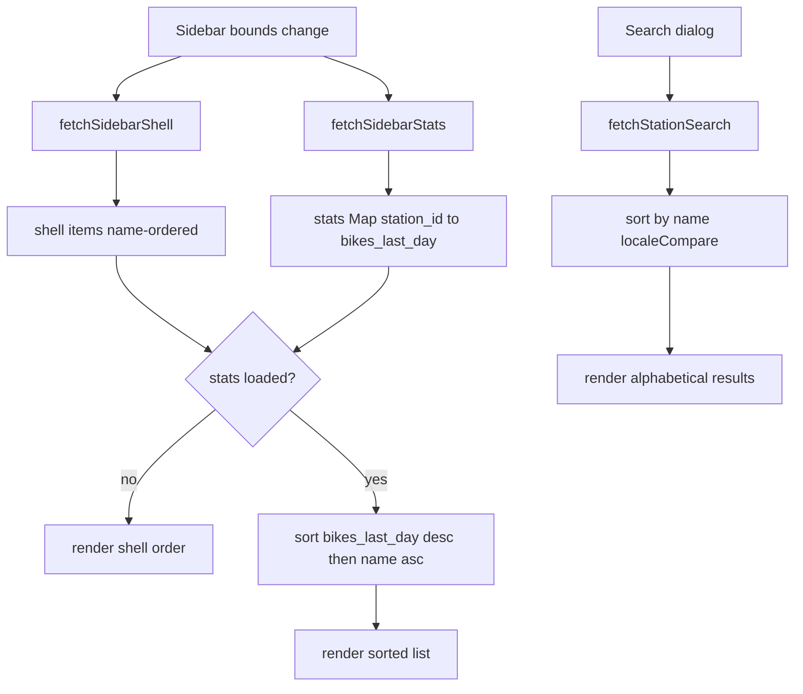

# Plan 102 — Sort sidebar by last-day counts, keep search alphabetical

## Status

- [x] Implemented & verified (`make check` + `make test-playwright` green)

## Goal

The sidebar currently lists visible counting stations in name order (the backend
[`stations_for_bounds()`](backend/src/core/application/station_analytics/service.rs:250)
sorts by `name`). Change the sidebar so the list is ordered by
`bikes_last_day` **descending** (busiest station first), with ties broken
**alphabetically by name** (ascending). The search dialog must remain
**alphabetical**.

## Context

- The sidebar is split into two resources (see plan 52):
  - [`SidebarShell`](frontend/src/features/stations/types.ts:46) returns the
    station **identity** only (`id`, `name`, `description`, coordinates,
    `image_url`) and is cheap.
  - The stats sub-resource returns
    [`SidebarStationStats`](frontend/src/features/stations/types.ts:56), which
    contains `bikes_last_day`, and arrives in parallel, after the shell renders.
- [`Sidebar.tsx`](frontend/src/features/sidebar/Sidebar.tsx:87) currently maps
  over `shell.items` in the order they arrive (name order).
- [`useStationSearch.ts`](frontend/src/features/stations/useStationSearch.ts:23)
  returns search results in backend order; the backend already returns them
  name-sorted, but the frontend does not enforce it.

## Approach

Frontend-only change, keeping the backend shell cheap (no measurement
aggregation in the shell):

1. **Sidebar** — [`Sidebar.tsx`](frontend/src/features/sidebar/Sidebar.tsx:87):
   derive a sorted list with `useMemo` that joins `shell.items` with the
   `stats` map:
   - If `stats` is still `null` (loading), keep the shell's existing order,
     which is already alphabetical (the shell is name-sorted).
   - Once `stats` is available, sort descending by
     `stats.get(id)?.bikes_last_day ?? 0`, breaking ties by
     `name.localeCompare(name)` ascending.
2. **Search** — [`useStationSearch.ts`](frontend/src/features/stations/useStationSearch.ts:23):
   add an explicit alphabetical sort of the results by `name` via
   `localeCompare`, so the search dialog stays alphabetical regardless of
   backend ordering.

### Sorting rule

```text
descending bikes_last_day
    -> equal count: ascending name (localeCompare)
    -> no stats yet: shell order (alphabetical fallback)
```

### Why not sort in the backend

The shell is intentionally free of measurement aggregation so the identity
renders immediately; the counts only exist in the stats sub-resource. Joining
them client-side preserves that latency split and keeps the change minimal.

## Mermaid — data flow and sort placement



## Implementation steps

1. Add the sorted-list `useMemo` to
   [`Sidebar.tsx`](frontend/src/features/sidebar/Sidebar.tsx) and render the
   sorted list instead of `shell.items` directly. Done.
2. Add an explicit alphabetical `localeCompare` sort to
   [`useStationSearch.ts`](frontend/src/features/stations/useStationSearch.ts).
   Done (sorts a copy so the loaded `allStations` state is never mutated).
3. Add Playwright coverage:
   - Sidebar ([`sidebar.spec.ts`](frontend/e2e/sidebar.spec.ts)): read every
     row's station + `bikes / last day`, assert counts are non-increasing, and
     assert the busiest seeded Münster station (`Gasselstiege`, 6 channels with
     data) tops a list that is not alphabetical. Done.
   - Search ([`search.spec.ts`](frontend/e2e/search.spec.ts)): read the
     unfiltered result names and assert they are sorted with the browser's own
     `localeCompare`. Done.
4. Run the gates:
   - `make check` — green
   - `make test-playwright` — green (71 passed; one pre-existing flaky
     settings date-range test failed on a first run and passed on re-run)

## Definition of done

- [x] Sidebar lists visible stations by `bikes_last_day` descending, ties by name
- [x] Search dialog results remain alphabetical
- [x] Plan registered in [`plans/README.md`](plans/README.md)
- [x] `make check` green
- [x] `make test-playwright` green
