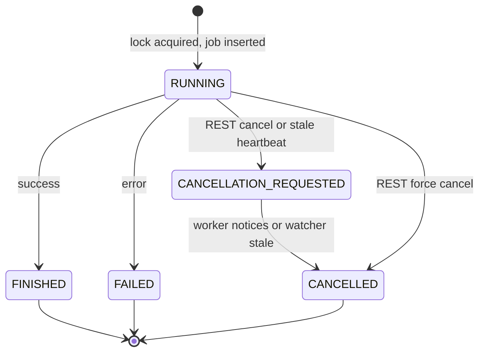

# 106 - Cancel job REST endpoint, multi-instance heartbeat + HATEOAS update

Status: drafted

## Problem

The jobs API is read-only and the job lifecycle is a single-instance ShedLock
model. Running several backend instances against the same database is unsafe:

- [`GET /api/v1/jobs`](backend/src/adapter/driving/rest/handlers/jobs.rs:23) and
  [`GET /api/v1/jobs/{id}`](backend/src/adapter/driving/rest/handlers/jobs.rs:52) are read-only.
- Liveness is expressed as an absolute `lifetime_until` deadline; there is no
  notion of **who** runs a job or **whether it is still alive**, so another
  instance cannot safely cancel it, and a crashed instance's RUNNING job is only
  noticed once the deadline passes.
- Starting a job is a non-atomic `find_running_by_type` check followed by
  `set_running`, which lets two instances claim the same job type.

## Goal

Make every job type cancellable through `POST /api/v1/jobs/{id}/cancel` using a
cooperative, multi-instance-safe protocol built on Postgres's proven locking
primitive (a ShedLock-style lock table) instead of hand-rolled locking:

1. Each backend instance generates a random `instance_id` at startup.
2. A `job_locks` table (unique `job_type`, `locked_by`, `lock_until`) provides
   atomic mutual exclusion via `INSERT ... ON CONFLICT ... WHERE lock_until < now()`.
3. A job row is only created **after** the lock is acquired, and is inserted
   directly as `RUNNING` (the transient `PENDING` state is removed).
4. The owner refreshes `heartbeat_at` (and extends the lock lease) after each
   sub-task.
5. Cancellation is two-phase: the REST call or a stale-heartbeat watcher sets
   `CANCELLATION_REQUESTED`; the owner notices it at the next sub-task boundary,
   stops, and finalizes `CANCELLED`. A `force` option (REST) and the watcher (for
   dead workers) set `CANCELLED` directly.
6. `lifetime_until` / `max_lifetime_exceeded` and the `*_max_lifetime_seconds`
   configuration are **replaced** by `heartbeat_at` and
   `*_max_heartbeat_interval_seconds`.

## Status model



## Protocol

| Actor | Action |
|---|---|
| Worker (owner) | acquire `job_locks` row, insert RUNNING job, heartbeat after each sub-task; on `CANCELLATION_REQUESTED`/`CANCELLED` stop and finalize `CANCELLED`; release the lock at the terminal transition. |
| REST `cancel` (`force=false`) | `RUNNING` → `CANCELLATION_REQUESTED`; `CANCELLATION_REQUESTED` → idempotent no-op; terminal → `400`. |
| REST `cancel` (`force=true`) | `RUNNING`/`CANCELLATION_REQUESTED` → `CANCELLED`; terminal → `400`. |
| Watcher (per instance, periodic) | `RUNNING` with stale `heartbeat_at` → `CANCELLATION_REQUESTED`; `CANCELLATION_REQUESTED` with stale `heartbeat_at` → `CANCELLED` (a requested cancellation can always be force-finalized). |

## Concurrency model

- The **only** racy step is the claim: [`acquire`](backend/src/core/domain/jobs/repository_port.rs:1)
  is a single `INSERT ... ON CONFLICT (job_type) DO UPDATE ... WHERE lock_until < now()`
  statement on `job_locks`, so exactly one instance wins the lock and sets the
  `locked_by` owner id.
- The `job_locks` row **persists for the entire job life** and is released only
  at the terminal transition (`FINISHED`/`FAILED`/`CANCELLED`). Status changes
  in between (`heartbeat`, `CANCELLATION_REQUESTED`, `CANCELLED`) do not touch
  the lock and are single atomic `UPDATE`s guarded by the current status, so
  they cannot race.
- `heartbeat` is **owner-only**: it updates `jobs.heartbeat_at` only when
  `instance_id` matches the caller and extends the `job_locks` lease only when
  `locked_by` matches; any other instance's heartbeat is a no-op (it still reads
  the current status so a foreign caller learns the job is no longer owned by it).
- Cross-instance transitions (`request_cancellation`, force `mark_cancelled`)
  are safe because each is one atomic conditional `UPDATE`; whoever wins the
  status guard wins, and the loser observes the resulting terminal state.

## Heartbeat frequency (revised)

The first implementation ties heartbeats to sub-task boundaries, which can be
too infrequent:

- `data_source_update` heartbeats once per import **batch** (one provider page):
  a slow provider or a very large page can exceed the heartbeat interval even
  though the worker is healthy.
- `asset_cleanup` heartbeats once per orphan delete (fine).
- `tiles_update` heartbeats only **before and after** the whole atomic build, so
  a multi-minute/multi-GB build has no mid-build heartbeat and could be force-
  cancelled by the watcher as stale.

**Fix — a dedicated per-job heartbeat loop.** Each running job spawns a short-
lived background thread (inside the existing `spawn_blocking`/`scope` context)
that calls [`heartbeat`](backend/src/core/domain/jobs/repository_port.rs:1) on a
fixed tick independent of sub-tasks:

- Tick = `min(heartbeat_interval / 3, 5 s)` (at least three beats per interval,
  with a small floor) — no new configuration key needed.
- The loop also observes the returned status and sets a shared
  `Arc<AtomicBool>` (`cancel_requested`) when the job is no longer RUNNING, so a
  cancellation is observed promptly (bounded by the tick).
- The worker stops/joins the loop when the job work finishes, before the
  terminal transition, so no further writes race `finalize`.
- Implemented as [`JobHeartbeat`](backend/src/core/application/job_heartbeat.rs:1)
  (core application), started in each job service's `execute` after the job is
  recorded and stopped before finalize.

Impact on Task 7/8: `data_source_update`, `asset_cleanup` and `tiles_update`
each run one heartbeat thread for the whole job, guaranteeing freshness even
while a single import batch or the atomic tiles build is still running. The
existing per-boundary `check_cancellation`/`is_cancelled_or_requested` DB checks
are retained as an additional authoritative cancellation check. At most one job
per type runs at a time, so there are at most three such threads.

## Approach

### Task 1 — Migration V22 ([`V22__add_job_cancellation.sql`](backend/migrations/V22__add_job_cancellation.sql))

```sql
ALTER TABLE jobs
    DROP COLUMN lifetime_until,
    DROP COLUMN max_lifetime_exceeded,
    ADD COLUMN instance_id UUID,
    ADD COLUMN heartbeat_at TIMESTAMPTZ;

-- Any pre-migration PENDING row can never be claimed under the new model.
UPDATE jobs SET status = 'CANCELLED',
                failure_message = 'abandoned before ownership',
                finished_at = now()
WHERE status = 'PENDING';

ALTER TABLE jobs DROP CONSTRAINT jobs_status_check;
ALTER TABLE jobs ADD CONSTRAINT jobs_status_check
    CHECK (status IN ('RUNNING','FINISHED','FAILED','CANCELLATION_REQUESTED','CANCELLED'));

CREATE INDEX idx_jobs_type_status_heartbeat ON jobs (job_type, status, heartbeat_at);

-- ShedLock-style mutual exclusion: the atomic claim primitive.
CREATE TABLE job_locks (
    job_type TEXT PRIMARY KEY,
    locked_by UUID NOT NULL,
    lock_until TIMESTAMPTZ NOT NULL
);
```

**Implementation notes:** `jobs_status_check` is PostgreSQL's default generated
name (`{table}_{column}_check`) — confirm via `\d jobs` before dropping.
`instance_id`/`heartbeat_at` stay nullable so pre-migration rows need no
backfill; the watcher treats `NULL` heartbeat as stale and cancels orphaned
pre-migration RUNNING rows. Regenerate
[`frontend/e2e/e2e-seed.sql`](frontend/e2e/e2e-seed.sql) after the schema change
(`scripts/dump-e2e-fixture.sh`).

### Task 2 — Domain model ([`job.rs`](backend/src/core/domain/jobs/job.rs:1))

- `JobStatus`: `Running`, `Finished`, `Failed`, `CancellationRequested`,
  `Cancelled` (remove `Pending`); wire values `RUNNING`/`FINISHED`/`FAILED`/
  `CANCELLATION_REQUESTED`/`CANCELLED` in `as_str` + `FromStr`.
- `Job`: remove `lifetime_until` + `max_lifetime_exceeded`; add
  `instance_id: Option<Uuid>` and `heartbeat_at: Option<DateTime<Utc>>`.
- Replace `Job::new` with `Job::running(id, name, job_type, instance_id,
  started_at)` (status `Running`, `instance_id = Some`, `heartbeat_at = Some`).
- Helpers: keep `is_running`/`is_successful`; add `is_cancellable` (`Running`),
  `is_cancellation_requested`, `is_cancelled`, `is_terminal`
  (`Finished | Failed | Cancelled`). Remove `lifetime_exceeded`.
- Update domain unit tests (round-trip five statuses, new-field defaults,
  `Job::running`).

### Task 3 — Repository port ([`repository_port.rs`](backend/src/core/domain/jobs/repository_port.rs:1))

- `insert(job)` — persists an already-owned `RUNNING` job (no lifetime validation).
- Add `acquire(&self, job_type, instance_id, lock_until) -> Result<bool, DomainError>`:
  ShedLock upsert on `job_locks`; `true` when acquired.
- Add `release(&self, job_type, instance_id) -> Result<(), DomainError>`:
  `DELETE FROM job_locks WHERE job_type = $1 AND locked_by = $2`.
- Add `heartbeat(&self, id, job_type, instance_id, at) -> Result<JobStatus, DomainError>`:
  extend the `job_locks` lease, update `jobs.heartbeat_at`, return the current
  status (so the worker observes `CANCELLATION_REQUESTED`/`CANCELLED`).
- Add `request_cancellation(&self, id)` — `RUNNING → CANCELLATION_REQUESTED`.
- Add `mark_cancelled(&self, id, finished_at)` —
  `RUNNING`/`CANCELLATION_REQUESTED → CANCELLED` (+ `finished_at`,
  `failure_message = 'cancelled'`).
- Keep `set_finished` (`RUNNING → FINISHED`) and `set_failed`
  (`RUNNING → FAILED`); `update_metadata`; `find_by_id`; `find_all`.
- Replace `find_running_by_type` with
  `find_active_by_type(job_type) -> Result<Vec<Job>, DomainError>` (`RUNNING` +
  `CANCELLATION_REQUESTED`).
- Replace `expire_running_jobs` with
  `reconcile_stale_active(job_type, heartbeat_before, now)`:
  stale `RUNNING` → `CANCELLATION_REQUESTED`; stale `CANCELLATION_REQUESTED` →
  `CANCELLED` (raw SQL, no new domain fields).
- Keep `find_last_finished_by_type`.

### Task 4 — Postgres implementation ([`job_repository.rs`](backend/src/adapter/driven/postgres/job_repository.rs:1))

- `SELECT_COLUMNS`: drop `lifetime_until`/`max_lifetime_exceeded`, add
  `instance_id`/`heartbeat_at`; update `map_row`.
- Implement all Task 3 methods; rewrite repository tests (acquire/release,
  heartbeat freshness + lease extension, claim contention returns `false`,
  request/mark cancellation transitions + guards, reconcile of stale rows).

### Task 5 — Application services

- [`job_service.rs`](backend/src/core/application/job_service.rs:12): add
  `cancel(id, force)` with the protocol policy (404 unknown, 400 terminal,
  idempotent in-flight request) and add `cancel` to
  [`JobServicePort`](backend/src/core/domain/jobs/service_port.rs:9).
- New `JobReconciliationService` (core application) holding `JobRepository` +
  `Configuration`; `reconcile_all(now)` iterates the three job types with their
  heartbeat intervals and calls `reconcile_stale_active`.

### Task 6 — Configuration ([`configuration.rs`](backend/src/core/domain/configuration/configuration.rs:19))

- Rename `data_source_update_max_lifetime_seconds` →
  `data_source_update_max_heartbeat_interval_seconds`,
  `asset_cleanup_max_lifetime_seconds` →
  `asset_cleanup_max_heartbeat_interval_seconds`, and
  [`MapsConfiguration.update_max_lifetime_seconds`](backend/src/core/domain/configuration/configuration.rs:376)
  → `update_max_heartbeat_interval_seconds`.
- Update constructors, validation, accessors (return `chrono::Duration`),
  defaults, config tests, [`config.toml`](config.toml:7),
  [`config.toml.example`](config.toml.example:1) and the README config table.

### Task 7 — Worker loops (all three job types)

Common `execute` shape per service:

1. `acquire(job_type, instance_id, now + heartbeat_interval)`; if `false`, skip
   (another instance owns the type).
2. `insert(Job::running(...))`; on failure, `release` and abort.
3. Run the work, heartbeating at each sub-task; on completion transition the
   status to `FINISHED`/`FAILED`/`CANCELLED` and `release` the lock.

- **`DataSourceUpdateService`** ([`data_source_update_service.rs`](backend/src/core/application/data_source_update_service.rs:1)):
  `on_batch` closure heartbeats and returns `Err(DomainError::Cancelled)` on
  `CANCELLATION_REQUESTED`/`CANCELLED`; the aggregate finalizes `CANCELLED`.
  `run_if_due` uses `find_active_by_type` and drops `expire_running_jobs`.
- **`AssetCleanupService`** ([`asset_cleanup_service.rs`](backend/src/core/application/asset_cleanup_service.rs:1)):
  heartbeat/check before each orphan delete; `DomainError::Cancelled` finalizes
  `CANCELLED`.
- **`TilesUpdateService`** ([`tiles_update_service.rs`](backend/src/core/application/tiles_update_service.rs:1)):
  heartbeat/check before and after the atomic
  [`run_update`](backend/src/core/application/tiles_update_service.rs:182); the
  build itself cannot be interrupted, so a mid-run cancel is recorded as
  `CANCELLED` only after the build returns.
- Add `DomainError::Cancelled` to [`error.rs`](backend/src/core/domain/error.rs:4)
  and handle it in [`map_domain_error`](backend/src/adapter/driving/rest/handlers/mod.rs:67)
  (internal control flow; should not normally reach REST).

### Task 8 — Data import loop ([`data_import_service.rs`](backend/src/core/application/data_import_service.rs:387))

- Drop the `deadline: Option<DateTime<Utc>>` parameter from
  `update_data_source_with_progress` and `update_data_source`; remove the
  deadline `break`. Cancellation now arrives through `on_batch` returning
  `DomainError::Cancelled`.
- Update callers and tests accordingly.

### Task 9 — Watcher driving adapter + wiring

- Add `job_scheduler::run_job_watcher(reconciliation_service, interval)` (a
  periodic `spawn_blocking` loop calling `reconcile_all`). Use a fixed short
  interval (e.g. 30 s, a constant) — cheap, three small UPDATEs per tick.
- [`main.rs`](backend/src/main.rs:304): generate the random `instance_id` once at
  startup, thread it into the three job services, and spawn the watcher alongside
  the existing schedulers (still gated by `scheduled_jobs_enabled`).

### Task 10 — DTO + HATEOAS ([`dto/jobs.rs`](backend/src/adapter/driving/rest/dto/jobs.rs:1))

- `JobStatusDto`: `Running`, `Finished`, `Failed`, `CancellationRequested`,
  `Cancelled`.
- `JobDto`: replace `lifetime_until`/`max_lifetime_exceeded` with `instance_id`
  and `heartbeat_at`; add a `cancel` HATEOAS link only when `status == Running`.
- Add `CancelJobRequestDto { force: Option<bool> }` for the POST body.

### Task 11 — Handler + route + OpenAPI

- [`handlers/jobs.rs`](backend/src/adapter/driving/rest/handlers/jobs.rs:1): add
  `cancel_job` (`POST /api/v1/jobs/{id}/cancel`, optional JSON
  `CancelJobRequestDto`, returns `200` with the updated `JobDto`;
  `400`/`404`/`500` otherwise). Re-export in
  [`handlers/mod.rs`](backend/src/adapter/driving/rest/handlers/mod.rs:1).
- [`rest/mod.rs`](backend/src/adapter/driving/rest/mod.rs:12): import `post` and
  route `/api/v1/jobs/{id}/cancel`.
- [`openapi.rs`](backend/src/adapter/driving/rest/openapi.rs:29): register
  `cancel_job` path + `CancelJobRequestDto` schema.

### Task 12 — Tests

- Repository tests (Task 4), service tests for `JobService::cancel` and
  `JobReconciliationService`, config tests (Task 6).
- [`rest/tests/jobs.rs`](backend/src/adapter/driving/rest/tests/jobs.rs:1): cancel a
  `RUNNING` job (`force=false` → `CANCELLATION_REQUESTED`), force-cancel →
  `CANCELLED`, terminal → `400`, unknown → `404`, and extend OpenAPI assertions
  with `/api/v1/jobs/{id}/cancel`.
- [`rest/tests/dto.rs`](backend/src/adapter/driving/rest/tests/dto.rs:132): status
  mapping for the new variants; `cancel` link present on RUNNING, absent on
  FINISHED; new `instance_id`/`heartbeat_at` fields.
- Update all `JobRepository` test doubles (rest mocks,
  asset_cleanup_service, data_source_update_service, tiles_update_service,
  station_analytics/tests.rs, station_analytics/metrics.rs) to the new trait
  surface (mutating where cancellation is asserted, no-op/unimplemented
  elsewhere).

### Task 13 — Docs

- [`README.md`](README.md:152): rewrite the lifecycle description
  (`RUNNING → FINISHED` / `FAILED` / `CANCELLED` with `CANCELLATION_REQUESTED`
  + heartbeat + instance-id), rename the config keys, document the cancel
  endpoint + `force` body in the REST list, and note the `job_locks` table.
- Register this plan in [`plans/README.md`](plans/README.md:1).

## Files touched

| File | Change |
|---|---|
| [`backend/migrations/V22__add_job_cancellation.sql`](backend/migrations/V22__add_job_cancellation.sql:1) | columns + CHECK + index + `job_locks` |
| [`backend/src/core/domain/jobs/job.rs`](backend/src/core/domain/jobs/job.rs:16) | statuses + fields + `Job::running` + helpers |
| [`backend/src/core/domain/jobs/repository_port.rs`](backend/src/core/domain/jobs/repository_port.rs:9) | acquire/release/heartbeat/request/mark/reconcile/active |
| [`backend/src/core/domain/jobs/service_port.rs`](backend/src/core/domain/jobs/service_port.rs:9) | `cancel` |
| [`backend/src/core/domain/error.rs`](backend/src/core/domain/error.rs:4) | `Cancelled` variant |
| [`backend/src/adapter/driven/postgres/job_repository.rs`](backend/src/adapter/driven/postgres/job_repository.rs:1) | new repository impl + tests |
| [`backend/src/core/application/job_service.rs`](backend/src/core/application/job_service.rs:12) | `cancel` + tests |
| [`backend/src/core/application/job_reconciliation_service.rs`](backend/src/core/application/job_reconciliation_service.rs:1) | new watcher core service |
| [`backend/src/core/application/data_source_update_service.rs`](backend/src/core/application/data_source_update_service.rs:1) | acquire + heartbeat + cancellation |
| [`backend/src/core/application/asset_cleanup_service.rs`](backend/src/core/application/asset_cleanup_service.rs:1) | acquire + heartbeat + cancellation |
| [`backend/src/core/application/tiles_update_service.rs`](backend/src/core/application/tiles_update_service.rs:1) | acquire + heartbeat + cancellation |
| [`backend/src/core/application/data_import_service.rs`](backend/src/core/application/data_import_service.rs:387) | drop deadline; propagate cancellation |
| [`backend/src/core/domain/configuration/configuration.rs`](backend/src/core/domain/configuration/configuration.rs:19) | renamed heartbeat config |
| [`backend/src/adapter/driving/job_scheduler.rs`](backend/src/adapter/driving/job_scheduler.rs:1) | `run_job_watcher` |
| [`backend/src/main.rs`](backend/src/main.rs:304) | instance id + watcher wiring |
| [`backend/src/adapter/driving/rest/dto/jobs.rs`](backend/src/adapter/driving/rest/dto/jobs.rs:1) | DTO fields + cancel link + request DTO |
| [`backend/src/adapter/driving/rest/handlers/jobs.rs`](backend/src/adapter/driving/rest/handlers/jobs.rs:1) | `cancel_job` |
| [`backend/src/adapter/driving/rest/handlers/mod.rs`](backend/src/adapter/driving/rest/handlers/mod.rs:67) | re-export + `Cancelled` mapping |
| [`backend/src/adapter/driving/rest/mod.rs`](backend/src/adapter/driving/rest/mod.rs:12) | route + `post` import |
| [`backend/src/adapter/driving/rest/openapi.rs`](backend/src/adapter/driving/rest/openapi.rs:29) | path + schema |
| [`backend/src/adapter/driving/rest/tests/{jobs,dto,mocks}.rs`](backend/src/adapter/driving/rest/tests/jobs.rs:1) | REST/DTO/mock updates |
| [`config.toml`](config.toml:7) / [`config.toml.example`](config.toml.example:1) | renamed keys |
| [`frontend/e2e/e2e-seed.sql`](frontend/e2e/e2e-seed.sql:1) | regenerate after schema change |
| [`README.md`](README.md:152) | lifecycle + config + endpoint docs |
| [`plans/README.md`](plans/README.md:1) | registration |

## Definition of done

- [ ] Plan registered in [`plans/README.md`](../plans/README.md:1)
- [ ] `POST /api/v1/jobs/{id}/cancel` (with optional `{"force": true}`) cancels
      every job type; unknown → 404, terminal → 400
- [ ] `job_locks` table provides atomic, ShedLock-style claim (no hand-rolled
      `NOT EXISTS` race); `PENDING` removed
- [ ] Jobs carry `instance_id` + `heartbeat_at`; workers heartbeat each sub-task
      and stop on `CANCELLATION_REQUESTED`
- [ ] Watcher reconciles stale RUNNING / CANCELLATION_REQUESTED jobs
- [ ] `lifetime_until`/`max_lifetime_exceeded` and the `*_max_lifetime_seconds`
      configs replaced by heartbeat equivalents
- [ ] `JobDto` exposes `instance_id`/`heartbeat_at` and a conditional `cancel`
      HATEOAS link
- [ ] `make check` green
- [ ] `make test-rest` green
- [ ] `make test` green
- [ ] `make coverage` green
- [ ] README / plan docs updated
