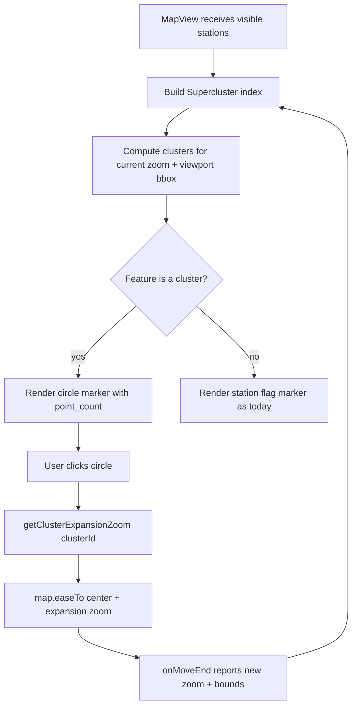

# 107 - Map station grouping (cluster circles with click-to-zoom)

Status: implemented

## Problem

The main map ([`MapView`](frontend/src/features/map/MapView.tsx:30)) renders one
flag marker per visible station. When stations are close together at low zoom,
their 32×40 px flags overlap and become unreadable/unclickable — a pair a few
metres apart (e.g. Hamburg MQ1.2/MQ1.3) or the dense Münster centre is drawn as
a pile of stacked flags. There is no way to see "how many stations are here" and
no way to separate them without manually zooming.

## Goal

Add frontend-only **station grouping** on the main map route only:

1. When stations visually overlap at the current zoom, render a single **circle
   marker showing the number of grouped stations** instead of the individual
   flags.
2. Clicking a circle **zooms the map to that cluster** (using the cluster's
   expansion zoom), after which the view re-renders and the stations render as
   individual markers because they no longer overlap.
3. Keep the existing station-marker behaviour (flag states, popup, overview
   selection) for every station that is **not** grouped, and keep the sidebar /
   visible-station BFF flow unchanged (clustering is purely a presentation layer
   on top of the already-fetched visible stations).

## Approach

Use the [`supercluster`](https://github.com/mapbox/supercluster) library for
client-side clustering. It is the standard, tiny, well-tested choice and fits the
current architecture: the map still renders React [`Marker`](frontend/src/features/map/MapView.tsx:1)
elements, so the existing flag SVGs ([`stationMarkerImage`](frontend/src/lib/map.tsx:46)),
popups and the `.station-marker` e2e locators stay intact. Cluster circles are
just additional `Marker` elements.

### Cluster index

- New helper module [`clusterStations.ts`](frontend/src/features/map/clusterStations.ts)
  owns the `Supercluster` index:
  - `radius: 40` (px) — close to the 32 px flag width, so only stations whose
    markers actually overlap are grouped (minimises unnecessary grouping and e2e
    churn).
  - `maxZoom: 18` — the map's own `maxZoom`, so even near-co-located stations
    separate at the highest zoom the map supports.
  - `minPoints: 2` — a single station is never "clustered".
- Each station is loaded as a `PointFeature` with
  `properties: { id, name, status }` and `geometry.coordinates = [lng, lat]`.
- `getClusters(bbox, zoom)` is called with the current viewport bbox and zoom.
- A helper returns the expansion zoom for a cluster id via
  `getClusterExpansionZoom(id)`.

### MapView wiring

[`MapView`](frontend/src/features/map/MapView.tsx:30) currently passes the map
instance straight up via `onReady` and reports bounds up via `onBounds`, but does
not keep either for itself. It gains:

- A local map ref (`useRef<MaplibreMap | null>`), set inside a wrapper around
  the existing `onReady`.
- A local `zoom` state, fed by a new optional `onZoom` callback on
  [`BaseMap`](frontend/src/features/map/BaseMap.tsx:37) that is invoked on map
  load and on `moveend` (alongside the existing `onBounds`).
- A local viewport-bounds state, fed by wrapping the existing `onBounds`.
- A `useMemo` that builds the index once per stations array and derives the
  cluster/point feature list from `zoom` + viewport bounds.

The render loop switches from `stations.map(...)` to iterating the derived
features:

- **Cluster feature** → a `Marker` with a circle `<button>` showing
  `point_count`, carrying `className="station-cluster"`, `data-count` and an
  `aria-label`/`title` of `"{n} stations"`. Its `onClick` stops propagation and
  calls `zoomToCluster(feature)`.
- **Point feature** → the existing [`stationMarkerImage`](frontend/src/lib/map.tsx:46)
  marker built from the feature's `{ id, name, status }` + coordinates, wired to
  the existing popup + `onSelectStation` logic unchanged.

`zoomToCluster` clears the open popup and calls
`map.easeTo({ center: [lng, lat], zoom: getClusterExpansionZoom(id) })`. The
ensuing `moveend` updates `zoom`/bounds, the cluster recomputes, and the grouped
stations re-render as individual flags.

### Cluster circle styling

Rendered with Tailwind utilities on the circle `<button>` (theme-aware via the
existing `--primary` / `--primary-foreground` tokens): a filled primary circle
with the count in `primary-foreground`, a `ring` outline, `shadow`, and
`cursor-pointer`. The `station-cluster` class is added for the e2e locator and
for any map-specific sizing fix.

## Files touched

| File | Change |
|---|---|
| [`frontend/package.json`](frontend/package.json) | Add `supercluster` dependency |
| [`frontend/package-lock.json`](frontend/package-lock.json) | Lockfile update via `npm install` |
| [`frontend/src/features/map/clusterStations.ts`](frontend/src/features/map/clusterStations.ts) | New helper: Supercluster index build + cluster query + expansion zoom |
| [`frontend/src/features/map/BaseMap.tsx`](frontend/src/features/map/BaseMap.tsx:37) | Add optional `onZoom` prop, invoked on load + moveend |
| [`frontend/src/features/map/MapView.tsx`](frontend/src/features/map/MapView.tsx:30) | Track map ref/zoom/bounds; compute + render clusters; cluster click-to-zoom |
| [`frontend/e2e/helpers.ts`](frontend/e2e/helpers.ts:24) | Add `mapClusters` locator + a marker-representation count helper |
| [`frontend/e2e/map.spec.ts`](frontend/e2e/map.spec.ts) | Add cluster → zoom → ungroup spec; adjust marker-click specs |
| [`frontend/e2e/sidebar.spec.ts`](frontend/e2e/sidebar.spec.ts:12) | Reconcile marker-count assertions with clusters |
| other affected specs (flags/url/detail/cities/responsive/dark-mode/settings) | Adjust specs that assume every visible station is an individual marker |

## e2e impact

Clustering changes the "one marker per visible station" invariant that several
specs rely on:

- [`mapMarkers`](frontend/e2e/helpers.ts:25) counts `.station-marker` elements
  and several specs assert `markers === sidebarVisible` (e.g.
  [`sidebar.spec.ts`](frontend/e2e/sidebar.spec.ts:24)).
- Specs click `mapMarkers(page).first()` at the default Münster view to open a
  popup/overview; if that station is grouped at zoom 13 the click target no
  longer exists.

Strategy:

1. Add `mapClusters(page)` = `page.locator('.station-cluster')`.
2. Add a helper `mapStationRepresentationCount(page)` = individual marker count +
   the sum of `data-count` over visible cluster markers, so the sidebar
   consistency assertions become `markers + clusterCounts === visible`.
3. For specs that click a specific station, first zoom in (or click through a
   cluster) until that station renders individually; reuse the existing
   `CITY_TARGET` isolated stations.
4. Add a dedicated spec: at the default view a cluster circle is visible with a
   numeric count; clicking it zooms so the grouped stations render as individual
   `.station-marker` flags and the circle disappears.

## Tasks

1. Add `supercluster` to `frontend/package.json` and regenerate
   `package-lock.json` (`npm install supercluster` in [`frontend/`](frontend)).
2. Add `onZoom?: (zoom: number) => void` to [`BaseMap`](frontend/src/features/map/BaseMap.tsx:37)
   and call it in `onLoad` (after `fitBounds`) and `onMoveEnd`.
3. Create [`clusterStations.ts`](frontend/src/features/map/clusterStations.ts)
   with the Supercluster index, cluster query and expansion-zoom helpers.
4. Update [`MapView`](frontend/src/features/map/MapView.tsx:30) to track map
   ref/zoom/bounds, compute features, render cluster circles + individual
   markers, and wire cluster click-to-zoom.
5. Style the cluster circle (Tailwind + `station-cluster` class).
6. Update Playwright helpers and affected specs; add the cluster → zoom →
   ungroup spec.
7. Run `make check` and `make test-playwright`.

## Definition of done

- [x] Clusters render as numbered circles on the main map when stations overlap
- [x] Clicking a cluster zooms to the expansion zoom and the stations render
      individually
- [x] Individual station markers, popup and overview selection unchanged
- [x] `make check` green
- [x] `make test-playwright` green (updated + new e2e)
