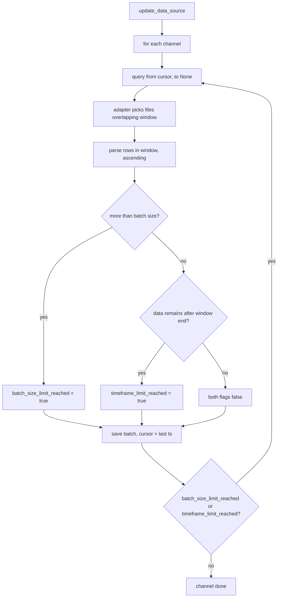

# Plan: Import time-batching + API pagination & filters

> Status: completed.

## Summary

Two hot-fixes that address the runaway import job and make the read API usable on
a large dataset:

1. **Import time-batching.** Bound each measurement page by a configurable time
   window (in hours, default 7 days) in addition to the existing row-count
   batch size. The Münster adapter then only reads the monthly CSV files that
   overlap the current window instead of the full history, and the job keeps
   paging until everything is imported.
2. **API pagination + filters.** Paginate `GET /api/v1/measurements`
   (`offset`/`limit`) and add a `name` filter to `GET /api/v1/counting-stations`
   and `GET /api/v1/channels` (channels keep `counting_station_id`).

## Root cause

The first import has no lower bound (`from = None`), so
[`DataImportService::update_data_source`](../src/core/application/data_import_service.rs:252)
asks the provider for every measurement of every channel. The Münster adapter
then:

- [`build_index`](../src/adapter/driven/muenster_github_adapter.rs:406) reads the
  **header of every monthly CSV** to map channels to files;
- [`series_for`](../src/adapter/driven/muenster_github_adapter.rs:458) parses the
  **entire history** of a channel into memory before
  [`get_measurements`](../src/adapter/driven/muenster_github_adapter.rs:501)
  filters and truncates.

Result: millions of rows are read and inserted in one job.

## Scope

- [`src/adapter/driven/muenster_github_adapter.rs`](../src/adapter/driven/muenster_github_adapter.rs:1)
  (windowed file selection + config var + index derivation).
- [`src/core/domain/data_source/provider.rs`](../src/core/domain/data_source/provider.rs:107)
  (add `timeframe_limit_reached` to `MeasurementBatch`).
- [`src/core/application/data_import_service.rs`](../src/core/application/data_import_service.rs:252)
  (loop continues while `batch_size_limit_reached || timeframe_limit_reached`).
- `migrations/V5__add_measurements_natural_key.sql` (natural key + dedup) and
  [`postgres_measurement_repository.rs`](../src/adapter/driven/postgres_measurement_repository.rs:34)
  (idempotent `ON CONFLICT` writes).
- REST stack: [`handlers.rs`](../src/adapter/driving/rest/handlers.rs:1),
  [`dto.rs`](../src/adapter/driving/rest/dto.rs:1), the three read services
  ([`measurement_service.rs`](../src/core/application/measurement_service.rs:20),
  [`channel_service.rs`](../src/core/application/channel_service.rs:20),
  [`counting_station_service.rs`](../src/core/application/counting_station_service.rs:20)),
  the domain repositories, and the three Postgres repositories.
- `config.toml` / `config.toml.example` (new provider var).

## Key design decisions

1. **Timeframe is a provider var, measured in hours, default 7 days.** New var
   `max_measurement_timeframe_hours` (default `168`) parsed in
   [`with_fetcher`](../src/adapter/driven/muenster_github_adapter.rs:165), next to
   the existing `max_measurement_batch_size`. This keeps the adapter able to read
   it (adapters only see provider vars + persistent state) and is symmetric with
   the existing batch-size knob.

2. **The adapter owns the window; two explicit batch indicators.** The core keeps
   paging on `last_measurement_datetime` plus two flags on
   [`MeasurementBatch`](../src/core/domain/data_source/provider.rs:107):
   - `batch_size_limit_reached` — unchanged: the row-count cap was hit.
   - `timeframe_limit_reached` (new) — the time window was exhausted while more
     data exists beyond it.
   The core continues while either flag is `true`; existing mocks only add the
   new field.

3. **Rolling window.** Each page covers `(from, from + timeframe]` (or
   `(earliest, earliest + timeframe]` when `from` is `None`). The count cap
   (500) and the 7-day window interact: a 7-day window holds ~672 15-minute
   samples per channel, so pages alternate between count-truncated and
   window-exhausted until the latest data is reached.

4. **The index is derived from `site_min.json`, not CSV headers.** A station's
   channels all live in the station directory's monthly files, so the
   channel→files map is built by listing `{root}/{station.directory}/*.csv`
   (sorted by filename) for each station — no header reads.
   `read_csv_channel_ids` and its test are removed.

5. **Pagination is offset/limit.** `GET /api/v1/measurements` gains
   `offset` (default 0) and `limit` (default 100, hard cap 1000). The repository
   fetches `limit + 1` rows so the service can compute `has_more` and render
   `next`/`prev` HATEOAS links.

6. **Filters are case-insensitive substrings.** `name` for counting-stations and
   channels (SQL `ILIKE '%…%'`, escaped). Channels keep `counting_station_id`.

## Windowed paging flow

## Step-by-step implementation

### Part A — adapter time window

1. **Config var.** In [`with_fetcher`](../src/adapter/driven/muenster_github_adapter.rs:165),
   parse `max_measurement_timeframe_hours` as `u64` (hours), default
   `DEFAULT_MAX_MEASUREMENT_TIMEFRAME_HOURS = 168`, invalid → `ConfigError`.
   Store as `chrono::Duration` on the adapter struct. Add to
   [`config.toml`](../config.toml:15) and [`config.toml.example`](../config.toml.example:1).

2. **Index derivation.** Rewrite [`build_index`](../src/adapter/driven/muenster_github_adapter.rs:406)
   to map each channel's external id to the sorted `*.csv` list of its station
   directory (from `site_min.json`), with no CSV header reads. Remove
   [`read_csv_channel_ids`](../src/adapter/driven/muenster_github_adapter.rs:593)
   and its test.

3. **Windowed series.** Replace [`series_for`](../src/adapter/driven/muenster_github_adapter.rs:458)
   with a windowed variant that:
   - computes `window_start = query.from` (exclusive) and
     `window_end = query.to` else `from + timeframe` (else `earliest + timeframe`
     when `from` is `None`, using the earliest file's first timestamp);
   - selects only the channel's monthly files overlapping
     `(window_start, window_end]` (compare the `YYYY-MM` filename to the window);
   - parses those files, keeps rows `window_start < t <= window_end`, ascending;
   - drops the full-series LRU cache (windowed reads are small).

4. **`get_measurements`.** Set `batch_size_limit_reached` when truncated to
   `max_batch_size`, and `timeframe_limit_reached` when rows/files exist beyond
   `window_end` (rows `> window_end` in the parsed files or a later monthly file).
   `last_measurement_datetime` = last returned row, or `window_end` when the
   window was empty (so the core can advance past a gap). Keep the
   exclusive-`from` / inclusive-`to` filtering.

### Part B — core loop

5. **Continue while either flag is set.** In
   [`update_data_source`](../src/core/application/data_import_service.rs:252)
   (and the legacy `import_measurements`), continue paging when
   `batch_size_limit_reached || timeframe_limit_reached` (and
   `last_measurement_datetime` is `Some`). Add the `timeframe_limit_reached`
   doc to [`MeasurementBatch`](../src/core/domain/data_source/provider.rs:107).

### Part C — measurements pagination

6. **Query params.** Add `offset`/`limit` to
   [`MeasurementQueryParams`](../src/adapter/driving/rest/dto.rs:266).

7. **Repository.** Add `find_page(channel_id: Option<ChannelId>, offset, limit)`
   to [`MeasurementRepository`](../src/core/domain/measurements/repository.rs:4)
   and implement it in
   [`PostgresMeasurementRepository`](../src/adapter/driven/postgres_measurement_repository.rs:107)
   (`ORDER BY timestamp DESC LIMIT $n OFFSET $m`, with optional `channel_id`).

8. **Service.** Change [`MeasurementService::list`](../src/core/application/measurement_service.rs:20)
   to `list(channel_id, offset, limit) -> (Vec<Measurement>, bool has_more)` by
   fetching `limit + 1` rows.

9. **DTO + handler.** Extend
   [`MeasurementListDto`](../src/adapter/driving/rest/dto.rs:244) with
   `offset`, `limit`, and `next`/`prev` `_links`; update
   [`list_measurements`](../src/adapter/driving/rest/handlers.rs:204) to parse
   and pass the params and clamp `limit`.

### Part D — channel & station filters

10. **Repositories.** Add `find_filtered(...)` methods:
    - [`CountingStationRepository`](../src/core/domain/counting_stations/repository.rs:4):
      `find_filtered(name: Option<&str>)`.
    - [`ChannelRepository`](../src/core/domain/channels/repository.rs:4):
      `find_filtered(counting_station_id: Option<CountingStationId>, name: Option<&str>)`.
    Implement in the Postgres repositories with `ILIKE`.

11. **Services.** [`CountingStationService::list`](../src/core/application/counting_station_service.rs:20)
    and [`ChannelService::list`](../src/core/application/channel_service.rs:20)
    accept the filter params.

12. **DTO + handlers.** Add `name` to
    [`CountingStationQueryParams` (new)](../src/adapter/driving/rest/dto.rs:1) and
    [`ChannelQueryParams`](../src/adapter/driving/rest/dto.rs:201); update
    [`list_counting_stations`](../src/adapter/driving/rest/handlers.rs:106) (new
    `Query`) and [`list_channels`](../src/adapter/driving/rest/handlers.rs:153).

### Part E — measurements natural key & idempotent import

13. **Migration V5.** Add `migrations/V5__add_measurements_natural_key.sql`:
    deduplicate existing rows on `(channel_id, timestamp)` (keep one row), then
    add `UNIQUE (channel_id, timestamp)`. This also creates the
    `(channel_id, timestamp)` index used by channel-filtered pagination.
14. **Idempotent writes.** Change
    [`PostgresMeasurementRepository::save_batch`](../src/adapter/driven/postgres_measurement_repository.rs:34)
    (and `save`) to `INSERT ... ON CONFLICT (channel_id, timestamp) DO NOTHING`,
    so re-running a partially-completed import never duplicates rows.

### Part F — tests, docs, verification

15. **Adapter tests.** Update/extend
    [`muenster_github_adapter.rs` tests](../src/adapter/driven/muenster_github_adapter.rs:721):
    windowed file selection (only overlapping months read),
    `timeframe_limit_reached` for window exhaustion, empty-window gap advance,
    config var parsing + default.
16. **REST tests.** Update
    [`measurements.rs`](../src/adapter/driving/rest/tests/measurements.rs:1),
    [`channels.rs`](../src/adapter/driving/rest/tests/channels.rs:1),
    [`counting_stations.rs`](../src/adapter/driving/rest/tests/counting_stations.rs:1)
    and their mocks/fixtures for pagination and filters.
17. **Service/repo tests.** Update in-memory mocks for the new trait methods and
    all `MeasurementBatch` construction sites (data_import_service,
    data_source_update_service, startup_service) with the new field. Add a
    postgres test for the natural-key dedup / `ON CONFLICT` behaviour.
18. **Docs.** `README.md` (API overview + import semantics), `ToDo.md`,
    `plans/README.md`.
19. **Verification.** `cargo check --all-targets`, `make check`, `make test`.

## Out of scope / follow-up

- Keyset/cursor pagination (offset/limit is the hot-fix).
- **Monthly declarative partitioning** of `measurements` (range by month on
  `timestamp`; `PRIMARY KEY (id, timestamp)`, monthly partitions, a separate
  `id` index) — separate follow-up plan.
- Retry-on-failure and manual trigger endpoints.

## Depends on

- [`archive_cache_and_parsing_plan.md`](archive_cache_and_parsing_plan.md)
  (completed): the record interface + CSV parsing this plan optimizes.
- [`startup_overdue_update_plan.md`](startup_overdue_update_plan.md)
  (completed): the job runner whose import path this plan bounds.
