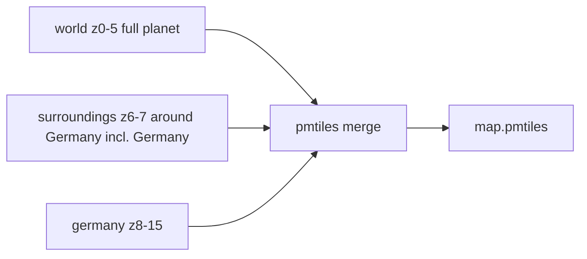

# 111 - Surroundings basemap box around Germany (z6-7)

Status: implemented

## Problem

At mid zoom (the view `min_lat=48.044362&min_lng=-1.01736&max_lat=55.122248&max_lng=18.777428`,
roughly zoom 6) the edge of the Germany detail extract is visible as a hard
seam: Germany renders from the `z6` Germany tiles while everything around it
renders from the overzoomed `z5` world backdrop, so the difference in detail
level exposes the Germany bbox border.

## Approach

Add a third intermediate extract to the [`TilesInit`](../backend/src/adapter/driven/tiles_init/mod.rs)
build pipeline — a wider **surroundings** box around Germany that spans exactly
**two zoom layers more than the world backdrop** (`z6–z7`, since the world
extract is `z0–5`). At those zoom levels the area around Germany then renders
from real Protomaps tiles at the same detail level as Germany, so the Germany
border no longer stands out; the coarse-world/detail seam moves out to the
(much further) surroundings bbox edge instead.

The surroundings box is the exact extent the user requested:

```text
min_lng = -11.112889  min_lat = 43.555498
max_lng =  27.187828  max_lat = 57.470545
```

It is **hard-coded** as a constant, matching the existing hard-coded
[`GERMANY_BBOX`](../backend/src/adapter/driven/tiles_init/mod.rs) convention
(`min_lon,min_lat,max_lon,max_lat`):

```text
-11.112889,43.555498,27.187828,57.470545
```

### Extract + merge order — three disjoint zoom bands

The `pmtiles merge` CLI (go-pmtiles) **refuses overlapping inputs** ("Inputs
must be disjoint"), so the three extracts must not share any `z/x/y` tile.
Because the surroundings bbox fully contains the Germany bbox, the two would
overlap at z6-7 if Germany still started at z6. Germany is therefore moved to
start at **z8**, turning the three extracts into disjoint zoom bands:



- `world.pmtiles` — `--maxzoom=5` (unchanged).
- `surroundings.pmtiles` — `--bbox=-11.112889,43.555498,27.187828,57.470545 --minzoom=6 --maxzoom=7`.
- `germany.pmtiles` — `--bbox=5.8,47.2,15.1,55.1 --minzoom=8 --maxzoom=15`
  (minzoom raised from 6 to 8).

The surroundings box fully contains Germany, so at z6-7 Germany is served by
the surroundings extract with the **identical source tiles** (both are extracts
of the same Protomaps build) — no visual change to Germany versus the old
z6-15 Germany extract.

```text
pmtiles merge world.pmtiles surroundings.pmtiles germany.pmtiles map.pmtiles
```

## Changes

### [`backend/src/adapter/driven/tiles_init/mod.rs`](../backend/src/adapter/driven/tiles_init/mod.rs)

1. Add `pub const SURROUNDINGS_BBOX: &str = "-11.112889,43.555498,27.187828,57.470545";`
2. Add `const SURROUNDINGS_ARCHIVE: &str = "surroundings.pmtiles";`
3. In [`build_to`](../backend/src/adapter/driven/tiles_init/mod.rs):
   - extract `surroundings` with `--bbox={SURROUNDINGS_BBOX} --minzoom=6 --maxzoom=7`,
   - raise the Germany extract's minzoom from 6 to 8 (disjoint bands),
   - merge `world`, `surroundings`, `germany` into `target`.
4. Extend [`cleanup_intermediates`](../backend/src/adapter/driven/tiles_init/mod.rs)
   to also remove `SURROUNDINGS_ARCHIVE`.
5. Update the module doc comment and `build_to` doc summary to mention the three
   extracts, the disjoint zoom bands and why (merge refuses overlaps).
6. Tests:
   - Fix [`write_fake_cli`](../backend/src/adapter/driven/tiles_init/mod.rs) so
     the `merge` branch writes the **last** argument as the destination (it
     previously hard-coded `$3`, which becomes the second input once a third
     extract is merged).
   - Add a `surroundings_bbox_is_hard_coded` test alongside the existing
     `germany_bbox_is_hard_coded` test.

### Protomaps build pin bump (found during validation)

The pinned daily build `https://build.protomaps.com/20260829.pmtiles` had been
**pruned upstream** (404) — Protomaps only keeps a short window of dailies — so
no rebuild was possible. Bumped the pin to the newest available build
`20260905.pmtiles` in:

- [`config.toml`](../config.toml)
- [`config.toml.example`](../config.toml.example)
- the `DEFAULT_MAPS_PROTOMAPS_BUILD_URL` default in
  [`configuration_toml_adapter.rs`](../backend/src/adapter/driven/configuration_toml_adapter.rs)
  and every test expectation that asserted the old default (`20260829` →
  `20260905`) across the backend.

### [`tiles/README.md`](../tiles/README.md)

Document the third extract: the surroundings box (z6-7, exact bbox), Germany
now z8-15, the disjoint zoom bands, and the three-way merge order.

### [`plans/README.md`](../plans/README.md)

Register plan 111.

No style or frontend change is needed: [`basemap.json`](../frontend/public/styles/basemap.json)
already reads a single `protomaps` source from `map.pmtiles` with no
source-level `minzoom`/`maxzoom`, so the newly added z6-7 tiles are served
automatically.

## Validation

- `make tiles-update` rebuilds the archive from the `20260905` Protomaps build
  (world + surroundings + germany extracts, then `pmtiles merge` — no
  overlapping-tile error), producing the new `tiles/map.pmtiles`.
- Confirm in the browser at the reported view that the Germany bbox edge is no
  longer visible at mid zoom, Germany still renders full street detail at city
  zoom, and the world backdrop still shows outside the surroundings box.
- Run the repository gates required by `agents.md`: `make check`,
  `make test` (or `make test-rest`), `make coverage`.
