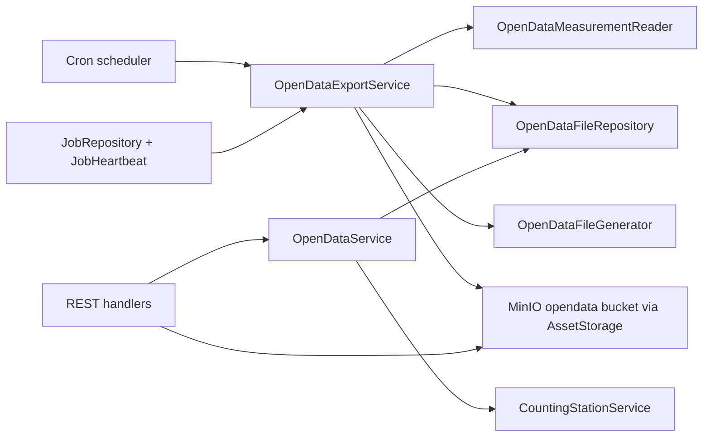

# 112 - OpenData export endpoints + daily append job

Status: delivered (2026-09-06)

## Problem

The application ingests and aggregates bicycle counting data from several
providers into PostgreSQL, but there is no way to publish the processed,
immutable measurement data as OpenData files. Consumers of an OpenData feed
expect:

- a stable, HATEOAS-shaped HTTP tree under `/api/v1/opendata`,
- discoverable metadata including JSON schemata,
- bulk files in standard formats (`parquet`, `csv.gz`, `json`),
- immutable, append-only files (never modified once published),
- content-addressed serving (ETags, long-lived caching) that never exposes the
  S3/MinIO endpoints.

Today the S3 object storage is only used for station images
([`AssetStorage`](backend/src/core/domain/assets/asset_storage_port.rs:22)), the
measurement reads are analytics-oriented aggregations, and the job subsystem
already provides a generic heartbeat/cancellation protocol
([`JobRepository`](backend/src/core/domain/jobs/repository_port.rs:14),
[`JobHeartbeat`](backend/src/core/application/job_heartbeat.rs:1)) that a new
export job can reuse.

## Goal

Add a self-contained **OpenData** vertical slice:

1. A new domain `opendata` with three driven ports:
   - **file generator** (`OpenDataFileGenerator`) — the adapter turns
     `measurements + format` into file bytes (parquet / csv.gz / json),
   - **file registry repository** (`OpenDataFileRepository`) — the DB port that
     persists the published-file metadata (the job's state / append-only ledger),
   - **measurement reader** (`OpenDataMeasurementReader`) — the DB port that
     returns export-shaped rows joined with station/channel identities.
2. A core application service `OpenDataExportService` implementing
   [`ScheduledJobPort`](backend/src/core/domain/jobs/scheduled_job_port.rs:7):
   daily job, ShedLock claim + heartbeat + cooperative cancellation, computes the
   missing complete periods and appends the missing files. The **core** owns the
   orchestration; the **adapter** only generates bytes; the **core** persists
   them through the existing S3 adapter.
3. A read-model service `OpenDataService` (driving port impl) that serves the
   root/metadata/stations/index queries for the REST handlers.
4. REST endpoints under `/api/v1/opendata` serving JSON indices and streaming the
   files with strong ETags, `Content-Length`, immutable `Cache-Control` and
   `If-None-Match → 304`, using the S3 adapter for the bytes (S3 is never
   exposed).

## Decisions (confirmed / assumed)

- **Station identifier** (confirmed): the opendata API uses the **internal UUID**
  as `station_id`, consistent with
  [`/api/v1/counting-stations`](backend/src/adapter/driving/rest/mod.rs:149). The
  provider-native `external_datasource_id` is exposed as an **additional note
  field** on the station schema / station data only (not on measurement rows).
- **File content** (confirmed): raw processed rows, all resolutions preserved:
  `station_id`, `channel_id`, `channel_name`, `timestamp`, `value`,
  `resolution_seconds`.
- **Timezone** (from the task): central Europe `Europe/Berlin`; timestamps are
  serialized as **naive local** datetimes without any UTC offset
  (e.g. `2026-09-05T14:00:00`). Day/month bucket boundaries are computed
  DST-aware in `Europe/Berlin` (reusing the same boundary techniques as
  [`counting_station.rs`](backend/src/core/domain/counting_stations/counting_station.rs:112)).
- **Storage**: the existing MinIO/S3 server is reused, but files go into a
  **dedicated bucket** `bike-counter-opendata` (second
  [`MinioAssetStorage`](backend/src/adapter/driven/minio_asset_storage.rs:32)
  instance). This keeps the asset-cleanup orphan sweep
  ([`AssetCleanupService`](backend/src/core/application/asset_cleanup_service.rs:39))
  from seeing opendata objects (it lists only the images bucket) and keeps the
  image/opendata object keys namespaced.
- **Immutability / append-only**: the registry is the state. The job computes
  missing periods by comparing available measurement periods with already
  registered files; it never overwrites an existing object. DB unique indexes
  back this guarantee.
- **Compression**: `csv.gz` is gzip-compressed at generation time; `parquet` is
  columnar-compressed by the writer; `json` is served as plain `application/json`.
  The HTTP layer performs no on-the-fly re-compression so the stored bytes, the
  `sha256`, `Content-Length` and ETag always agree.

## Architecture



- Core decides *what* to publish and *when*; the generator adapter decides *how*
  to serialize a format; the S3 adapter moves/stores bytes; the registry DB port
  persists state.
- The REST opendata handlers only read: `OpenDataService` for JSON, the registry
  for the object key + metadata, and `AssetStorage::get_stream` for file bytes.

## Endpoint tree + response shapes

```
/api/v1/opendata
├── GET /                         root: HATEOAS links (metadata, stations, stations.geojson, measurements)
├── GET /metadata                 general metadata + JSON schemata (station, measurement, daily index, monthly index, station index, distribution)
├── GET /stations                 JSON array of stations (uuid + external id note + name + coords + timezone + status)
├── GET /stations.geojson         GeoJSON FeatureCollection (same station data)
│
├── /measurements
│   ├── GET /                     links (metadata, daily, monthly)
│   ├── GET /metadata             measurement JSON schema + format descriptions
│   │
│   ├── /daily
│   │   ├── GET /                 available years
│   │   └── /{year}
│   │       ├── GET /             { "year", "files": [ { "date", "distributions": [...] } ] }
│   │       ├── GET /{date}.parquet
│   │       ├── GET /{date}.csv.gz
│   │       └── GET /{date}.json
│   │
│   └── /monthly
│       ├── GET /                 available year_months
│       └── /{year_month}
│           ├── GET /{year_month}.parquet
│           ├── GET /{year_month}.csv.gz
│           └── GET /{year_month}.json
│
└── /stations
    └── /{station_id}
        ├── GET /                 { station_id, station metadata, measurements links }
        └── /measurements
            ├── GET /             links (metadata, daily, monthly)
            ├── GET /metadata
            ├── /daily
            │   ├── GET /         available years
            │   └── /{year}
            │       ├── GET /     { station_id, year, files: [ { date, distributions } ] }
            │       ├── GET /{date}.parquet
            │       ├── GET /{date}.csv.gz
            │       └── GET /{date}.json
            └── /monthly
                ├── GET /         available year_months
                └── /{year_month}
                    ├── GET /{year_month}.parquet
                    ├── GET /{year_month}.csv.gz
                    └── GET /{year_month}.json
```

`distributions` element:

```json
{ "format": "parquet", "url": "/api/v1/opendata/...", "size_bytes": 1843921, "sha256": "..." }
```

### JSON schemata (described in `/metadata`)

Measurement record (one row in a `.json` file / one CSV row / one parquet row):

```json
{
  "station_id": "uuid",
  "channel_id": "uuid",
  "channel_name": "string",
  "timestamp": "2026-09-05T14:00:00",
  "value": 42,
  "resolution_seconds": 3600
}
```

Station object (in `/stations`, `/stations.geojson` properties, and the station
root payload):

```json
{
  "station_id": "uuid",
  "name": "string",
  "description": "string",
  "external_datasource_id": "string | null",
  "timezone": "Europe/Berlin",
  "coordinates": { "latitude": 51.96, "longitude": 7.63 } | null,
  "status": "active" | "inactive"
}
```

## Storage object keys

| Scope | Key |
|---|---|
| global daily | `opendata/measurements/daily/{year}/{date}.{ext}` |
| global monthly | `opendata/measurements/monthly/{year_month}/{year_month}.{ext}` |
| station daily | `opendata/stations/{station_id}/measurements/daily/{year}/{date}.{ext}` |
| station monthly | `opendata/stations/{station_id}/measurements/monthly/{year_month}/{year_month}.{ext}` |

`{ext}` is `parquet`, `csv.gz` or `json`. The object key is deterministic from
the URL path, so the file-serving handler reconstructs it and looks the row up by
`object_key`.

## Migration (V23)

```sql
CREATE TABLE opendata_files (
    id UUID PRIMARY KEY,
    object_key TEXT NOT NULL UNIQUE,
    station_id UUID,
    granularity TEXT NOT NULL CHECK (granularity IN ('daily','monthly')),
    period TEXT NOT NULL,
    format TEXT NOT NULL CHECK (format IN ('parquet','csv.gz','json')),
    byte_size BIGINT NOT NULL,
    sha256 TEXT NOT NULL,
    created_at TIMESTAMPTZ NOT NULL DEFAULT now()
);

CREATE UNIQUE INDEX uq_opendata_files_global
    ON opendata_files (granularity, period, format) WHERE station_id IS NULL;
CREATE UNIQUE INDEX uq_opendata_files_station
    ON opendata_files (station_id, granularity, period, format)
    WHERE station_id IS NOT NULL;
CREATE INDEX idx_opendata_files_station_period
    ON opendata_files (station_id, granularity, period);
```

The two unique indexes are the DB-level append-only guard; the service-level
idempotency check (`find_by_object_key`) keeps the job restart-safe without
conflict errors.

## Core ports (new)

```
core/domain/opendata/
├── mod.rs
├── file.rs                    OpenDataFile aggregate + value objects (format, granularity, period)
├── file_repository_port.rs    registry DB port
├── measurement_reader_port.rs export-row DB port
├── file_generator_port.rs     byte-generation port
└── service_port.rs            driving port for the REST read model
```

- `OpenDataFileGenerator::generate(rows: &[OpenDataMeasurement], format) -> GeneratedFile`
  (bytes + content type). `OpenDataMeasurement` carries `station_id`, `channel_id`,
  `channel_name`, `timestamp` (naive central local), `value`, `resolution_seconds`.
- `OpenDataFileRepository`: `insert`, `find_by_object_key`, `list_periods`
  (grouped for the index endpoints), `max_period(granularity, station_id)`.
- `OpenDataMeasurementReader`: `rows(from_utc, to_utc, station_id: Option<Id>)`
  and `available_periods(granularity, from_utc, to_utc, station_id)` (distinct
  local days / months that actually contain measurements).

## Job design (`OpenDataExportService`)

Mirrors [`AssetCleanupService`](backend/src/core/application/asset_cleanup_service.rs:68):

1. `run_if_due`: skip while active, run at startup if never succeeded or overdue
   (`opendata_export` cron), same as the other jobs.
2. `execute`: `acquire("opendata_export", ...)`, insert a RUNNING job, start
   [`JobHeartbeat`](backend/src/core/application/job_heartbeat.rs:1).
3. Compute the target window in `Europe/Berlin`:
   - daily: from `max_period(daily, None) + 1 day` up to **yesterday** (today's
     partial day is never exported),
   - monthly: from `max_period(monthly, None) + 1 month` up to the **previous
     complete month**.
4. For each available period in the window (global, then per active station):
   - check cancellation (heartbeat + status),
   - skip if `find_by_object_key` already exists,
   - read rows, call the generator for each of the three formats,
   - compute `sha256`, `put` through the S3 adapter, `insert` the registry row.
5. `finalize` FINISHED / FAILED / CANCELLED and release the lock (same protocol
   as the other jobs). Cancellation is checked between files; the heartbeat loop
   keeps the job alive independently of per-file work.

Per-station export uses only **active** stations
([`CountingStationRepository::find_all`](backend/src/adapter/driven/postgres/counting_station_repository.rs:128)
filtered to `Active`) so a station never dropped from a provider does not
produce new empty files.

## Configuration

New `[opendata]` section in [`config.toml`](config.toml:1) and
[`config.toml.example`](config.toml.example:1):

```toml
[opendata]
export_cron = "0 30 3 * * *"
export_max_heartbeat_interval_seconds = 600

[opendata_storage]
endpoint = "http://minio:9000"
access_key = "minioadmin"
secret_key = "minioadmin"
bucket = "bike-counter-opendata"
region = "us-east-1"
```

Wiring additions:

- [`Configuration`](backend/src/core/domain/configuration/configuration.rs:20) +
  a new `OpenDataConfiguration` / `OpenDataStorageConfiguration` value objects.
- [`docker-compose.yml`](docker-compose.yml:93) `minio-init`: add
  `mc mb --ignore-existing local/bike-counter-opendata`.
- [`main.rs`](backend/src/main.rs:1): second `MinioAssetStorage` for the opendata
  bucket, build the generator adapter + repositories + services, add the
  `opendata_export` scheduler to the `scheduled_jobs_enabled` block, and pass the
  read-model service + opendata storage into `RestApiAdapter`.

## Driving adapter (REST)

- New [`handlers/opendata.rs`](backend/src/adapter/driving/rest/handlers/mod.rs:8)
  + [`dto/opendata.rs`](backend/src/adapter/driving/rest/dto/mod.rs:1) + tests.
- `AppState` gains `opendata_service: Arc<dyn OpenDataServicePort>` and
  `opendata_storage: Arc<dyn AssetStorage>`.
- JSON index endpoints use a caching helper (strong ETag + `Cache-Control`,
  honoring `If-None-Match`), following
  [`cache.rs`](backend/src/adapter/driving/bff/cache.rs:58). Immutable index
  responses use `public, max-age=3600, must-revalidate` (the set of files only
  grows once a day); file responses use `public, max-age=31536000, immutable`.
- File endpoints: parse the path into `(scope, granularity, period, format)`,
  build the object key, look up the registry row (404 when missing), answer
  `304` on `If-None-Match` match, otherwise stream
  `AssetStorage::get_stream` with `Content-Type`, `Content-Length`, `ETag`
  (`sha256`), and the immutable `Cache-Control`.
- Routes registered in
  [`rest/mod.rs`](backend/src/adapter/driving/rest/mod.rs:91) and OpenAPI in
  [`openapi.rs`](backend/src/adapter/driving/rest/openapi.rs:1).
- Content types: `application/vnd.apache.parquet`, `application/gzip`,
  `application/json`.

## Integration tests (fetching the files)

The REST opendata tests are part of [`make test-rest`](agents.md:32)
(in-memory mocks, no Docker), following the existing
[`rest/tests`](backend/src/adapter/driving/rest/tests/mod.rs:1) style:

- Add an in-memory `MockOpenDataFileRepository` (keyed by `object_key`) and an
  in-memory `ObjectStorage` double that actually stores the bytes it is given
  under their object key and streams them back (a keyed, byte-exact
  [`AssetStorage`](backend/src/core/domain/assets/asset_storage_port.rs:22) mock —
  the current [`MockAssetStorage`](backend/src/adapter/driving/rest/tests/mocks.rs:899)
  streams a fixed payload, so a keyed variant is added for opendata).
- Use the **real** generator adapter for at least the `json` and `csv.gz` formats
  (and `parquet` where the crate supports a cheap in-memory round-trip) against a
  deterministic fixture row set, so the test exercises the actual serialization.
- End-to-end test flow per format:
  1. build a small `OpenDataMeasurement` fixture,
  2. `generate` the bytes, compute `sha256`, `put` them into the keyed storage
     mock, `insert` a registry row,
  3. `GET` the file URL and assert `200`, byte-exact body, `Content-Type`,
     `Content-Length` and the `ETag` header,
  4. `GET` again with `If-None-Match: "<sha256>"` and assert `304`,
  5. `GET` an unregistered file and assert `404`.
- Index/metadata coverage: root HATEOAS links, `/metadata` JSON schemata,
  `/stations`, `/stations.geojson`, `/measurements/daily/{year}` and the station
  `/{year}` roots assert the correct `url`/`size_bytes`/`sha256` for each
  distribution and that only registered files are listed.
- A `TestApp` constructor variant injects the opendata service + keyed storage
  (e.g. `TestApp::with_opendata(...)`), mirroring
  [`TestApp::with_persistent_state_service`](backend/src/adapter/driving/rest/tests/mod.rs:96).

## Dependencies

Add `arrow` + `parquet` (arrow feature) to
[`Cargo.toml`](backend/Cargo.toml:6) for parquet generation. `csv` + `flate2`
(already present) cover `csv.gz`; `serde_json` covers `json`; `sha2` (already
present) computes the content hash.

**Version pinning:** use the **latest stable** version of every new package
(`arrow`, `parquet` and any transitive dev dependency) — i.e. `cargo add arrow`
/ `cargo add parquet --features arrow` without a stale pin, then run
`make check` (which includes `cargo audit`) so the chosen versions pass the
audit gate before committing.

## Files touched

| File | Change |
|---|---|
| [`backend/migrations/V23__add_opendata_files.sql`](backend/migrations/V1__create_measurements.sql:1) | new registry table + indexes |
| [`backend/src/core/domain/opendata/*`](backend/src/core/domain/mod.rs:1) | new domain: aggregate, 4 ports |
| [`backend/src/core/application/opendata_export_service.rs`](backend/src/core/application/mod.rs:1) | export job |
| [`backend/src/core/application/opendata_service.rs`](backend/src/core/application/mod.rs:1) | read model |
| [`backend/src/adapter/driven/opendata_file_generator.rs`](backend/src/adapter/driven/mod.rs:1) | parquet/csv.gz/json generator |
| [`backend/src/adapter/driven/postgres/opendata_file_repository.rs`](backend/src/adapter/driven/postgres/mod.rs:10) | registry repository |
| [`backend/src/adapter/driven/postgres/opendata_measurement_reader.rs`](backend/src/adapter/driven/postgres/mod.rs:10) | joined-row reader |
| [`backend/src/core/domain/configuration/configuration.rs`](backend/src/core/domain/configuration/configuration.rs:20) | opendata config |
| [`backend/src/adapter/driving/rest/handlers/opendata.rs`](backend/src/adapter/driving/rest/handlers/mod.rs:8) | handlers |
| [`backend/src/adapter/driving/rest/dto/opendata.rs`](backend/src/adapter/driving/rest/dto/mod.rs:1) | DTOs + JSON schemata |
| [`backend/src/adapter/driving/rest/mod.rs`](backend/src/adapter/driving/rest/mod.rs:91) | routes + state |
| [`backend/src/adapter/driving/rest/openapi.rs`](backend/src/adapter/driving/rest/openapi.rs:1) | OpenAPI paths |
| [`backend/src/main.rs`](backend/src/main.rs:1) | wiring |
| [`backend/Cargo.toml`](backend/Cargo.toml:6) | arrow + parquet |
| [`docker-compose.yml`](docker-compose.yml:93) | opendata bucket |
| [`config.toml`](config.toml:1) / [`config.toml.example`](config.toml.example:1) | opendata config |
| [`frontend/e2e/e2e-seed.sql`](frontend/e2e/e2e-seed.sql:1) | regenerate after schema change |
| [`README.md`](README.md:1) / [`plans/README.md`](plans/README.md:1) | docs + registration |

## Definition of done

- [x] Plan registered in [`plans/README.md`](plans/README.md:1)
- [x] `/api/v1/opendata` tree serves metadata, stations (+ GeoJSON), indices and
      the parquet/csv.gz/json files with ETag/304, `Content-Length`, immutable
      cache headers, and never exposes MinIO
- [x] `opendata_export` daily job appends missing global + per-station files,
      persists state in `opendata_files`, heartbeats and honors cancellation
- [x] Files are immutable: unique indexes + service idempotency, append-only
- [x] Integration tests fetch the generated files end-to-end: byte-exact `200`,
      `ETag`/`304`, `Content-Length`, `Content-Type`, `404` for missing files,
      plus index/metadata assertions
- [x] `make check`, `make test-rest`, `make test`, `make coverage` green
- [x] README / plan docs updated

## Delivered

- Migration `V23` (`opendata_files`) + partial unique indexes; core `opendata`
  domain with `file.rs`/`measurement.rs` and the three driven ports + the
  `OpenDataServicePort`; `OpenDataService` read model; `OpenDataExportService`
  job (ShedLock + heartbeat + cooperative cancellation, crash recovery via
  `complete_newest_period`, always append-only); Postgres registry + measurement
  reader (`Europe/Berlin` DST-aware bucketing, no offset in rows);
  parquet/csv.gz/json generator; second MinIO asset storage wired in `main.rs`
  (dedicated `bike-counter-opendata` bucket via `minio-init`); `[opendata]` /
  `[opendata_storage]` config (defaults + validation, toml parsing tests); ~24
  REST handlers + routes + OpenAPI `OpenData` tag + root HATEOAS link; REST
  integration tests that fetch real generated bytes (byte-exact, `ETag`/`304`,
  `404`). arrow + parquet added at the latest stable version.
- Coverage: the export job + config got dedicated unit tests (error-injection
  fakes for the job-repository failure branches, overdue/no-anchor scheduling,
  crash-recovery edge paths, period-boundary helpers); the final gate reports
  `core (src/core/)` 95.46% and overall 85.67% production line coverage.
- Follow-ups (2026-09-06):
  - **OpenAPI HATEOAS examples** — `GET /api/v1` and the OpenData JSON endpoints
    that return `_links` (root, `/measurements`, `/stations/{id}` and
    `/stations/{id}/measurements`) now carry a response `example` listing their
    real links (each entry keeps `{ href }`), reusing the existing operation
    descriptions. A root/OpenAPI test asserts the examples (added
    `jobs`/`opendata` to the runtime root-link test too).
  - **Job-info metadata** — the `opendata_export` job writes `files_created` to
    its metadata when it starts (0) and keeps it current after every export
    scope (best-effort), so even a RUNNING/backfill or CANCELLED job reports the
    files created so far; the finalize step overwrites it with the run's total.
    Tests assert the finished job-info carries the count.
  - **Parquet compression** — a unit test now reads the column-chunk metadata
    and asserts every chunk is Snappy-compressed (the writer already set
    `Compression::SNAPPY`). Global daily files are still ~195 KB because the
    UUID/timestamp columns are stored as strings.
  - Final gate after the follow-ups: `make check` OK, `make test` 739 passed,
    `make coverage` core 95.41% / overall 85.68%.
- `e2e-seed.sql` does **not** need regenerating for this change: migrations run
  at backend startup on the e2e database and the opendata export job is disabled
  under `scheduled_jobs_enabled = false`.
