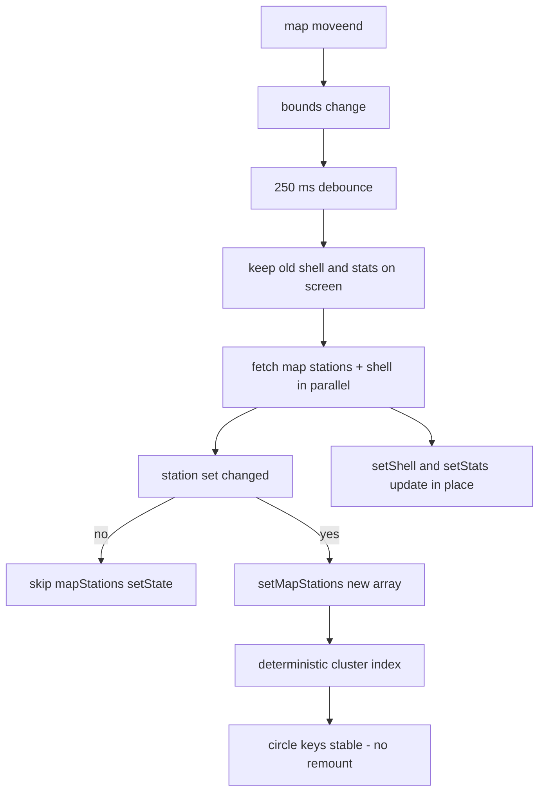

# 114 - Sidebar + map bubble flicker (keep old data, no ghosts)

Status: implemented

## Problem

While panning/zooming the map the sidebar briefly swaps its loaded station list
for skeleton rows ("ghosts") and the cluster circles on the map blink, even
though the previous data is still valid. Both come from the visible-stations
refetch cycle triggered by every map bounds change.

[`useVisibleStations`](frontend/src/features/stations/useVisibleStations.ts:18)
runs on every `bounds` change (each map `moveend`). After its 250 ms debounce it
clears the previous data before the new request resolves:

```ts
setLoading(true)
setShell(null) // sidebar list -> skeleton ghosts
setStats(null) // per-row stats -> skeleton ghosts
```

[`Sidebar`](frontend/src/features/sidebar/Sidebar.tsx:95) shows the full-list
skeleton when `loading && shell === null`, so clearing `shell` re-renders ghosts
even though the old list was already on screen.

The map cluster circles blink for a related reason:
[`MapView`](frontend/src/features/map/MapView.tsx:85) rebuilds the Supercluster
index whenever the `stations` array reference changes, and `useVisibleStations`
replaces `mapStations` with a fresh array on every fetch
(`setMapStations(mapData)`). If the BFF returns the stations in a different
order, Supercluster assigns different `cluster_id`s to the same circles, so
React remounts the `Marker`s (their `key` changes) and the circles flash.

## Goals

- Keep the previously loaded shell / stats / map stations visible while a
  refetch is in flight; update them in place when the new data lands (no
  skeleton ghosts after the first load).
- Make the cluster circle rendering stable: deterministic `cluster_id`s and no
  index rebuild when the visible station set has not changed.

## Non-goals

- No change to the BFF/backend or the sidebar/stats endpoints.
- No change to the search dialog, overview panel, detail or summary pages.
- No new caching layer; this is purely "stale data stays visible until replaced".

## Approach

### 1. Keep old data during refetch

In [`useVisibleStations`](frontend/src/features/stations/useVisibleStations.ts:18):

- Remove `setShell(null)` and `setStats(null)` from the debounced timer, so the
  previously loaded shell + stats stay rendered while the new request is in
  flight.
- Keep `setLoading(true)` — [`Sidebar`](frontend/src/features/sidebar/Sidebar.tsx:95)
  only renders the full-list skeleton when `shell === null`, so it still shows
  skeletons on the very first load but not on refetch.
- Guard `setMapStations` so the array is only replaced when the station set
  actually changed (compare id + status). This avoids rebuilding the cluster
  index — and re-rendering every marker — when the same stations come back.

### 2. Deterministic cluster ids

In [`clusterStations.ts`](frontend/src/features/map/clusterStations.ts:37), sort
the input points by a stable key (`id`) before `index.load(points)`, so
Supercluster assigns the same `cluster_id` to the same circles regardless of the
order the BFF returns the stations. Identical circles keep identical `key`s and
are reconciled instead of remounted.



### 3. Stable cluster-circle marker keys (follow-up)

Sorting alone cannot keep a circle's Supercluster `cluster_id` stable when the
visible station set changes: a pan/zoom refetch adds/removes edge stations and
the tree-order ids shift, so a changed React `key` remounts the `Marker` (the
library's `marker.remove()`/`addTo()` run in post-paint effects), which blinks
the circle for one frame right after the data update.

So [`MapView`](frontend/src/features/map/MapView.tsx:95) now keys each circle by
the **sorted ids of the stations it groups** via the new
[`clusterMarkerKey`](frontend/src/features/map/clusterStations.ts:93) helper
(Supercluster `getLeaves` → ids → sort → join). A circle that keeps the same
members across a refetch keeps its key and is reconciled instead of remounted;
only circles whose membership genuinely changed (e.g. an edge station joined)
remount. Flag markers keep their station-id key.

## Files touched

| File | Change |
|---|---|
| [`frontend/src/features/stations/useVisibleStations.ts`](frontend/src/features/stations/useVisibleStations.ts:18) | Stop clearing shell/stats on refetch; only replace mapStations when the set changed |
| [`frontend/src/features/map/clusterStations.ts`](frontend/src/features/map/clusterStations.ts:37) | Sort points by id before loading the Supercluster index; add `clusterMarkerKey` (stable member-id key) |
| [`frontend/src/features/map/MapView.tsx`](frontend/src/features/map/MapView.tsx:95) | Key cluster-circle markers by `clusterMarkerKey` instead of the Supercluster id |
| [`plans/README.md`](plans/README.md) | Register plan 114 |

## Tasks

1. Edit [`useVisibleStations.ts`](frontend/src/features/stations/useVisibleStations.ts:18):
   remove `setShell(null)` / `setStats(null)` and add a `sameMapStations` guard
   around `setMapStations`.
2. Edit [`clusterStations.ts`](frontend/src/features/map/clusterStations.ts:37):
   sort the `points` array by `id` before `index.load`.
3. Verify the sidebar still shows the skeleton on first load and never swaps
   back to skeletons on subsequent pans/zooms.
4. Run `make check` and `make test-playwright` (frontend UI change).
5. Register the plan in [`plans/README.md`](plans/README.md).

## Verification

- [`useVisibleStations.ts`](frontend/src/features/stations/useVisibleStations.ts:24)
  no longer clears `shell`/`stats` on a bounds refetch, so the sidebar keeps the
  old list (and the map keeps its markers) while the new request is in flight
  and updates in place when it lands; `setMapStations` is guarded by
  `sameMapStations` so an unchanged view does not rebuild the cluster index.
- [`clusterStations.ts`](frontend/src/features/map/clusterStations.ts:44) sorts
  the input points by `id` before `index.load`, making the Supercluster ids
  deterministic so identical circles keep stable keys.
- Follow-up: [`MapView.tsx`](frontend/src/features/map/MapView.tsx:95) keys the
  cluster-circle markers by `clusterMarkerKey` (the sorted member station ids),
  so a circle that keeps the same members across a pan/zoom data refresh is
  reconciled instead of remounted — no one-frame blink after the update.
- `make check` green (cargo fmt/clippy, prettier, audit).
- Frontend `tsc --noEmit` green.
- `make test-playwright` green (72 passed).

## Definition of done

- [x] Panning/zooming keeps the old sidebar list visible until the new data
      replaces it (no skeleton ghosts after first load).
- [x] Cluster circles no longer remount/flicker while the visible station set is
      unchanged.
- [x] Follow-up: circles that keep the same members across a pan/zoom data
      refresh are reconciled (stable member-id key) — no one-frame blink after
      the update.
- [x] First-load skeleton behaviour unchanged.
- [x] `make check` green.
- [x] `make test-playwright` green.
