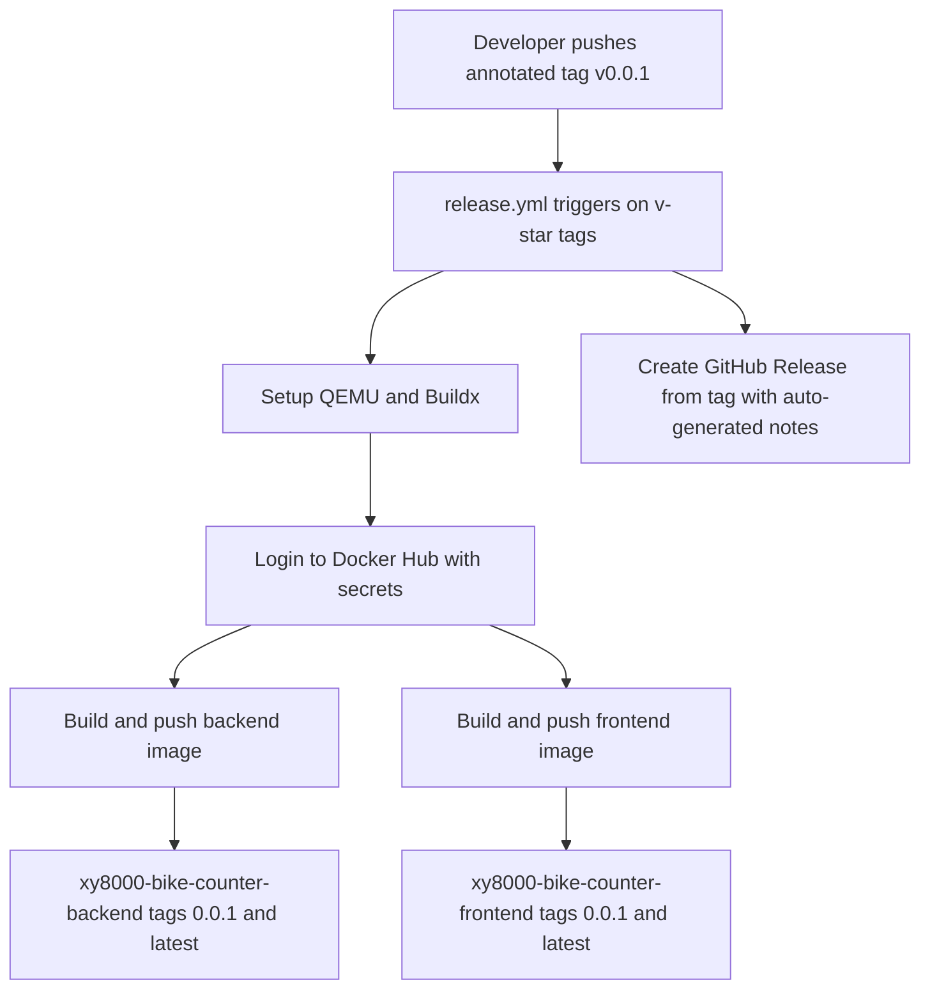

# 119 - Release v0.0.1 to GitHub and Docker Hub

Status: in progress

## Problem

The application has reached a first public release (`0.0.1`) and needs to be
published the standard open-source way:

- a **semantic-versioned annotated git tag** (`v0.0.1`);
- a **GitHub Release** with auto-generated notes;
- **Docker images published to Docker Hub** so users can `pull` instead of
  compiling;
- **CI automation** that builds and pushes those images reproducibly from the
  tag;
- an **Apache-2.0 license**, which is currently missing entirely.

Today the repo has no CI/CD workflows, no tags, and no registry image names.
[`docker-compose.yml`](../docker-compose.yml) only builds images locally, and
the version `0.0.1` already lives in [`backend/Cargo.toml`](../backend/Cargo.toml:3)
and [`frontend/package.json`](../frontend/package.json:4), so no version bump is
required.

## Decisions (confirmed with the owner)

| Decision | Value |
|---|---|
| Git hosting / release | GitHub repo `xy8000/bike_counter`, annotated tag `v0.0.1` + GitHub Release |
| Registry | Docker Hub, namespace `xy8000` |
| Backend image | `xy8000/bike-counter-backend` |
| Frontend image | `xy8000/bike-counter-frontend` |
| Tags per image | `0.0.1` (semver, no `v` prefix) and `latest` |
| Build platform | multi-arch `linux/amd64`, `linux/arm64` (both base images are multi-arch; backend is a fully-static musl binary) |
| License | Apache-2.0 |
| Image signing | Sigstore **keyless cosign** — each image digest is signed by the GitHub Actions OIDC identity (no stored keys); SLSA provenance from BuildKit also applies |
| Tile handling | unchanged — tiles are downloaded/built at runtime into the mounted `./tiles` volume ([`plans/65`](65_bundle_tiles_init_into_backend_image_plan.md:15)), never baked into the image |

## Approach

### 1. License

- Add an Apache-2.0 [`LICENSE`](../LICENSE) file at the repo root (full Apache
  2.0 text, copyright placeholder for the owner).
- Declare it in [`backend/Cargo.toml`](../backend/Cargo.toml:1) via
  `license = "Apache-2.0"` and in [`frontend/package.json`](../frontend/package.json:1)
  via `"license": "Apache-2.0"`. `package.json` keeps `"private": true` because
  the frontend is not published to npm.
- Mention the license in [`README.md`](../README.md).

### 2. Release workflow — `.github/workflows/release.yml`

A single workflow (`id-token: write` + `contents: write` permissions) triggered
by pushed tags matching `v*`:

- **Build job** — `docker/setup-qemu-action` + `docker/setup-buildx-action`,
  then `docker/login-action` using secrets `DOCKERHUB_USERNAME` /
  `DOCKERHUB_TOKEN` (a Docker Hub access token with Read & Write scope, not the
  account password).
- **Backend** — `docker/build-push-action` with
  [`backend/Dockerfile`](../backend/Dockerfile:1), context `./backend`,
  platforms `linux/amd64,linux/arm64`, and tags `xy8000/bike-counter-backend:0.0.1`
  + `xy8000/bike-counter-backend:latest`. Push enabled.
- **Frontend** — same, with [`frontend/Dockerfile`](../frontend/Dockerfile:1),
  context `./frontend`, and tags `xy8000/bike-counter-frontend:0.0.1` +
  `xy8000/bike-counter-frontend:latest`.
- **Sign job (per image)** — `sigstore/cosign-installer`, then
  `cosign sign --yes ${{ matrix.image }}@${{ steps.build.outputs.digest }}`
  keyless: the GitHub Actions OIDC identity signs the immutable digest via
  Sigstore Fulcio/Rekor (no stored keys). Docker Hub credentials come from the
  `docker/login-action` step (`~/.docker/config.json`); the `docker/build-push-action`
  exposes `digest` via its `id: build` step. Consumers verify with
  `cosign verify --certificate-identity-regexp
  'https://github.com/xy8000/bike_counter/.github/workflows/release.yml@refs/tags/v[0-9.]+'
  --certificate-oidc-issuer https://token.actions.githubusercontent.com`.
- **Release job** — `softprops/action-gh-release` with
  `generate_release_notes: true` so the GitHub Release is created automatically
  from merged PRs since the previous tag.

Tag derivation uses `docker/metadata-action` (`type=semver,pattern={{version}}`
to strip the `v` prefix, plus a raw `latest` tag enabled only for `v*` tags),
or explicit tags with the pinned `0.0.1` — the exact mechanism is left to
implementation, but the resulting tags must be exactly `0.0.1` and `latest`.

### 3. Published-image consumption

- Add `image:` to the `backend` and `frontend` services in
  [`docker-compose.yml`](../docker-compose.yml:24) alongside the existing
  `build:`, using the pinned version:
  - `xy8000/bike-counter-backend:0.0.1`
  - `xy8000/bike-counter-frontend:0.0.1`
- Keep `build:` so `make run` (which uses `docker compose up --build`) keeps
  working for developers.
- In [`README.md`](../README.md) add a **Run the published images** section:
  `docker compose pull` then `docker compose up -d`, plus a Docker Hub version
  badge.

### 4. Secrets and repository prerequisites

These are owner actions outside the code (must be done before the tag push):

- Create the Docker Hub repositories `xy8000/bike-counter-backend` and
  `xy8000/bike-counter-frontend` (or confirm they are auto-created on push).
- Add the GitHub repository secrets `DOCKERHUB_USERNAME` and `DOCKERHUB_TOKEN`.

### 5. Cut the release

- Commit the license, workflow, compose and README changes to `main` first, so
  the `v0.0.1` tag points at a tree that already contains them.
- Create and push the annotated tag:
  `git tag -a v0.0.1 -m "Bike-Counter 0.0.1"` then `git push origin v0.0.1`.
- The push triggers the workflow, which builds both multi-arch images, pushes
  them to Docker Hub, cosign-signs them, and creates the GitHub Release.

## Consequences to note

- Multi-arch backend builds compile `openssl` with `vendored` under QEMU for
  `arm64`; this is slower than an `amd64`-only build but produces a static musl
  binary as designed. If arm64 builds prove problematic, fall back to
  `linux/amd64` only — but that is a regression from the stated decision.
- The backend image still requires the `./tiles` bind mount and `[maps]` config
  because tiles are built at runtime; no change to that model.
- Future releases reuse the same workflow: bump the version in
  [`backend/Cargo.toml`](../backend/Cargo.toml) and
  [`frontend/package.json`](../frontend/package.json), update the pinned image
  tags in [`docker-compose.yml`](../docker-compose.yml), commit, and push a new
  `v*` tag.

## Progress (code changes done, release not yet cut)

The license, workflow (including keyless cosign signing), compose and README
changes are implemented, gated (`make check`, `make test-rest` — 128 passed)
and committed on the local feature branch `release/v0.0.1-release-prep`
(remote `main` is protected, so it is merged via PR).

Post-merge CI hygiene: after the tag-triggered run flagged the GitHub Node-20
deprecation, the release workflow's actions were bumped to Node-24 majors
(`actions/checkout@v7`, `docker/login-action@v4`,
`docker/setup-buildx-action@v4`, `docker/setup-qemu-action@v4`) — committed on
`chore/ci-node24-action-bumps`. This is cosmetic for future runs; the `v0.0.1`
publish itself only still needs the Docker Hub secrets configured and a re-run.

Remaining **owner actions** (require GitHub + Docker Hub credentials not
available in this environment):

1. Push the branch and open/merge the PR to `main`:
   `git push -u origin release/v0.0.1-release-prep`.
2. Create the Docker Hub repositories `xy8000/bike-counter-backend` and
   `xy8000/bike-counter-frontend`.
3. Add GitHub repository secrets `DOCKERHUB_USERNAME` and
   `DOCKERHUB_TOKEN` (a Docker Hub access token).
4. From the merged `main`, cut the release:
   `git tag -a v0.0.1 -m "Bike-Counter 0.0.1"` then
   `git push origin v0.0.1` — this triggers `.github/workflows/release.yml`.
5. Verify the workflow is green, the GitHub Release `v0.0.1` exists, and
   Docker Hub shows `xy8000/bike-counter-backend:0.0.1` / `:latest` and
   `xy8000/bike-counter-frontend:0.0.1` / `:latest`.

## Definition of done

- [x] Apache-2.0 [`LICENSE`](../LICENSE) added and declared in both manifests
- [x] `.github/workflows/release.yml` builds, pushes and **keyless-cosign-signs** both multi-arch images with `0.0.1` + `latest` tags and creates the GitHub Release
- [x] `docker-compose.yml` exposes versioned `image:` names for backend and frontend
- [x] [`README.md`](../README.md) documents the published-image path and Docker Hub badge
- [x] `make check` green
- [x] `make test-rest` green (128 passed; no Rust/TS logic changed)
- [ ] `DOCKERHUB_USERNAME` / `DOCKERHUB_TOKEN` secrets configured and Docker Hub repositories exist — **owner action**
- [ ] Annotated tag `v0.0.1` pushed and the release workflow completed green — **owner action**
- [ ] Docker Hub shows `xy8000/bike-counter-backend:0.0.1` / `:latest` and `xy8000/bike-counter-frontend:0.0.1` / `:latest` — **owner action**
- [ ] GitHub Release `v0.0.1` exists with release notes — **owner action**
