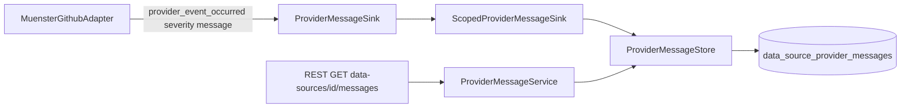

# 11 - Data-provider messages (events) plan

Status: implemented

## Problem

The data-source update job currently aborts when the Münster provider finds a
channel that has no column in a monthly CSV file, e.g.:

```text
Provider("InvalidData("channel 353306596 has no column in .../2019-07.csv")")
```

After processing millions of measurements, one such channel fails the whole job.
These conditions are not fatal for the import as a whole and should be surfaced
as readable events instead of aborting.

> **Motivation (what triggered this plan):** the abort is a *hard job failure*, not
> a skipped step. `DataSourceUpdateService::execute` marks the job `FAILED` and
> stores the provider error verbatim as the job's **major failure message**:
> `failure_message = Provider(InvalidData("channel ... has no column in ..."))`.
> The underlying condition is merely informational (a data quirk in one monthly
> CSV), yet the adapter cancels the whole job run and the job history presents it
> as a major failure. This plan fixes exactly that mischaracterization: an
> informational condition must never cancel the job or surface as a job
> `failure_message`.

## Goals

- Persist provider-emitted events per data source in a dedicated table.
- Let the core manage the events and hand providers a scoped, callable sink
  (mirroring the `PersistentStateAccess` pattern).
- Let the Münster provider emit events instead of aborting on *known* non-fatal
  data quirks (missing CSV column -> `WARNING` and skip); genuine IO/parse
  failures still fail the job as today.
- Emit concise one-line `INFO`/`DEBUG` lifecycle messages (e.g. "archive
  downloaded", "cache refreshed") so an operator can trace provider activity
  without spammy text.
- Expose the events read-only through the REST API and Swagger.
- Store an automatically generated `occurred_at` timestamp with every event.

## Data model

New table `data_source_provider_messages` (migration `V6`):

| Column           | Type                        | Notes                                                        |
|------------------|-----------------------------|--------------------------------------------------------------|
| `id`             | UUID PRIMARY KEY            | application-generated (`Uuid::new_v4()`)                     |
| `data_source_id` | UUID NOT NULL               | FK -> `data_sources(id)` `ON DELETE CASCADE`                 |
| `severity`       | TEXT NOT NULL               | `CHECK (severity IN ('INFO','WARNING','ERROR','DEBUG','TRACE'))` |
| `message`        | TEXT NOT NULL               | human-readable event text                                    |
| `occurred_at`    | TIMESTAMPTZ NOT NULL DEFAULT now() | auto-generated on insert, read-only                  |

`occurred_at` is generated by the database on insert and returned read-only; the
caller never supplies it.

Index: `data_source_id` (for per-source listing and cascade cleanup).

## Severity

`ProviderMessageSeverity` enum with variants `Info`, `Warning`, `Error`,
`Debug`, `Trace`. Wire and database representation is the upper-case string
(`INFO`, `WARNING`, `ERROR`, `DEBUG`, `TRACE`) with a round-trip `FromStr`.

## Core architecture (mirrors persistent state)

- `ProviderMessageStore` (persistence port):
  - `record(data_source_id, severity, message) -> Result<(), DomainError>`
  - `find_by_data_source(data_source_id) -> Result<Vec<ProviderMessage>, DomainError>`
- `ProviderMessageSink` (callable interface handed to providers):
  - `provider_event_occurred(severity, message) -> Result<(), ProviderError>`
- `ScopedProviderMessageSink` wraps the store for one data source id and maps
  `DomainError` to `ProviderError::Storage` (same as `ScopedPersistentState`).
- `DataProvider::attach_provider_messages(sink)` — new default no-op hook,
  called by `StartupService` after the data source is upserted (two-phase
  handover, exactly like `attach_persistent_state`).

Flow:



## Hexagonal architecture (ports & adapters)

This plan keeps the project's hexagonal layout; the core must never see the
adapters (single-crate convention, enforced by convention — `src/core/*` has zero
references to `src/adapter/*`).

- **Ports (in the core):** `ProviderMessageStore` (persistence port),
  `ProviderMessageSink` + `ScopedProviderMessageSink` (outbound interface handed
  to providers) and the `DataProvider::attach_provider_messages` hook live in
  `src/core/domain/*`. `ProviderMessageService` in `src/core/application/*` is
  the use-case entry point the driving side calls.
- **Driving adapter:** the REST handler in `src/adapter/driving/rest` calls the
  core service; DTO mapping (`ProviderMessageDto`, HATEOAS) stays in the driving
  adapter — the core exposes domain types only.
- **Driven adapters:** `PostgresProviderMessageRepository` (in
  `src/adapter/driven`) implements the `ProviderMessageStore` port;
  `MuensterGithubAdapter` implements the `DataProvider` port and receives the
  scoped sink via the attach hook. `main.rs` composes everything, passing ports
  inward.
- **Dependency rule:** adapters depend on core ports, never the reverse; no
  repository, DTO, or Postgres type leaks into the core.

## File changes

New files:

- `migrations/V6__add_data_source_provider_messages.sql` — table + index.
- `src/core/domain/data_source/provider_message.rs` — `ProviderMessageSeverity`,
  `ProviderMessage`, `ProviderMessageStore`.
- `src/adapter/driven/postgres_provider_message_repository.rs` — Postgres store
  impl (`record` insert with DB-generated `occurred_at`, `find_by_data_source`
  ordered newest first) + tests.
- `src/core/application/provider_message_service.rs` — read-only core service
  (`list` resolves the data source, 404 via `DomainError::NotFound`) + tests.
- `src/adapter/driving/rest/tests/messages.rs` — endpoint tests.

Modified files:

- `src/core/domain/data_source/mod.rs` — register `provider_message`.
- `src/core/domain/data_source/provider.rs` — `ProviderMessageSink`,
  `ScopedProviderMessageSink`, `DataProvider::attach_provider_messages`.
- `src/core/application/mod.rs` — register `provider_message_service`.
- `src/core/application/startup_service.rs` — accept the store, attach a scoped
  sink per provider after the data source is persisted.
- `src/adapter/driven/mod.rs` — register the Postgres repository.
- `src/main.rs` — build `PostgresProviderMessageRepository` and
  `ProviderMessageService`; pass the store into `StartupService` and the service
  into `RestApiAdapter`.
- `src/adapter/driving/rest/dto.rs` — `ProviderMessageDto`,
  `ProviderMessageListDto` (HATEOAS links, severity as upper-case string,
  `occurred_at` as ISO-8601 timestamp).
- `src/adapter/driving/rest/handlers.rs` — `list_provider_messages` handler and
  `AppState` field.
- `src/adapter/driving/rest/mod.rs` — route registration.
- `src/adapter/driving/rest/openapi.rs` — schema + path registration.
- `src/adapter/driven/muenster_github_adapter.rs` — `messages` field,
  `attach_provider_messages`, `emit` helper; thread an event callback through
  `earliest_timestamp` / `windowed_series` / `parse_measurement_csv` so a missing
  channel column emits `WARNING` and returns empty records instead of
  `ProviderError::InvalidData`, and through the cache lifecycle
  (`refresh_archive` / `download` / `extract`) to emit `INFO`/`DEBUG` one-liners.
  Genuine IO/parse failures keep returning `ProviderError` unchanged.
- `src/adapter/driving/rest/tests/mocks.rs`, `fixtures.rs`, `mod.rs` — mock
  message store, sample message service, `TestApp` wiring.

## REST endpoints

- `GET /api/v1/data-sources/{id}/messages` — list messages for a data source,
  ordered newest first, with HATEOAS `_links` (`self`, `collection`, `root`).
  Read-only; exposed through Swagger via utoipa.

## Behavior change (Münster provider)

Warn-and-continue is **only** for known, expected data quirks. Everything else
keeps failing the job exactly as today — a missing column must not become an
excuse to swallow genuine errors.

- Known quirk — missing channel column in a monthly CSV: emit a `WARNING` event
  (channel id + file path) and return empty records for that file, so the update
  continues and finishes. `update_data_source` / `run_updates` succeed and the
  job is marked `FINISHED` (never `FAILED`) with no `failure_message`; the
  condition is visible only through `data_source_provider_messages` as a
  `WARNING`.
- Genuine errors keep propagating as `ProviderError` and fail the job as normal:
  unreachable source (`Unreachable`), invalid ZIP / unreadable archive, invalid
  `site_min.json`, unreadable or invalid CSV header (`InvalidData`), storage
  failures (`Storage`). No `WARNING` for these — a real IO/parse failure must
  still cancel the job and be recorded as its `failure_message`.
- Lifecycle tracing: emit concise one-line `INFO`/`DEBUG` messages for events
  like "archive downloaded", "archive extracted", "cache refreshed" (or ETag
  reuse skip), so an operator can follow what the provider did without large text
  blocks.

## Testing

- Domain: severity string round-trip; scoped sink binds to the correct data
  source id.
- Postgres repo: record/round-trip, ordering, per-source scoping, cascade on
  data-source delete.
- Application service: `list` resolves known sources and 404s unknown ones.
- REST: `GET /api/v1/data-sources/{id}/messages` returns items and HATEOAS
  links; unknown data source -> 404; OpenAPI exposes the schemas/path.
- Münster adapter: a channel missing from a monthly CSV emits a `WARNING` and
  yields an empty batch instead of failing.
- Münster adapter: a genuine failure (unreachable source, unreadable archive,
  invalid CSV header) still returns a `ProviderError` and fails the job as normal
  — no `WARNING` is emitted for it.
- Münster adapter: cache lifecycle emits concise `INFO`/`DEBUG` one-liners
  (download, extract, refresh skip) with no large text blocks.

## Acceptance criteria

- The update job no longer fails with `channel ... has no column in ...`.
- A missing channel column results in a `FINISHED` (successful) data-source
  update job with **no** `failure_message`; the informational condition is
  surfaced only as a `WARNING` provider message, never as a job failure.
- A genuine IO/parse failure (e.g. unreadable archive or invalid CSV header)
  still fails the job and records its `failure_message` as before — no behavior
  change for real errors.
- The warning is persisted in `data_source_provider_messages` with a
  DB-generated `occurred_at` and is visible via
  `GET /api/v1/data-sources/{id}/messages` and Swagger.
- `make check` and `make test` pass.
