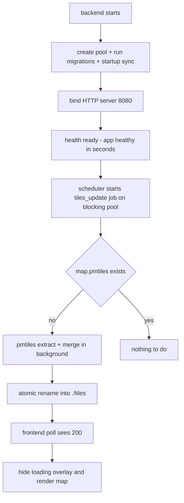

# 123 - Decouple the tiles build from startup (background build + loading animation)

Status: implemented

> Gates run in this session: `make check`, `make test` (full backend, 741),
> `make test-rest` (128), frontend `npm run test:unit` (543) and
> `npm run test:unit:coverage` (whole-src line coverage ≥ 80 %). The backend
> `make coverage` (llvm-cov) and `make test-playwright` gates are exercised in
> CI.

## Problem

The backend builds the self-hosted basemap **synchronously before the HTTP
server binds**:

- [`main.rs`](backend/src/main.rs:131) calls `tiles_init.ensure_available()`
  during the init phase. On a fresh host (empty `./tiles`) this triggers the
  full Protomaps download + `pmtiles extract`/`merge` pipeline in
  [`tiles_init/mod.rs`](backend/src/adapter/driven/tiles_init/mod.rs:119),
  which can take hours.
- During that build the HTTP server is not listening, so `/health/ready` never
  answers. The Docker healthcheck
  ([`docker-compose.yml`](docker-compose.yml:53),
  [`Dockerfile`](backend/Dockerfile:47)) therefore marks the backend
  **unhealthy**, and because the `frontend` service is gated on
  `backend: service_healthy` ([`docker-compose.yml`](docker-compose.yml:109)),
  the frontend never starts. The whole app stays down for the duration of the
  build (confirmed in production: `bikecounter_backend` … `(unhealthy)` while
  `db`/`minio` are healthy).
- The build is also **not resumable**: [`cleanup_intermediates`](backend/src/adapter/driven/tiles_init/mod.rs:167)
  deletes the intermediate extracts and the source is re-read via range requests
  on every attempt, so a container restart discards hours of progress.

The previous design decisions in
[`plan 65`](plans/65_bundle_tiles_init_into_backend_image_plan.md:13) ("no
baked-in tile data", "no `SKIP_TILES`", "the application cannot run without
tiles") are what force the blocking startup. This plan revisits that invariant:
the application starts and reports ready immediately, the basemap is built in
the background, and the map shows a loading state until the archive appears.

## Approach

Decouple: bind the HTTP server immediately and build the tiles in the
background, so the app is healthy in seconds and the map appears once the build
finishes.

### Backend

1. **Stop blocking startup on tiles.** Remove the synchronous
   `tiles_init.ensure_available()` call (and its comment) from
   [`main.rs`](backend/src/main.rs:131). The standalone `bike_counter tiles`
   subcommand (used by `make tiles` / `make tiles-update`) stays unchanged.
2. **Let the existing scheduled job own the initial build.** The
   [`TilesUpdateService`](backend/src/core/application/tiles_update_service.rs:65)
   already runs at startup ("never succeeded"), is job-tracked (lock +
   heartbeat), builds atomically (`update()` → `map.pmtiles.tmp` → rename), and
   is executed on the tokio blocking pool via
   [`job_scheduler`](backend/src/adapter/driving/job_scheduler.rs:23) — so no
   tokio worker thread is blocked for hours. This becomes the single build path.
3. **Close the "missing archive" gap.** Add a cheap `is_available()` (archive
   exists) method to [`TilesProvisioningPort`](backend/src/core/domain/tiles/provisioning_port.rs:13)
   and implement it in [`TilesInit`](backend/src/adapter/driven/tiles_init/mod.rs).
   In [`run_if_due`](backend/src/core/application/tiles_update_service.rs:65)
   also trigger the build when the archive is missing, so a wiped `./tiles` dir
   with an already-finished job record still rebuilds promptly instead of
   waiting for the next cron trigger.
4. **Update stale docs/comments** that claim the server only becomes ready once
   the basemap exists: [`main.rs`](backend/src/main.rs:114),
   [`provisioning_port.rs`](backend/src/core/domain/tiles/provisioning_port.rs:6),
   [`tiles_init/mod.rs`](backend/src/adapter/driven/tiles_init/mod.rs:5),
   the `frontend.depends_on` comment in
   [`docker-compose.yml`](docker-compose.yml:110), [`tiles/README.md`](tiles/README.md:57)
   and the root [`README.md`](README.md).

### Frontend

5. **Show a "map is being downloaded" loading state.** In the shared
   [`BaseMap`](frontend/src/features/map/BaseMap.tsx:37), poll the static
   `/tiles/map.pmtiles` resource (the same file the pmtiles protocol reads)
   with a `HEAD` request until it returns `200`; while it is not ready, render a
   full-size overlay in the app's existing loading style (lucide `Loader2` with
   `animate-spin`, muted foreground text, `aria-busy`/`aria-live`) instead of
   the MapLibre map. Because all four map surfaces (`MapView`, `SummaryMap`,
   `DataSourceMap`, `DetailMap`) go through `BaseMap`, the loading state is
   uniform. Once the backend atomically renames `map.pmtiles` into `./tiles`,
   nginx serves it and the overlay is removed.

## Definition of done

- [x] Remove the blocking `ensure_available()` call from
      [`main.rs`](backend/src/main.rs:131); keep the `bike_counter tiles`
      subcommand and `make tiles`.
- [x] Add `TilesProvisioningPort::is_available()` and implement it in
      [`TilesInit`](backend/src/adapter/driven/tiles_init/mod.rs) (archive
      existence check).
- [x] Make [`TilesUpdateService::run_if_due`](backend/src/core/application/tiles_update_service.rs:65)
      run when the archive is missing, in addition to the existing triggers.
- [x] Update comments/docs: [`main.rs`](backend/src/main.rs:114),
      [`provisioning_port.rs`](backend/src/core/domain/tiles/provisioning_port.rs:6),
      [`tiles_init/mod.rs`](backend/src/adapter/driven/tiles_init/mod.rs:5),
      [`docker-compose.yml`](docker-compose.yml:110),
      [`tiles/README.md`](tiles/README.md:57), root [`README.md`](README.md).
- [x] Backend tests: `is_available()` on the adapter and the new
      missing-archive trigger in `TilesUpdateService` (coverage gate stays
      green).
- [x] Frontend: add the tiles-readiness poll + loading overlay in
      [`BaseMap`](frontend/src/features/map/BaseMap.tsx) (app-styled spinner +
      "Downloading map…", accessible).
- [x] Frontend tests: update [`BaseMap.test.tsx`](frontend/src/features/map/BaseMap.test.tsx)
      fetch mocks for the `HEAD` probe and add overlay show/hide coverage (plus
      the `useTilesReady` hook test).
- [x] Gates green: `make check`, `make test`, `make test-rest`, frontend unit
      suite and frontend unit-coverage gate (backend llvm-cov `make coverage`
      and `make test-playwright` run in CI).
