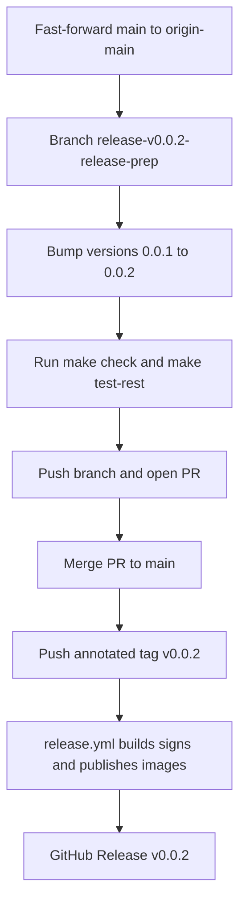

# 125 - Release v0.0.2 to GitHub and Docker Hub

Status: in progress

## Problem

The code that landed on `main` since `v0.0.1` has not yet been released. Cut
`0.0.2` so the published Docker images and GitHub Release cover that delta.

## Delta (v0.0.1 `9ff456d` -> origin/main `fab3a34`)

The following work landed after the `v0.0.1` tag:

- [plan 120](120_docker_badge_pulls_plan.md) — Docker Hub image badges switched to
  `docker/pulls` (docs-only).
- [plan 121](121_codecov_github_actions_plan.md) — Codecov coverage reporting via
  a new [`ci.yml`](../.github/workflows/ci.yml), [`codecov.yml`](../codecov.yml),
  the frontend Vitest harness and
  [`scripts/lcov-production-only.sh`](../scripts/lcov-production-only.sh).
- [plan 122](122_frontend_unit_coverage_80_plan.md) — frontend unit-test coverage
  of the whole `frontend/src` raised to >= 80 % (jsdom + Testing Library).
- [plan 123](123_decouple_tiles_build_from_startup_plan.md) — the backend no
  longer blocks startup on the basemap build; the map is built in the background
  and the frontend shows a "Downloading map..." overlay.
- [plan 124](124_daily_data_source_update_cron_plan.md) — the default
  `data_source_update_cron` changed from hourly to once a day at 03:00.
- cosmetic CI action bumps to Node-24 majors (the plan 119 follow-up).

The release infrastructure from
[plan 119](119_release_v0.0.1_plan.md) (Apache-2.0 license, Docker Hub image
names, keyless cosign signing, GitHub Release) is already in place and is
**version-agnostic**: [`release.yml`](../.github/workflows/release.yml) derives
`0.0.2` + `latest` from the pushed `v0.0.2` tag via `docker/metadata-action`
(`type=semver,pattern={{version}}`). Only the version string and the pinned
image tags need bumping.

## Approach

Follow the exact `v0.0.1` release flow
([plan 119](119_release_v0.0.1_plan.md)): prepare on a
`release/v0.0.2-release-prep` branch, merge to `main` via PR, then push the
annotated tag.

### 1. Sync `main`

The local checkout is on `feat/async-map-download`; local `main`
(`223146e`) is behind `origin/main` (`fab3a34`).

- `git checkout main`
- `git pull --ff-only` (fast-forwards local `main` to `origin/main`)

### 2. Branch

- `git checkout -b release/v0.0.2-release-prep`

### 3. Version bump `0.0.1` -> `0.0.2`

- [`backend/Cargo.toml`](../backend/Cargo.toml:3) — `version = "0.0.2"`.
- [`backend/Cargo.lock`](../backend/Cargo.lock:476) — the `[[package]] name =
  "bike_counter"` entry `version = "0.0.2"` (regenerated by `cargo check`, or
  edited directly; only the top-level `bike_counter` package, never any
  dependency entry).
- [`frontend/package.json`](../frontend/package.json:4) — `"version": "0.0.2"`.
- [`frontend/package-lock.json`](../frontend/package-lock.json:2) — the two
  top-level `name`/`version` fields (`0.0.2`); never touch `node_modules/*`
  entries.
- [`docker-compose.yml`](../docker-compose.yml:29) — backend image
  `xy8000/bike-counter-backend:0.0.2`.
- [`docker-compose.yml`](../docker-compose.yml:103) — frontend image
  `xy8000/bike-counter-frontend:0.0.2`.
- [`README.md`](../README.md:83) and [`README.md`](../README.md:102) — prose
  references to the pinned image names and release tags.
- [`.github/workflows/release.yml`](../.github/workflows/release.yml:9) —
  refresh the `0.0.1` examples in the doc comments (cosmetic; the workflow
  logic is untouched).

### 4. Gates

- `make check` green (fmt + clippy + prettier + cargo audit).
- `make test-rest` green.
- The full `make test` / `make coverage` / `make test-playwright` suites run in
  CI on the PR (only version strings change, so no logic is affected).

### 5. Cut the release (owner actions)

- Push the branch and open/merge the PR to `main`.
- From the merged `main`:
  `git tag -a v0.0.2 -m "Bike-Counter 0.0.2"` then `git push origin v0.0.2`.
- The push triggers [`release.yml`](../.github/workflows/release.yml), which
  builds both multi-arch images, pushes `xy8000/bike-counter-backend:0.0.2`
  / `:latest` and `xy8000/bike-counter-frontend:0.0.2` / `:latest`, cosign-signs
  them, and creates the GitHub Release.

## Progress (local prep done, release not yet cut)

The version bump, image tags, docs and this plan file are committed on
`release/v0.0.2-release-prep`; `make check` and
`make test-rest` (128 passed) are green. No application logic changed, so the
release prep differs from `main` only in version strings and the two image tags.

Remaining **owner actions** (require GitHub credentials not available in this
environment — `gh` is not installed and no git credential helper is configured):

1. Push the branch and open/merge the PR to `main`:
   `git push -u origin release/v0.0.2-release-prep`.
2. From the merged `main`, cut the release:
   `git tag -a v0.0.2 -m "Bike-Counter 0.0.2"` then `git push origin v0.0.2` —
   this triggers `.github/workflows/release.yml`.
3. Verify the workflow is green, the GitHub Release `v0.0.2` exists, and
   Docker Hub shows `xy8000/bike-counter-backend:0.0.2` / `:latest` and
   `xy8000/bike-counter-frontend:0.0.2` / `:latest`.

## Definition of done

- [x] Plan file in [`plans/`](.) updated
- [x] Local `main` fast-forwarded to `origin/main` (`fab3a34`)
- [x] `release/v0.0.2-release-prep` branch created
- [x] Version bumped to `0.0.2` in `Cargo.toml`, `Cargo.lock`, `package.json`, `package-lock.json`
- [x] `docker-compose.yml` image tags and [`README.md`](../README.md) prose updated to `0.0.2`
- [x] `make check` green
- [x] `make test-rest` green
- [ ] PR merged to `main` — **owner action**
- [ ] Annotated tag `v0.0.2` pushed and the release workflow completed green — **owner action**
- [ ] Docker Hub shows `xy8000/bike-counter-backend:0.0.2` / `:latest` and `xy8000/bike-counter-frontend:0.0.2` / `:latest` — **owner action**
- [ ] GitHub Release `v0.0.2` exists with release notes — **owner action**
