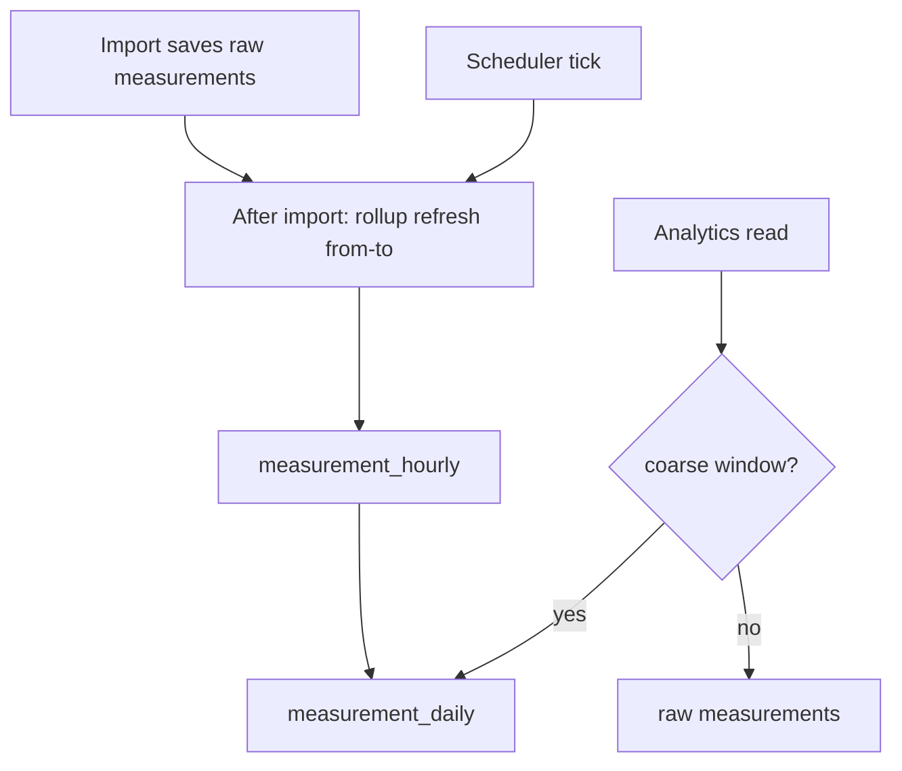
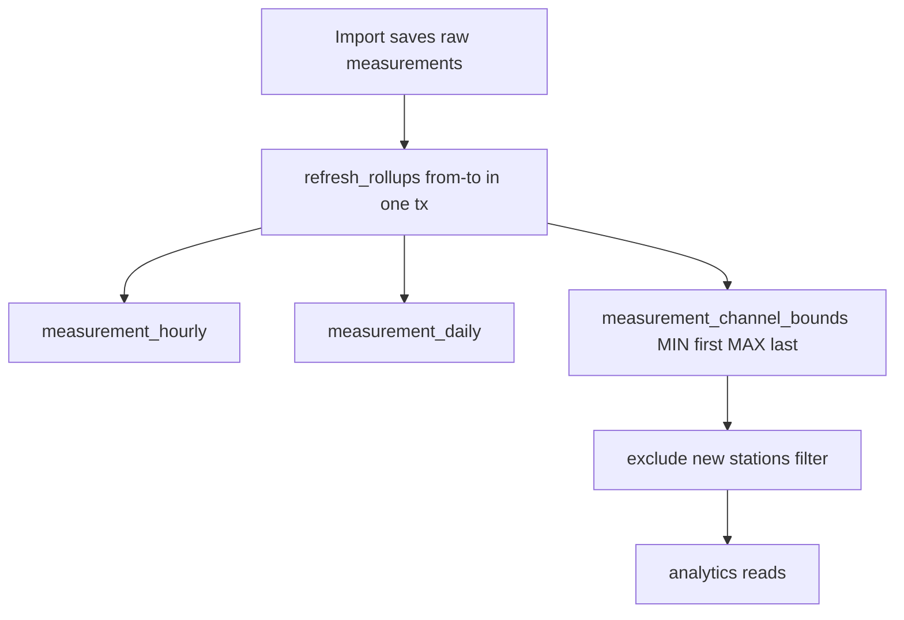

# 126 - Measurement rollups for fast graphs and overviews

Status: implemented

## Workflow

All work for this plan is done on a dedicated feature branch
(`feat/measurement-daily-hourly-rollup`) off the current default branch, and
opened as a pull request when complete.

## Context

The station-analytics endpoints (global summary, sidebar/summary `bikes_last_day`,
overview metrics, monthly bar, 30-day/year graphs) all aggregate the raw
[`measurements`](../backend/migrations/V1__create_measurements.sql:14) table on every
request. The covering index from
[`V20`](../backend/migrations/V20__add_measurements_timestamp_index.sql:11) turns
windowed scans into index-only range scans, but the coarse reads still scan a lot
of history:

- [`sum_by_month`](../backend/src/adapter/driven/postgres/measurement_repository.rs:605)
  scans the **entire** history of a channel (Hamburg ~20.9M rows) for the monthly
  bar and all-time total.
- The **year** timeframe re-scans a full year per request, both for its daily
  buckets ([`sum_buckets_by_channel`](../backend/src/adapter/driven/postgres/measurement_repository.rs:382))
  and for its hour-of-day radar
  ([`sum_hours_by_channel`](../backend/src/adapter/driven/postgres/measurement_repository.rs:535)).

On low-IO hardware this makes the initial graph/overview render slow. Caching the
HTTP responses does not help the first load and does not help the per-viewport /
per-timeframe combinations the frontend already fetches on demand.

## Decision

Pre-aggregate measurements into **hourly** and **daily** rollup tables keyed by
`(channel_id, resolution_seconds, local calendar bucket)` and maintain them in the
background. Raw measurements stay the source of truth and keep serving the only
reads the rollups cannot answer: the 5-minute day graph and any custom range finer
than an hour.

- **Daily rollup** serves the scalar overview metrics (day / 7 days / month / year
  are all complete local-day windows), `bikes_last_day`, the monthly bar, the
  all-time total and the 30-day/year daily bucket series.
- **Hourly rollup** serves the hour-of-day radars (incl. the year graph's), whose
  `EXTRACT(HOUR ...)` grouping collapses DST-ambiguous hours exactly like the
  rollup's `local_hour` key.

### Why background maintenance instead of a trigger

The import path
([`save_batch`](../backend/src/adapter/driven/postgres/measurement_repository.rs:131))
inserts up to ~16k rows per statement inside one transaction. A per-row
`AFTER INSERT` trigger would add a channel→station join and an upsert to that hot
path and would serialize bulk imports. A background job (the pattern already used
by [`data_source_update`](../backend/src/core/application/data_source_update_service.rs:34),
[`tiles_update`](../backend/src/core/application/tiles_update_service.rs:40),
[`asset_cleanup`](../backend/src/core/application/asset_cleanup_service.rs:31) and
[`opendata_export`](../backend/src/core/application/opendata_export_service.rs:44))
keeps the import path untouched, and a refresh hook right after each import makes
the rollup fresh immediately after new data lands.

## Design

### 1. Schema (migration `V24__add_measurement_rollups.sql`)

```sql
CREATE TABLE measurement_hourly (
    channel_id         UUID    NOT NULL REFERENCES channels(id) ON DELETE CASCADE,
    resolution_seconds BIGINT  NOT NULL,
    local_date         DATE    NOT NULL,
    local_hour         SMALLINT NOT NULL,
    total              BIGINT  NOT NULL,
    PRIMARY KEY (channel_id, resolution_seconds, local_date, local_hour)
);

CREATE TABLE measurement_daily (
    channel_id         UUID   NOT NULL REFERENCES channels(id) ON DELETE CASCADE,
    resolution_seconds BIGINT NOT NULL,
    local_date         DATE   NOT NULL,
    total              BIGINT NOT NULL,
    PRIMARY KEY (channel_id, resolution_seconds, local_date)
);

-- Date-first index for the read path, which filters a channel list by a
-- local-date range and then groups by month/hour-of-day.
CREATE INDEX measurement_hourly_date_resolution_idx
    ON measurement_hourly (local_date, resolution_seconds);
CREATE INDEX measurement_daily_date_resolution_idx
    ON measurement_daily (local_date, resolution_seconds);
```

`local_date` / `local_hour` are computed in the **channel's own counting-station
timezone** (each channel belongs to exactly one station with one timezone). This
matches the analytics' DST-aware local-day semantics. The summary endpoints that
aggregate many stations already use a single shared timezone today, so the
per-channel local-date keying stays consistent with the existing behavior; a truly
multi-timezone summary is out of scope.

The migration is **DDL only** — it must not backfill, because a full scan of the
production history (tens of millions of rows) inside a startup migration keeps
the backend in `Starting DB-Migrations` far longer than the healthcheck allows.
The one-time backfill runs in the background in the `measurement_rollup` job
(which reads the measurement bounds and refreshes the whole range on its first
run), so startup never blocks.

`refresh_rollups` widens the requested range by 40 h on both ends so every
station-local calendar day overlapping it is fully covered (a day is at most
24 h; UTC offsets span -12 h…+14 h). It recomputes the strictly-interior local
days from the raw rows and **upserts** them (`ON CONFLICT DO UPDATE`), so a
mid-day range boundary can never leave a partially re-aggregated day behind and
no delete (nor a scan of the rollup tables) is needed. Both the hourly and the
daily rollup are recomputed directly from raw with the same filter; the raw scan
is bounded by the timestamp index.

Every refresh takes a transaction-scoped `pg_advisory_xact_lock` first. The
scheduled backfill and the post-import hook run concurrently by design, and
without the lock two refreshes can deadlock or re-insert the same bucket between
one transaction's delete and the other's insert (observed in a real deployment).
The lock is released on commit/rollback.

### 2. Repository port and Postgres implementation

Extend the measurement repository port (or add a dedicated rollup port) with
rollup-backed reads, each with an empty default implementation so existing
in-memory test doubles keep compiling:

- `sum_daily(from, to, timezone, channel_ids, resolution) -> i64` — converts the
  UTC window to local dates and sums `measurement_daily`.
- `sum_daily_by_channel(from, to, timezone, channel_ids, resolution) -> Vec<ChannelTotal>`
  — per-channel daily sums (sidebar/summary `bikes_last_day`).
- `sum_daily_buckets_by_channel(from, to, timezone, channel_ids, resolution) -> Vec<ChannelBucket>`
  — per-channel daily bucket series (30-day/year graphs, daily-or-coarser custom
  ranges), with each bucket start as the local-midnight UTC instant.
- `sum_by_month` re-implemented over `measurement_daily` grouped by
  `EXTRACT(YEAR/MONTH FROM local_date)` (replaces the full-history raw scan).
- `sum_hours` / `sum_hours_by_channel` re-implemented over `measurement_hourly`
  grouped by `local_hour` for daily-or-coarser windows (replaces the full-year
  raw scan behind the year graph's hour radar).
- `refresh_rollups(from, to)` — the maintenance write: within one
  advisory-locked transaction, upsert the hourly and daily buckets of the
  strictly-interior local days of the widened range, both recomputed from the
  raw rows.

### 3. Background job (`MeasurementRollupService`)

A new core service following the existing scheduled-job pattern:

- Job type `measurement_rollup`, ShedLock-style acquire/release, heartbeat and
  cancellation matching [`DataSourceUpdateService`](../backend/src/core/application/data_source_update_service.rs);
  the max heartbeat interval defaults to 300 s so a crashed rollup job is
  reclaimed quickly (the heartbeat loop beats independently of the refresh
  chunks).
- `run_if_due`: if the rollup job has never succeeded, run the full backfill;
  otherwise refresh the last `N` days (3) so a restart or a missed import is
  self-healing. The full backfill walks the history in 7-day chunks (each its own
  advisory-locked transaction), so it commits visible progress, keeps every
  transaction small, and stays cancellable between chunks.
- A `refresh(from, to)` method that the import flow calls directly after each
  successful source import, so the rollup is fresh as soon as data lands without
  waiting for the cron tick. Historical backfills by a provider are covered because
  the refresh uses the imported timestamp range, not a global watermark.

### 4. Read-path switch in the analytics service

- [`metrics::sum_window`](../backend/src/core/application/station_analytics/metrics.rs:32)
  and [`metrics::metric_windows`](../backend/src/core/application/station_analytics/metrics.rs:82)
  call the daily-rollup sums (all four metric windows are complete local days).
- [`bikes_by_station`](../backend/src/core/application/station_analytics/service.rs:289)
  calls `sum_daily_by_channel` for the previous local day.
- [`summary_monthly_totals`](../backend/src/core/application/station_analytics/service.rs:167)
  and `detail_monthly` / `total_bikes` use the rollup-backed `sum_by_month`.
- [`graphs::period_data`](../backend/src/core/application/station_analytics/graphs.rs:426)
  branches on granularity: daily-or-coarser windows use
  `sum_daily_buckets_by_channel` and the rollup-backed hour radar; the 5-minute
  day graph and custom sub-hourly ranges keep the raw `sum_buckets_by_channel`.

The analytics service always picks the **coarsest rollup that can answer the
request exactly**, so it never reads more history than it needs:

| Read | Source |
|---|---|
| Overview metrics day / 7 days / month / year | `measurement_daily` |
| Global / sidebar / summary `bikes_last_day` | `measurement_daily` |
| Monthly bar chart and all-time total | `measurement_daily` |
| 30-day and year daily bucket series | `measurement_daily` |
| Weekday radar over daily-or-coarser buckets | `measurement_daily` |
| Hour-of-day radar incl. the year graph | `measurement_hourly` |
| Week graph hourly buckets | raw `measurements` (bounded to 2 weeks, DST-exact) |
| 5-minute day graph | raw `measurements` |
| Custom range finer than 1 hour | raw `measurements` |



### 5. Wiring and configuration

- `measurement_rollup_cron` (default `0 */15 * * * *`) and
  `measurement_rollup_max_heartbeat_interval_seconds` (default 300) added to
  [`Configuration`](../backend/src/core/domain/configuration/configuration.rs) with
  a `with_measurement_rollup` builder, validated like the other cron keys, read by
  [`ConfigurationTomlAdapter`](../backend/src/adapter/driven/configuration_toml_adapter.rs)
  and documented in [`config.toml.example`](../config.toml.example).
- `MeasurementRollupService` instantiated in
  [`main.rs`](../backend/src/main.rs:267) and its scheduler spawned inside the
  `scheduled_jobs_enabled` block (so the offline Playwright e2e path is unaffected);
  also registered in the heartbeat
  [reconciliation watcher](../backend/src/core/application/job_reconciliation_service.rs:51).

## Testing strategy (TDD)

Write tests **before** the production code they exercise, following the repo's
existing red/green flow:

1. Rollup read contract: add failing tests against the new port methods using an
   in-memory double, then implement the Postgres repository to satisfy them.
2. [`MeasurementRollupService`](../backend/src/core/application/data_source_update_service.rs)
   behavior (backfill, incremental refresh, heartbeat/cancellation) written against
   a recording job/rollup repository double before the service body exists.
3. Analytics read-path routing: tests asserting that daily-or-coarser windows hit
   the rollup methods and sub-hourly windows still hit the raw methods, written
   before [`graphs.rs`](../backend/src/core/application/station_analytics/graphs.rs)
   and [`metrics.rs`](../backend/src/core/application/station_analytics/metrics.rs)
   are switched over.
4. Postgres repository tests cover the migration backfill, the delete+reinsert
   refresh, and DST-sensitive local-date/local-hour bucketing (23/25-hour days).

### Coverage constraints

- Backend overall production line coverage stays ≥ 80 % and `src/core/` stays
  ≥ 95 % (enforced by `make coverage` / [`scripts/coverage.sh`](../scripts/coverage.sh)).
- The new core service and the new `graphs.rs`/`metrics.rs` routing branches must
  not lower the core threshold; add tests for every new branch instead of
  `#[allow]`-ing coverage.
- No production code ships without its test landing in the same change.

## Out of scope

- HTTP-response caching / Redis (does not address the cold-start scan cost).
- Partitioning the raw measurements table.
- A per-row database trigger on `measurements`.
- Multi-timezone summary correctness (the current code already assumes one shared
  timezone for the aggregated summary views).

## Definition of done

- [x] Failing tests written first for the rollup port contract, rollup service behavior, and analytics routing
- [x] `V24__add_measurement_rollups.sql` added with the tables and indexes (DDL only; the backfill runs in the rollup job)
- [x] Rollup read methods added to the repository port with default impls, satisfying the port-contract tests
- [x] Postgres rollup read/write implementation added and made green by the repository tests
- [x] `MeasurementRollupService` implemented and made green by its behavior tests
- [x] Import flow triggers a rollup refresh after each successful source import
- [x] Analytics metrics, `bikes_last_day`, monthly totals and 30-day/year graphs read from the rollups; routing tests green
- [x] Scheduler + cron configuration wired and validated
- [x] `make check` green
- [x] `make test` green
- [x] `make coverage` green (backend core ≥ 95 %, overall ≥ 80 % — measured 95.00 % / 85.82 %)
- [x] `make test-playwright` green (74 passed; the seeded fixture lacks V23/V24, so they are applied at e2e startup)
- [x] [`README.md`](../README.md) updated where the architecture/README mentions the read model

## Extension — per-channel bounds aggregate for the new-station filter (V25)

Status: implemented

### Problem

Turning on *Bike-Trends → Exclude new stations* re-introduces the very raw scans
the rollups removed. The predicate is
[`introduced_after`](../backend/src/core/application/station_analytics/resolution.rs:67),
so every consumer must know each channel's **earliest-ever** measurement. That is
answered by
[`earliest_by_channel`](../backend/src/adapter/driven/postgres/measurement_repository.rs:883):

```sql
SELECT DISTINCT ON (channel_id) channel_id, timestamp
FROM measurements
WHERE channel_id = ANY($1::uuid[])
ORDER BY channel_id, timestamp ASC
```

To return the first row per channel, Postgres must walk **every** row of each
requested channel (one station is up to ~2 x 250k rows in the dev data; a summary
is every channel in the system) and discard all but the first. No index can skip
the rest of a channel's history — Postgres has no loose index scan — so this is a
large index walk whose cost dwarfs the rollup reads it guards.

It is called from five places, several of them per station:

- [`metrics.rs:127`](../backend/src/core/application/station_analytics/metrics.rs:127)
  inside the per-station loop of `metric_windows` so a multi-station summary
  overview does N+1 earliest queries.
- [`graphs.rs:450`](../backend/src/core/application/station_analytics/graphs.rs:450)
  per station graph (`period_data`).
- [`graphs.rs:786`](../backend/src/core/application/station_analytics/graphs.rs:786)
  per channel graph.
- [`service.rs:225`](../backend/src/core/application/station_analytics/service.rs:225)
  once, batched, for the established-year filter.
- [`service.rs:435`](../backend/src/core/application/station_analytics/service.rs:435)
  once, batched, for the header/summary `bikes_last_day`.

With the setting off none of them run, which is why the IO difference is so large.

### Decision

Add a **per-channel bounds aggregate**, `measurement_channel_bounds`, holding
each channel's first and last measurement timestamp, and maintain it from the
existing `measurement_rollup` job alongside the hourly/daily rollups. The
new-station predicate then reads one tiny indexed row per channel instead of
scanning the raw history.

### Design

#### 1. Schema (migration `V25__add_measurement_channel_bounds.sql`, DDL only)

```sql
CREATE TABLE measurement_channel_bounds (
    channel_id      UUID        PRIMARY KEY REFERENCES channels(id) ON DELETE CASCADE,
    first_timestamp TIMESTAMPTZ NOT NULL,
    last_timestamp  TIMESTAMPTZ NOT NULL
);

-- Single-row rollup readiness flag (id pinned to 1).
CREATE TABLE measurement_rollup_state (
    id         SMALLINT PRIMARY KEY DEFAULT 1 CHECK (id = 1),
    backfilled BOOLEAN  NOT NULL DEFAULT FALSE
);
```

The PK is the channel id, so each lookup is a single index seek. `backfilled`
tells the read path whether the one-time rollup backfill has finished; it starts
`FALSE`. DDL only, like `V24`: the backfill runs in the job, never in the
migration, so startup never blocks.

#### 2. Port

- New value object `ChannelBounds { channel_id, first, last }` and
  `channel_bounds(channel_ids) -> Vec<ChannelBounds>` on
  [`MeasurementRepository`](../backend/src/core/domain/measurements/repository_port.rs),
  with a default impl that merges `earliest_by_channel` + `latest_by_channel`, so
  existing in-memory doubles keep compiling (and stay correct) without an
  override.
- [`refresh_rollups`](../backend/src/adapter/driven/postgres/measurement_repository.rs:993)
  becomes responsible for the bounds too: inside the same advisory-locked
  transaction it upserts `MIN(timestamp)`/`MAX(timestamp)` per channel over the
  widened raw range — **without** the interior-local-day filter the bucket
  aggregation uses, so the global extremes are never clipped — merging with
  `ON CONFLICT ... DO UPDATE SET first = LEAST(...), last = GREATEST(...)`.

#### 3. Read-path switch

- Every `earliest_by_channel` consumer switches to `channel_bounds`:
  [`metrics.rs:127`](../backend/src/core/application/station_analytics/metrics.rs:127),
  [`graphs.rs:450`](../backend/src/core/application/station_analytics/graphs.rs:450),
  [`graphs.rs:786`](../backend/src/core/application/station_analytics/graphs.rs:786),
  [`service.rs:225`](../backend/src/core/application/station_analytics/service.rs:225)
  and
  [`service.rs:435`](../backend/src/core/application/station_analytics/service.rs:435).
- The `metric_windows` N+1 is removed too: fetch the bounds for **all** the
  included stations' channels once before the loop and reuse the map.
- `latest_by_channel` (the post-import staleness check in
  [`data_import_service.rs:553`](../backend/src/core/application/data_import_service.rs:553))
  reads the same table, removing a second per-import raw scan.
- `measurement_bounds()` reads `MIN(first)`/`MAX(last)` from the bounds table once
  it is populated (falling back to the raw `MIN`/`MAX` while empty), so the job's
  own range discovery is cheap after the first run.

#### 4. Cold-start correctness

While the bounds table is still being backfilled a channel may have no row.
`channel_bounds` falls back to `earliest_by_channel`/`latest_by_channel` for any
requested channel that is missing, so the new-station filter is never wrong
during the first backfill; it stops paying the raw cost only once the row exists.

The same concern applies to the rollup reads themselves. `rollups_ready()` reads
`measurement_rollup_state.backfilled` (cached in an `AtomicBool` once true), and
every rollup-backed read (`sum_daily`, `sum_daily_by_channel`, `sum_hours`,
`sum_hours_by_channel`, `sum_by_month`, and the daily branch of
`sum_buckets`/`sum_buckets_by_channel`) falls back to the raw table until it is
set. `MeasurementRollupService::run_if_due` runs the full backfill while the flag
is false and calls `mark_rollups_ready()` only when that backfill completes, so a
fresh deploy (or a restart mid-backfill) serves **correct** numbers — the
pre-rollup raw behaviour — instead of zeros.



### Testing strategy (TDD)

Write the tests first, as for the base plan:

1. Port contract: failing tests for `channel_bounds` (batch lookup, a missing
   channel falls back to raw) against an in-memory double, then implement.
2. Postgres repository: the bounds upsert during `refresh_rollups` (`MIN`/`MAX`
   per channel, `LEAST`/`GREATEST` merge on re-run, extremes at the range edges
   are not clipped) and `channel_bounds` returning the stored rows.
3. Core routing: `metric_windows` / graph / `global_summary` tests assert the
   exclude path reads `channel_bounds` and no longer `earliest_by_channel`,
   written before the code is switched.

### Coverage constraints

Same as the base plan: core ≥ 95 %, overall ≥ 80 %, no production code without its
test in the same change, and no `#[allow]` to dodge the threshold.

### Related fix — stale zero overview after a cold start

While diagnosing this, the station overview briefly showed `0` for every metric.
The read path now answers coarse windows **only** from the rollups, so during the
one-time backfill (and for the first moments after a fresh deploy) it returns
zeros until the job has built them; the `Windowed` BFF policy then caches that
zero body for an hour (`max-age=3600, must-revalidate`), so the browser keeps
showing it after the rollups are ready.

- [x] Guard chosen: fall back to the raw window sum while
      `measurement_rollup_state.backfilled` is false (the readiness gate above),
      so the zero body is never produced and the `Windowed` cache cannot hold it.

### Out of scope

- Multi-resolution `resolution_coverage` / `has_measurements_in_windows` rewrites
  (not on the exclude-new-stations path).

### Definition of done

- [x] Tests written first for the bounds port contract, the refresh bounds upsert and the core routing switch
- [x] `V25__add_measurement_channel_bounds.sql` added (DDL only, incl. the readiness state row)
- [x] `channel_bounds` port method + default impl (mirrors the missing edge for doubles that override only one side)
- [x] Postgres bounds upsert in `refresh_rollups` and the `channel_bounds` reader (raw fallback for uncovered channels) implemented and made green
- [x] All `earliest_by_channel` consumers (and the `metric_windows` N+1) switched to `channel_bounds`
- [x] Post-import `latest_by_channel` staleness reads the bounds table
- [x] Readiness gate: rollup reads fall back to raw until the backfill completes; covered by a repository test and a service test
- [x] `make check` / `make test` / `make coverage` green (767 tests; core 95.90 %, overall 86.25 %; `repository_port.rs` 100 %, analytics ~99 %, rollup service 91.4 %)
- [x] `make test-playwright` green (74 passed)
- [x] Committed on `feat/measurement-daily-hourly-rollup`
