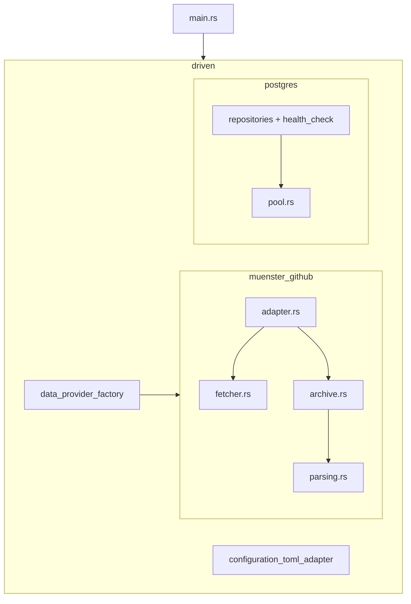

# 12 - Adapter structure refactor plan

Status: implemented

## Problem

`src/adapter/` grew quickly over the last days and is now hard to navigate:

- **Driven side** (`src/adapter/driven/`) is a flat list of 10 modules. Nine of
  them are Postgres-related (`postgres_pool`, seven `postgres_*_repository`
  files, `postgres_health_check`) but are scattered as siblings of unrelated
  config/factory adapters.
- **Münster provider** lives in a single 1649-line file
  [`muenster_github_adapter.rs`](src/adapter/driven/muenster_github_adapter.rs:1)
  that mixes four distinct concerns plus ~800 lines of tests:
  1. HTTP abstraction (`UpstreamHeaders`, `ArchiveFetcher`, `HttpFetcher`)
  2. Archive index + zip extraction (`ArchiveIndex`, `extract`, `build_index`)
  3. The adapter itself (`MuensterGithubAdapter` struct, config parsing,
     cache lifecycle, `DataProvider` impl)
  4. Parsing helpers (`parse_site_index`, `csv_month_range`,
     `parse_measurement_csv`, `berlin_to_utc`, `sanitize_zip_path`,
     `parse_host_and_port`)
- **Driving side** is also large: [`rest/handlers.rs`](src/adapter/driving/rest/handlers.rs:1)
  (560 lines) and [`rest/dto.rs`](src/adapter/driving/rest/dto.rs:1) (694 lines)
  bundle every resource's handlers/DTOs in one file.

This plan is a **pure structural refactor** of the adapter layer only. No
behavioral change, no domain/core changes (domain stays a follow-up plan).

## Goals

- Group all Postgres adapters into one `postgres` submodule so the driven side
  reads as `postgres`, `configuration_toml_adapter`, `data_provider_factory`,
  and `muenster_github`.
- Give the Münster provider its own module directory and split the 1649-line
  file into focused files by concern, keeping tests next to their subject.
- Keep all public type names and paths that external callers use stable where
  reasonable (a `postgres/mod.rs` re-export layer), and update the few
  import sites that do change.
- Split the large driving REST `handlers.rs` (560) and `dto.rs` (694) into
  per-resource modules for symmetry.
- All existing tests keep passing with no logic edits.

## Current state

```text
src/adapter/
├── mod.rs                       # pub mod driven; pub mod driving;
├── driven/
│   ├── mod.rs                   # 10 flat pub mod declarations
│   ├── configuration_toml_adapter.rs   (304 lines, keep)
│   ├── data_provider_factory.rs        ( 68 lines, keep; imports muenster)
│   ├── muenster_github_adapter.rs      (1649 lines, THE monolith)
│   ├── postgres_pool.rs                ( 63 lines)
│   ├── postgres_channel_repository.rs
│   ├── postgres_counting_station_repository.rs
│   ├── postgres_data_source_repository.rs    (119)
│   ├── postgres_health_check.rs               (112)
│   ├── postgres_job_repository.rs
│   ├── postgres_measurement_repository.rs     (450)
│   ├── postgres_persistent_state_repository.rs
│   └── postgres_provider_message_repository.rs (228)
└── driving/
    ├── mod.rs                   # pub mod job_scheduler; pub mod rest;
    ├── job_scheduler.rs
    └── rest/
        ├── mod.rs               # RestApiAdapter, router (108)
        ├── handlers.rs          # all handlers + AppState (560)
        ├── dto.rs               # all DTOs (694)
        ├── openapi.rs           # utoipa registry (83)
        └── tests/               # 10 test modules
```

### Existing cross-references that must be updated

| Location | Reference today | Becomes |
|---|---|---|
| `src/main.rs` | `crate::adapter::driven::postgres_*` (9 imports + `create_pool`) | `crate::adapter::driven::postgres::*` |
| `src/adapter/driven/data_provider_factory.rs` | `crate::adapter::driven::muenster_github_adapter::MuensterGithubAdapter` | `crate::adapter::driven::muenster_github::MuensterGithubAdapter` |
| postgres files (impls) | `use super::postgres_pool::PgPool;` | `use super::pool::PgPool;` (or `super::PgPool` via re-export) |
| postgres test modules | `crate::adapter::driven::postgres_pool::create_pool` and `...::postgres_data_source_repository::PostgresDataSourceRepository` | `crate::adapter::driven::postgres::create_pool` and `...::postgres::PostgresDataSourceRepository` (via re-exports) |
| `src/adapter/driven/mod.rs` | 10 flat `pub mod` declarations | 4 declarations incl. `pub mod postgres; pub mod muenster_github;` |

## Target state

```text
src/adapter/
├── mod.rs
├── driven/
│   ├── mod.rs                       # configuration_toml_adapter, data_provider_factory,
│   │                                # muenster_github, postgres
│   ├── configuration_toml_adapter.rs   (unchanged)
│   ├── data_provider_factory.rs        (unchanged, import path updated)
│   ├── muenster_github/
│   │   ├── mod.rs                      # module doc, re-export MuensterGithubAdapter
│   │   ├── adapter.rs                  # struct, config parsing, cache lifecycle, DataProvider impl
│   │   ├── fetcher.rs                  # UpstreamHeaders, ArchiveFetcher, HttpFetcher
│   │   ├── archive.rs                  # ArchiveIndex, extract, build_index, sanitize_zip_path
│   │   ├── parsing.rs                  # site index + CSV parsers, timezone/url helpers
│   │   └── tests.rs                    # moved integration-style tests (cache/serving/messages)
│   └── postgres/
│       ├── mod.rs                      # submodule declarations + re-exports (PgPool, create_pool,
│       │                                # Postgres*Repository, PostgresHealthCheck)
│       ├── pool.rs                     # (was postgres_pool.rs)
│       ├── channel_repository.rs       # (was postgres_channel_repository.rs)
│       ├── counting_station_repository.rs
│       ├── data_source_repository.rs
│       ├── health_check.rs             # (was postgres_health_check.rs)
│       ├── job_repository.rs
│       ├── measurement_repository.rs
│       ├── persistent_state_repository.rs
│       └── provider_message_repository.rs
└── driving/
    └── rest/
        ├── mod.rs                       # RestApiAdapter + router (re-exports handlers)
        ├── handlers/
        │   ├── mod.rs                   # AppState, map_domain_error, blocking helper
        │   ├── root.rs                  # get_api_root
        │   ├── counting_stations.rs     # list/get counting stations
        │   ├── channels.rs              # list/get channels
        │   ├── measurements.rs          # list/get measurements
        │   ├── data_sources.rs          # list/get data sources + list_provider_messages
        │   ├── persistent_state.rs      # get/put/delete/clear persistent_state
        │   ├── jobs.rs                  # list/get jobs
        │   └── health.rs                # get_health_live / get_health_ready
        ├── dto/
        │   ├── mod.rs                   # LinkDto, ErrorResponseDto + re-exports
        │   ├── root.rs                  # ApiRootDto
        │   ├── counting_stations.rs
        │   ├── channels.rs
        │   ├── measurements.rs
        │   ├── data_sources.rs
        │   ├── persistent_state.rs
        │   ├── jobs.rs
        │   ├── provider_message.rs      # severity DTO + message/list DTOs
        │   └── health.rs                # HealthDto, HealthComponentDto
        ├── openapi.rs                   # single ApiDoc registry (imports updated)
        └── tests/
```



## Phase 1 - Group the Postgres adapters

Scope: **pure move + path updates**, no logic change.

1. Create `src/adapter/driven/postgres/` and move the nine files, dropping the
   `postgres_` filename prefix (the module name already conveys it):
   - `postgres_pool.rs` -> `postgres/pool.rs`
   - `postgres_channel_repository.rs` -> `postgres/channel_repository.rs`
   - `postgres_counting_station_repository.rs` -> `postgres/counting_station_repository.rs`
   - `postgres_data_source_repository.rs` -> `postgres/data_source_repository.rs`
   - `postgres_health_check.rs` -> `postgres/health_check.rs`
   - `postgres_job_repository.rs` -> `postgres/job_repository.rs`
   - `postgres_measurement_repository.rs` -> `postgres/measurement_repository.rs`
   - `postgres_persistent_state_repository.rs` -> `postgres/persistent_state_repository.rs`
   - `postgres_provider_message_repository.rs` -> `postgres/provider_message_repository.rs`
2. Add `src/adapter/driven/postgres/mod.rs`:
   - `pub mod pool;` + the repository/health submodules
   - Re-export `pub use pool::{PgPool, create_pool};` and each
     `pub use {module}::Postgres*;` so callers keep short paths:
     `postgres::PgPool`, `postgres::create_pool`, `postgres::PostgresChannelRepository`.
   - **Keep the `Postgres*` struct names.** They live in the same files that
     import the domain traits of the same short name (`ChannelRepository`,
     `MeasurementRepository`, ...); renaming would collide with the traits in
     scope. The prefix stays self-documenting.
3. Update `src/adapter/driven/mod.rs`:
   - Replace the nine `pub mod postgres_*;` lines with a single `pub mod postgres;`.
4. Update the internal references inside the moved files:
   - `use super::postgres_pool::PgPool;` -> `use super::pool::PgPool;` (or
     `use super::PgPool;` since `mod.rs` re-exports it).
   - Test modules that use `crate::adapter::driven::postgres_pool::create_pool`
     and `...::postgres_data_source_repository::PostgresDataSourceRepository`
     become `crate::adapter::driven::postgres::{create_pool, PostgresDataSourceRepository}`
     (re-exported from `mod.rs`).
5. Update `src/main.rs`:
   - Rewrite the 9 `use crate::adapter::driven::postgres_*::...;` lines to
     `use crate::adapter::driven::postgres::{...};`.

Expected outcome: `driven/` holds exactly 4 entries and all Postgres files are
grouped under one module, with no behavior change.

## Phase 2 - Split the Münster GitHub adapter into its own module

Scope: **pure file split**, no logic change. (The provider downloads from
`github.com`, so the module is `muenster_github`, consistent with
`PROVIDER_TYPE = "münster_opendata_github_provider"`.)

1. Create `src/adapter/driven/muenster_github/` and split
   [`muenster_github_adapter.rs`](src/adapter/driven/muenster_github_adapter.rs:1):

   - `mod.rs` - module doc; declares the submodules; re-exports
     `pub use adapter::MuensterGithubAdapter;` so the public path stays
     `driven::muenster_github::MuensterGithubAdapter`.
   - `adapter.rs` - constants used by the adapter + tests (`PROVIDER_TYPE`,
     `DEFAULT_*`, the `KEY_*` persistent-state keys), the
     `MuensterGithubAdapter` struct, `new`/`with_fetcher` config parsing,
     state helpers, cache lifecycle (`ensure_archive`, `refresh_archive`,
     `download`, `extract`, `store_extracted`, `store_refreshed`),
     measurement serving (`earliest_timestamp`, `windowed_series`,
     `get_measurements`), and the `DataProvider` impl.
   - `fetcher.rs` - `UpstreamHeaders`, `ArchiveFetcher` trait, `HttpFetcher`
     (kept isolated so the cache tiers stay testable without a network).
   - `archive.rs` - `ArchiveIndex`, `build_index`, zip extraction,
     `sanitize_zip_path`, `ARCHIVE_ROOT`, `SITE_INDEX_FILE`.
   - `parsing.rs` - `RawSite`, `parse_site_index`, `csv_month_range`,
     `parse_measurement_csv`, `berlin_to_utc`, `parse_rfc3339`,
     `parse_host_and_port`, `TIMEZONE`.
   - `tests.rs` - the integration-style tests (fixture archive on disk,
     cache tiers, measurement paging, provider-message emission). Config and
     parser unit tests stay as inline `#[cfg(test)]` modules inside
     `adapter.rs` / `parsing.rs` / `fetcher.rs`.
2. Visibility: types shared across the submodules become `pub(crate)` (or stay
   `pub(super)`); `MuensterGithubAdapter` alone is `pub`. Tests can access
   helpers through `pub(crate)` visibility or `#[cfg(test)]` re-exports.
3. Update `src/adapter/driven/mod.rs`:
   - `pub mod muenster_github_adapter;` -> `pub mod muenster_github;`
4. Update `src/adapter/driven/data_provider_factory.rs`:
   - Both `use crate::adapter::driven::muenster_github_adapter::MuensterGithubAdapter;`
     and the test-module import become
     `use crate::adapter::driven::muenster_github::MuensterGithubAdapter;`
5. Delete the old `src/adapter/driven/muenster_github_adapter.rs`.

Expected outcome: the 1649-line file becomes five focused files, each under
~300-400 lines, with tests living next to their subject.

## Phase 3 - Split the driving REST files

Scope: **pure file split**, no logic change. This phase turns the flat
`rest/handlers.rs` (560) and `rest/dto.rs` (694) into per-resource modules.

1. `handlers.rs` -> `handlers/` directory:
   - `mod.rs` - shared items: `AppState`, `map_domain_error`, `blocking`,
     the pagination constants, and re-exports of every handler function so
     existing callers keep compiling.
   - `root.rs` - `get_api_root`
   - `counting_stations.rs` - `list_counting_stations`, `get_counting_station_by_id`
   - `channels.rs` - `list_channels`, `get_channel_by_id`
   - `measurements.rs` - `list_measurements`, `get_measurement_by_id`
   - `data_sources.rs` - `list_data_sources`, `get_data_source_by_id`,
     `list_provider_messages`
   - `persistent_state.rs` - `get_persistent_state`, `put_persistent_state_entry`,
     `delete_persistent_state_entry`, `clear_persistent_state`
   - `jobs.rs` - `list_jobs`, `get_job_by_id`
   - `health.rs` - `get_health_live`, `get_health_ready`
2. `dto.rs` -> `dto/` directory:
   - `mod.rs` - shared `LinkDto` (+ `is_false`) and `ErrorResponseDto`, plus
     re-exports of every DTO so existing import paths (`rest::dto::*`) keep
     working.
   - `root.rs` - `ApiRootDto`
   - `counting_stations.rs` - `CountingStationDto`, `CountingStationListDto`,
     `CountingStationQueryParams`
   - `channels.rs` - `ChannelDto`, `ChannelListDto`, `ChannelQueryParams`
   - `measurements.rs` - `MeasurementDto`, `MeasurementListDto`,
     `MeasurementQueryParams`
   - `data_sources.rs` - `DataSourceDto`, `DataSourceListDto`
   - `persistent_state.rs` - `PersistentStateDto`, `PersistentStateEntryDto`,
     `PersistentStateValueDto`
   - `jobs.rs` - `JobStatusDto`, `JobDto`, `JobListDto`, `JobQueryParams`
   - `provider_message.rs` - `ProviderMessageSeverityDto`, `ProviderMessageDto`,
     `ProviderMessageListDto`
   - `health.rs` - `HealthDto`, `HealthComponentDto`
3. `openapi.rs` - keep the single `ApiDoc` registry; update its imports to pull
   the `__path_*` handler macros and DTO schemas from the new module paths.
4. `rest/mod.rs` - update the `use ... rest::handlers::{...}` import list to the
   new `handlers::*` re-exports; `pub use handlers::AppState` is preserved.

Keeping `handlers/mod.rs` and `dto/mod.rs` as **re-exporting** modules is what
lets `openapi.rs`, `rest/mod.rs`, and the `tests/` directory compile with
minimal churn - their existing `rest::dto::*` / `rest::handlers::*` paths stay
valid.

## Verification

- `make check` - rustfmt + `clippy --all-targets -- -D warnings` (must pass
  with no warnings).
- `make test-rest` - REST endpoint tests (in-memory mocks, no Docker) - this
  exercises Phase 3's new `handlers/` and `dto/` module layout.
- `make test` - full suite incl. Postgres repository tests (spins up a
  Postgres test container via Docker) and the Münster adapter unit tests.
- Confirm no logic diff: `git diff` should only show moved code, re-export
  lines, and import-path changes - zero logic edits.

## Out of scope (future plans)

- **Domain/core refactor** (the user's stated follow-up).
- **Cargo workspace split** into separate crates (`core` vs `adapter`) - the
  README already flags this as the recommended path if the project keeps
  growing; the module-level restructure here is a compatible prerequisite.
- Renaming `Postgres*` structs (kept to avoid clashing with same-named domain
  traits) or renaming `muenster_github` to `muenster` / `munster_*` (kept for
  consistency with the existing provider type string).

## Acceptance criteria

- `src/adapter/driven/` contains exactly 4 entries:
  `configuration_toml_adapter`, `data_provider_factory`, `muenster_github`,
  `postgres`.
- `muenster_github/` splits the monolith into `adapter.rs`, `fetcher.rs`,
  `archive.rs`, `parsing.rs`, `tests.rs` with tests beside their subject.
- All callers compile with the new paths (`main.rs`, `data_provider_factory.rs`,
  internal postgres cross-references).
- `driving/rest/` contains per-resource `handlers/` and `dto/` module
  directories; `openapi.rs`, `rest/mod.rs` and the tests compile against the
  re-export modules unchanged.
- `make check` and `make test` pass; the diff contains moves + path updates
  only.
