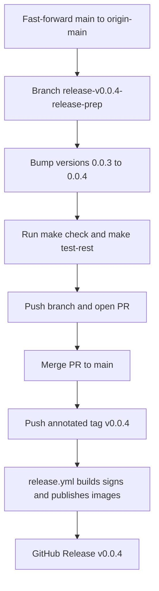

# 138 - Release v0.0.4 to GitHub and Docker Hub

Status: in progress

## Problem

The code that landed on `main` since `v0.0.3` has not yet been released. Cut
`0.0.4` so the published Docker images and GitHub Release cover that delta.

## Delta (v0.0.3 `42a49f0` -> main `46fb2dc`)

The following work landed after the `v0.0.3` tag:

- [plan 132](132_sonar_security_findings_fix_plan.md) — fixed the open Sonar
  security findings (BFF URL validation guard, `--locked` Docker builds,
  non-root backend/frontend runtimes, pinned/integrity-checked debug assets,
  per-job workflow permissions).
- [plan 133](133_vendored_pmtiles_lint_fix_plan.md) — behaviour-preserving lint
  fixes in the vendored PMTiles debug bundle (later superseded by plan 135's
  removal of the debug artifacts).
- [plan 134](134_sonar_maintainability_findings_plan.md) — fixed the remaining
  Sonar maintainability findings in hand-written code (read-only props, nested
  ternaries, cognitive complexity, mechanical lints).
- [plan 135](135_sonar_duplication_and_debug_cleanup_plan.md) — Sonar
  duplication cleanup and debug-artifact removal (shared BFF request helpers,
  shared chart-section helpers, shared station-page shell, test/e2e helper
  extraction, deletion of the unused `pmtiles-debug*` pages).
- [plan 136](136_map_bubble_zoom_dark_toggle_and_illustration_axis_plan.md) —
  map station-selection zoom 15 → 16, visible dark-mode switch thumb, and the
  trend-illustration x-axis label removal.
- [plan 137](137_dependency_upgrade_release_notes_plan.md) — dependency upgrade
  review and compatibility fixes (`testcontainers` reverted to `0.27.3`,
  `toml` metadata dropped, Node engine floor raised to `>=22.12.0`, lockfiles
  regenerated).

The release infrastructure from
[plan 119](119_release_v0.0.1_plan.md) (Apache-2.0 license, Docker Hub image
names, keyless cosign signing, GitHub Release) is already in place and is
**version-agnostic**: [`release.yml`](../.github/workflows/release.yml) derives
`0.0.4` + `latest` from the pushed `v0.0.4` tag via `docker/metadata-action`
(`type=semver,pattern={{version}}`). Only the version string and the pinned
image tags need bumping.

## Approach

Follow the exact `v0.0.1` / `v0.0.2` / `v0.0.3` release flow
([plan 119](119_release_v0.0.1_plan.md),
[plan 125](125_release_v0.0.2_plan.md),
[plan 130](130_release_v0.0.3_plan.md)): prepare on a
`release/v0.0.4-release-prep` branch, merge to `main` via PR, then push the
annotated tag.

### 1. Sync `main`

- `git fetch origin --prune`
- `git checkout main`
- `git pull --ff-only` (fast-forwards local `main` to `origin/main` `46fb2dc`)

### 2. Branch

- `git checkout -b release/v0.0.4-release-prep`

### 3. Version bump `0.0.3` -> `0.0.4`

- [`backend/Cargo.toml`](../backend/Cargo.toml:3) — `version = "0.0.4"`.
- [`backend/Cargo.lock`](../backend/Cargo.lock:477) — the `[[package]] name =
  "bike_counter"` entry `version = "0.0.4"` (regenerated by `cargo check`, or
  edited directly; only the top-level `bike_counter` package, never any
  dependency entry).
- [`frontend/package.json`](../frontend/package.json:4) — `"version": "0.0.4"`.
- [`frontend/package-lock.json`](../frontend/package-lock.json:3) — the two
  top-level `name`/`version` fields (`0.0.4`); never touch `node_modules/*`
  entries.
- [`docker-compose.yml`](../docker-compose.yml:29) — backend image
  `xy8000/bike-counter-backend:0.0.4`.
- [`docker-compose.yml`](../docker-compose.yml:103) — frontend image
  `xy8000/bike-counter-frontend:0.0.4`.
- [`README.md`](../README.md:84) and [`README.md`](../README.md:103) — prose
  references to the pinned image names and release tags.
- [`.github/workflows/release.yml`](../.github/workflows/release.yml:9) —
  refresh the `0.0.3` examples in the doc comments (cosmetic; the workflow
  logic is untouched).

### 4. Gates

- `make check` green (fmt + clippy + prettier + cargo audit).
- `make test-rest` green.
- The full `make test` / `make coverage` / `make test-playwright` suites run in
  CI on the PR (only version strings change, so no logic is affected).

### 5. Cut the release (owner actions)

- Push the branch and open/merge the PR to `main`.
- From the merged `main`:
  `git tag -a v0.0.4 -m "Bike-Counter 0.0.4"` then `git push origin v0.0.4`.
- The push triggers [`release.yml`](../.github/workflows/release.yml), which
  builds both multi-arch images, pushes `xy8000/bike-counter-backend:0.0.4`
  / `:latest` and `xy8000/bike-counter-frontend:0.0.4` / `:latest`, cosign-signs
  them, and creates the GitHub Release.

## Progress (local prep done, release not yet cut)

The version bump, image tags, docs and this plan file are committed on
`release/v0.0.4-release-prep`; `make check` and `make test-rest` (128 passed)
are green.
Apart from this plan's version strings / image tags, no application logic
changed — the delta consists of the tested Sonar/UI/dependency work already
landed on `main` (plans 132–137).

Remaining **owner actions** (require GitHub credentials not available in this
environment):

1. Push the branch and open/merge the PR to `main`:
   `git push -u origin release/v0.0.4-release-prep`.
2. From the merged `main`, cut the release:
   `git tag -a v0.0.4 -m "Bike-Counter 0.0.4"` then `git push origin v0.0.4` —
   this triggers `.github/workflows/release.yml`.
3. Verify the workflow is green, the GitHub Release `v0.0.4` exists, and
   Docker Hub shows `xy8000/bike-counter-backend:0.0.4` / `:latest` and
   `xy8000/bike-counter-frontend:0.0.4` / `:latest`.

## Definition of done

- [x] Plan file in [`plans/`](.) updated
- [x] Local `main` fast-forwarded to `origin/main` (`46fb2dc`)
- [x] `release/v0.0.4-release-prep` branch created
- [x] Version bumped to `0.0.4` in `Cargo.toml`, `Cargo.lock`, `package.json`, `package-lock.json`
- [x] `docker-compose.yml` image tags and [`README.md`](../README.md) prose updated to `0.0.4`
- [x] `make check` green
- [x] `make test-rest` green
- [ ] PR merged to `main` — **owner action**
- [ ] Annotated tag `v0.0.4` pushed and the release workflow completed green — **owner action**
- [ ] Docker Hub shows `xy8000/bike-counter-backend:0.0.4` / `:latest` and `xy8000/bike-counter-frontend:0.0.4` / `:latest` — **owner action**
- [ ] GitHub Release `v0.0.4` exists with release notes — **owner action**
