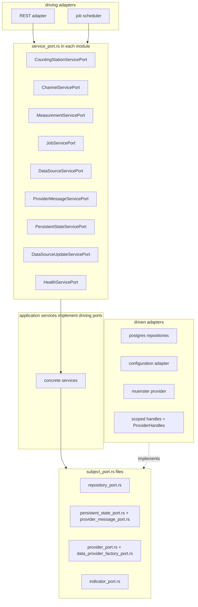

# 13 - Domain structure refactor plan

Status: implemented

## Problem

The adapter layer was structurally refactored in
[`12_adapter_refactor_plan.md`](12_adapter_refactor_plan.md); the domain layer
(`src/core/domain/`) was explicitly left as a follow-up. Today the domain mixes
several concerns in ways that make the **ports** hard to identify and
distinguish:

- **Ports are not distinguishable from models.** Port traits (repositories,
  stores, providers) live in the same modules as their entities, with no uniform
  naming that marks them as ports.
- **The driven/driving split is invisible.** All existing ports are **driven**
  (outbound) ports, but there are **zero driving (inbound) port traits**: the
  REST adapter ([`AppState`](src/adapter/driving/rest/handlers/mod.rs:43)) and
  the job scheduler ([`run_scheduler`](src/adapter/driving/job_scheduler.rs:19))
  depend on the concrete application service structs directly.
- **One port, `DataProviderFactory`, lives in the wrong layer** — it is a driven
  port but is defined in `src/core/application/data_provider_factory.rs` instead
  of the domain.
- **`data_source/provider.rs` is overloaded** (407 lines): the `DataProvider`
  port, five record types, the query/batch types, `ProviderError`, the two
  scoped-handle traits (`PersistentStateAccess`, `ProviderMessageSink`) **and**
  their concrete implementations (`ScopedPersistentState`,
  `ScopedProviderMessageSink`).
- **Implementations live inside the domain.** `ScopedPersistentState` and
  `ScopedProviderMessageSink` are concrete implementations (wrapping store
  ports), not ports — they belong on the driven-adapter side.
- **Dead code.** `src/core/domain/station/` is not registered in
  `domain/mod.rs`, has no `mod.rs`, and contains broken references (undefined
  `UUID`, undefined `Station`, undefined `DomainError`). It is superseded by
  `counting_stations` + `channels`. Likewise `measurements/provider.rs` and
  `application/station_import_service.rs` are unregistered placeholder files.
- **Small inconsistencies.** `#![allow(clippy::module_inception)]` is needed in
  `data_source/mod.rs` and `configuration/mod.rs` because a submodule shadows its
  parent (`data_source/data_source.rs`). `main.rs` carries a crate-wide
  `#![allow(dead_code)]` that masks real dead code. Repository `find_by_id`
  returns `Result<T>` for channels/counting-stations/measurements but
  `Result<Option<T>>` for data sources; `ConfigurationRepository` returns
  `ConfigError` while every other port returns `DomainError`.

This plan is a **pure structural refactor**: renames, moves, splits, import path
updates, dead-code removal, and the addition of driving port traits. No
behavioral change; business logic stays byte-for-byte identical. It mirrors the
approach and format of the adapter refactor (plan 12).

## Approach (decision)

The business-domain modules stay the single home for both models **and** their
ports — no central `domain/port/` directory and no `domain/service/` directory
are introduced. Ports are made identifiable and the driven/driving split visible
through one **uniform file-naming convention**:

**Every file that defines a port is named `<subject>_port.rs`.**

- **Driven (outbound) ports** — named by their role subject + `_port`:
  `repository_port.rs`, `provider_port.rs`, `persistent_state_port.rs`,
  `provider_message_port.rs`, `data_provider_factory_port.rs`,
  `indicator_port.rs`.
- **Driving (inbound) ports** — uniformly named `service_port.rs` (they define
  the service interface for that module's aggregate).

The role noun already conveys the direction (repositories/stores/providers are
outbound; service interfaces are inbound), and the `_port` suffix marks the file
as a port everywhere, uniformly. Non-port files (models, domain services like
`health/service.rs`, error types) do not carry the suffix. This is the same
naming convention in every module — nothing is "special-cased".

## Goals

- Make every **port** identifiable by a uniform `<subject>_port.rs` file name in
  its business module.
- Introduce **driving (inbound) port traits** (`service_port.rs`) so the driving
  adapters stop depending on concrete service structs, and the driven/driving
  distinction is real (not just documented).
- Move the two scoped-handle **implementations** (`ScopedPersistentState`,
  `ScopedProviderMessageSink`) into the driven adapter, where implementations
  belong, while keeping the core free of adapter imports (via two new factory
  ports).
- Move the misplaced `DataProviderFactory` port into the `data_source` domain
  module.
- Remove dead code.
- All existing tests keep passing with no logic edits.

## Current state

```text
src/core/domain/
├── mod.rs                       # pub mod channels; configuration; counting_stations;
│                                # data_source; error; health; jobs; measurements;
├── error.rs                     # DomainError
├── channels/
│   ├── mod.rs
│   ├── channel.rs               # Channel + value_objects            (model)
│   └── repository.rs            # ChannelRepository                  (driven port)
├── counting_stations/
│   ├── mod.rs
│   ├── counting_station.rs      # CountingStation + value_objects    (model)
│   └── repository.rs            # CountingStationRepository          (driven port)
├── measurements/
│   ├── mod.rs                   # measurement only (provider.rs NOT registered)
│   ├── measurement.rs           # Measurement + value_objects        (model)
│   ├── provider.rs              # DEAD placeholder (superseded, unregistered)
│   └── repository.rs            # MeasurementRepository              (driven port)
├── jobs/
│   ├── mod.rs
│   ├── job.rs                   # Job + JobStatus                    (model)
│   └── repository.rs            # JobRepository                      (driven port)
├── configuration/
│   ├── mod.rs                   # #![allow(clippy::module_inception)]
│   ├── configuration.rs         # Configuration + value_objects      (model)
│   ├── error.rs                 # ConfigError
│   └── repository.rs            # ConfigurationRepository            (driven port)
├── data_source/
│   ├── mod.rs                   # #![allow(clippy::module_inception)]
│   ├── data_source.rs           # DataSource + value_objects         (model)
│   ├── provider_message.rs      # ProviderMessage + severity (model)
│   │                            #   + ProviderMessageStore           (driven port)
│   ├── persistent_state.rs      # PersistentStateStore               (driven port)
│   ├── repository.rs            # DataSourceRepository               (driven port)
│   ├── provider.rs              # DataProvider + records + query/batch
│   │                            #   + ProviderError (driven port)
│   │                            #   + PersistentStateAccess, ProviderMessageSink (driven ports)
│   │                            #   + ScopedPersistentState, ScopedProviderMessageSink (IMPLS)
│   └── health_indicator.rs      # ProviderHealthIndicator (impl of ServiceHealthIndicator)
├── health/
│   ├── mod.rs                   # re-exports indicator + service
│   ├── indicator.rs             # HealthStatus, HealthComponent (model)
│   │                            #   + ServiceHealthIndicator          (driven port)
│   └── service.rs               # HealthService (domain service)
└── station/                     # DEAD: no mod.rs, unregistered, broken refs
    ├── station.rs               # (superseded by counting_stations + channels)
    ├── repository.rs
    └── provider.rs
```

### Port inventory

#### Driven (outbound) ports — implemented by the driven adapter

| Port (trait) | Current home | Target file | Implemented by |
|---|---|---|---|
| `ChannelRepository` | `channels/repository.rs` | `channels/repository_port.rs` | `PostgresChannelRepository` |
| `CountingStationRepository` | `counting_stations/repository.rs` | `counting_stations/repository_port.rs` | `PostgresCountingStationRepository` |
| `MeasurementRepository` | `measurements/repository.rs` | `measurements/repository_port.rs` | `PostgresMeasurementRepository` |
| `JobRepository` | `jobs/repository.rs` | `jobs/repository_port.rs` | `PostgresJobRepository` |
| `ConfigurationRepository` | `configuration/repository.rs` | `configuration/repository_port.rs` | `ConfigurationTomlAdapter` |
| `DataSourceRepository` | `data_source/repository.rs` | `data_source/repository_port.rs` | `PostgresDataSourceRepository` |
| `PersistentStateStore` | `data_source/persistent_state.rs` | `data_source/persistent_state_port.rs` | `PostgresPersistentStateRepository` |
| `ProviderMessageStore` | `data_source/provider_message.rs` | `data_source/provider_message_port.rs` | `PostgresProviderMessageRepository` |
| `DataProvider` | `data_source/provider.rs` | `data_source/provider_port.rs` | `MuensterGithubAdapter` |
| `PersistentStateAccess` | `data_source/provider.rs` | `data_source/provider_port.rs` | `ScopedPersistentState` (→ adapter) |
| `ProviderMessageSink` | `data_source/provider.rs` | `data_source/provider_port.rs` | `ScopedProviderMessageSink` (→ adapter) |
| `ServiceHealthIndicator` | `health/indicator.rs` | `health/indicator_port.rs` | `PostgresHealthCheck`, `ProviderHealthIndicator` |
| `DataProviderFactory` | `application/data_provider_factory.rs` (wrong layer) | `data_source/data_provider_factory_port.rs` | `DataProviderFactoryImpl` |
| `PersistentStateHandleFactory` | (NEW) | `data_source/persistent_state_port.rs` | `ProviderHandles` (→ adapter) |
| `ProviderMessageSinkFactory` | (NEW) | `data_source/provider_port.rs` | `ProviderHandles` (→ adapter) |

#### Driving (inbound) ports — implemented by the application services, consumed by the driving adapters (NEW)

| Port (trait) | Target file | Implemented by | Consumed by |
|---|---|---|---|
| `CountingStationServicePort` | `counting_stations/service_port.rs` | `CountingStationService` | REST counting-stations handlers |
| `ChannelServicePort` | `channels/service_port.rs` | `ChannelService` | REST channels handlers |
| `MeasurementServicePort` | `measurements/service_port.rs` | `MeasurementService` | REST measurements handlers |
| `JobServicePort` | `jobs/service_port.rs` | `JobService` | REST jobs handlers |
| `DataSourceServicePort` | `data_source/service_port.rs` | `DataSourceService` | REST data-sources handlers |
| `ProviderMessageServicePort` | `data_source/service_port.rs` | `ProviderMessageService` | REST provider-messages handler |
| `PersistentStateServicePort` | `data_source/service_port.rs` | `PersistentStateService` | REST persistent-state handlers |
| `DataSourceUpdateServicePort` | `data_source/service_port.rs` | `DataSourceUpdateService` | `job_scheduler::run_scheduler` |
| `HealthServicePort` | `health/service_port.rs` | `HealthService` | REST health handlers |

`StartupService` and `DataImportService` are called by the composition root
(`main.rs`) and by other application services respectively — not through a
driving adapter — so they stay concrete (no port). This is noted, not changed.

### Issues found during analysis

1. Dead code: `station/` module, `measurements/provider.rs`,
   `application/station_import_service.rs`.
2. Overloaded file: `data_source/provider.rs` (ports + records + two impls).
3. Misplaced port: `DataProviderFactory` in `application/`.
4. Implementations inside the domain: `ScopedPersistentState`,
   `ScopedProviderMessageSink`.
5. Misplaced health concern: `ProviderHealthIndicator` under `data_source/`.
6. No driving port traits: `AppState`/`RestApiAdapter` and `run_scheduler`
   depend on concrete service structs, so driven vs driving is not expressed.
7. `#![allow(clippy::module_inception)]` in `data_source/mod.rs` and
   `configuration/mod.rs`; crate-wide `#![allow(dead_code)]` in `main.rs`.
8. Inconsistencies (flagged, out of scope): `ConfigError` vs `DomainError`;
   repository `find_by_id` `Result<T>` vs `Result<Option<T>>`.

## Target state

Every file that defines a port is named `<subject>_port.rs`; non-port files are
unchanged. `data_source` and `health` are split so each port has its own
content-named `*_port.rs` file.

```text
src/core/domain/
├── mod.rs                       # registers aggregates + error; layer doc
├── error.rs                     # DomainError (unchanged)
├── channels/
│   ├── mod.rs
│   ├── channel.rs               # Channel + value_objects            (model, unchanged)
│   ├── repository_port.rs       # ChannelRepository                 (renamed from repository.rs)
│   └── service_port.rs          # ChannelServicePort                (NEW)
├── counting_stations/
│   ├── mod.rs
│   ├── counting_station.rs      # (model, unchanged)
│   ├── repository_port.rs       # CountingStationRepository         (renamed)
│   └── service_port.rs          # CountingStationServicePort        (NEW)
├── measurements/
│   ├── mod.rs                   # provider.rs deleted
│   ├── measurement.rs           # (model, unchanged)
│   ├── repository_port.rs       # MeasurementRepository             (renamed)
│   └── service_port.rs          # MeasurementServicePort            (NEW)
├── jobs/
│   ├── mod.rs
│   ├── job.rs                   # (model, unchanged)
│   ├── repository_port.rs       # JobRepository                     (renamed)
│   └── service_port.rs          # JobServicePort                    (NEW)
├── configuration/
│   ├── mod.rs
│   ├── configuration.rs         # (model, unchanged)
│   ├── error.rs                 # ConfigError (unchanged)
│   └── repository_port.rs       # ConfigurationRepository           (renamed)
├── data_source/
│   ├── mod.rs
│   ├── data_source.rs           # (model, unchanged)
│   ├── provider_message.rs      # ProviderMessage + severity         (model, unchanged)
│   ├── repository_port.rs       # DataSourceRepository              (renamed)
│   ├── persistent_state_port.rs # PersistentStateStore + PersistentStateHandleFactory
│   │                            #   (renamed + NEW factory port)
│   ├── provider_message_port.rs # ProviderMessageStore              (NEW, split from provider_message.rs)
│   ├── provider_port.rs         # DataProvider + records + query/batch + ProviderError
│   │                            #   + PersistentStateAccess + ProviderMessageSink
│   │                            #   + ProviderMessageSinkFactory (renamed, Scoped* impls removed)
│   ├── data_provider_factory_port.rs  # DataProviderFactory         (NEW, moved from application/)
│   └── service_port.rs          # DataSourceServicePort, ProviderMessageServicePort,
│                                #   PersistentStateServicePort, DataSourceUpdateServicePort (NEW)
├── health/
│   ├── mod.rs
│   ├── indicator.rs             # HealthStatus, HealthComponent      (model, unchanged)
│   ├── indicator_port.rs        # ServiceHealthIndicator            (NEW, split from indicator.rs)
│   ├── service.rs               # HealthService (domain service, unchanged)
│   ├── provider_health_indicator.rs  # ProviderHealthIndicator      (moved from data_source/)
│   └── service_port.rs          # HealthServicePort                 (NEW)
```



## Phase 1 - Green baseline

Scope: **no changes**.

1. Confirm `cargo build` succeeds.
2. Confirm `make check` (rustfmt + `clippy --all-targets -- -D warnings`) passes.
3. Confirm `make test-rest` and `make test` pass, so any later regression is
   attributable to this refactor.

Expected outcome: a known-green starting point.

## Phase 2 - Remove dead code

Scope: **deletion only**, no behavior change.

1. Delete `src/core/domain/station/` entirely (no `mod.rs`, not registered in
   `domain/mod.rs`, broken code, superseded by `counting_stations` + `channels`).
2. Delete `src/core/domain/measurements/provider.rs` (unregistered placeholder
   superseded by `data_source/provider.rs`).
3. Delete `src/core/application/station_import_service.rs` (unregistered
   placeholder superseded by `data_import_service.rs`).
4. Reassess `#![allow(dead_code)]` at the top of `src/main.rs`: attempt to remove
   it after cleanup; if it surfaces unrelated dead code that is out of scope,
   keep it and note it in the plan doc.

Expected outcome: no orphan/broken domain or application files remain.

## Phase 3 - Rename/split driven port files to the uniform `*_port.rs` convention

Scope: **renames + pure file splits**, no logic change.

1. Rename each single-port repository file to `*_port.rs` (with `git mv`):
   - `channels/repository.rs` → `channels/repository_port.rs`
   - `counting_stations/repository.rs` → `counting_stations/repository_port.rs`
   - `measurements/repository.rs` → `measurements/repository_port.rs`
   - `jobs/repository.rs` → `jobs/repository_port.rs`
   - `configuration/repository.rs` → `configuration/repository_port.rs`
   - `data_source/repository.rs` → `data_source/repository_port.rs`
2. `data_source`:
   - `persistent_state.rs` → `persistent_state_port.rs` (keeps `PersistentStateStore`;
     add `PersistentStateHandleFactory`).
   - Split `provider_message.rs`: the model + severity stay in
     `provider_message.rs`; `ProviderMessageStore` moves to
     `provider_message_port.rs`.
   - `provider.rs` → `provider_port.rs` (keeps `DataProvider`, `MeasurementQuery`,
     `MeasurementBatch`, the three record types, `ProviderError` + `From`
     conversions, `PersistentStateAccess`, `ProviderMessageSink`; add
     `ProviderMessageSinkFactory`; remove `ScopedPersistentState` +
     `ScopedProviderMessageSink`).
   - `data_provider_factory_port.rs` (NEW): `DataProviderFactory` trait moved from
     `src/core/application/data_provider_factory.rs` (delete that file; update
     `application/mod.rs` and all importers).
   - `health_indicator.rs` → move to `health/provider_health_indicator.rs`.
3. `health`:
   - Split `indicator.rs`: `HealthStatus` + `HealthComponent` stay; the
     `ServiceHealthIndicator` trait moves to `indicator_port.rs`.
   - Keep `service.rs` (`HealthService`).
   - Add `provider_health_indicator.rs` (moved from `data_source/`).
4. Update each aggregate `mod.rs` to declare the renamed/split submodules.

Expected outcome: every driven port file is named `<subject>_port.rs`; no port
trait lives in a non-`_port` file; no implementations remain in the domain's
provider file.

## Phase 4 - Create driving `service_port.rs` files in each module

Scope: **new trait files**, no logic change.

Create one `service_port.rs` per module with the driving (inbound) port traits;
each trait exposes exactly the public methods the driving adapter currently calls
on the concrete service, with the same signatures and return types:

- `channels/service_port.rs` — `ChannelServicePort`
- `counting_stations/service_port.rs` — `CountingStationServicePort`
- `measurements/service_port.rs` — `MeasurementServicePort`
- `jobs/service_port.rs` — `JobServicePort`
- `data_source/service_port.rs` — `DataSourceServicePort`,
  `ProviderMessageServicePort`, `PersistentStateServicePort`,
  `DataSourceUpdateServicePort` (exposes `run_if_due`)
- `health/service_port.rs` — `HealthServicePort` (exposes `check`)

Each file carries a module doc marking it as the driving (inbound) port for its
module and naming its implementer. Register each in its module's `mod.rs`.

## Phase 5 - Implement driving ports on the application services

Scope: **thin `impl` blocks**, no logic change.

1. In each application service file, add `impl XxxServicePort for XxxService`
   delegating to the existing public methods:
   `CountingStationService`, `ChannelService`, `MeasurementService`, `JobService`,
   `DataSourceService`, `ProviderMessageService`, `PersistentStateService`,
   `DataSourceUpdateService`.
2. `HealthService` implements `health::service_port::HealthServicePort`.

## Phase 6 - Rewire the driving adapters to the driving ports

Scope: **adapter signature changes**, no logic change.

1. `src/adapter/driving/rest/handlers/mod.rs` — `AppState` fields become
   `Arc<dyn XxxServicePort + Send + Sync>` (drop the concrete service imports;
   import the driving port traits).
2. `src/adapter/driving/rest/mod.rs` — `RestApiAdapter::new` parameter types
   become `Arc<dyn ...Port + Send + Sync>`.
3. `src/adapter/driving/job_scheduler.rs` — `run_scheduler(service: Arc<dyn
   DataSourceUpdateServicePort + Send + Sync>, ...)`.
4. `src/main.rs` — coerce the concrete service `Arc`s to the trait-object types
   (type annotations / `as` casts) when constructing `RestApiAdapter::new(...)`
   and calling `run_scheduler(...)`.
5. Update the REST test helpers (`tests/fixtures.rs`, `tests/mocks.rs`, each
   `tests/*.rs`) so `AppState` construction coerces the concrete services (which
   now implement the port traits) to the trait objects.

## Phase 7 - Move scoped-handle implementations into the driven adapter

Scope: **implementation move + wiring**, no logic change. This is the one phase
with ripple effects beyond `domain/` (it touches `application/` + `main.rs`),
because the scoped handles are constructed by `StartupService` today.

1. Create `src/adapter/driven/provider_handles.rs`:
   - `ScopedPersistentState` + its `impl PersistentStateAccess` (moved verbatim
     from `domain/data_source/provider.rs`).
   - `ScopedProviderMessageSink` + its `impl ProviderMessageSink` (moved
     verbatim).
   - A `ProviderHandles` struct holding `Arc<dyn PersistentStateStore + Send +
     Sync>` and `Arc<dyn ProviderMessageStore + Send + Sync>`, implementing both
     `PersistentStateHandleFactory` and `ProviderMessageSinkFactory` by
     constructing the scoped wrappers.
2. Register `pub mod provider_handles;` in `src/adapter/driven/mod.rs` (and
   re-export `ProviderHandles`).
3. Update `src/core/application/startup_service.rs`:
   - Replace the `persistent_state_store` / `provider_message_store` fields and
     constructor params with `persistent_state_handle_factory:
     Arc<dyn PersistentStateHandleFactory>` and `provider_message_sink_factory:
     Arc<dyn ProviderMessageSinkFactory>`.
   - In `run()`, replace the two inline constructions
     (`Arc::new(ScopedPersistentState::new(...))`,
     `Arc::new(ScopedProviderMessageSink::new(...))`) with
     `self.persistent_state_handle_factory.scoped(data_source_id)` and
     `self.provider_message_sink_factory.scoped(data_source_id)`.
4. Update `src/main.rs` wiring: construct
   `ProviderHandles::new(persistent_state_repo.clone(), provider_message_repo.clone())`
   and pass it to `StartupService::new`.
5. Update the `StartupService` tests to use in-memory factory fakes (or a small
   local `PersistentStateHandleFactory`/`ProviderMessageSinkFactory` helper) so
   the assertions about scoping to `data_source_id` are preserved.

## Phase 8 - Update all remaining imports

Scope: **mechanical import-path updates**, no logic change.

Update every reference from the old paths to the new paths across
`src/core/application/*`, `src/adapter/**`, `src/main.rs` and all test/mock/fixture
files:

- `domain::<agg>::repository::X` → `domain::<agg>::repository_port::X`
- `domain::data_source::persistent_state::PersistentStateStore` /
  `::PersistentStateHandleFactory` → `domain::data_source::persistent_state_port::{...}`
- `domain::data_source::provider_message::ProviderMessageStore` →
  `domain::data_source::provider_message_port::ProviderMessageStore`
- `domain::data_source::provider::{...}` (records/query/batch/error/access/sink)
  → `domain::data_source::provider_port::{...}`
- `domain::data_source::provider::{ScopedPersistentState, ScopedProviderMessageSink}`
  → adapter (`adapter::driven::provider_handles::...`, only used by startup)
- `domain::data_source::health_indicator::ProviderHealthIndicator` →
  `domain::health::provider_health_indicator::ProviderHealthIndicator`
- `domain::health::ServiceHealthIndicator` →
  `domain::health::indicator_port::ServiceHealthIndicator`
- `application::data_provider_factory::DataProviderFactory` →
  `domain::data_source::data_provider_factory_port::DataProviderFactory`
- Driving adapters switch from concrete service imports to the
  `domain::<agg>::service_port::*` traits.

Entity/model paths are unchanged (`domain::channels::channel::Channel`,
`domain::data_source::data_source::DataSource`, `domain::health::HealthStatus`,
`domain::health::service::HealthService`, ...). Rely on `cargo build` to catch
every missed site.

## Phase 9 - Consistency cleanup

Scope: **cosmetic**, no logic change.

1. `#![allow(clippy::module_inception)]` in `data_source/mod.rs` and
   `configuration/mod.rs` is **kept** — the nested-module style (a module
   containing a submodule of the same name, e.g. `data_source/data_source.rs`)
   is inherent to the chosen layout, so the allows remain necessary.
2. Re-run clippy; confirm no dead modules remain and no new warnings appear.

## Phase 10 - Verification

- `make check` — rustfmt + `clippy --all-targets -- -D warnings` (must pass with
  no warnings).
- `make test-rest` — REST endpoint tests (in-memory mocks, no Docker).
- `make test` — full suite incl. Postgres repository tests (Postgres test
  container via Docker) and the Münster adapter unit tests.
- Confirm no logic diff: `git diff` should only show deleted dead files, renamed
  files, split files, new `*_port.rs` files, import-path changes, driving-port
  trait impls + adapter signature changes, and the `StartupService`
  handle-factory wiring. Zero business-logic edits.

## Phase 11 - Documentation

1. Mark this file's Status to `implemented` on completion.
2. Update `plans/README.md`: add the plan to the completed table and the
   dependency graph.

## Out of scope (future plans)

- **Error-type unification**: merging `ConfigError` into `DomainError` and
  standardizing repository `find_by_id` `Result<T>` vs `Result<Option<T>>`
  (signature-only but touches call sites).
- **Cargo workspace split** into separate crates (`core` vs `adapter`) — the
  README already flags this as the recommended path; this refactor is a
  compatible prerequisite.
- **Driving ports for `StartupService` / `DataImportService`**: they are invoked
  by the composition root and by other application services, not by a driving
  adapter; kept concrete by design.
- Removing `#![allow(dead_code)]` from `main.rs` if it surfaces out-of-scope dead
  code.

## Acceptance criteria

- Every port trait lives in a file named `<subject>_port.rs` — driven ports use
  role subjects (`repository_port.rs`, `provider_port.rs`,
  `persistent_state_port.rs`, `provider_message_port.rs`,
  `data_provider_factory_port.rs`, `indicator_port.rs`) and driving ports use
  `service_port.rs` — uniformly across all modules. No central `domain/port/` or
  `domain/service/` directories are introduced; no port trait lives in a
  non-`_port` file.
- `data_source/provider_port.rs` no longer contains the `Scoped*`
  implementations; `DataProviderFactory` lives in
  `data_source/data_provider_factory_port.rs`; the handle-factory ports exist in
  `persistent_state_port.rs` / `provider_port.rs`.
- `ProviderHealthIndicator` lives in `health/provider_health_indicator.rs`.
- The driving adapters (`AppState`/`RestApiAdapter`, `run_scheduler`) depend on
  `domain::<agg>::service_port` traits, not concrete service structs.
- `ScopedPersistentState` and `ScopedProviderMessageSink` live in
  `adapter/driven/provider_handles.rs`; `StartupService` obtains scoped handles
  through the two factory ports; `main.rs` wires `ProviderHandles`.
- Dead code (`station/`, `measurements/provider.rs`,
  `application/station_import_service.rs`) is deleted.
- `make check` and `make test` pass; the diff contains deletions + renames +
  splits + new `*_port.rs` files + path updates + the handle-factory wiring only
  (zero logic change).
