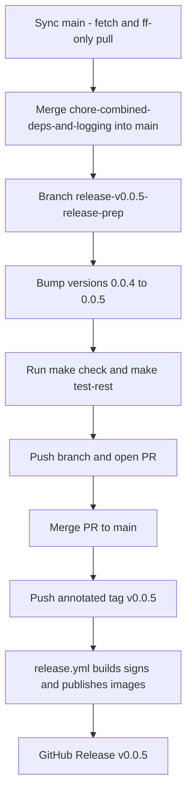

# 148 - Release v0.0.5 to GitHub and Docker Hub

Status: in progress

## Problem

The work that landed since `v0.0.4` has not yet been released. Cut `0.0.5` so
the published Docker images and GitHub Release cover that delta.

## Current git state (verified from the working tree)

- `main` fast-forwarded to `origin/main` = `308332f` — `v0.0.4` is tagged and
  released, and the whole `v0.0.5` delta is **already merged into `main`** (the
  `chore/combined-deps-and-logging` remote branch was merged via PR and
  deleted).
- `release/v0.0.5-release-prep` was branched from that merged `main`.

## Delta (v0.0.4 -> `chore/combined-deps-and-logging` tip `ece24ab`)

The following work is on `chore/combined-deps-and-logging` and must be merged to
`main` before cutting `v0.0.5`:

- [plan 139](139_timestamped_logging_and_update_semantics_plan.md) — timestamped
  `tracing` logs (RFC 3339 UTC), provider failures isolated from the aggregate
  "Data source update" job, and the Münster archive-fetch age bound.
- [plan 141](141_frontend_dependency_upgrade_plan.md) — frontend dependency
  bump (nine packages) with a regenerated lockfile.
- [plan 142](142_backend_dependency_and_docker_image_bump_plan.md) — backend
  dependency bump (`arrow`/`parquet` 60, `utoipa` 6, `utoipa-swagger-ui` 10) and
  refreshed digest-pinned Docker base images.
- [plan 143](143_combined_dependency_and_logging_branch_plan.md) — the combined
  dependency + logging branch reconciliation.
- [plan 144](144_ci_cargo_llvm_cov_install_fix_plan.md) — CI fix: pass
  `tool: cargo-llvm-cov` to the SHA-pinned `taiki-e/install-action` step.
- [plan 145](145_top_files_coverage_plan.md) — coverage top-up for the four
  backend files with the most missed lines.
- [plan 146](146_overdue_update_not_scheduled_plan.md) — overdue data-source
  update diagnosis plus a startup `WARN` when scheduled jobs are disabled.
- [plan 147](147_extract_timeframe_settings_controls_plan.md) — extract the
  shared `TimeframeSettingsControls` component (Sonar duplication fix).

The release infrastructure from
[plan 119](119_release_v0.0.1_plan.md) (Apache-2.0 license, Docker Hub image
names, keyless cosign signing, GitHub Release) is already in place and is
**version-agnostic**: [`release.yml`](../.github/workflows/release.yml) derives
`0.0.5` + `latest` from the pushed `v0.0.5` tag via `docker/metadata-action`
(`type=semver,pattern={{version}}`). Only the version string and the pinned
image tags need bumping.

## Approach

Follow the exact `v0.0.1` .. `v0.0.4` release flow
([plan 119](119_release_v0.0.1_plan.md),
[plan 138](138_release_v0.0.4_plan.md)): sync `main`, merge the delta onto
`main`, prepare on a `release/v0.0.5-release-prep` branch, merge to `main` via
PR, then push the annotated tag.

### 1. Sync `main` (owner reminder: pull main first)

- `git fetch origin --prune`
- `git checkout main`
- `git pull --ff-only` (fast-forwards local `main` to the latest `origin/main`)

### 2. Delta already on `main`

The `v0.0.5` delta (`chore/combined-deps-and-logging`) was already merged into
`main` via PR — `main` fast-forwarded cleanly to `308332f` on the sync above, so
no separate merge step is required.

### 3. Branch

- `git checkout -b release/v0.0.5-release-prep` (from the merged `main`)

### 4. Version bump `0.0.4` -> `0.0.5`

- [`backend/Cargo.toml`](../backend/Cargo.toml:3) — `version = "0.0.5"`.
- [`backend/Cargo.lock`](../backend/Cargo.lock:481) — the `[[package]] name =
  "bike_counter"` entry `version = "0.0.5"` (regenerated by `cargo check`, or
  edited directly; only the top-level `bike_counter` package, never any
  dependency entry).
- [`frontend/package.json`](../frontend/package.json:4) — `"version": "0.0.5"`.
- [`frontend/package-lock.json`](../frontend/package-lock.json:3) and
  [`frontend/package-lock.json`](../frontend/package-lock.json:9) — the two
  top-level `version` fields (`0.0.5`); never touch `node_modules/*` entries.
- [`docker-compose.yml`](../docker-compose.yml:29) — backend image
  `xy8000/bike-counter-backend:0.0.5`.
- [`docker-compose.yml`](../docker-compose.yml:103) — frontend image
  `xy8000/bike-counter-frontend:0.0.5`.
- [`README.md`](../README.md:84) and [`README.md`](../README.md:103) — prose
  references to the pinned image names and release tags.
- [`.github/workflows/release.yml`](../.github/workflows/release.yml:9) —
  refresh the `0.0.4` examples in the doc comments (cosmetic; the workflow
  logic is untouched).

### 5. Gates

- `make check` green (fmt + clippy + prettier + cargo audit).
- `make test-rest` green.
- The full `make test` / `make coverage` / `make test-playwright` suites run in
  CI on the PR (only version strings change, so no logic is affected).

### 6. Cut the release (owner actions)

- Push the branch and open/merge the PR to `main`.
- From the merged `main`:
  `git tag -a v0.0.5 -m "Bike-Counter 0.0.5"` then `git push origin v0.0.5`.
- The push triggers [`release.yml`](../.github/workflows/release.yml), which
  builds both multi-arch images, pushes `xy8000/bike-counter-backend:0.0.5`
  / `:latest` and `xy8000/bike-counter-frontend:0.0.5` / `:latest`,
  cosign-signs them, and creates the GitHub Release.

## Notes

- A separate branch `feat/nginx-access-log-default-off` (commit `13c3898`) was
  created but is **not** part of the `v0.0.5` delta — it was never merged into
  `chore/combined-deps-and-logging` and has no plan file. It stays out of scope
  unless the owner says otherwise.

## Progress (local prep done, release not yet cut)

The version bump, image tags, docs and this plan file are committed on
`release/v0.0.5-release-prep`; `make check` and `make test-rest` (128 passed) are
green. Apart from this plan's version strings / image tags, no application logic
changed — the delta consists of the tested work already merged to `main` (plans
139, 141–147).

Remaining **owner actions** (require GitHub credentials not available in this
environment):

1. Push the branch and open/merge the PR to `main`:
   `git push -u origin release/v0.0.5-release-prep`.
2. From the merged `main`, cut the release:
   `git tag -a v0.0.5 -m "Bike-Counter 0.0.5"` then `git push origin v0.0.5` —
   this triggers `.github/workflows/release.yml`.
3. Verify the workflow is green, the GitHub Release `v0.0.5` exists, and
   Docker Hub shows `xy8000/bike-counter-backend:0.0.5` / `:latest` and
   `xy8000/bike-counter-frontend:0.0.5` / `:latest`.

## Definition of done

- [x] Plan file in [`plans/`](.) updated
- [x] Local `main` fast-forwarded to `origin/main` (`308332f`, pull main first)
- [x] `chore/combined-deps-and-logging` merged into `main` (already done via PR)
- [x] `release/v0.0.5-release-prep` branch created
- [x] Version bumped to `0.0.5` in `Cargo.toml`, `Cargo.lock`, `package.json`, `package-lock.json`
- [x] `docker-compose.yml` image tags and [`README.md`](../README.md) prose updated to `0.0.5`
- [x] `make check` green
- [x] `make test-rest` green (128 passed)
- [ ] PR merged to `main` — **owner action**
- [ ] Annotated tag `v0.0.5` pushed and the release workflow completed green — **owner action**
- [ ] Docker Hub shows `xy8000/bike-counter-backend:0.0.5` / `:latest` and `xy8000/bike-counter-frontend:0.0.5` / `:latest` — **owner action**
- [ ] GitHub Release `v0.0.5` exists with release notes — **owner action**
