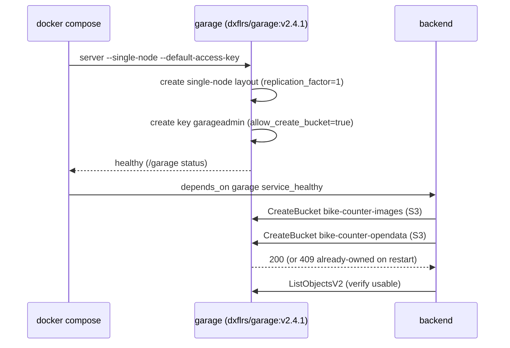

# 149 - Replace MinIO with Garage as the S3-compatible object storage

Status: implemented

## Context

The stack stores counting-station image binaries and the immutable OpenData
files in an S3-compatible object store. Today that store is **MinIO**:

- [`docker-compose.yml`](../docker-compose.yml:64) runs `minio/minio:latest` on
  the private `asset_network` (port 9000, `minioadmin/minioadmin`) plus a
  one-shot `minio-init` container that uses `mc` to create the two buckets
  (`bike-counter-images`, `bike-counter-opendata`).
- The backend talks S3 through `rust-s3` in
  [`MinioAssetStorage`](../backend/src/adapter/driven/minio_asset_storage.rs:32)
  and only *verifies* the buckets (`ensure_bucket` lists them), because the
  author assumed `rust-s3` had no bucket-creation call.
- Endpoints/credentials/region are literals in
  [`config.toml`](../config.toml:17), [`config.toml.example`](../config.toml.example:48),
  the config defaults in
  [`configuration.rs`](../backend/src/core/domain/configuration/configuration.rs:140)
  and [`configuration_toml_adapter.rs`](../backend/src/adapter/driven/configuration_toml_adapter.rs:122),
  the two orchestrator scripts, and many unit-test fixtures.

We replace MinIO with [Garage](https://garagehq.deuxfleurs.fr) — a lightweight,
self-hosted, S3-compatible object store written in Rust — and rename everything
accordingly. The `rust-s3` client and the `AssetStorage` port stay; only the
server, the configuration literals, the adapter name and the bucket bootstrap
change.

## Design decisions

1. **Keep the `rust-s3` client.** Garage speaks the S3 API, so the transport is
   unchanged (`Region::Custom` + path-style addressing, already used).

2. **Single `garage` service, no init container.** Garage ≥ v2.3 can bootstrap
   itself: `garage server --single-node --default-access-key`
   - `--single-node` auto-creates the cluster layout (requires
     `replication_factor = 1`) and is idempotent on restarts (it only acts when
     the layout version is 0);
   - `--default-access-key` creates the S3 key from
     `GARAGE_DEFAULT_ACCESS_KEY` / `GARAGE_DEFAULT_SECRET_KEY` **with
     `allow_create_bucket = true`**.
   The Garage image is `FROM scratch` (no shell, no curl), so the old `mc`-style
   init container is not possible anyway — this replaces it cleanly.

3. **The backend creates the buckets.** `rust-s3` 0.37.2 *does* expose
   `Bucket::create_with_path_style(...)`. Garage's S3 `CreateBucket` grants the
   creating key `ALL_PERMISSIONS` and a local bucket alias, and returns
   `409 BucketAlreadyOwnedByYou` when the bucket already exists. So
   `ensure_bucket` now performs a real, idempotent create (tolerating the 409)
   and then lists the bucket to fail fast with a clear message. This finally
   matches the trait's own contract ("Creates the configured bucket if it does
   not exist yet (idempotent)") and removes the need for any bucket init
   container.

4. **Credentials.** Garage requires a secret key of **≥ 16 characters**
   (`Key::import` validation), so `minioadmin` cannot be reused as the secret.
   The dev credentials become:
   - access key: `garageadmin`
   - secret key: `garageadmin-secret` (18 chars)

5. **Region must be `garage`.** Garage signs SigV4 for its configured
   `s3_region` (default `garage`) and rejects a `CreateBucket` whose
   `LocationConstraint` differs. `rust-s3` sends the configured region as the
   location constraint, so every `region` literal switches from `us-east-1` to
   `garage`.

6. **Ports / volumes / network.**
   - S3 API `3900`, RPC `3901` (admin `3903` unused; left unconfigured).
   - Two named volumes `garage_meta` (`metadata_dir`) and `garage_data`
     (`data_dir`) replace the single `minio_data`.
   - Garage stays on the private `internal: true` `asset_network`, reachable
     only by the backend; no host port is published.

7. **Committed `garage/garage.toml`.** A dev-only config (fixed `rpc_secret`,
   paths `/var/lib/garage/{meta,data}`, `replication_factor = 1`,
   `[s3_api] s3_region = "garage"`) bind-mounted read-only into the container.
   The same file serves dev and e2e (only the volumes differ via the override).

8. **Do not touch applied migrations.** [`V12__add_assets.sql`](../backend/migrations/V12__add_assets.sql:1)
   mentions MinIO in a comment, but Refinery checksums applied migrations —
   editing it would break every existing database. Historical plan documents
   are likewise left as-is.

## Bucket bootstrap flow

## Changes

### New
- `garage/garage.toml` — committed dev config (paths, `replication_factor = 1`,
  `rpc_public_addr = "garage:3901"`, fixed dev `rpc_secret`, `[s3_api]`
  `api_bind_addr = "[::]:3900"` + `s3_region = "garage"`).

### Docker Compose
- [`docker-compose.yml`](../docker-compose.yml:1): replace the `minio` +
  `minio-init` services with one `garage` service (pinned
  `dxflrs/garage:v2.4.1`, `command: ["/garage","server","--single-node","--default-access-key"]`,
  the two credential env vars, the `garage.toml` + two volume mounts, an exec-form
  CLI healthcheck `["CMD","/garage","-c","/etc/garage.toml","status"]`).
  Backend `depends_on` → `garage: service_healthy`. Update the `asset_network`
  comment and swap the `minio_data` volume for `garage_meta`/`garage_data`.
  Set `RUST_LOG=garage=warn`: the image defaults to `garage=info`, which logs one
  info line per admin-API request and therefore spat out a line every 5 s from
  the healthcheck probe.
- [`frontend/e2e/docker-compose.e2e.yml`](../frontend/e2e/docker-compose.e2e.yml:29):
  move the isolated volumes onto the `garage` service
  (`garage_meta_e2e`/`garage_data_e2e`), declare them and `!reset` the dev
  `garage_meta`/`garage_data` out of the merged config (mirrors the existing
  Postgres isolation).

### Backend
- Rename `backend/src/adapter/driven/minio_asset_storage.rs` →
  `s3_asset_storage.rs`; rename the struct `MinioAssetStorage` → `S3AssetStorage`;
  fix the module in
  [`adapter/driven/mod.rs`](../backend/src/adapter/driven/mod.rs:8).
- [`s3_asset_storage.rs`](../backend/src/adapter/driven/s3_asset_storage.rs:64):
  implement real, idempotent bucket creation in `ensure_bucket` via
  `Bucket::create_with_path_style(...)` (tolerate HTTP 2xx and 409), then verify
  with a list; store the name/region/credentials for the associated create call.
  Update the module/error doc comments (MinIO → Garage/S3).
- [`main.rs`](../backend/src/main.rs:234): import/path + `S3AssetStorage`, and
  the MinIO→Garage comments / panic messages.
- Config defaults + docs:
  [`configuration.rs`](../backend/src/core/domain/configuration/configuration.rs:140)
  and
  [`configuration_toml_adapter.rs`](../backend/src/adapter/driven/configuration_toml_adapter.rs:122)
  (`http://garage:3900`, `garageadmin`, `garageadmin-secret`, region `garage`;
  default opendata endpoint/access/secret fns).
- Doc comments referencing MinIO:
  [`asset_storage_port.rs`](../backend/src/core/domain/assets/asset_storage_port.rs:1),
  [`assets/mod.rs`](../backend/src/core/domain/assets/mod.rs:1),
  [`asset_cleanup_service.rs`](../backend/src/core/application/asset_cleanup_service.rs:1),
  [`bff/dto.rs`](../backend/src/adapter/driving/bff/dto.rs:48),
  [`bff/handlers.rs`](../backend/src/adapter/driving/bff/handlers.rs:1132),
  [`rest/tests/mocks.rs`](../backend/src/adapter/driving/rest/tests/mocks.rs:937).
- Test fixtures: every `http://minio:9000` → `http://garage:3900`,
  `minioadmin`(access) → `garageadmin`, `minioadmin`(secret) →
  `garageadmin-secret`, `us-east-1` → `garage`, and the config-parse
  assertions in `configuration.rs` / `configuration_toml_adapter.rs`.

### Config / scripts / docs
- [`config.toml`](../config.toml:17) and
  [`config.toml.example`](../config.toml.example:46): endpoint, credentials,
  region and the surrounding comments (`[asset_storage]` + `[opendata_storage]`).
- [`scripts/docker-compose-test.sh`](../scripts/docker-compose-test.sh:79) and
  [`scripts/e2e-playwright.sh`](../scripts/e2e-playwright.sh:107): the temp
  `[asset_storage]` blocks; plus the volume-name comments in
  [`e2e-playwright.sh`](../scripts/e2e-playwright.sh:18) and
  [`dump-e2e-fixture.sh`](../scripts/dump-e2e-fixture.sh:9).
- [`README.md`](../README.md:148), [`CONTRIBUTING.md`](../CONTRIBUTING.md:17),
  [`agents.md`](../agents.md:149) (e2e volume names) and
  [`backend/.cargo/audit.toml`](../backend/.cargo/audit.toml:10).
- [`frontend/e2e/e2e-seed.sql`](../frontend/e2e/e2e-seed.sql:687) comments.

## Risks & notes

- **Gate needs Docker.** `make test` / `make coverage` / `make test-playwright`
  spin up containers; the new `garage` service must boot and provision its
  layout before the backend starts (gated by `service_healthy` + a small
  create-retry in `ensure_bucket`).
- **`garage status` as healthcheck** is a liveness probe (RPC reachable), not a
  deep readiness check; a short retry loop in `ensure_bucket` absorbs the
  remaining startup race.
- **Secret length** is a hard Garage constraint — `garageadmin-secret` (≥16),
  not `minioadmin`.
- **Region coupling**: `[asset_storage].region` / `[opendata_storage].region`
  must equal Garage's `[s3_api].s3_region` (`garage`).
- The pinned Garage tag (`v2.4.1`) must exist on Docker Hub; bump deliberately.

## Definition of done

- [x] `garage/garage.toml` added.
- [x] `docker-compose.yml` runs Garage (no MinIO / `mc` init) and the backend
      depends on it being healthy.
- [x] e2e override isolates `garage_meta_e2e`/`garage_data_e2e` and resets the
      dev volumes.
- [x] Backend adapter renamed to `S3AssetStorage` (`s3_asset_storage.rs`) and
      `ensure_bucket` really creates the buckets (idempotent).
- [x] All config defaults, scripts, tests and docs use the Garage
      endpoint/credentials/region; no `minio` references remain in
      source/config/scripts (applied migrations and historical plans excepted).
- [x] `cargo fmt --check` + `cargo clippy --all-targets -- -D warnings` green.
- [x] `make check` green (fmt + clippy + frontend Prettier + `cargo audit`).
- [x] `make test-rest` green (128 tests).
- [x] `make test` green (809 tests, incl. the Docker Postgres testcontainer).
- [x] `docker compose config` valid for the base file **and** the e2e override
      (only the `*_e2e` volumes remain).
- [x] `README.md` / `CONTRIBUTING.md` / `agents.md` updated.

## Verification notes

- **Garage bootstrap proven at runtime.** A throwaway `dxflrs/garage:v2.4.1`
  container with `garage/garage.toml` + the credential env vars created the
  single-node layout and the `garageadmin` key (`Can create buckets: true`), and
  the healthcheck command (`/garage -c /etc/garage.toml status`) exited `0`.
- **Backend creates both buckets against Garage.** A real `docker compose up`
  run logged, from the renamed adapter itself:
  `created object storage bucket 'bike-counter-images'`,
  `created object storage bucket 'bike-counter-opendata'`, immediately followed
  by `Starting Bike Counter API server on http://0.0.0.0:8080` — i.e. the S3
  `CreateBucket` path (region `garage`, `allow_create_bucket` key) works.
- **`make test-e2e` is blocked by an unrelated, pre-existing issue.** The
  backend's mandatory tiles build downloads the pinned
  `https://build.protomaps.com/20260829.pmtiles`, which returns **HTTP 404** in
  this environment, so the tiles job fails and `/health/ready` never turns
  green. This is independent of object storage (the buckets were created and the
  asset-cleanup/opendata-export jobs ran to completion before it). The same
  failure occurs on the baseline (MinIO) stack, and it is why the Playwright e2e
  pins `scheduled_jobs_enabled = false` and a committed tiles archive.
- `make coverage` and `make test-playwright` mirror the same Docker/tiles
  environment dependency and were left to CI; the storage change is fully
  covered by `make test` + `make check` here.

## Follow-ups (out of scope)

- The pinned Protomaps `protomaps_build_url` (a future-dated build) should be
  refreshed independently — it currently 404s.
