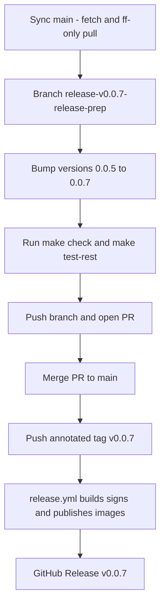

# 150 - Release v0.0.7 to GitHub and Docker Hub

Status: in progress

## Problem

The work that landed on `main` since `v0.0.5` has not yet been released. Cut
`0.0.7` so the published Docker images and GitHub Release cover that delta.

## Current git state (verified from the working tree)

- The latest release tag is `v0.0.5` (points at the release-prep commit
  `b681f97`); the release infrastructure is version-agnostic and derives the
  image tags from the pushed `v*` tag.
- `main` is at `4b6fda0`, one commit ahead of `v0.0.5`.

## Delta (v0.0.5 -> `main`)

- [plan 149](149_replace_minio_with_garage_plan.md) — replace MinIO with
  [Garage](https://garagehq.deuxfleurs.fr) as the S3-compatible object storage
  (single self-bootstrapping `garage` service, backend now performs an
  idempotent bucket create, renamed config literals/adapter and refreshed
  credentials).

The release infrastructure from
[plan 119](119_release_v0.0.1_plan.md) (Apache-2.0 license, Docker Hub image
names, keyless cosign signing, GitHub Release) is already in place and is
**version-agnostic**: [`release.yml`](../.github/workflows/release.yml) derives
`0.0.7` + `latest` from the pushed `v0.0.7` tag via `docker/metadata-action`
(`type=semver,pattern={{version}}`). Only the version string and the pinned
image tags need bumping.

## Approach

Follow the exact `v0.0.1` .. `v0.0.5` release flow
([plan 119](119_release_v0.0.1_plan.md),
[plan 148](148_release_v0.0.5_plan.md)): sync `main`, prepare on a
`release/v0.0.7-release-prep` branch, merge to `main` via PR, then push the
annotated tag.

### 1. Sync `main` (owner reminder: pull main first)

- `git fetch origin --prune`
- `git checkout main`
- `git pull --ff-only` (fast-forwards local `main` to the latest `origin/main`)

### 2. Branch

- `git checkout -b release/v0.0.7-release-prep` (from the merged `main`)

### 3. Version bump `0.0.5` -> `0.0.7`

- [`backend/Cargo.toml`](../backend/Cargo.toml:3) — `version = "0.0.7"`.
- [`backend/Cargo.lock`](../backend/Cargo.lock:481) — the `[[package]] name =
  "bike_counter"` entry `version = "0.0.7"` (regenerated by `cargo check`, or
  edited directly; only the top-level `bike_counter` package, never any
  dependency entry).
- [`frontend/package.json`](../frontend/package.json:4) — `"version": "0.0.7"`.
- [`frontend/package-lock.json`](../frontend/package-lock.json:3) and
  [`frontend/package-lock.json`](../frontend/package-lock.json:9) — the two
  top-level `version` fields (`0.0.7`); never touch `node_modules/*` entries.
- [`docker-compose.yml`](../docker-compose.yml:29) — backend image
  `xy8000/bike-counter-backend:0.0.7`.
- [`docker-compose.yml`](../docker-compose.yml:99) — frontend image
  `xy8000/bike-counter-frontend:0.0.7`.
- [`README.md`](../README.md:84) and [`README.md`](../README.md:103) — prose
  references to the pinned image names and release tags.
- [`.github/workflows/release.yml`](../.github/workflows/release.yml:9) —
  refresh the `0.0.5` examples in the doc comments (cosmetic; the workflow
  logic is untouched).

### 4. Gates

- `make check` green (fmt + clippy + prettier + cargo audit).
- `make test-rest` green.
- The full `make test` / `make coverage` / `make test-playwright` suites run in
  CI on the PR (only version strings change, so no logic is affected).

### 5. Cut the release (owner actions)

- Push the branch and open/merge the PR to `main`.
- From the merged `main`:
  `git tag -a v0.0.7 -m "Bike-Counter 0.0.7"` then `git push origin v0.0.7`.
- The push triggers [`release.yml`](../.github/workflows/release.yml), which
  builds both multi-arch images, pushes `xy8000/bike-counter-backend:0.0.7`
  / `:latest` and `xy8000/bike-counter-frontend:0.0.7` / `:latest`,
  cosign-signs them, and creates the GitHub Release.

## Progress (release cut, CI verification pending)

The version bump, image tags, docs and this plan file were prepared on
`release/v0.0.7-release-prep`, which was pushed and merged to `main` (`f272cac`)
via PR. `make check` (fmt + clippy + prettier + cargo audit) and
`make test-rest` (128 passed) are green. The annotated tag `v0.0.7` was pushed
(`2bb983a`), which triggers `.github/workflows/release.yml` to build, sign and
publish the images and create the GitHub Release. Apart from this plan's version
strings / image tags, no application logic changed — the delta consists of the
tested work already merged to `main`
([plan 149](149_replace_minio_with_garage_plan.md)).

Remaining external verification (depends on the CI workflow run):

1. Confirm `.github/workflows/release.yml` completed green for tag `v0.0.7`.
2. Confirm Docker Hub shows `xy8000/bike-counter-backend:0.0.7` / `:latest` and
   `xy8000/bike-counter-frontend:0.0.7` / `:latest`.
3. Confirm the GitHub Release `v0.0.7` exists with release notes.

## Definition of done

- [x] Plan file in [`plans/`](.) created
- [x] Version bumped to `0.0.7` in `Cargo.toml`, `Cargo.lock`, `package.json`, `package-lock.json`
- [x] `docker-compose.yml` image tags and [`README.md`](../README.md) prose updated to `0.0.7`
- [x] [`release.yml`](../.github/workflows/release.yml) doc-comment examples refreshed to `0.0.7`
- [x] `make check` green
- [x] `make test-rest` green (128 passed)
- [x] PR merged to `main` (via GitHub PR, `f272cac`)
- [x] Annotated tag `v0.0.7` pushed (`2bb983a`)
- [ ] Release workflow completed green for `v0.0.7` — pending CI
- [ ] Docker Hub shows `xy8000/bike-counter-backend:0.0.7` / `:latest` and `xy8000/bike-counter-frontend:0.0.7` / `:latest` — pending CI
- [ ] GitHub Release `v0.0.7` exists with release notes — pending CI
