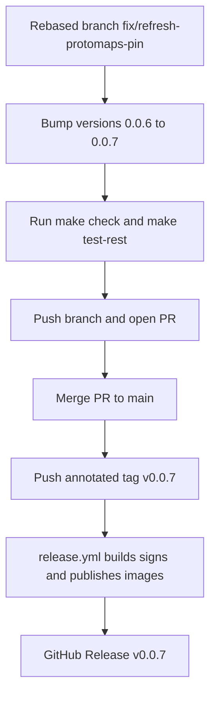

# 154 - Release v0.0.7 to GitHub and Docker Hub

Status: in progress

## Problem

The work that landed on `main` since `v0.0.6` — plus the rebased
`fix/refresh-protomaps-pin` branch on top of it — has not been released. The
next version after the released `v0.0.6` is `v0.0.7`, so the release is prepared
for `v0.0.7`.

## Current git state (verified from the working tree)

- The latest release tag is `v0.0.6` (points at
  `463e5c1` — `docs: record Playwright e2e gate in plan 151`).
- `main` is at `0d0e8dd` (`fix: normalise duplicate station names in the
  persisted Eco-Counter index` — plan 152)
- The working branch `fix/refresh-protomaps-pin` was **rebased onto `main`**
  (`main` is an ancestor of `HEAD`) and adds the four plan-153 commits on top.
- `git log v0.0.6..HEAD` therefore contains the plan-152 and plan-153 work; the
  release bumps the version strings from the current `0.0.6` to `0.0.7`.
- The stale `release/v0.0.7-release-prep` branch from the earlier, rolled-back
  `0.0.7` attempt (pre-`v0.0.6`) is **not** an ancestor of `HEAD` and is
  superseded by this plan.

## Delta (v0.0.6 -> `HEAD`)

- [plan 152](152_eco_counter_web_html_flight_payload_plan.md) — Eco-Counter web
  adapter: parse the flight payload from the inlined HTML document instead of the
  now-307/404 `RSC: 1` route (Hessen Mobil / Düsseldorf / Köln imports work
  again; duplicate station names disambiguated and normalised).
- [plan 153](153_refresh_protomaps_pin_plan.md) — fix the failing `tiles_update`
  job: self-healing Protomaps basemap pin that resolves the newest catalog build
  (the `latest` token is now the default), plus the `pmtiles` CLI stderr is
  surfaced in the job error.

The release infrastructure from
[plan 119](119_release_v0.0.1_plan.md) (Apache-2.0 license, Docker Hub image
names, keyless cosign signing, GitHub Release) is already in place and is
**version-agnostic**: [`release.yml`](../.github/workflows/release.yml) derives
`0.0.7` + `latest` from the pushed `v0.0.7` tag via `docker/metadata-action`
(`type=semver,pattern={{version}}`). Only the version string and the pinned
image tags need bumping.

## Approach

Follow the exact `v0.0.1` .. `v0.0.6` release flow
([plan 119](119_release_v0.0.1_plan.md),
[plan 148](148_release_v0.0.5_plan.md),
[plan 150](150_release_v0.0.6_plan.md)). As in
[plan 150](150_release_v0.0.6_plan.md)/[151](151_sonar_findings_and_v0.0.6_plan.md),
the prep is committed directly on the rebased working branch
`fix/refresh-protomaps-pin` (which already carries the unreleased plan-153
changes), then merged to `main` via PR before the annotated tag is pushed.

### 1. Version bump `0.0.6` -> `0.0.7`

- [`backend/Cargo.toml`](../backend/Cargo.toml:3) — `version = "0.0.7"`.
- [`backend/Cargo.lock`](../backend/Cargo.lock:481) — the `[[package]] name =
  "bike_counter"` entry `version = "0.0.7"` (regenerated by `cargo check`, or
  edited directly; only the top-level `bike_counter` package, never any
  dependency entry).
- [`frontend/package.json`](../frontend/package.json:4) — `"version": "0.0.7"`.
- [`frontend/package-lock.json`](../frontend/package-lock.json:3) and
  [`frontend/package-lock.json`](../frontend/package-lock.json:9) — the two
  top-level `version` fields (`0.0.7`); never touch `node_modules/*` entries.
- [`docker-compose.yml`](../docker-compose.yml:29) — backend image
  `xy8000/bike-counter-backend:0.0.7`.
- [`docker-compose.yml`](../docker-compose.yml:99) — frontend image
  `xy8000/bike-counter-frontend:0.0.7`.
- [`README.md`](../README.md:84) and [`README.md`](../README.md:103) — prose
  references to the pinned image names and release tags.
- [`.github/workflows/release.yml`](../.github/workflows/release.yml:9) —
  refresh the `0.0.6` examples in the doc comments (cosmetic; the workflow
  logic is untouched).

### 2. Gates

- `make check` green (fmt + clippy + prettier + cargo audit).
- `make test-rest` green.
- The full `make test` / `make coverage` / `make test-playwright` suites run in
  CI on the PR.

### 3. Cut the release (owner actions)

- Push the branch and open/merge the PR to `main`.
- From the merged `main`:
  `git tag -a v0.0.7 -m "Bike-Counter 0.0.7"` then `git push origin v0.0.7`.
- The push triggers [`release.yml`](../.github/workflows/release.yml), which
  builds both multi-arch images, pushes `xy8000/bike-counter-backend:0.0.7`
  / `:latest` and `xy8000/bike-counter-frontend:0.0.7` / `:latest`,
  cosign-signs them, and creates the GitHub Release.

## Definition of done

- [x] Plan file in [`plans/`](.) created
- [x] Version bumped to `0.0.7` in `Cargo.toml`, `Cargo.lock`, `package.json`, `package-lock.json`
- [x] `docker-compose.yml` image tags and [`README.md`](../README.md) prose updated to `0.0.7`
- [x] [`release.yml`](../.github/workflows/release.yml) doc-comment examples refreshed to `0.0.7`
- [x] `make check` green
- [x] `make test-rest` green (128 passed)
- [ ] PR merged to `main` — owner action
- [ ] Annotated tag `v0.0.7` pushed — owner action
- [ ] Release workflow completed green for `v0.0.7` — pending CI
- [ ] Docker Hub shows `xy8000/bike-counter-backend:0.0.7` / `:latest` and `xy8000/bike-counter-frontend:0.0.7` / `:latest` — pending CI
- [ ] GitHub Release `v0.0.7` exists with release notes — pending CI
