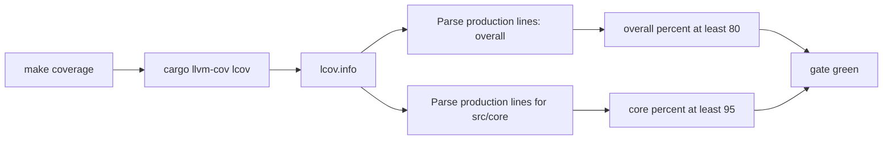

# 15 - Coverage thresholds: 80% overall, 95% core

Status: decided

## Problem

Plan [`14_coverage_scan_plan.md`](14_coverage_scan_plan.md) wired a single
global line-coverage gate (default 75%, baseline 76.68%) via `cargo-llvm-cov`.
The measured coverage is still too low. The team wants:

- overall line coverage enforced at **80%**,
- the core ([`src/core/`](../src/core/) — domain + application) enforced at
  **95%**, because the core is pure hexagonal logic that must be fully unit-tested
  in isolation with in-memory mocks, while the adapters (Postgres, HTTP, Münster
  fetch/parse) are IO-bound and harder to cover.

Question: can a per-module threshold be enforced the same way as the global one?

## Approach (decision)

Yes — enforce per-path thresholds from a **single** instrumented run by parsing
the lcov report. `cargo llvm-cov --fail-under-lines` is global-only, but its lcov
report carries per-file `SF:`/`LF:`/`LH:` line counts.

**Production-only metric.** The naive sum over all `LF`/`LH` is dominated by
`#[cfg(test)]` scaffolding — 667 of the 718 uncovered core lines were unused mock
methods in test modules, which had inflated the "low" headline numbers. Both
thresholds are therefore measured on **production code only**:

- lines at/after the first `#[cfg(test)]` marker in each source file are skipped,
- standalone test files (paths containing `/tests/`, or named
  `tests.rs`/`test.rs`) are skipped entirely.

`scripts/coverage.sh` now:
1. runs `cargo llvm-cov --lcov --output-path target/coverage/lcov.info` once,
2. computes the **overall** production percentage and gates it against
   `COVERAGE_THRESHOLD` (default **80**),
3. computes the **core** (`src/core/`) production percentage and gates it
   against `CORE_COVERAGE_THRESHOLD` (default **95**),
4. renders the HTML report and prints both numbers.

The script stays local and CI-ready, same shape as plan 14.

## Baseline (measured)

Original instrumented run of the full suite (179 tests), 2026-08-23 — includes
`#[cfg(test)]` scaffolding:

- Overall: **5121/6678 = 76.68%**
- Core (`src/core/`): **2575/3343 = 77.03%**

Re-measured on production code only, the same run was:

- Overall (production): **2245/2964 = 75.74%**
- Core (production): **716/788 = 90.86%**

The gap was therefore ~72 uncovered core production lines and ~127 uncovered
production lines overall, not the ~600 suggested by the scaffold-inflated number.

## Result (measured, final)

After the test additions below, the full suite has **206 tests** and the gate
reports:

- Overall (production): **2382/2964 = 80.36%** (>= 80)
- Core (production): **760/788 = 96.45%** (>= 95)

## Work done

- [`scripts/coverage.sh`](../scripts/coverage.sh) — dual gate, production-only,
  via lcov parsing (awk, no new dependency); defaults `COVERAGE_THRESHOLD=80`,
  `CORE_COVERAGE_THRESHOLD=95`. The gate numbers are printed to the terminal; the
  HTML report stays the standard cargo-llvm-cov output (it includes test
  scaffolding, so its totals differ from the gated, production-only numbers).
  Annotating test modules with `#[cfg_attr(coverage, coverage(off))]` would
  exclude test code natively, but the `#[coverage]` attribute is still an
  experimental feature (rustc E0658, issue #84605) and requires nightly, so it
  was not used.
- Core tests (isolated, in-memory mocks) covering the previously missed
  branches: configuration error `Display`, `provider_port` conversions +
  `MeasurementQuery` builders + default attach no-ops, `JobServicePort`
  delegation, `StartupError`/`ConfigError` conversion, `ProviderConfig::vars`,
  and `DataImportService` (channel referencing an unknown station, `to`-bounded
  import, and no-last-datetime paging termination).
- Adapter tests: jobs DTO mapping (`JobStatusDto`, `JobDto`, `JobListDto`),
  `ProviderHandles` factory scoping, and `map_domain_error` database/provider
  branches.
- **Fixed a pre-existing gap:** `src/adapter/driving/rest/tests/jobs.rs` was
  orphaned (not declared in `tests/mod.rs`, so its endpoint tests never ran);
  wired it in with `pub mod jobs;`, which also uncovered the jobs REST handler.
- Docs updated: [`Makefile`](../Makefile), [`agents.md`](../agents.md),
  [`README.md`](../README.md), [`plans/README.md`](README.md); plan
  [`14`](14_coverage_scan_plan.md) closed.

## Deliverables

- [x] Baseline measured (overall + core) and recorded in this plan
- [x] `scripts/coverage.sh` — dual gate (overall 80 + core 95), production-only
- [x] Core unit tests to reach 95% in `src/core` (96.45%)
- [x] Adapter tests to reach 80% overall (80.36%)
- [x] Orphaned `rest/tests/jobs.rs` wired into the suite
- [x] `Makefile` / `agents.md` / `README.md` / `plans/README.md` updated; plan 14 closed
- [x] Gate green: `make check`, `make test-rest`, `make coverage`

## Out of scope

- GitHub Actions / CI workflow (still a natural follow-up; local gate only).
- Coverage exclusions / per-file ignore lists beyond the test-code handling.
