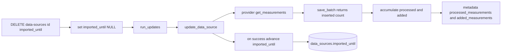

# 16 - Import cursor rename to `imported_until` + `added_measurements` metadata + reset endpoint plan

Status: implemented

> Result: `data_sources.last_updated_at` is renamed to `imported_until` (migration
> V7), `MeasurementRepository::save_batch` returns the inserted-row count which
> the core accumulates into an `added_measurements` job metadata key (alongside
> `processed_measurements`), `DataSourceDto` exposes `imported_until` plus a
> HATEOAS link, and `DELETE /api/v1/data-sources/{id}/imported_until` clears the
> cursor to force a full re-import. All gates green: `make check`, `make test`
> (211 tests), `make test-rest` (59 tests), `make coverage` (overall 81.89%,
> core 96.40%).

## Problem

The data-source update job is incremental: it pages measurements from
`data_sources.last_updated_at` and advances that cursor after a successful run.
Two gaps make its behavior confusing:

1. **`processed_measurements` is misleading.** It counts the rows the provider
   *returned* (re-scanned from the CSVs and handed to `save_batch`), not the rows
   actually inserted. The measurement repository is idempotent
   (`INSERT ... ON CONFLICT (channel_id, timestamp) DO NOTHING`, migration V5), so
   a re-run over already-imported history reports millions of "processed"
   measurements while inserting nothing. Operators cannot tell new data from
   re-read data.

2. **The incremental cursor is vague and hidden.** The marker is named
   `last_updated_at`, is not exposed through the REST API, and has no way to be
   reset. There is therefore no supported way to force a full re-import of a
   single data source.

## Goals

- Rename `last_updated_at` to `imported_until` **everywhere**: DB column, domain
  entity, repository port and implementations, application services, REST
  resource path, DTO field, and docs.
- Add a second job metadata key `added_measurements` that counts only rows
  actually inserted, computed by the core from the repository's affected-row
  count. Keep `processed_measurements` as "rows read from the provider".
- Expose `imported_until` on the data-source resource and add
  `DELETE /api/v1/data-sources/{id}/imported_until` to clear the cursor and force
  a full re-import of that data source.
- Update the OpenAPI/Swagger doc and HATEOAS links accordingly.

## Data model

- Rename the column `data_sources.last_updated_at` to
  `data_sources.imported_until` (nullable `TIMESTAMPTZ`). Migration `V7`:
  `ALTER TABLE data_sources RENAME COLUMN last_updated_at TO imported_until;`.
  `V3` stays untouched so already-applied databases keep their migration
  checksums; fresh databases run V3 (add `last_updated_at`) then V7 (rename).
- Job `metadata` (JSONB) gains a second key:
  - `processed_measurements` — rows read from the provider (unchanged meaning),
  - `added_measurements` — rows actually inserted (new).

## Core architecture

- `MeasurementRepository::save_batch` returns the number of inserted rows
  (`Result<u64, DomainError>`). Postgres `execute` reports affected rows;
  `ON CONFLICT DO NOTHING` counts conflicts as 0, so the return value is the
  honest insert count.
- `DataImportService::update_data_source` accumulates two counters — `processed`
  (rows returned) and `added` (rows inserted) — and returns both in
  `DataSourceUpdate`.
- `DataSourceUpdateService::run_updates` writes both metadata keys after each
  batch and advances `imported_until` (via `update_imported_until`) only after a
  fully successful run.
- `DataSourceRepository` port: rename `update_last_updated_at` to
  `update_imported_until`; add `clear_imported_until(id)`.
- `DataSourceServicePort`: add `reset_imported_until(id)`, implemented by
  `DataSourceService`.

## Hexagonal architecture (ports & adapters)

The change stays within the project's hexagonal boundaries; `src/core/*` keeps
zero references to `src/adapter/*`.

- **Domain ports (core):** `MeasurementRepository::save_batch` returns a `u64`
  inserted count (a primitive — no SQL or Postgres type leaks into the core).
  `DataSourceRepository` exposes `update_imported_until` and
  `clear_imported_until`. `DataSourceServicePort` gains `reset_imported_until`
  (driving port), consistent with the read/write `PersistentStateServicePort`
  pattern.
- **Application services (core):** `DataImportService::update_data_source`
  returns a `DataSourceUpdate` carrying `processed_measurements` and
  `added_measurements`; it depends only on domain ports. The job runner
  `DataSourceUpdateService::run_updates` writes both keys through the
  `JobRepository` domain port and advances the cursor through
  `DataSourceRepository` — no adapter types involved.
- **Driven adapters:** `PostgresMeasurementRepository` computes the inserted
  count from Postgres affected rows; `PostgresDataSourceRepository` implements
  `update_imported_until` and `clear_imported_until`. These implement core ports
  and never flow back into the core.
- **Driving adapter:** the REST handler, `DataSourceDto` (field plus `_links`
  HATEOAS), route registration and `openapi.rs` all stay in
  `src/adapter/driving/rest`; the handler calls the core service port only.

## REST endpoint

- `DELETE /api/v1/data-sources/{id}/imported_until` — clears the cursor (sets
  `imported_until` to `NULL`) and returns `204 No Content`. Idempotent.
- `DataSourceDto` exposes `imported_until: Option<DateTime<Utc>>` and adds a
  HATEOAS link rel `imported_until` pointing at the reset endpoint.

## File changes

New files:

- `migrations/V7__rename_data_source_imported_until.sql` — column rename.

Modified files:

- `src/core/domain/data_source/data_source.rs` — field `last_updated_at` ->
  `imported_until`; update doc comment and `DataSource::new`.
- `src/core/domain/data_source/repository_port.rs` — rename
  `update_last_updated_at` -> `update_imported_until`; add `clear_imported_until`.
- `src/core/domain/data_source/service_port.rs` — add `reset_imported_until` to
  `DataSourceServicePort`.
- `src/core/domain/measurements/repository_port.rs` — `save_batch` returns the
  inserted count.
- `src/adapter/driven/postgres/data_source_repository.rs` — SELECT/UPDATE
  columns to `imported_until`; `update_imported_until`; new `clear_imported_until`.
- `src/adapter/driven/postgres/measurement_repository.rs` — `save_batch` returns
  affected rows.
- `src/core/application/data_import_service.rs` — `DataSourceUpdate` gains
  `added_measurements`; `update_data_source` returns both counters; update the
  `last_updated_at` doc references.
- `src/core/application/data_source_update_service.rs` — read `.imported_until`,
  call `update_imported_until`, write `added_measurements` metadata; update the
  mock repository and tests.
- `src/core/application/data_source_service.rs` — implement `reset_imported_until`;
  update the in-memory mock repository.
- `src/core/application/provider_message_service.rs`,
  `src/core/application/persistent_state_service.rs`,
  `src/core/application/startup_service.rs` — update their in-memory
  `DataSourceRepository` mocks for the renamed/new methods.
- `src/adapter/driving/rest/handlers/data_sources.rs` — new
  `reset_imported_until` handler (`DELETE`, utoipa-documented).
- `src/adapter/driving/rest/dto/data_sources.rs` — `imported_until` field +
  `_links.imported_until`.
- `src/adapter/driving/rest/mod.rs` — import the handler and register the route.
- `src/adapter/driving/rest/openapi.rs` — register the new path.
- `src/adapter/driving/rest/tests/mocks.rs`, `fixtures.rs` — update mocks.
- `scripts/docker-compose-test.sh` — verify `data_sources.imported_until` instead
  of `last_updated_at`.
- `README.md`, `ToDo.md` — update `last_updated_at` references.

## Testing

- Domain: `DataSource` uses `imported_until`; `MeasurementRepository::save_batch`
  contract returns the inserted count.
- Application: `update_data_source` returns `processed_measurements` and
  `added_measurements`; a re-run over already-imported data reports
  `added_measurements == 0` while `processed_measurements > 0`.
- Application: `run_updates` records both metadata keys and advances
  `imported_until` on success; `reset_imported_until` clears the cursor.
- Postgres: `update_imported_until` and `clear_imported_until` round-trip;
  `save_batch` reports the number of actually inserted rows under
  `ON CONFLICT DO NOTHING`.
- REST: `DELETE /api/v1/data-sources/{id}/imported_until` returns 204 and clears
  the value; unknown id -> 404; `DataSourceDto` exposes `imported_until` and the
  HATEOAS link; OpenAPI exposes the new path.

## Acceptance criteria

- The `data_sources` table column is named `imported_until` (migration V7), and
  `scripts/docker-compose-test.sh` verifies that column.
- `processed_measurements` counts rows read from the provider and
  `added_measurements` counts rows actually inserted; both appear in job
  metadata.
- `DELETE /api/v1/data-sources/{id}/imported_until` clears the cursor and is
  visible via Swagger and the data-source HATEOAS links.
- `make check`, `make test`, `make test-rest`, and `make coverage` all pass.
