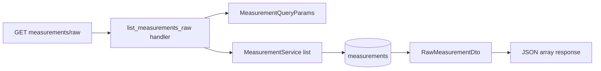

# 17 - Raw measurements export + provider-message HATEOAS fix plan

Status: implemented

## Problem

Two small REST-layer improvements surfaced while reviewing the measurements API:

1. [`GET /api/v1/measurements`](src/adapter/driving/rest/handlers/measurements.rs:14)
   wraps every measurement in HATEOAS `_links` and a pagination envelope. For
   bulk scraping this is overfetching — the same data is much larger than needed.
2. [`ProviderMessageDto`](src/adapter/driving/rest/dto/provider_message.rs:48)
   emits a `self` link to `/api/v1/data-sources/{id}/messages/{message_id}`, but
   no single-message route exists (only the list route
   [`/api/v1/data-sources/:id/messages`](src/adapter/driving/rest/mod.rs:92)).

> **Scope decision:** the originally proposed counting-station filter is dropped.
> It can be achieved with existing per-channel `GET` requests, so no core/domain,
> repository, or service changes are made.

## Design decision: raw export shape

A query parameter (`?raw=true`) was rejected because it returns two different
`200` bodies for the same URL, and OpenAPI keys responses by status + media type,
not by query parameter — Swagger UI could only show one schema and would be
misleading. The chosen approach is a **separate endpoint**:

`GET /api/v1/measurements/raw`

- Same query parameters as the HATEOAS list endpoint (`channel_id`, `offset`,
  `limit`), reusing [`MeasurementQueryParams`](src/adapter/driving/rest/dto/measurements.rs:101).
- Returns a **bare JSON array** of plain measurement objects (no `_links`, no
  `offset`/`limit` envelope).
- Handled entirely in the driving adapter; the existing
  [`MeasurementServicePort::list`](src/core/domain/measurements/service_port.rs:11)
  is reused unchanged.

Response example:

```json
[
  { "id": "…", "channel_id": "…", "value": 42, "timestamp": "2024-01-01T12:00:00Z" }
]
```

## Flow



## File changes (adapter layer only)

- [`src/adapter/driving/rest/dto/measurements.rs`](src/adapter/driving/rest/dto/measurements.rs:11)
  — add `RawMeasurementDto` (`id`, `channel_id`, `value`, `timestamp`) with
  `From<Measurement>`; derive `Serialize`/`Deserialize`/`ToSchema`. No `_links`.
- [`src/adapter/driving/rest/handlers/measurements.rs`](src/adapter/driving/rest/handlers/measurements.rs:26)
  — add `list_measurements_raw` handler: parse `MeasurementQueryParams`, call the
  existing service `list(channel_id, offset, limit)`, ignore `has_more`, and map
  to `Vec<RawMeasurementDto>`; document via `#[utoipa::path]`
  (`body = Vec<RawMeasurementDto>`).
- [`src/adapter/driving/rest/mod.rs`](src/adapter/driving/rest/mod.rs:80)
  — register `GET /api/v1/measurements/raw` (static segment wins over `:id`).
- [`src/adapter/driving/rest/openapi.rs`](src/adapter/driving/rest/openapi.rs:20)
  — add `__path_list_measurements_raw` to the `paths` list and `RawMeasurementDto`
  to `components(schemas(...))`.
- [`src/adapter/driving/rest/dto/provider_message.rs`](src/adapter/driving/rest/dto/provider_message.rs:51)
  — change the `self` link to
  `/api/v1/data-sources/{data_source_id}/messages` (the list endpoint).

### Tests

- [`src/adapter/driving/rest/tests/measurements.rs`](src/adapter/driving/rest/tests/measurements.rs:83)
  — add tests: raw returns a bare array of plain objects with no `_links` and no
  envelope; raw honors `channel_id` + `offset`/`limit`.
- [`src/adapter/driving/rest/tests/dto.rs`](src/adapter/driving/rest/tests/dto.rs:47)
  — add a `RawMeasurementDto` mapping test (fields present, no links).
- [`src/adapter/driving/rest/tests/messages.rs`](src/adapter/driving/rest/tests/messages.rs:47)
  — assert the corrected per-item `self` link points at the messages list.
- [`src/adapter/driving/rest/tests/root.rs`](src/adapter/driving/rest/tests/root.rs:49)
  — add `/api/v1/measurements/raw` to the OpenAPI path assertions.

### Docs

- [`README.md`](README.md:304) — document the raw measurements endpoint.
- [`ToDo.md`](ToDo.md:107) — add a closed entry for this plan.
- [`plans/README.md`](plans/README.md:15) — register this plan.

## OpenAPI review result

No other OpenAPI correctness issues were found. The raw endpoint is documented as
its own path with its own `RawMeasurementDto` schema, so Swagger stays accurate
for both representations.

## Testing

- REST: raw endpoint shape, filters + pagination, OpenAPI path presence.
- DTO: `RawMeasurementDto` mapping.
- Provider-message: corrected `self` link.
- Full gates: `make check`, `make test-rest`, `make test`, `make coverage`.

## Acceptance criteria

- `GET /api/v1/measurements/raw` returns a bare JSON array of plain measurement
  objects (no `_links`, no `offset`/`limit` envelope).
- It accepts the same `channel_id`/`offset`/`limit` query parameters as the list
  endpoint, with the same defaults and the 1000-item `limit` cap.
- `ProviderMessageDto` `self` no longer points at a nonexistent single-message URL.
- No core/domain changes; the existing measurement service is reused.
- `make check`, `make test`, and `make coverage` pass.

## Implementation result

All acceptance criteria met. Gates green: `make check` (fmt + clippy), `make test`
(214 tests, incl. the two new raw-endpoint tests, the `RawMeasurementDto` mapping
test and the corrected provider-message `self` link assertion), `make test-rest`
(62 tests), and `make coverage` (overall 82.07% >= 80%, core 96.40% >= 95%).
The counting-station filter is intentionally not implemented (per scope decision
it is achievable with existing per-channel GET requests).
