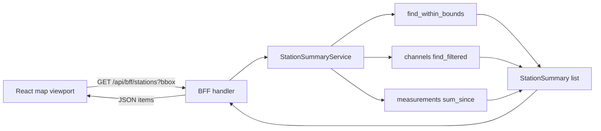

# 23 - Visible stations BFF endpoint + config consolidation + frontend header/list

Status: implemented

## Problem

The frontend map loads markers from the public
[`GET /api/v1/counting-stations`](../backend/src/adapter/driving/rest/handlers/counting_stations.rs:13)
endpoint and renders a bare `<h1>Bike Counter</h1>` header. The user wants:

1. The placeholder BFF `hello` endpoint removed (there are no useful BFF
   endpoints yet), while keeping the `BFF API` Swagger grouping.
2. Configuration consolidated into the **root** [`config.toml`](../config.toml:1)
   only: the `backend/` config files should go away and `make run` (docker
   compose) should wire the root TOML. Backend-specific config should be avoided
   in favour of the existing defaults.
3. A log level for the frontend (it currently logs at nginx's default `notice`
   level), configured in the TOML.
4. A Komoot-style page header.
5. A list of the **currently visible** stations with key metadata (name,
   description, channel count, bikes counted in the last 24 h). This needs a new
   BFF endpoint whose numbers are computed on the fly (no Redis yet).

## Goal

- Remove the `GET /api/bff/hello` seam (handler, DTO, route, Swagger path/schema)
  while keeping the `BFF API` tag.
- Add `GET /api/bff/stations` returning, per station, `id`, `name`, `description`,
  `latitude`, `longitude`, `channel_count`, `bikes_last_24h`. With the bounding-box
  query params it returns only the visible stations (map markers + sidebar list);
  without them it returns **all** stations (search dialog).
- Add `GET /api/bff/stations/summary` (bounding-box query) returning the header
  aggregate `{ station_count, bikes_last_24h_total }` for the visible area.
- The aggregation (channels count + last-24h bikes sum) is computed on the fly,
  orchestrated in a core application service.
- Only [`config.toml`](../config.toml:1) remains; `backend/config.toml` and
  `backend/config.toml.example` are removed and a root `config.toml.example`
  template is added.
- The frontend logs at a TOML-configured level and renders a header + a visible
  stations list.

## Decisions (clarified)

1. **`GET /api/bff/stations` takes optional bbox params**: all four present ->
   only stations inside the bounds (invalid `min > max` -> 400); all four absent
   -> **all** stations (search dialog); a partial set -> 400.
2. **`GET /api/bff/stations/summary` requires the bbox** and returns the header
   aggregate `{ station_count, bikes_last_24h_total }`. Both endpoints replace
   the previous `/api/v1/counting-stations` fetch.
3. **Search dialog lists all stations** in the same rendering as the sidebar
   (one shared list-item component), each entry with a "find on map" button that
   pans/zooms the map and closes the dialog.
4. **On-the-fly aggregation lives in the core** (not the driving adapter),
   following the "REST through the core" convention: a new application service
   orchestrates the three existing repository ports.
5. **`bikes_last_24h` = sum of `measurements.value`** for all channels of a
   station with `timestamp >= since`, where the handler passes
   `since = now - 24h` (keeps the core deterministic and unit-testable).
6. **Frontend log level default is `warn`** (one level quieter than nginx's
   default `notice`), configured as `[frontend] log_level = "warn"` in the TOML.
7. **Config template lives at the root**: `backend/config.toml` and
   `backend/config.toml.example` are deleted; a tracked root
   [`config.toml.example`](../config.toml.example) is added. Docker compose mounts
   the root `config.toml` into both backend and frontend.

## Design

### 1. Remove the BFF hello endpoint

- Delete `BffHelloDto` from
  [`backend/src/adapter/driving/bff/dto.rs`](../backend/src/adapter/driving/bff/dto.rs:1).
- Delete `get_bff_hello` from
  [`backend/src/adapter/driving/bff/handlers.rs`](../backend/src/adapter/driving/bff/handlers.rs:1).
- Remove the `/api/bff/hello` route in
  [`backend/src/adapter/driving/rest/mod.rs`](../backend/src/adapter/driving/rest/mod.rs:71)
  and the import in [`mod.rs`](../backend/src/adapter/driving/rest/mod.rs:16).
- In [`openapi.rs`](../backend/src/adapter/driving/rest/openapi.rs:1): remove the
  `get_bff_hello` path and the `BffHelloDto` schema. **Keep** the `BFF API` tag.

### 2. Core domain + repository ports

In [`counting_station.rs`](../backend/src/core/domain/counting_stations/counting_station.rs:15)
add a `GeoBounds` value object:

```rust
#[derive(Debug, Clone, Copy, PartialEq)]
pub struct GeoBounds {
    pub min_latitude: f64,
    pub min_longitude: f64,
    pub max_latitude: f64,
    pub max_longitude: f64,
}
```

Extend [`repository_port.rs`](../backend/src/core/domain/counting_stations/repository_port.rs:4)
with:

```rust
fn find_within_bounds(&self, bounds: value_objects::GeoBounds)
    -> Result<Vec<CountingStation>, DomainError>;
```

Extend [`measurements/repository_port.rs`](../backend/src/core/domain/measurements/repository_port.rs:4)
with a per-channel sum:

```rust
fn sum_since(
    &self,
    channel_ids: &[value_objects::ChannelId],
    since: chrono::DateTime<chrono::Utc>,
) -> Result<std::collections::HashMap<value_objects::ChannelId, i64>, DomainError>;
```

### 3. Postgres repository implementations

In
[`postgres/counting_station_repository.rs`](../backend/src/adapter/driven/postgres/counting_station_repository.rs:42)
add `find_within_bounds`:

```sql
SELECT id, name, description, external_datasource_id, data_source_id, latitude, longitude
FROM counting_stations
WHERE latitude IS NOT NULL AND longitude IS NOT NULL
  AND latitude  BETWEEN $1 AND $2
  AND longitude BETWEEN $3 AND $4
ORDER BY name ASC
```

In
[`postgres/measurement_repository.rs`](../backend/src/adapter/driven/postgres/measurement_repository.rs:19)
add `sum_since`:

```sql
SELECT channel_id, COALESCE(SUM(value), 0)
FROM measurements
WHERE channel_id = ANY($1) AND timestamp >= $2
GROUP BY channel_id
```

Return an empty map when `channel_ids` is empty.

### 4. Core application service

Add a new domain module `core/domain/station_summary/`:

- `station_summary.rs` — `StationSummary { id: Uuid, name: String,
  description: String, latitude: f64, longitude: f64, channel_count: usize,
  bikes_last_24h: i64 }` and `StationSummaryAggregate { station_count: usize,
  bikes_last_24h_total: i64 }`.
- `service_port.rs` — `StationSummaryServicePort` with three methods:
  - `summarize_in_bounds(bounds: GeoBounds, since: DateTime<Utc>) ->
    Result<Vec<StationSummary>, DomainError>`.
  - `summarize_all(since: DateTime<Utc>) -> Result<Vec<StationSummary>,
    DomainError>`.
  - `aggregate_in_bounds(bounds: GeoBounds, since: DateTime<Utc>) ->
    Result<StationSummaryAggregate, DomainError>`.

Add `core/application/station_summary_service.rs` implementing the port. It holds
the counting-station, channel, and measurement repository ports and:

1. A private `compute(stations, since)` helper takes the already-filtered
   stations and, for them:
   - `channel_repo.find_filtered(None, None)` — build a `station_id -> channel
     count` map and a `channel_id -> station_id` map, and collect the stations'
     channel ids.
   - `measurement_repo.sum_since(channel_ids, since)` — aggregate the per-channel
     sums to per-station `bikes_last_24h`.
   - Return summaries (ordered by name).
2. `summarize_in_bounds` = `find_within_bounds(bounds)` then `compute`.
3. `summarize_all` = `find_filtered(None)` then `compute` (all stations).
4. `aggregate_in_bounds` reuses `compute` and returns the count plus the summed
   `bikes_last_24h` total.

Register the module in `core/domain/mod.rs` and the service in
`core/application/mod.rs`.

### 5. BFF DTO + handler

In [`bff/dto.rs`](../backend/src/adapter/driving/bff/dto.rs:1):

- `StationSummaryDto { id: Uuid, name: String, description: String, latitude:
  f64, longitude: f64, channel_count: usize, bikes_last_24h: i64 }`
  (`ToSchema`).
- `StationSummaryListDto { items: Vec<StationSummaryDto> }` (`ToSchema`).
- `StationSummaryAggregateDto { station_count: usize, bikes_last_24h_total: i64 }`
  (`ToSchema`) — returned by the summary endpoint.
- `BffStationQueryParams { min_lat: Option<f64>, min_lng: Option<f64>,
  max_lat: Option<f64>, max_lng: Option<f64> }` (`IntoParams`, `Deserialize`) —
  shared by both endpoints; for the summary endpoint all four are required.

In [`bff/handlers.rs`](../backend/src/adapter/driving/bff/handlers.rs:1):

- `list_bff_stations` with `#[utoipa::path(get, path = "/api/bff/stations",
  tag = "BFF API", params(BffStationQueryParams), responses(...))]`:
  - No bbox params -> `summarize_all` (search dialog).
  - All four present -> validate (`min <= max`), then `summarize_in_bounds`.
  - Partial set -> 400 via `map_domain_error(DomainError::InvalidQuery(...))`.
  - Compute `since = Utc::now() - chrono::Duration::hours(24)` and map to
    `StationSummaryListDto`.
- `get_bff_stations_summary` with
  `#[utoipa::path(get, path = "/api/bff/stations/summary", tag = "BFF API",
  params(BffStationQueryParams), responses(...))]`: requires all four bbox
  params (else 400), calls `aggregate_in_bounds` and maps to
  `StationSummaryAggregateDto`.

Make [`blocking`](../backend/src/adapter/driving/rest/handlers/mod.rs:94) and
[`map_domain_error`](../backend/src/adapter/driving/rest/handlers/mod.rs:59)
`pub(crate)` so the BFF module can reuse them. Add `station_summary_service:
Arc<dyn StationSummaryServicePort + Send + Sync>` to
[`AppState`](../backend/src/adapter/driving/rest/handlers/mod.rs:43).

### 6. Router + OpenAPI + wiring

- [`rest/mod.rs`](../backend/src/adapter/driving/rest/mod.rs:67): replace the
  `/api/bff/hello` route with `/api/bff/stations` and add
  `/api/bff/stations/summary` (import `list_bff_stations` and
  `get_bff_stations_summary`).
- [`RestApiAdapter::new`](../backend/src/adapter/driving/rest/mod.rs:43): add the
  `station_summary_service` parameter.
- [`openapi.rs`](../backend/src/adapter/driving/rest/openapi.rs:1): add the
  `list_bff_stations` and `get_bff_stations_summary` paths and the
  `StationSummaryDto`/`StationSummaryListDto`/`StationSummaryAggregateDto`/
  `BffStationQueryParams` schemas; keep the `BFF API` tag.
- [`main.rs`](../backend/src/main.rs:64): build `StationSummaryService` from the
  three repository `Arc`s and pass it to `RestApiAdapter::new`.

### 7. Tests

- Update
  [`tests/mod.rs`](../backend/src/adapter/driving/rest/tests/mod.rs:54) and
  [`mocks.rs`](../backend/src/adapter/driving/rest/tests/mocks.rs:447) with a
  `sample_station_summary_service()` and wire it into every `RestApiAdapter::new`
  call.
- Rewrite [`tests/bff.rs`](../backend/src/adapter/driving/rest/tests/bff.rs:1):
  drop the hello tests; add tests for the new endpoints (200 with stations inside
  the bounds; 400 on inverted bounds; `channel_count` and `bikes_last_24h`
  computed from fixtures; the summary endpoint returns `station_count` and
  `bikes_last_24h_total`; OpenAPI contains `/api/bff/stations`,
  `/api/bff/stations/summary`, and the `BFF API` tag). Add fixture measurements
  with timestamps within the last 24 h for the sum test.
- Add unit tests for `StationSummaryService` (in-memory repos) covering bounds
  filtering, channel counting, and the 24-h sum.
- Add repository tests for `find_within_bounds` and `sum_since` (Postgres
  testcontainer), mirroring the existing patterns.
- Update [`scripts/docker-compose-test.sh`](../scripts/docker-compose-test.sh:26):
  point `CONFIG_FILE` at `${PROJECT_ROOT}/config.toml` and replace the
  `/api/bff/hello` assertions with `/api/bff/stations` assertions.

### 8. Config consolidation + log level

- Delete [`backend/config.toml`](../backend/config.toml:1) and
  [`backend/config.toml.example`](../backend/config.toml.example:1).
- Add a tracked root [`config.toml.example`](../config.toml.example) mirroring
  [`config.toml`](../config.toml:1), plus a `[frontend]` section:

  ```toml
  [frontend]
  log_level = "warn"
  ```

- [`docker-compose.yml`](../docker-compose.yml:29): change the backend volume to
  `./config.toml:/app/config.toml:ro` and add a frontend volume
  `./config.toml:/etc/bike-counter/config.toml:ro`.

### 9. Frontend nginx log level

- Rename [`frontend/nginx.conf`](../frontend/nginx.conf:1) to
  `frontend/nginx.conf.template` and add
  `error_log /dev/stderr ${BIKE_COUNTER_LOG_LEVEL};` at the top of the server
  block.
- Add `frontend/docker/20-log-level.sh` (copied to `/docker-entrypoint.d/`) that
  reads `[frontend] log_level` from `/etc/bike-counter/config.toml` (default
  `warn`) and `export BIKE_COUNTER_LOG_LEVEL`.
- Update [`frontend/Dockerfile`](../frontend/Dockerfile:16): copy the template to
  `/etc/nginx/templates/default.conf.template` and the script to
  `/docker-entrypoint.d/20-log-level.sh` (`chmod +x`). The official nginx
  entrypoint substitutes the variable and starts nginx.

### 10. Frontend header + sidebar (Komoot-style, adapted to counting stations)

The Komoot route planner is a **left sidebar** (persistent panel) plus a
**floating header bar** over the map canvas. The counting-station view mirrors
that layout:

- Root `.app` becomes a full-viewport flex **row**: a fixed-width left sidebar
  plus a flexible map area.
- The header floats as an overlay across the top of the map area.

#### Left sidebar (persistent list panel) — the analogue of Komoot's waypoint list

- Panel header: title **"Counting stations"**, a visible-count badge (e.g.
  `14`), and a **collapse toggle** (chevron; keyboard shortcut `H`).
- A scrollable list of the **currently visible** stations, each entry showing:
  - **Name** — primary, bold.
  - **Description** — secondary, muted, truncated to 1–2 lines.
  - Meta row — `channel_count` (e.g. `3 channels`) and `bikes_last_24h`
    (e.g. `1 337 bikes / 24 h`).
- Interactions:
  - Clicking an entry pans the map to that station and opens its popup.
  - The collapse toggle hides/shows the panel (`H`).
- States: loading, error, and an empty state
  ("No counting stations visible in this area.").

#### Top header bar (over the map canvas)

- **Left**: brand — a logo mark + "Bike Counter" wordmark.
- **Center-left**: a search field that, on focus/click, opens a **search dialog**.
- **Right**: a live aggregate summary (e.g. `14 stations · 3 204 bikes / 24 h`)
  plus the sidebar collapse toggle.

#### Search dialog (modal)

- Opened by the header search field; contains its own filter input.
- Lists **all** counting stations (not bound to the map viewport), rendered with
  the same `StationListItem` component as the sidebar, fetched from
  `GET /api/bff/stations` (no bbox params).
- Each entry has a **"Find on map"** button that pans/zooms the map to that
  station (and opens its popup), then closes the dialog.

#### Data flow

- On every viewport change (both debounced ~250 ms on `moveend`):
  - `GET /api/bff/stations?...bbox...` feeds **both** the map markers and the
    sidebar list.
  - `GET /api/bff/stations/summary?...bbox...` feeds the header aggregate
    (`N stations · M bikes / 24 h`).
- The search dialog fetches `GET /api/bff/stations` (no bbox) once on open.
- These replace the previous `/api/v1/counting-stations` fetch.

Implementation touches
[`frontend/src/App.tsx`](../frontend/src/App.tsx:1) (layout, header, sidebar,
search dialog, shared station list item, bounds-driven fetch) and
[`frontend/src/index.css`](../frontend/src/index.css:1) (flex layout, header
overlay, sidebar, dialog, list entries, states).

## Out of scope

- Redis/any caching of the aggregation (computed fresh per request).
- PostGIS spatial indexing (plain double-column bounds filter).
- Click-to-drill into a station's channels/measurements.
- Komoot's sport-type/fitness selectors, map-layer switching, and save/export
  (no counting-station analogue; the adapted header keeps brand + search dialog +
  aggregate summary only).
- Per-station configuration or a second backend TOML.

## Workflow



## Testing / gates

- `make check` — rustfmt + clippy clean.
- `make test` — full backend suite (repository tests use a Postgres testcontainer).
- `make test-rest` — BFF/REST endpoint tests (in-memory mocks).
- `make coverage` — overall production >= 80% and core >= 95% (add tests for the
  new service/repository methods).
- `make frontend-build` — TypeScript compiles.
- `make test-e2e` — stack smoke test (updated for the new BFF endpoint and root
  config path).
