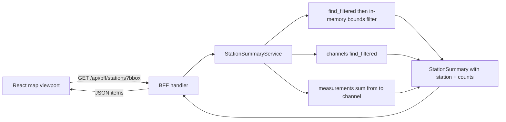

# 24 - Backend station-summary refactor: reuse DTOs, windowed sum, owned bounds, separated aggregate

Status: implemented (2026-08-25)

Supersedes / builds on: [plan 23](23_visible_stations_bff_and_config_plan.md) (implemented).

## Current code state (VERIFY before changing)

A partial refactor is already on disk. The implementation must **verify** each
item below rather than assume it is done or missing. Verified at plan-writing time:

- **D1 — done.** [`summary.rs`](../backend/src/core/domain/station_summary/summary.rs:8)
  already holds `StationSummary { station: CountingStation, channel_count: usize,
  bikes_last_24h: i64 }` with no flat duplication of station fields.
- **D3 — done.** The port already declares `sum(from, to, channel_id:
  Option<ChannelId>) -> i64` in
  [`measurements/repository_port.rs`](../backend/src/core/domain/measurements/repository_port.rs:28)
  and every implementor has been migrated (`sum_since` is gone; grep returns nothing).
- **D4 — done.** [`bounds.rs`](../backend/src/core/domain/station_summary/bounds.rs:9)
  owns `GeoBounds`; the counting-stations domain has no `GeoBounds` /
  `find_within_bounds`; the service filters in memory.
- **D5 — done.** [`aggregate.rs`](../backend/src/core/domain/station_summary/aggregate.rs:7)
  holds `StationSummaryAggregate`, separate from `StationSummary`.
- **D6 — done.** The service port and handlers already take `(from, to)`; the
  handlers compute `to = Utc::now()`, `from = to - 24h`; bbox is optional for
  `/api/bff/stations` and required for `/api/bff/stations/summary`.
- **D7 — done.** [`19-log-level.sh`](../frontend/docker/19-log-level.sh:1) exists and
  [`Dockerfile`](../frontend/Dockerfile:25) references it.

**Still needed:**

- **D2 — done (this implementation).**
  [`bff/dto.rs`](../backend/src/adapter/driving/bff/dto.rs:14) now structurally
  reuses `CountingStationDto` via `#[serde(flatten)]` + `#[schema(inline)]`; the
  `From<StationSummary>` impl delegates `CountingStationDto::from(summary.station)`.
  The flattened DTO required `CountingStationDto` to implement `PartialEq`
  (added to
  [`counting_stations.rs`](../backend/src/adapter/driving/rest/dto/counting_stations.rs:11));
  `LinkDto` already derived it, so no further changes were needed.
- **Re-run the gates** after D2 (and after any verification-driven corrections to
  D1/D3–D7).

The numbered steps below are the source of truth; the on-disk state above is a
checklist to verify, not a guarantee.

## Problem

The "visible stations" BFF feature (plan 23) works but has structural issues per
user feedback:

1. **DTO duplication** — `StationSummaryDto` re-declares `id`/`name`/`description`/
   `latitude`/`longitude` by hand instead of reusing `CountingStationDto`.
2. **One-sided sum** — `MeasurementRepository::sum_since(&[ChannelId], since)` is
   channel-list shaped and one-sided; the BFF needs a scalar windowed
   `sum(from, to, channel_id?)`.
3. **Non-optional channel** — the channel restriction should be optional
   (`Option<ChannelId>`, `None` = all channels).
4. **Bounds stored in the wrong place** — bounding-box filtering lives in the
   counting-station repository (`find_within_bounds` + a `GeoBounds` value object)
   even though only the station-summary feature uses it; the location itself is
   already stored on the counting station, so the core can filter in memory.
5. **Mixed aggregates** — the global aggregate (`StationSummaryAggregate`) is mixed
   into the per-station summary; it must be separated in the domain as well.

## Goal

Refactor per the above without changing endpoints/tags or unrelated code, keep the
exact JSON shape the frontend consumes, and keep every gate green.

## Decisions

### D1 — Reuse `CountingStation` in `StationSummary` (domain)

`StationSummary` holds the whole entity, not flat copies:

```rust
pub struct StationSummary {
    pub station: CountingStation,
    pub channel_count: usize,
    pub bikes_last_24h: i64,
}
```

No `id`/`name`/`description`/`latitude`/`longitude` fields on the summary. Consumers
read them through `summary.station`.

### D2 — Reuse `CountingStationDto` in `StationSummaryDto` (BFF DTO)

`StationSummaryDto` structurally reuses [`CountingStationDto`](../backend/src/adapter/driving/rest/dto/counting_stations.rs:10)
via `#[serde(flatten)]` plus the two summary-only fields:

```rust
#[derive(Debug, Clone, Serialize, Deserialize, ToSchema, PartialEq)]
pub struct StationSummaryDto {
    #[serde(flatten)]
    #[schema(inline)]
    pub station: CountingStationDto,
    pub channel_count: usize,
    pub bikes_last_24h: i64,
}

impl From<StationSummary> for StationSummaryDto {
    fn from(summary: StationSummary) -> Self {
        Self {
            station: CountingStationDto::from(summary.station),
            channel_count: summary.channel_count,
            bikes_last_24h: summary.bikes_last_24h,
        }
    }
}
```

- `#[serde(flatten)]` inlines `CountingStationDto`'s fields at the top level, so
  `id`/`name`/`description`/`latitude`/`longitude` remain flat keys exactly as the
  frontend reads them.
- `#[schema(inline)]` is **required** on the flattened field: utoipa's `ToSchema`
  derive does not support a bare `#[serde(flatten)]` field and fails to compile
  without it. The generated `StationSummaryDto` OpenAPI schema then reflects the
  inlined properties.
- **Consequence to accept:** `CountingStationDto` also serializes `data_source_id`
  and `_links`; flattening surfaces those two keys as additive top-level fields.
  This is the deliberate price of reusing the full `CountingStationDto` (per this
  decision). The frontend reads only the seven keys it already consumes, so the
  additive keys are harmless. The OpenAPI schema updates accordingly.
- Delete the now-redundant flat `id`/`name`/`description`/`latitude`/`longitude`
  fields and the manual re-extraction in the `From` impl.

### D3 — `sum(from, to, channel_id: Option<ChannelId>) -> i64`

Replace `sum_since(&[ChannelId], since)` with a scalar, windowed, optional-channel
sum:

```rust
fn sum(
    &self,
    from: chrono::DateTime<chrono::Utc>,
    to: chrono::DateTime<chrono::Utc>,
    channel_id: Option<value_objects::ChannelId>,
) -> Result<i64, DomainError>;
```

`None` = all channels. Files that must declare/implement the new signature (each
verified via grep — `sum_since` must not remain anywhere):

- Port: [`measurements/repository_port.rs`](../backend/src/core/domain/measurements/repository_port.rs:28).
- Postgres impl: [`postgres/measurement_repository.rs`](../backend/src/adapter/driven/postgres/measurement_repository.rs:198)
  (`channel_id` becomes an optional SQL filter; `timestamp BETWEEN from AND to`).
- In-memory/test mocks (every `impl MeasurementRepository`):
  - [`measurement_service.rs`](../backend/src/core/application/measurement_service.rs:122)
  - [`data_import_service.rs`](../backend/src/core/application/data_import_service.rs:660)
    and [`data_import_service.rs`](../backend/src/core/application/data_import_service.rs:1131)
  - [`data_source_update_service.rs`](../backend/src/core/application/data_source_update_service.rs:697)
  - [`station_summary_service.rs`](../backend/src/core/application/station_summary_service.rs:257)
  - [`rest/tests/mocks.rs`](../backend/src/adapter/driving/rest/tests/mocks.rs:235)

### D4 — Move `GeoBounds` out of counting stations

- [`bounds.rs`](../backend/src/core/domain/station_summary/bounds.rs:9) owns
  `GeoBounds { min_latitude, min_longitude, max_latitude, max_longitude }` with
  `is_valid()` and `contains(&GeoCoordinates)`.
- Remove any `GeoBounds` value object and `CountingStationRepository::find_within_bounds`
  from the counting-stations domain (currently absent — verify and keep absent).
- In-memory filtering approach in
  [`station_summary_service.rs`](../backend/src/core/application/station_summary_service.rs:107):
  load all stations via `counting_station_repository.find_filtered(None)` and
  `.filter(|station| station.coordinates.is_some_and(|coords| bounds.contains(coords)))`.
  Stations without coordinates are excluded from a bounds-filtered result (but
  included in the "all stations" path).

### D5 — Separate the global summary aggregate

`StationSummaryAggregate` lives in its own file
[`station_summary/aggregate.rs`](../backend/src/core/domain/station_summary/aggregate.rs:7),
separate from [`summary.rs`](../backend/src/core/domain/station_summary/summary.rs:8).
[`station_summary/mod.rs`](../backend/src/core/domain/station_summary/mod.rs:9)
exports `aggregate`, `bounds`, `service_port`, and `summary`.

### D6 — Service port + BFF handlers + OpenAPI + tests

- Service port methods take an explicit `(from, to)` window
  ([`service_port.rs`](../backend/src/core/domain/station_summary/service_port.rs:11)):
  `summarize_in_bounds(bounds, from, to)`, `summarize_all(from, to)`,
  `aggregate_in_bounds(bounds, from, to)`.
- [`handlers.rs`](../backend/src/adapter/driving/bff/handlers.rs:49) computes
  `to = Utc::now()`, `from = to - 24h`.
- Bbox is **optional** for `/api/bff/stations` (absent = all stations) and
  **required** for `/api/bff/stations/summary` (missing/invalid = 400).
- OpenAPI registers the paths/schemas (already present — update only if D2 changes
  the `StationSummaryDto` schema).
- Tests: [`bff.rs`](../backend/src/adapter/driving/rest/tests/bff.rs:1),
  [`station_summary_service.rs`](../backend/src/core/application/station_summary_service.rs:143)
  unit tests, and [`mocks.rs`](../backend/src/adapter/driving/rest/tests/mocks.rs:235).

### D7 — Frontend nginx log-level script ordering

The script must be named [`19-log-level.sh`](../frontend/docker/19-log-level.sh:1)
and [`Dockerfile`](../frontend/Dockerfile:25) must copy it to
`/docker-entrypoint.d/19-log-level.sh`.

**Ordering rationale:** the official nginx entrypoint runs
`/docker-entrypoint.d/*.sh` in lexical order. The image ships
`20-envsubst-on-templates.sh`, which substitutes `${...}` env vars into
`/etc/nginx/templates/*.template`. A script named `20-log-level.sh` would sort
*after* envsubst (same `20-` prefix, `e` < `l`), so `BIKE_COUNTER_LOG_LEVEL` would
still be empty at substitution time, producing an invalid `error_log` directive and
a failed nginx startup. The `19-` prefix sorts *before* `20-envsubst-on-templates.sh`.

**Propagation note (from the earlier draft's finding):** the entrypoint *executes*
`.sh` scripts as subprocesses (it does not source them), so a bare `export` never
reaches the later envsubst step. The script therefore also pre-substitutes the
template in place with `envsubst` (guarded by `command -v envsubst`); the image's
later envsubst step then copies it unchanged and nginx starts.

## Implementation steps

1. **D1** — Verify [`summary.rs`](../backend/src/core/domain/station_summary/summary.rs:8)
   holds `StationSummary { station: CountingStation, channel_count, bikes_last_24h }`;
   remove any flat station fields if present.
2. **D2** — Rewrite `StationSummaryDto` in
   [`bff/dto.rs`](../backend/src/adapter/driving/bff/dto.rs:12) to embed
   `CountingStationDto` via `#[serde(flatten)]` + `#[schema(inline)]`, and simplify
   the `From<StationSummary>` impl. Verify the serialized keys and the OpenAPI
   schema.
3. **D3** — Confirm the port and every `impl MeasurementRepository` use
   `sum(from, to, channel_id: Option<ChannelId>) -> i64`; remove any leftover
   `sum_since`.
4. **D4** — Confirm `GeoBounds` lives only in
   [`bounds.rs`](../backend/src/core/domain/station_summary/bounds.rs:9) and that
   `find_within_bounds`/`GeoBounds` are absent from the counting-stations domain;
   confirm in-memory filtering in the service.
5. **D5** — Confirm `StationSummaryAggregate` lives only in
   [`aggregate.rs`](../backend/src/core/domain/station_summary/aggregate.rs:7) and is
   exported from `mod.rs`.
6. **D6** — Confirm the port/handlers/OpenAPI/tests use `(from, to)` with
   `to = Utc::now()`, `from = to - 24h`, and the optional/required bbox split.
7. **D7** — Confirm [`19-log-level.sh`](../frontend/docker/19-log-level.sh:1) and the
   [`Dockerfile`](../frontend/Dockerfile:25) `COPY`/`chmod` are correct and ordered
   before the image's envsubst step.
8. Run the gates (see below).

## Out of scope

- Redis/any caching of the aggregation (computed fresh per request).
- PostGIS spatial indexing (plain double-column / in-memory bounds filter).
- Plan 25's endpoint separation (`/api/bff/stations/search`, `/api/bff/actions`,
  `/api/bff/global-summary`) and its `global_summary` domain module — deferred.
- Reverting the `[frontend] log_level` feature (D7 keeps it, fixing its ordering).
- Click-to-drill into a station's channels/measurements.

## Workflow



## Testing / gates

- `make check` — rustfmt + clippy clean (watch for the `#[schema(inline)]`
  requirement on the flattened DTO field).
- `make test` — full backend suite (repository tests use a Postgres testcontainer).
- `make test-rest` — BFF/REST endpoint tests (in-memory mocks); update
  [`bff.rs`](../backend/src/adapter/driving/rest/tests/bff.rs:1) if the
  `StationSummaryDto` JSON shape changes.
- `make coverage` — overall production >= 80% and core >= 95%.
- `make frontend-build` — TypeScript compiles.
- `make test-e2e` — stack smoke test (nginx log-level ordering fix is exercised
  here).

## Result

Implemented (2026-08-25). All decisions verified against the code on disk:

- **D1 — already done, verified.** `StationSummary { station: CountingStation,
  channel_count, bikes_last_24h }` in
  [`summary.rs`](../backend/src/core/domain/station_summary/summary.rs:8); no flat
  station fields.
- **D2 — implemented.** `StationSummaryDto` in
  [`bff/dto.rs`](../backend/src/adapter/driving/bff/dto.rs:14) now embeds
  `CountingStationDto` via `#[serde(flatten)]` + `#[schema(inline)]`, and
  `From<StationSummary>` delegates to `CountingStationDto::from(summary.station)`.
  `CountingStationDto` gained `PartialEq`
  ([`counting_stations.rs`](../backend/src/adapter/driving/rest/dto/counting_stations.rs:11))
  so the DTO derive compiles; the serialized `id/name/description/latitude/
  longitude` keys stay flat (plus additive `data_source_id`/`_links`).
- **D3 — already done, verified.** `sum(from, to, Option<ChannelId>) -> i64` in the
  port ([`measurements/repository_port.rs`](../backend/src/core/domain/measurements/repository_port.rs:28)),
  Postgres impl COALESCEs to 0, and all five `impl MeasurementRepository` mocks
  use the new signature; `sum_since` and `find_within_bounds` return zero grep hits.
- **D4 — already done, verified.** `GeoBounds` lives only in
  [`station_summary/bounds.rs`](../backend/src/core/domain/station_summary/bounds.rs:9);
  the service loads all stations via `find_filtered(None)` and filters in memory.
- **D5 — already done, verified.** `StationSummaryAggregate` in
  [`station_summary/aggregate.rs`](../backend/src/core/domain/station_summary/aggregate.rs:7),
  exported from `mod.rs`.
- **D6 — already done, verified.** Port/handlers take `(from, to)` with
  `to = Utc::now()`, `from = to - 24h`; bbox optional for `/api/bff/stations` and
  required for `/api/bff/stations/summary`; OpenAPI keeps both paths under `BFF API`.
- **D7 — already done, verified.** `frontend/docker/19-log-level.sh` is the only
  log-level script and `frontend/Dockerfile` copies + `chmod +x`es it.

Gates (all pass): `cargo fmt` ok; `make check` ok; `make test` 246/246;
`make test-rest` 76/76; `make coverage` overall 85.42% (>= 80%) and core 96.93%
(>= 95%); `make frontend-build` ok; `make test-e2e` ok (docker-compose-test: OK).
No frontend React UI changes were required.
