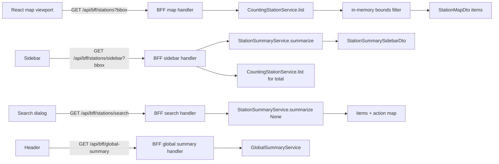

# 25 - BFF endpoint separation + global summary + frontend polish

Status: implemented (2026-08-25)

Supersedes the aggregate approach of plan 24. The visible-stations BFF currently
serves one mixed station list plus a bbox-scoped aggregate. The user wants the BFF
to expose distinct, single-purpose calls — a map station list, a sidebar station
summary with a visible/global counter, a search call (all stations + action map),
and a whole-system global summary — while keeping the domain concepts clean
(`station`, `station_summary`, `global_summary`) and decoupled from BFF-specific
naming.

## Problem

1. `station_summary/aggregate.rs` mixes a global aggregate into per-station
   summaries; the user wants a standalone, non-station-bound `global_summary`
   computed by its own application service and served by its own endpoint.
2. The single BFF station call mixes map, sidebar and search concerns. The user
   wants separate BFF calls with their own DTO shapes.
3. `station_summary/summary.rs` is poorly named (file vs. type).
4. Frontend polish: sidebar close button location, sidebar title, visible/global
   counter, header global stats + last update, and a search-clear-button bug.

## Decisions

- **BFF is frontend-only.** It may compose multiple core services, but core/domain
  stays decoupled: domain concepts are `station` (counting station),
  `station_summary` and `global_summary` only. The "visible vs global counter"
  and "sidebar" naming live only in the BFF DTO layer.
- **`station_summary`** is used with optional map filtering, serving both the
  search (no bounds) and the sidebar (bounds + counter).
- **Map** uses plain counting stations (not summaries) and returns only what the
  map needs (`id`, `name`, `latitude`, `longitude`). Bounds filtering for the map
  is done in the BFF handler using the existing
  [`GeoBounds`](../backend/src/core/domain/station_summary/bounds.rs:9) value
  object (a supporting VO, not a domain aggregate).
- **`global_summary`** is a separate domain concept so non-station stats (last
  update now, jobs later) can be added without touching stations.
- The search-bar endpoint returns **one response** containing both the station
  list and the action map (actions as a keyed map). There is no separate
  `/api/bff/actions` endpoint.

## BFF API surface (all under the `BFF API` tag)

The paths are named after the frontend widget they serve, so the BFF surface is
self-documenting: the base station path is the map, and the two station-derived
views are `sidebar` and `search`. The global summary is deliberately outside the
`/stations/` sub-path.

| Method | Path | Query | Purpose | Response |
|---|---|---|---|---|
| GET | `/api/bff/stations` | all four bounds required | map markers | `{ items: [StationMapDto] }` |
| GET | `/api/bff/stations/sidebar` | all four bounds required | sidebar list + counter | `StationSummarySidebarDto` |
| GET | `/api/bff/stations/search` | none | search dialog (all stations + actions) | `{ items: [StationSummaryDto], actions: {...} }` |
| GET | `/api/bff/global-summary` | none | whole-system stats | `GlobalSummaryDto` |

### DTOs (BFF module only)

- `StationMapDto { id: Uuid, name: String, latitude: f64, longitude: f64 }`
  (only positioned stations) + `StationMapListDto { items }`.
- `StationSummarySidebarDto { items: Vec<StationSummaryDto>, visible_count: usize, total_count: usize }`
  — `visible_count = items.len()`, `total_count` = global station count.
- `StationSummaryDto` (unchanged) — reused by the sidebar and the search list.
- `ActionDto { enabled: bool }`; the search response embeds
  `actions: HashMap<String, ActionDto>` — for now
  `{ "find_on_map": { "enabled": true } }`.
- `GlobalSummaryDto { station_count: usize, channel_count: usize, bikes_last_24h_total: i64, last_update: Option<DateTime<Utc>> }`.

## Domain + application

### station_summary (domain)

- Rename `summary.rs` -> `station_summary.rs` (holds `StationSummary`).
- Delete `aggregate.rs` (`StationSummaryAggregate`).
- `service_port.rs`: replace `summarize_in_bounds` / `summarize_all` /
  `aggregate_in_bounds` with a single
  `summarize(&self, bounds: Option<GeoBounds>, from, to) -> Result<Vec<StationSummary>, DomainError>`
  (optional map filtering).
- `station_summary_service.rs`: implement `summarize(bounds: Option<GeoBounds>, ...)`;
  drop the aggregate logic. Update its unit tests.

### global_summary (new domain module)

- `global_summary.rs`: `GlobalSummary { station_count, channel_count, bikes_last_24h_total, last_update: Option<DateTime<Utc>> }`.
- `service_port.rs`: `GlobalSummaryServicePort { fn summarize(&self, from, to) -> Result<GlobalSummary, DomainError> }`.
- `mod.rs`, registered in `core/domain/mod.rs`.

### application

- New `global_summary_service.rs` (`GlobalSummaryService`) deps:
  `CountingStationRepository`, `ChannelRepository`, `MeasurementRepository`,
  `JobRepository`.
  - `station_count` = all counting stations count.
  - `channel_count` = all channels count.
  - `bikes_last_24h_total` = `measurement_repository.sum(from, to, None)`.
  - `last_update` = `find_last_finished_by_type("data_source_update")?.finished_at`
    (reuse `DATA_SOURCE_UPDATE_JOB_TYPE` from
    [`data_source_update_service.rs`](../backend/src/core/application/data_source_update_service.rs:25)).
- Unit tests with in-memory mocks. Register in `core/application/mod.rs`.

## Wiring + OpenAPI (Swagger) + tests

### Wiring

- `AppState` + `RestApiAdapter::new` gain a `global_summary_service`
  (`Arc<dyn GlobalSummaryServicePort>`). The sidebar handler reads
  `counting_station_service` for `total_count`; the map handler reads
  `counting_station_service` for the stations.
- `main.rs`: build `GlobalSummaryService` from `counting_station_repo`,
  `channel_repo`, `measurement_repo`, `job_repo`.
- `rest/mod.rs`: add routes for `/api/bff/stations/sidebar` (rename of the old
  summary route), `/api/bff/stations/search`, and `/api/bff/global-summary`; keep
  `/api/bff/stations` (map semantics). Update imports.

### OpenAPI / Swagger (utoipa)

Each BFF handler keeps a `#[utoipa::path(...)]` under the `BFF API` tag with its
response body type, and the Swagger doc is updated to match:

- `list_bff_stations` — path `/api/bff/stations`, query `BffStationQueryParams`
  (all four bounds required now), response `StationMapListDto`.
- `get_bff_stations_sidebar` (rename of the old summary handler) — path
  `/api/bff/stations/sidebar`, response `StationSummarySidebarDto`.
- `get_bff_stations_search` (new) — path `/api/bff/stations/search`, no query,
  response `StationSearchDto`.
- `get_bff_global_summary` (new) — path `/api/bff/global-summary`, no query,
  response `GlobalSummaryDto`.

In [`openapi.rs`](../backend/src/adapter/driving/rest/openapi.rs:25):

- `paths(...)`: add `get_bff_stations_search`, `get_bff_global_summary`; keep
  `list_bff_stations`; rename `get_bff_stations_summary` to
  `get_bff_stations_sidebar` (imports and `__path_*` companions updated in the
  `use` block).
- `components(schemas(...))`: add `StationMapDto`, `StationMapListDto`,
  `StationSummarySidebarDto`, `StationSearchDto`, `ActionDto`, `GlobalSummaryDto`;
  keep `StationSummaryDto`; remove the obsolete `StationSummaryAggregateDto` and
  `StationSummaryListDto` (the old map-list DTO).
- Keep the `BFF API` tag; no new tag for the global summary (it remains a
  frontend-facing BFF call).

### Tests

- Update [`bff.rs`](../backend/src/adapter/driving/rest/tests/bff.rs:1) for the
  new response shapes (map items, sidebar `visible_count`/`total_count`, search
  `items` + `actions`, global summary fields) and the now-required bounds on the
  map endpoint.
- Update [`mod.rs`](../backend/src/adapter/driving/rest/tests/mod.rs:52)
  (`TestApp` wiring) and [`mocks.rs`](../backend/src/adapter/driving/rest/tests/mocks.rs:484)
  (`sample_global_summary_service`).
- Extend the OpenAPI test to assert the new paths
  (`/api/bff/stations/search`, `/api/bff/global-summary`) and schemas exist.

## Frontend

- Split the data fetching in [`App.tsx`](../frontend/src/App.tsx:149):
  - Map markers from `/api/bff/stations?bbox` (minimal map DTO).
  - Sidebar list + counter from `/api/bff/stations/sidebar?bbox`.
  - Search dialog from `/api/bff/stations/search` (items + actions).
  - Header global stats + last update from `/api/bff/global-summary`.
- Sidebar ([`App.tsx`](../frontend/src/App.tsx:279)):
  - Move the collapse/close toggle from the topbar to the top of the sidebar.
  - Rename the sidebar title to indicate the map only shows the currently
    visible counting stations (e.g. "Visible counting stations").
  - Top-right counter shows `visible_count / total_count`.
- Header ([`App.tsx`](../frontend/src/App.tsx:246)): show the global summary
  (station count, channel count, bikes / 24 h) plus the `last_update` timestamp.
- Fix the search-dialog clear button ([`App.tsx`](../frontend/src/App.tsx:332)):
  add a dedicated clear control that empties the filter text and keeps the
  dialog open; keep the close (✕) button for closing, and support `Esc` + overlay
  click to close.

## Revert the frontend log-level feature

Remove the `[frontend] log_level` nginx feature completely (script, Docker wiring,
template directive, TOML block, and compose mount):

- Delete [`frontend/docker/19-log-level.sh`](../frontend/docker/19-log-level.sh:1).
- [`frontend/Dockerfile`](../frontend/Dockerfile:17): remove the log-level comments
  and the `COPY docker/19-log-level.sh ...` + `chmod +x` lines (keep the nginx
  template COPY and the build-artifact COPY).
- [`frontend/nginx.conf.template`](../frontend/nginx.conf.template:5): remove the
  `error_log /dev/stderr ${BIKE_COUNTER_LOG_LEVEL};` line and its comment (nginx
  falls back to its default `notice` level).
- [`config.toml.example`](../config.toml.example:23): remove the `[frontend]`
  block (and its comment).
- [`docker-compose.yml`](../docker-compose.yml:53): remove the frontend
  `./config.toml:/etc/bike-counter/config.toml:ro` volume mount and its comment.
- Local `config.toml` (developer machine, not committed): remove the `[frontend]`
  block.

## Out of scope

- Jobs/other stats in `global_summary` (placeholder-ready, not surfaced yet).
- Redis/any caching of summaries or the global summary (computed per request).
- PostGIS spatial indexing.

## Workflow

## Testing / gates

- `make check` — rustfmt + clippy.
- `make test` — full backend suite.
- `make test-rest` — BFF/REST endpoint tests (in-memory mocks).
- `make coverage` — overall production >= 80%, core >= 95%.
- `make frontend-build` — TypeScript compiles.
- `make test-e2e` — stack smoke test.

## Result

Implemented (2026-08-25).

- **Domain** — `station_summary` exposes a single
  `summarize(bounds: Option<GeoBounds>, from, to)` (optional map filtering,
  serving the search + sidebar); `StationSummaryAggregate` removed. New
  decoupled `global_summary` module (`GlobalSummary` + `GlobalSummaryServicePort`)
  and `GlobalSummaryService` (station/channel counts, last-24h total, most recent
  data-source-update `finished_at`).
- **BFF API** — four widget-named endpoints: `/api/bff/stations` (map markers,
  minimal `StationMapDto`, bounds required), `/api/bff/stations/sidebar`
  (`StationSummarySidebarDto` with `visible_count`/`total_count`),
  `/api/bff/stations/search` (`StationSearchDto`: all stations + `find_on_map`
  action map), `/api/bff/global-summary` (`GlobalSummaryDto`, outside `/stations/`).
- **Swagger/OpenAPI** — utoipa paths + schemas updated for all four BFF endpoints
  under the `BFF API` tag; obsolete `StationSummaryAggregateDto` /
  `StationSummaryListDto` removed.
- **Frontend** — map/sidebar/search/header each fetch their own endpoint; sidebar
  close button moved to the top of the sidebar, sidebar renamed "Visible counting
  stations", top-right counter shows `visible / total`, header shows the global
  summary + last update; search-dialog clear button clears the filter (separate
  Close button + Esc), no longer closes the dialog.
- **Log-level feature removed** — `19-log-level.sh`, the Dockerfile COPY/chmod,
  the nginx `error_log` directive, the `[frontend]` TOML block
  (`config.toml` / `config.toml.example`) and the frontend compose volume mount
  are gone.
- Gates: `make check` ok; `make test` 250/250; `make test-rest` 78/78;
  `make coverage` overall 85.59% (>= 80%) and core 97.01% (>= 95%);
  `make frontend-build` ok; `make test-e2e` ok (docker-compose-test: OK).
