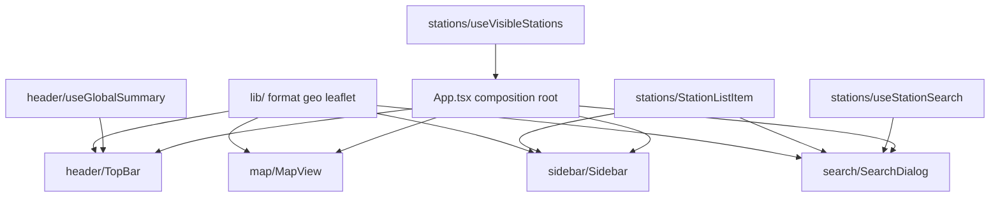

# 27 - Frontend component refactor + centered search bar plan

Status: implemented

## Problem

[`frontend/src/App.tsx`](../frontend/src/App.tsx:1) has grown to a single ~475-line
monolith that mixes concerns: DTO types, fetch calls, Leaflet bootstrap, formatting
helpers, and five UI regions (header, map, sidebar, search dialog, and a shared
station list item). This makes the file hard to navigate and extend.

Additionally, the header search trigger
([`.search-trigger`](../frontend/src/index.css:53)) is not centered: it uses
`flex: 1` between the brand and the summary, so it only fills the leftover middle
space and drifts with the widths of its neighbours.

## Goal

- Split [`App.tsx`](../frontend/src/App.tsx:1) into small, single-responsibility
  React components and hooks, organised as a feature-based structure that is easy
  to extend (new stations consumers, new header widgets, new map layers, etc.).
- Turn [`App.tsx`](../frontend/src/App.tsx:1) into a thin composition root that
  only owns cross-cutting state and wires the features together.
- Center the search trigger in the header.

## Decisions

1. **Feature-based layout.** UI regions become feature folders under
   `frontend/src/features/`, each owning its components and hooks. Cross-cutting
   pure helpers live in `frontend/src/lib/`. Shared station types + data access
   live in a `stations` feature because three features consume them (map markers,
   sidebar, search dialog).
2. **Data fetching moves into co-located hooks** (`useVisibleStations`,
   `useStationSearch`, `useGlobalSummary`) so components stay presentational and
   [`App.tsx`](../frontend/src/App.tsx:1) only orchestrates. Behaviour is
   preserved verbatim (same endpoints, same debounce, same error/loading states).
3. **Keep a single global stylesheet** ([`index.css`](../frontend/src/index.css:1))
   for now: the design is one cohesive theme, and the only CSS change needed is the
   header grid for centering. Co-located CSS modules are an optional later step,
   not part of this refactor.
4. **No path aliases** yet: the tree is shallow, so relative imports stay readable.
   Adding a `@/` alias is an optional follow-up.
5. **No behaviour change.** This is a pure structural refactor plus the one CSS
   centering tweak; no endpoints, texts, or interactions change.

## Proposed structure

```
frontend/src/
├── main.tsx                        # unchanged entry
├── App.tsx                         # thin composition root
├── index.css                       # global styles + centered search bar
├── lib/
│   ├── format.ts                   # formatNumber, formatTimestamp, escapeHtml
│   ├── geo.ts                      # MUENSTER_CENTER, Bounds, bboxQuery, mapBounds
│   └── leaflet.ts                  # Leaflet default-icon setup + leaflet.css import
├── features/
│   ├── stations/
│   │   ├── types.ts                # StationMap, StationSummary, Sidebar, ActionDto, Search payloads
│   │   ├── api.ts                  # fetchVisibleStations, fetchStationSearch
│   │   ├── useVisibleStations.ts   # debounced bounds-driven fetch
│   │   ├── useStationSearch.ts     # search fetch + client-side filter
│   │   └── StationListItem.tsx     # shared list item (sidebar + search)
│   ├── header/
│   │   ├── types.ts                # GlobalSummary
│   │   ├── api.ts                  # fetchGlobalSummary
│   │   ├── useGlobalSummary.ts     # global-summary fetch hook
│   │   └── TopBar.tsx              # brand + centered search trigger + summary
│   ├── map/
│   │   ├── MapView.tsx             # MapContainer + TileLayer + markers
│   │   └── MapController.tsx       # Leaflet events → onBounds / onReady
│   ├── sidebar/
│   │   └── Sidebar.tsx             # overlay panel (expanded / collapsed)
│   └── search/
│       └── SearchDialog.tsx        # modal search dialog
```

## Component & hook contracts

### `App.tsx` (composition root)

Owns only cross-cutting state: `bounds`, `mapRef`, `searchOpen`,
`sidebarCollapsed`, the `H` / `Esc` keyboard effect, and `focusStation` (uses
`mapRef`). It calls `useVisibleStations(bounds)` and renders:

- [`TopBar`](frontend/src/features/header/TopBar.tsx) with `onOpenSearch`
- [`Sidebar`](frontend/src/features/sidebar/Sidebar.tsx) with `collapsed`,
  `onToggle`, `sidebar`, `error`, `onSelectStation`
- [`MapView`](frontend/src/features/map/MapView.tsx) with `stations`, `onBounds`,
  `onReady`
- [`SearchDialog`](frontend/src/features/search/SearchDialog.tsx) with `onClose`,
  `onSelect`, `onFind` (mounted only while `searchOpen`)

### Hooks

- `useVisibleStations(bounds)` → `{ mapStations, sidebar, error }`. Debounced
  (250 ms) parallel fetch of `/api/bff/stations` + `/api/bff/stations/sidebar`,
  moved verbatim from the current [`useEffect`](../frontend/src/App.tsx:206).
- `useStationSearch()` → `{ query, setQuery, results, error, findOnMapEnabled }`.
  One-shot fetch of `/api/bff/stations/search` plus the existing client-side
  name/description filter; self-contained because the dialog only mounts when open.
- `useGlobalSummary()` → `{ summary, error }`. One-shot fetch of
  `/api/bff/global-summary`, moved from [`useEffect`](../frontend/src/App.tsx:233).

### Components

- [`StationListItem`](frontend/src/features/stations/StationListItem.tsx) and
  [`MapController`](frontend/src/features/map/MapController.tsx) move verbatim with
  their current props.
- [`Sidebar`](frontend/src/features/sidebar/Sidebar.tsx) and
  [`SearchDialog`](frontend/src/features/search/SearchDialog.tsx) keep the exact
  JSX they have today, only their inputs become props/hook results.
- [`TopBar`](frontend/src/features/header/TopBar.tsx) keeps brand, search trigger
  and global summary; it consumes `useGlobalSummary()` itself.

## Search bar centering

In [`frontend/src/index.css`](../frontend/src/index.css:29), turn `.topbar` into a
three-column grid so the middle track is centered regardless of the brand and
summary widths:

```css
.topbar {
  display: grid;
  grid-template-columns: 1fr auto 1fr;
  align-items: center;
  gap: 1rem;
  /* keep existing colours/shadow/z-index */
}
.brand { justify-self: start; }            /* keep existing flex styling */
.search-trigger {
  width: 26rem;                            /* was: flex: 1; max-width: 26rem */
  max-width: 60vw;                         /* responsive cap */
  /* keep existing padding/colours/font */
}
.topbar-right { justify-self: end; }        /* replaces margin-left: auto */
```

Both `1fr` side tracks receive equal remaining space, which centers the `auto`
middle track (the search trigger) in the header.

## Data flow



## Out of scope

- Backend / BFF / Rust changes.
- Frontend test harness (the frontend has none; build + manual check only).
- CSS modules / co-located styles, path aliases, and visual redesign beyond the
  centered search bar.

## Result

Implemented end-to-end in the frontend:

- [`frontend/src/App.tsx`](../frontend/src/App.tsx:1) is now a thin composition
  root owning only `bounds`, `mapRef`, `sidebarCollapsed`, `searchOpen`, the
  `H`/`Esc` keyboard effect, and `focusStation`.
- New feature folders:
  [`features/stations/`](../frontend/src/features/stations/types.ts:1)
  (shared station types, `api.ts`, `useVisibleStations`, `useStationSearch`,
  `StationListItem`), [`features/header/`](../frontend/src/features/header/TopBar.tsx:1)
  (types, `api.ts`, `useGlobalSummary`, `TopBar`),
  [`features/map/`](../frontend/src/features/map/MapView.tsx:1)
  (`MapView`, `MapController`), [`features/sidebar/`](../frontend/src/features/sidebar/Sidebar.tsx:1)
  and [`features/search/`](../frontend/src/features/search/SearchDialog.tsx:1).
- New [`lib/`](../frontend/src/lib/format.ts:1) helpers (`format.ts`, `geo.ts`,
  `leaflet.ts`). No behaviour change; same endpoints, debounce, and loading/error
  states.
- The search trigger is centered: `.topbar` is now a `1fr auto 1fr` grid with
  `.brand` `justify-self: start`, `.topbar-right` `justify-self: end`, and
  `.search-trigger` `width: 26rem; max-width: 60vw`
  ([`index.css`](../frontend/src/index.css:29)).

Gates: `make frontend-build` green (`tsc` + `vite build`). Backend gates are
unaffected (no Rust changes).

## Definition of done

- [x] New `features/`, `lib/`, and `App.tsx` implemented per this plan; behaviour
      identical to today.
- [x] Search trigger centered via the header grid change in
      [`index.css`](../frontend/src/index.css:29).
- [x] `make frontend-build` green (`tsc` + `vite build`).
- [x] Manual check with `make run` (http://localhost:8081): map, sidebar, search
      dialog and find-on-map all behave as before; search trigger is centered.
