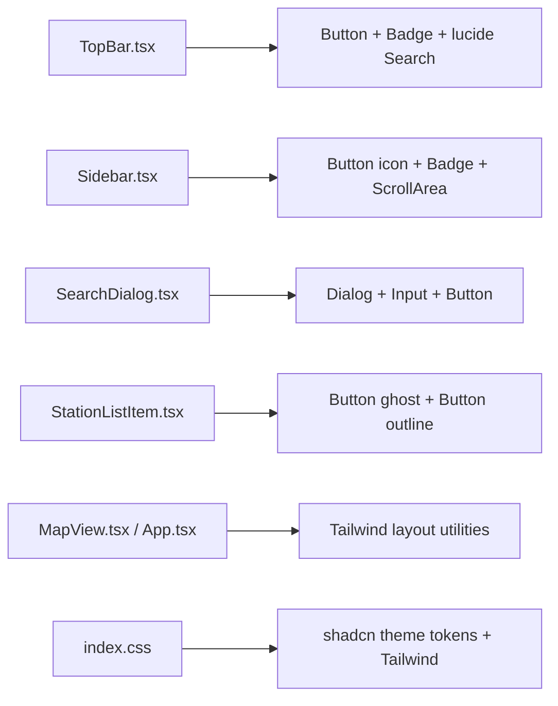

# 28 - Frontend shadcn/ui migration plan

Status: implemented

## Problem

The frontend styles every UI region through a single hand-written
[`frontend/src/index.css`](../frontend/src/index.css:1) (~350 lines) with bespoke
class names (`.topbar`, `.sidebar`, `.dialog`, `.station-item`, …). Every visual
decision — spacing, colours, focus rings, hover states, a11y — is custom and has
to be maintained by hand. There is no design-system layer, no reusable component
library, and no path aliases.

## Goal

Migrate the frontend to **Tailwind CSS v4 + shadcn/ui** so UI primitives
(buttons, inputs, dialogs, badges, scroll areas) come from a maintained component
library, while the existing behaviour and Komoot-style layout stay intact. The
hand-written [`frontend/src/index.css`](../frontend/src/index.css:1) is replaced
by the shadcn theme tokens + Tailwind utilities, and the app keeps a green accent
using shadcn conventions (emerald primary on a neutral slate base).

## Decisions

1. **Tailwind v4 + the official Vite plugin.** The project is on Vite 7 /
   React 19 / TS 5.9, so use `tailwindcss` + `@tailwindcss/vite` (no
   `tailwind.config.js`; configuration lives in CSS via `@theme`). The shadcn CLI
   runs against this setup.
2. **Path alias `@/*` → `./src/*`.** Required by shadcn. Add it to
   [`frontend/tsconfig.json`](../frontend/tsconfig.json:1) (`baseUrl` + `paths`)
   and [`frontend/vite.config.ts`](../frontend/vite.config.ts:1) (`resolve.alias`
   via `node:path`). Add `@types/node` as a dev dependency for the alias in the
   Vite config.
3. **Fresh shadcn theme: emerald primary, slate neutral.** `npx shadcn@latest init`
   generates the neutral default; we then point `--primary` /
   `--primary-foreground` / `--ring` at the Tailwind emerald scale to keep a green
   accent. Light mode is the product default; the generated `.dark` variables are
   kept for future use but no toggle is added now.
4. **Reuse shadcn primitives, not custom CSS.** Convert the five UI regions to
   shadcn components (`Button`, `Input`, `Dialog`, `Badge`, `ScrollArea`,
   `Separator`) with Tailwind utility classes for layout. Icons come from
   `lucide-react`.
5. **Preserve Leaflet rendering.** Tailwind's preflight (`img { max-width: 100% }`)
   can squash Leaflet tiles/markers. Keep a small `@layer base` override
   (`.leaflet-container img { max-width: none !important }`) and express the map
   chrome with Tailwind utilities (`absolute inset-0 z-0`).
6. **No behaviour change.** Same endpoints, texts, keyboard shortcuts (`H`, `Esc`),
   debounce, loading/error states, and Komoot-style layout. Pure presentation
   migration.

## Component mapping



## Proposed structure (new/changed files)

```
frontend/
├── components.json                  # shadcn config (new)
├── package.json                     # + tailwindcss, @tailwindcss/vite, cva, clsx,
│                                    #   tailwind-merge, tw-animate-css, lucide-react,
│                                    #   @types/node, radix deps (via shadcn CLI)
├── tsconfig.json                    # + baseUrl / paths for @/*
├── vite.config.ts                   # + tailwindcss plugin + @ alias
└── src/
    ├── index.css                    # rewritten: tailwind import + theme + base
    ├── lib/utils.ts                 # cn() helper (new)
    ├── components/ui/               # shadcn components (new)
    │   ├── button.tsx
    │   ├── input.tsx
    │   ├── dialog.tsx
    │   ├── badge.tsx
    │   ├── scroll-area.tsx
    │   └── separator.tsx
    ├── App.tsx                      # Tailwind layout utilities
    ├── features/header/TopBar.tsx
    ├── features/sidebar/Sidebar.tsx
    ├── features/search/SearchDialog.tsx
    ├── features/stations/StationListItem.tsx
    └── features/map/MapView.tsx
```

## Conversion notes per region

### `App.tsx` (composition root)

- `.app` → `flex h-screen flex-col`
- `.workspace` → `relative flex min-h-0 flex-1`
- `.map-area` → `relative min-w-0 flex-1`

State, keyboard shortcuts, `focusStation`, and wiring stay untouched.

### `TopBar.tsx`

- `.topbar` → `<header>` with
  `grid grid-cols-[1fr_auto_1fr] items-center gap-4 bg-primary px-4 py-2 text-primary-foreground shadow-md`
- `.brand` → `flex items-center gap-2 justify-self-start font-bold`
- search trigger → `<Button variant="ghost">` with the lucide `Search` icon and the
  existing width cap (`w-[26rem] max-w-[60vw] justify-start`)
- `.topbar-right` → `flex items-center gap-3 justify-self-end`
- `.global-summary` → `text-sm whitespace-nowrap text-primary-foreground/80`;
  error state → `text-red-200`

### `Sidebar.tsx`

- `.sidebar` → `<aside>` with `absolute inset-y-0 left-0 z-[500] flex w-[360px]
  min-h-0 flex-col border-r bg-background shadow-lg transition-[width]`;
  collapsed → `w-10 bg-primary` (keep `transition-[width]`)
- `.sidebar-edge` → `<Button variant="ghost" size="icon">` with lucide
  `ChevronRight`
- `.sidebar-header` → `flex items-center justify-between gap-2 border-b px-4 py-3`;
  `<h2>` → `flex-1 text-base font-semibold`
- `.count-badge` → `<Badge>` with the visible/total text
- `.collapse-toggle` → `<Button variant="ghost" size="icon">` with `ChevronLeft`
- `.station-list` → `<ScrollArea>` wrapping the `<ul>` (`flex-1 overflow-y-auto`)
- `.state` / `.state.error` → `p-4 text-sm text-muted-foreground` and
  `text-destructive font-semibold`

### `SearchDialog.tsx`

- Replace the custom overlay/dialog with shadcn `Dialog` (Radix) — `DialogContent`,
  `DialogHeader`, `DialogTitle` (sr-only), `DialogDescription` (sr-only).
- `DialogContent` gets `p-0` + a max-width matching the old
  `width: min(560px, 90vw)`, with the input row as a header strip.
- filter `<input>` → shadcn `Input` with the lucide `Search` icon; clear/close →
  `<Button variant="ghost" size="icon">` (`X`) and a `Close` button.
- Radix handles overlay click-to-close and focus trapping natively.

### `StationListItem.tsx`

- `.station-item` → `<li>` with `flex items-stretch border-b`
- `.station-item-main` → `<Button variant="ghost">` with
  `flex w-full flex-col items-start gap-0.5 rounded-none px-4 py-3 text-left`
- `.station-name` → `font-semibold`; `.station-description` →
  `truncate text-sm text-muted-foreground`; `.station-meta` →
  `text-xs text-muted-foreground`
- `.station-find` → `<Button variant="outline" size="sm">` (self-aligned)

### `MapView.tsx`

- `<MapContainer className="map">` → `className="absolute inset-0 z-0"`
- Leaflet CSS still comes from [`lib/leaflet.ts`](../frontend/src/lib/leaflet.ts:5);
  add the preflight override to `index.css`.

## Steps

1. Scaffold shadcn: add Tailwind v4 + `@tailwindcss/vite`, the `@` alias in
   `vite.config.ts` and `tsconfig.json`, `components.json`, `@types/node`, and
   rewrite `index.css` with the emerald/slate theme + base layer (incl. the
   Leaflet override).
2. Add `src/lib/utils.ts` (`cn`) and generate the shadcn components
   (`button`, `input`, `dialog`, `badge`, `scroll-area`, `separator`) + install
   `lucide-react`.
3. Convert `App.tsx` to Tailwind layout utilities.
4. Convert `TopBar.tsx`.
5. Convert `Sidebar.tsx`.
6. Convert `SearchDialog.tsx`.
7. Convert `StationListItem.tsx`.
8. Convert `MapView.tsx` map chrome.
9. Remove all obsolete hand-written classes from `index.css`.
10. Verify: `npm run build` (tsc + vite) and a dev smoke test (sidebar
    collapse/expand, search dialog open/close/filter/find-on-map, map pan +
    markers, `H`/`Esc` shortcuts).
11. Update docs ([`ToDo.md`](../ToDo.md:1) + [`plans/README.md`](../plans/README.md:1)).

## Verification

- `cd frontend && npm run build` green (TypeScript strict + Vite production build).
- Visual parity with the current Komoot-style layout, now on the emerald theme.
- Leaflet tiles, markers, and popups render correctly (preflight override in place).
- No backend change → backend gates (`make check`, `make test`) unaffected.
