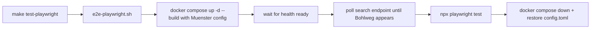

# 29 - Playwright end-to-end testing plan

Status: implemented

## Problem

The frontend's interactive behaviour — clicking a map marker to open its popup,
finding a station through the search bar, and the sidebar listing exactly the
stations visible in the current viewport — is only verified by hand. There is no
browser-level test: [`make test-e2e`](../Makefile:39) is a curl/psql smoke test
against the real stack but configures no data source, so the map has no markers
and the UI interactions are never exercised. Regressions in the marker/popup,
search/find-on-map, or visible-station filtering logic would ship unnoticed.

## Goal

Set up **Playwright** end-to-end tests for the React frontend that run against
the real Docker Compose stack (nginx → backend BFF → Postgres) with a real
Münster import, covering three scenarios:

1. Selecting a point on the map opens a popup with that station's name.
2. The search bar finds a station and "Find on map" opens the matching popup.
3. The sidebar renders only the stations visible in the current map viewport
   (and stays consistent with the map markers).

Wire the tests into the [`Makefile`](../Makefile:1) and document how to run and
update them in [`agents.md`](../agents.md:1).

## Decisions

1. **True end-to-end against the real stack.** Playwright targets the nginx-served
   production frontend at `http://localhost:8081` with the real backend/BFF and a
   real `Münster` data source (import from GitHub). This exercises the full path
   nginx → `/api/bff/*` → Postgres, not a mocked frontend. The trade-off is a
   network dependency on GitHub and a slow first import; the orchestration script
   waits for the **station phase** (fast) rather than the full multi-year
   measurements import.
2. **Location & tooling.** Tests live in [`frontend/e2e/`](../frontend/package.json)
   with config in [`frontend/playwright.config.ts`](../frontend/package.json).
   `@playwright/test` becomes a devDependency and a `test:e2e` npm script is
   added. The production build (`tsc && vite build`) is unaffected because
   `tsconfig.json` only includes `src`, so the e2e files are type-checked by
   Playwright's own transpiler.
3. **Chromium only.** One deterministic desktop Chromium project (1280×800).
   Firefox/WebKit can be added later without structural changes.
4. **Minimal, a11y-positive test hooks.** Map markers get `alt` and `title` equal
   to the station name in [`MapView.tsx`](../frontend/src/features/map/MapView.tsx:32)
   (Leaflet forwards both to the marker ``). This lets Playwright locate a
   marker by name and assert its popup, and it improves accessibility. No other
   frontend behaviour changes.
5. **Sidebar consistency invariant.** The map markers and the sidebar both derive
   from the same viewport bounds and are fetched together (`Promise.all` in
   [`useVisibleStations`](../frontend/src/features/stations/useVisibleStations.ts:17)),
   and both only include *positioned* stations inside the bounds. The sidebar test
   therefore asserts `marker count == sidebar item count == badge visible_count`,
   and that zooming in reduces the visible set — this is the "only the visible
   ones are rendered" check without hardcoding which station is off-screen.
6. **Dedicated make target.** A new `test-playwright` target runs a new
   [`scripts/e2e-playwright.sh`](../scripts) (boot → wait → test → teardown),
   mirroring [`scripts/docker-compose-test.sh`](../scripts/docker-compose-test.sh:1)
   but with a data source configured. The existing `make test-e2e` smoke test is
   left untouched.

## Run flow



## Proposed structure (new/changed files)

```
frontend/
├── package.json                  # + @playwright/test devDep, + test:e2e script
├── playwright.config.ts          # new: chromium, baseURL http://localhost:8081
├── e2e/                          # new
│   ├── map.spec.ts               # marker click -> popup
│   ├── search.spec.ts            # search -> find on map -> popup
│   └── sidebar.spec.ts           # visible-stations invariant + zoom
└── src/features/map/MapView.tsx  # + alt/title = station name on markers

scripts/
└── e2e-playwright.sh             # new: boot stack + wait + run Playwright + teardown

Makefile                          # + test-playwright, + playwright-install targets
.gitignore                        # + Playwright artifacts
agents.md                         # + gate + how to run/update Playwright e2e
README.md                         # + Running tests section
ToDo.md                           # + checklist for this plan
plans/README.md                   # + register this plan
```

## Test spec details

### `map.spec.ts` — selecting points on the map

- `page.goto('/')` and wait for at least one `.leaflet-marker-icon`.
- Take the first marker, read its `alt` (the station name), click it.
- Assert `.leaflet-popup-content` contains that same name.

### `search.spec.ts` — popups via the search bar

- Open the search dialog via the header button `Search counting stations…`.
- Type `Bohlweg` into the input placeholder `Filter stations by name or
  description…`.
- Click the **Find on map** button on the `Bohlweg` result.
- Assert the dialog closes and `.leaflet-popup-content` contains `Bohlweg`
  (the popup opened by [`focusStation`](../frontend/src/App.tsx:35)).

### `sidebar.spec.ts` — only visible stations rendered

- Wait for the sidebar header `Visible counting stations` and the badge.
- Parse `visible / total` from the badge.
- Assert `badge visible == count of sidebar <li> items` and
  `marker count == sidebar item count`.
- Click `.leaflet-control-zoom-in` a couple of times, wait for the debounced
  re-fetch, and assert the visible set shrinks while the invariant still holds.

## Steps

1. Create this plan file and register it in [`plans/README.md`](../plans/README.md:1).
2. Add `@playwright/test` + a `test:e2e` script to
   [`frontend/package.json`](../frontend/package.json:1) and regenerate
   `package-lock.json` (`npm install`).
3. Create [`frontend/playwright.config.ts`](../frontend/package.json) (Chromium,
   `baseURL` from `FRONTEND_URL` defaulting to `http://localhost:8081`, list +
   html reporters, trace/screenshot on failure).
4. Add `alt` + `title` (station name) to the map markers in
   [`frontend/src/features/map/MapView.tsx`](../frontend/src/features/map/MapView.tsx:32).
5. Add [`frontend/e2e/map.spec.ts`](../frontend/package.json).
6. Add [`frontend/e2e/search.spec.ts`](../frontend/package.json).
7. Add [`frontend/e2e/sidebar.spec.ts`](../frontend/package.json).
8. Add [`scripts/e2e-playwright.sh`](../scripts) (config backup/restore, compose
   up, wait for `/health/ready`, poll `/api/bff/stations/search` for `Bohlweg`,
   run `npx playwright test`, teardown via trap).
9. Add `test-playwright` + `playwright-install` to the [`Makefile`](../Makefile:1)
   (`.PHONY` + help).
10. Add Playwright artifacts to [`.gitignore`](../.gitignore:61)
    (`frontend/test-results/`, `frontend/playwright-report/`,
    `frontend/blob-report/`).
11. Update [`agents.md`](../agents.md:19) — add `make test-playwright` to the
    gates table, document where the tests live and how to run/update them, and
    extend the definition of done.
12. Update [`README.md`](../README.md:414) (`Running tests`) and
    [`ToDo.md`](../ToDo.md:1).
13. Verify.

## Verification

- `make playwright-install` installs the Chromium browser once.
- `make test-playwright` green: boots the real stack, imports Münster stations,
  and all three specs pass.
- `make frontend-build` green (no impact from the e2e files; `tsc` only includes
  `src`).
- Backend gates unaffected: `make check` and `make test-rest` green.
