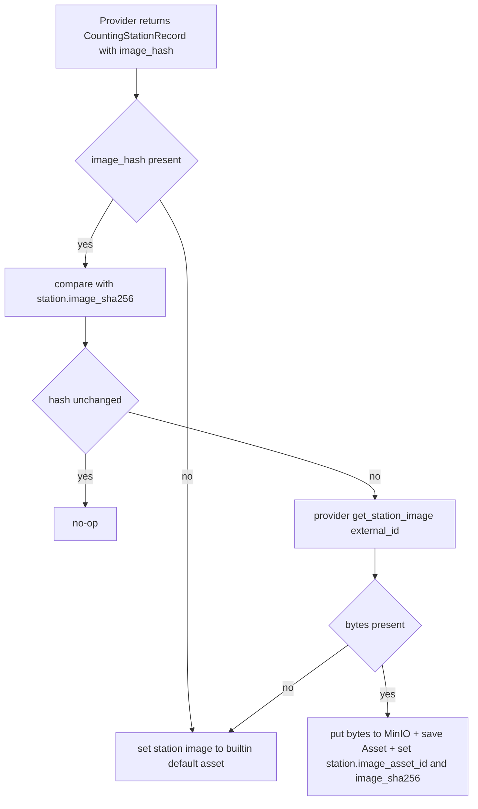

# 32 - Counting-station overview page + provider-provided images

Status: implemented

## Problem

Clicking a counting-station on the map currently only opens a small Leaflet popup
showing the name. There is no way to see a station's key facts (image, name,
description, bikes in the last day / 7 days / month, last data update) or a trend
per metric. Stations also have no images at all.

## Goal

1. Replace the sidebar with a **station overview panel** when a marker is clicked
   (same size/style as the sidebar, Komoot-like). Clicking the map void closes it.
2. The overview shows: image, name (linking to a future detail page), description,
   key facts with per-metric trend arrows, channel count and last data update.
3. Add a **BFF endpoint** for the overview and an image **streaming endpoint**.
4. Introduce an **assets/images** subsystem:
   - Images are provided by the data-source **provider adapters** (with hash-based
     change detection), not by user uploads. No upload/delete API.
   - A default/sample image is provided in source code and embedded in the backend
     binary, idempotently synced to object storage.
   - Binary data lives in **MinIO** (S3-compatible); PostgreSQL stores only
     metadata + the station↔asset link.
   - The BFF streams images from MinIO (never exposes MinIO to the browser).

## Scope decision (confirmed with user)

- **Docker only** — no Kubernetes manifests.
- Metrics use **complete calendar periods** in the station's timezone, consistent
  with the existing "previous complete local day" convention: previous full local
  day, previous 7 full local days, previous full calendar month; each trend
  compares the period with the immediately preceding period of equal length.
- **No upload/delete artifact endpoints.** Images come from providers + built-ins.

## Architecture

### New domain module `core/domain/assets`

- `asset.rs`: `Asset { id, object_key, content_type, byte_size, sha256, origin,
  created_at, updated_at }`, `AssetOrigin { Builtin, Provider }`, plus value
  objects (`ObjectKey`, `ContentType`, `ByteSize`, `Sha256`) and a plain
  `BuiltinImage { object_key, content_type, bytes }` data struct (no port).
- `repository_port.rs`: `AssetRepository` (driven port) — **station-agnostic**:
  `find_by_id`, `find_by_object_key`, `save` (idempotent on `object_key`),
  `list`, `all_object_keys()`. It knows nothing about counting stations.
- `asset_storage_port.rs`: `AssetStorage` (driven port) — the binary store, named
  in asset domain terms (not "object storage"):
  - blocking `ensure_bucket()`, `put(object_key, content_type, bytes) -> AssetObjectInfo { etag, byte_size }`,
    `list_object_keys()` and `delete(object_key)` (used from the import/startup/
    cleanup `spawn_blocking` contexts);
  - async `get_stream(object_key) -> AssetObjectStream { content_type, etag, byte_size, body }`
    (used by the BFF to stream to the browser).
- `service_port.rs`: `AssetServicePort` (driving port) — **station-agnostic**:
  - `sync_builtin_images(builtin: &[BuiltinImage])` (idempotent)
  - `default_asset() -> Asset` (the builtin fallback asset)
  - `store_provider_image(sha256, content_type, bytes) -> Asset`
  - `find_by_id(asset_id) -> Asset`

### CountingStation knows its asset

The `CountingStation` aggregate gains two optional fields (the station **owns**
the link, not the asset repository):

- `image_asset_id: Option<AssetId>` — the linked asset (FK).
- `image_sha256: Option<String>` — the persisted provider image hash used for
  change detection.

The `CountingStationRepository` (Postgres + all in-memory mocks) persists these
on `save`/`update`/`find`. The REST `CountingStationDto` is **not** changed to
expose them (BFF-only concern).

### New domain module `core/domain/station_overview`

- Model `StationOverview { station, channel_count, metrics, last_update }`, where
  each `MetricWindow { key, current, previous }` holds the raw sums for a period
  and the period before it. `MetricKey { LastDay, Last7Days, LastMonth }`.
- `service_port.rs`: `StationOverviewServicePort::overview(station_id, now)`.
  The BFF handler resolves the image URL from `station.image_asset_id` via
  `AssetService::find_by_id` (falling back to the builtin default asset).

### Period helpers (DST-aware, in the station's timezone)

Add pure helpers alongside [`previous_local_day`](../backend/src/core/domain/counting_stations/counting_station.rs:68):
- `previous_local_days(tz, now, n)` → the `n` complete local days immediately
  before today.
- `previous_calendar_month(tz, now)` → the previous complete calendar month.

These live in the core and are unit-tested (the core 95% coverage gate applies).

### Hash-based image sync (import flow)

The provider reports an image **hash** cheaply with each station record, and the
core requests the actual image bytes only when that hash differs from the hash
persisted on the station (`CountingStation::image_sha256`), or when the station
has no linked asset yet.



### Provider port extension

In [`provider_port.rs`](../backend/src/core/domain/data_source/provider_port.rs:138):
- Add `image_sha256: Option<String>` to `CountingStationRecord`.
- Add default method `fn get_station_image(&self, external_id: &str) ->
  Result<Option<StationImage>, ProviderError> { Ok(None) }` with
  `StationImage { sha256, content_type, bytes }`. Default no-op keeps existing
  mocks unaffected.

The Münster adapter returns `image_sha256: None` (the archive has no images), so
every station falls back to the built-in sample image until a real image source
is wired. A future provider implements `get_station_image` with real data.

### PostgreSQL schema (migration `V12__add_assets.sql`)

```sql
CREATE TABLE assets (
    id UUID PRIMARY KEY,
    object_key TEXT NOT NULL UNIQUE,
    content_type TEXT NOT NULL,
    byte_size BIGINT NOT NULL,
    sha256 TEXT NOT NULL,
    origin TEXT NOT NULL CHECK (origin IN ('builtin','provider')),
    created_at TIMESTAMPTZ NOT NULL DEFAULT now(),
    updated_at TIMESTAMPTZ NOT NULL DEFAULT now()
);

ALTER TABLE counting_stations ADD COLUMN image_asset_id UUID REFERENCES assets(id) ON DELETE SET NULL;
ALTER TABLE counting_stations ADD COLUMN image_sha256 TEXT;
```

The `CountingStation` aggregate **owns** the link (`image_asset_id`) and the
persisted provider hash (`image_sha256`); the assets repository stays
station-agnostic. Deleting an asset unlinks the station (`ON DELETE SET NULL`).

### Object-key strategy

- Builtin: `builtin/{name}` (e.g. `builtin/station-placeholder.jpg`) — stable,
  content in the repo/container image.
- Provider: `provider/{sha256}{extension}` — content-addressed (deduplicates when
  two stations share an image); extension derived from `content_type`.

### Configuration

Add an `[asset_storage]` section to [`config.toml.example`](../config.toml.example:1)
and a new `AssetStorageConfiguration` value object + getter in
[`configuration.rs`](../backend/src/core/domain/configuration/configuration.rs:82),
parsed by [`configuration_toml_adapter.rs`](../backend/src/adapter/driven/configuration_toml_adapter.rs:13).
Also add the two asset-cleanup job settings (a second cron + a ShedLock max
lifetime, mirroring `data_source_update_cron` /
`data_source_update_max_lifetime_seconds`):

```toml
[asset_storage]
endpoint = "http://minio:9000"
access_key = "minioadmin"
secret_key = "minioadmin"
bucket = "bike-counter-images"
region = "us-east-1"

# CRON for the asset cleanup job (default: daily at 04:00).
asset_cleanup_cron = "0 0 4 * * *"
# REQUIRED ShedLock-style max lifetime for the asset cleanup job in seconds.
asset_cleanup_max_lifetime_seconds = 3600
```

### Docker compose

Add a private `minio` service (persistent named volume, **no host port**) and make
`backend` depend on its health. **Network isolation**: MinIO is placed on a
dedicated `internal` network shared only with the backend, so `db` and `frontend`
(and anything else on the default network) cannot reach it; only the backend can.

```yaml
networks:
  asset_network:
    internal: true

services:
  backend:
    networks:
      - default        # reachable by frontend; has internet for the GitHub import
      - asset_network  # private link to MinIO

  minio:
    image: minio/minio:latest
    container_name: bike_counter_minio
    restart: unless-stopped
    command: server /data
    environment:
      MINIO_ROOT_USER: minioadmin
      MINIO_ROOT_PASSWORD: minioadmin
    volumes:
      - minio_data:/data
    networks:
      - asset_network
    # no ports: MinIO is reachable only from within asset_network (the backend)
    healthcheck:
      test: ["CMD", "curl", "-f", "http://localhost:9000/minio/health/live"]
      interval: 5s
      timeout: 5s
      retries: 10

volumes:
  minio_data:
```

`db` and `frontend` stay on the implicit `default` network and are therefore
unable to reach `minio`. (Use `minio/minio:latest` — the current image — or pin a
current `RELEASE.*` tag during implementation; do not use an outdated tag.)

### S3 client

Use `rust-s3` (crate `s3`, `features = ["with-tokio"]`) — a lean S3-compatible
client that talks to MinIO with `Region::Custom` + path-style addressing, and
supports both blocking `put_object`/`head_object` (import/startup) and async
`get_object_stream` (BFF streaming). `aws-sdk-s3` is the heavier alternative and
is intentionally avoided. Add `sha2` for computing the built-in image hash.

### Asset cleanup job

A new scheduled job type `asset_cleanup` (tracked in the `jobs` table like
`data_source_update`) periodically deletes **orphaned objects**: object keys in
MinIO that have no row in the `assets` table (e.g. left behind when a provider
image hash changes, or after a crash between `put` and `save`).

- New core application service `AssetCleanupService` with `run_if_due()`,
  mirroring [`DataSourceUpdateService`](../backend/src/core/application/data_source_update_service.rs:35):
  expire stale RUNNING jobs, skip while one is RUNNING, run when never
  succeeded or overdue. It computes `orphans = list_object_keys() -
  all_object_keys()` and deletes each orphan via `AssetStorage::delete`, recording
  `orphaned_objects` / `deleted_objects` in the job metadata.
- New generic driving port `ScheduledJobPort { fn run_if_due(&self) }` (in the
  `jobs` domain); both `DataSourceUpdateService` and `AssetCleanupService`
  implement it. [`run_scheduler`](../backend/src/adapter/driving/job_scheduler.rs:19)
  is generalized to `(Arc<dyn ScheduledJobPort>, cron: String)`, and
  [`main.rs`](../backend/src/main.rs:188) spawns it twice — once per cron.
- Config: `asset_cleanup_cron` (validated, default `"0 0 4 * * *"`) +
  `asset_cleanup_max_lifetime_seconds` (required, ShedLock-style, no default),
  exposed via `Configuration` getters.

### Endpoints

- `GET /api/bff/station-overview/{id}` — a **page-shaped BFF preview payload**: everything
  the overview panel needs to render, and only that page. It is a flat JSON
  object (`id`, `name`, `description`, `latitude`, `longitude`, `channel_count`,
  `image_url`, `metrics[]`, `last_update`, `detail_url`) with **no HATEOAS
  `_links`, no `data_source_id`, and no reuse of the REST `CountingStationDto`**.
  The overview DTO and any shared mapping helpers live entirely inside the BFF
  module.
- `GET /api/bff/assets/{id}/content` — streams the image from MinIO with
  `Content-Type`, `ETag`, `Content-Length` and a suitable `Cache-Control`
  (`immutable` for builtin, short-lived for provider). BFF-owned, frontend-only.

Trends (`up`/`down`/`flat` + percentage delta) are computed in the BFF DTO mapping
from the domain's raw `current`/`previous` sums. `detail_url` is `/stations/{id}`
(the future detail page — not implemented now, rendered as an external link).
No REST-standard artifact/upload endpoints are introduced.

### Frontend

- New `features/stationOverview/`: `types.ts`, `api.ts`, `useStationOverview.ts`,
  `StationOverview.tsx`, `TrendIcon.tsx` (lucide `TrendingUp`/`TrendingDown`/`Minus`).
- [`App.tsx`](../frontend/src/App.tsx:14): add `selectedStationId` state. Marker
  click sets it (overview replaces the sidebar); map-void click clears it.
- [`MapView.tsx`](../frontend/src/features/map/MapView.tsx:31): marker
  `eventHandlers.click` → select; popup renders name + external detail link;
  a `useMapEvents({ click })` closes the overview on void clicks.

## Implementation notes

- **MinIO bucket creation is delegated to a one-shot `minio/mc` container**
  (`minio-init` in docker-compose) instead of the SDK: `rust-s3` does not expose
  a `create_bucket` API, so `MinioAssetStorage::ensure_bucket` only verifies the
  bucket exists (a `list` call). The backend `depends_on` `minio-init` with
  `service_completed_successfully`.
- **`rust-s3` is pinned to `0.32`** (features `["with-tokio"]`). Its
  `ResponseData`-era API is used: `put_object_with_content_type` →
  `ResponseData`, `list` → `Vec<ListBucketResult>`,
  `get_object_stream(path, &mut AsyncWrite)`, `delete_object`. Because those
  methods are async, `MinioAssetStorage` owns a tokio runtime for the blocking
  `put`/`list_object_keys`/`delete` calls and streams `get_stream` through a
  `ChunkWriter` (AsyncWrite → mpsc channel) wrapped in `futures::stream::unfold`,
  so the BFF never buffers a whole image.
- **`get_stream` returns a boxed future** (`Pin<Box<dyn Future<...> + Send>>`)
  because `async fn` in a trait is not dyn-compatible.
- **sha2 alias**: the hasher is imported as `sha2::Sha256 as Sha2Digest` to
  avoid a name clash with the `Sha256` value object in the assets domain.
- **TOML placement**: bare top-level keys (`asset_cleanup_*`) must not follow a
  `[[data_sources]]`/sub-table header, so the test helpers prepend them and put
  `[asset_storage]` at the very end.
- **Docker musl build — vendored OpenSSL**: `rust-s3` pulls `openssl` via
  `native-tls` (both `reqwest` and `aws-creds` → `attohttpc`), so it cannot be
  avoided by switching TLS backends. Alpine's `openssl-dev` ships only shared
  `.so` libraries, so the fully-static musl link fails with `cannot find -lssl`.
  The [`backend/Dockerfile`](../backend/Dockerfile:1) therefore adds `perl make`
  to the builder and [`backend/Cargo.toml`](../backend/Cargo.toml:17) enables
  the `openssl` crate's `vendored` feature, which compiles a static OpenSSL into
  the binary. The Dockerfile also `COPY assets ./assets` (and touches it in the
  mtime-bump) so `include_bytes!("../assets/station-placeholder.jpg")` works in
  the container.
- **Frontend void-click**: `useMapEvents` requires the Leaflet map context that
  only `<MapContainer>`'s children have, so the map-void click handler lives in
  its own child component (`MapVoidClickHandler`) inside the map — calling it
  from `MapView` itself crashes the app at render.

## Task list

See the plan todo list (tracked via `update_todo_list`).

## Verification

- `make check` (fmt + clippy `-D warnings`) green.
- `make test` and `make test-rest` green (new core unit tests + adapter tests).
- `make coverage` green (core ≥ 95%, overall ≥ 80%).
- `make frontend-build` green.
- `make test-playwright` green (existing specs + new overview/popup assertions).
- Manual: `make run`, click a marker → overview with sample image + trends;
  click map void → sidebar returns; popup shows the detail link.

## Definition of done

- [x] Migration `V12` + asset domain + Postgres/MinIO adapters + built-in image.
- [x] Provider port extension + hash-based image sync in the import service.
- [x] Station-overview domain service + BFF overview + streaming endpoints.
- [x] Frontend overview panel, map popup link, void-click close.
- [x] Config + docker-compose MinIO wiring, sample image embedded.
- [x] [`README.md`](../README.md:1) updated.
- [x] All gates green (fmt/clippy, unit + rest tests, coverage, frontend build,
      Playwright).
