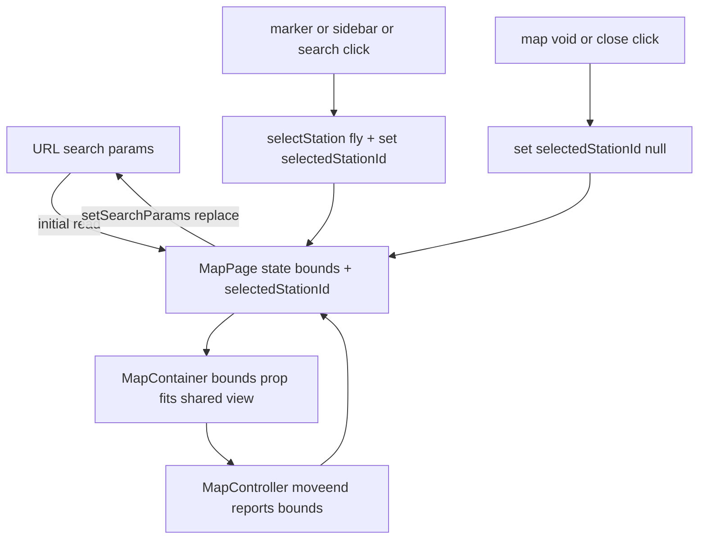

# 34 - Counting-station detail route + URL-encoded map/overview state

Status: implemented

## Problem

The frontend is a single un-routed page. The "Open detail page" links already
point at `/stations/{id}` (overview heading in
[`StationOverview.tsx`](../frontend/src/features/stationOverview/StationOverview.tsx:34)
and the map popup in [`MapView.tsx`](../frontend/src/features/map/MapView.tsx:71)),
but there is no route for it. The app also keeps the current map view and the
open station overview only in React state, so sharing the URL neither restores
the selected view nor the open overview nor a station's detail page.

## Goals

1. Add a `/stations/:id` route rendering a **blank** detail page for now (the
   counting-station-id is part of the URL).
2. Persist the map's visible bounding box in the URL (`min_lat`, `min_lng`,
   `max_lat`, `max_lng`), so sharing a link restores the same view via
   `map.fitBounds`.
3. Persist the open station overview as a `station=<id>` query param, so sharing
   keeps the selected overview.

## Out of scope

- Implementing the detail page content (blank placeholder only).
- Changing the existing `target="_blank"` detail links; they already produce
  `/stations/{id}` and keep opening in a new tab.

## Scope decisions (confirmed with user)

- The visible area is encoded as a bounding box (`min_lat` / `min_lng` /
  `max_lat` / `max_lng`), reusing the existing `Bounds` type
  ([`geo.ts`](../frontend/src/lib/geo.ts:4)) and the `bboxQuery` serialization,
  restored via Leaflet `fitBounds`.
- The station overview is encoded as `station=<id>` on the map route.
- Routing uses `react-router-dom` (`BrowserRouter`): the app will grow more
  routes (the detail page later replaces the blank placeholder), so a real
  router is the right foundation.

## URL scheme

- Map: `/?min_lat=…&min_lng=…&max_lat=…&max_lng=…[&station=<id>]`
- Detail: `/stations/<id>`

## Architecture

Add `react-router-dom` and wrap the app in a `BrowserRouter`. [`App.tsx`](../frontend/src/App.tsx:22)
becomes a thin route table:

- `/` → `MapPage` (the current map/sidebar/search/overview composition).
- `/stations/:stationId` → `StationDetail` (blank placeholder).

`MapPage` owns the URL↔state bridge:

- Initial state is read once from `useSearchParams()`: a new `parseBoundsQuery`
  helper in [`geo.ts`](../frontend/src/lib/geo.ts:14) parses and validates the
  four params (finite numbers, `min < max`, valid lat/lng ranges); `station`
  becomes the initial `selectedStationId`.
- A single sync effect writes `bounds` + `selectedStationId` back with
  `setSearchParams(params, { replace: true })`, guarded so it only navigates when
  the serialized value actually changed (no history spam on `moveend`, no
  render loop).
- `selectStation` ([`App.tsx`](../frontend/src/App.tsx:49)) and the overview-close
  paths keep working unchanged; their state updates flow through the same sync
  effect.

`MapView` gains an optional `initialBounds` prop: when present, `MapContainer`
receives `bounds={[[min_lat,min_lng],[max_lat,max_lng]]}` so Leaflet fits the
shared view on mount; otherwise it keeps the Münster default center/zoom
([`MapView.tsx`](../frontend/src/features/map/MapView.tsx:39)).

## Changes

### Dependency

- `frontend/package.json`: add `react-router-dom` and regenerate
  `frontend/package-lock.json`.

### Router

- [`main.tsx`](../frontend/src/main.tsx:6): wrap `<App/>` in `<BrowserRouter>`.
- [`App.tsx`](../frontend/src/App.tsx:22): replace the composition with a
  `<Routes>` table for `/` and `/stations/:stationId`.
- [`features/map/MapPage.tsx`](../frontend/src/features/map/MapPage.tsx:1): new
  file holding the current `App` body plus the URL-state bridge.
- [`features/stationDetail/StationDetail.tsx`](../frontend/src/features/stationDetail/StationDetail.tsx:1):
  new blank placeholder (`useParams()` for the id, renders an empty page).

### Geo helpers

- [`geo.ts`](../frontend/src/lib/geo.ts:14): add `parseBoundsQuery` (parse +
  validate the four params) and `serializeBounds` (reuse `bboxQuery`); round
  values to ~6 decimal places so URLs stay short.

### Map view

- [`MapView.tsx`](../frontend/src/features/map/MapView.tsx:25): accept and apply
  an optional `initialBounds` prop.

### e2e

- Add a new `frontend/e2e/url.spec.ts` (or extend `map.spec.ts`): assert bbox
  params appear after load, `station` appears/disappears with overview
  open/close, and `/stations/:id` renders the blank page.

### Docs

- Register [`plans/34_..._plan.md`](34_counting_station_detail_route_and_url_state_plan.md)
  in [`plans/README.md`](../plans/README.md:1); update [`ToDo.md`](../ToDo.md:1).

## Task list

See the plan todo list (tracked via `update_todo_list`).

## Verification

- `make frontend-build` green.
- `make test-playwright` green (existing specs + the new URL-state spec).
- Manual: pan/zoom → URL bbox updates; copy the URL → the same view restores;
  click a marker → `station=<id>` appears; close → removed; open
  `/stations/<id>` → blank page.

## Definition of done

- [x] `/stations/:id` renders a blank detail page.
- [x] The map bbox (min/max lat/lng) is in the URL and restores the view.
- [x] The open station overview (`station=<id>`) is in the URL and restored.
- [x] `make frontend-build` and `make test-playwright` green (6 specs), plus
      `make check` / `make test-rest` (backend untouched).
- [x] `plans/README.md` and `ToDo.md` updated.
