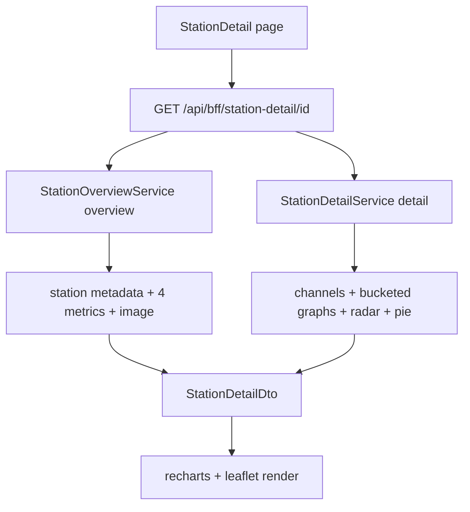

# 35 - Counting-station detail page (layout + stats + graphs)

Status: drafted

## Problem

[`StationDetail.tsx`](../frontend/src/features/stationDetail/StationDetail.tsx:1) is a blank
placeholder. The routing/URL-state groundwork from plan 34 is already in place
(`/stations/:id`, map bbox and open overview in the URL), so this plan fills the
detail page with the real content: station image, a highlighted map, the name and
description, overview stat boxes (incl. a new **year** stat), the detailed graph
view and the "nerd stats" per channel.

The backend currently only supports **scalar** sums
([`MeasurementRepository::sum`](../backend/src/core/domain/measurements/repository_port.rs:28))
and raw paged reads. All graph data therefore needs new time-bucketed aggregation
in Postgres plus a new page-shaped BFF endpoint.

## Scope

In scope (the shadcn list only, confirmed with user):

1. Back navigation from the detail page to the map without breaking the UI.
2. Top-left station image (half the screen), page keeps horizontal space left/right.
3. Top-right map with a highlighted station indicator.
4. Second row: name + description.
5. Overview stat boxes (same component as the overview panel) + a new **year** stat.
6. Detailed stats — graph view, one graph per half-page, labeled axes, rendered
   with a chosen frontend charting library:
   - Last day (5-minute precision)
   - Radar chart for week days
   - Current week + last week (15-minute precision; render leftover days empty)
   - Last 30 days (30-minute precision) + a small info note
   - Current year + last year (1-day precision)
7. Nerd stats: all above stats by channel + a pie chart by channel.

Out of scope: the URL state / link test automation from requirements 1–4 of the
original message (already implemented in plan 34).

## Decisions / assumptions

- **Charting: the shadcn Chart component** (`https://ui.shadcn.com/charts/line`),
  built on Recharts (the library shadcn charts use) — no separate charting
  framework. Added as the shadcn `chart` component plus its `recharts` dependency.
- **All time-series graphs are line charts** (shadcn line Chart). The nerd-stats
  graphs overlay one line per channel. The weekday chart stays a radar and the
  channel share stays a pie (both available through the same Recharts-based shadcn
  chart styling).
- **Week-day radar + channel pie aggregate over the last 30 days** (user decision),
  matching the Last-30-Days graph; a small info note on that graph states this.
- **No zero-filling**: the backend returns only buckets that actually contain
  data. The current week/year therefore simply end at the latest data point, so
  the user sees they are not over yet (no future empty slots are fabricated).
- All bucketing is **timezone-aware** (the station's own IANA timezone, like the
  existing last-day summary), using PostgreSQL `date_bin` on the local timestamp.
- Adding `last_year` to the shared overview endpoint means the **overview panel
  also gains the year box** (4 boxes). This is the intended "same component"
  behaviour; flag here if it should instead stay 3 on the panel.
- The back-to-map affordance is a plain `<Link to="/">`; the map already restores
  from any bbox params and otherwise falls back to the Münster default view.

## URL scheme (unchanged from plan 34)

- Map: `/?min_lat=…&min_lng=…&max_lat=…&max_lng=…[&station=<id>]`
- Detail: `/stations/<id>` — gains a "back to map" control, no new params.

## Backend architecture

### 1. Time-window helpers ([`counting_station.rs`](../backend/src/core/domain/counting_stations/counting_station.rs:68))

Add DST-aware helpers next to the existing day/month ones:

- `calendar_year_window(tz, now, years_back)` and `previous_calendar_year(tz, now)`
  — complete local calendar year as a closed UTC interval.
- `local_year_start(tz, now)` — Jan 1 00:00 local as a UTC instant.
- `local_week_start(tz, now)` — Monday 00:00 local as a UTC instant.

### 2. Year metric ([`station_overview`](../backend/src/core/domain/station_overview/mod.rs:37))

- Add `MetricKey::LastYear` (`"last_year"`) to `MetricKey` + `MetricKey::ALL`.
- [`StationOverviewService`](../backend/src/core/application/station_overview_service.rs:68)
  computes the year window (previous full year vs the year before) and appends it.
- Update `MetricDto` doc comment ([`bff/dto.rs`](../backend/src/adapter/driving/bff/dto.rs:126)).

### 3. Measurement repository — bucketed reads

Add value types + four methods to
[`MeasurementRepository`](../backend/src/core/domain/measurements/repository_port.rs:4)
(no default bodies; all implementors updated):

```rust
pub struct TimeBucket    { pub start: DateTime<Utc>, pub total: i64 }
pub struct ChannelBucket { pub channel_id: Uuid, pub start: DateTime<Utc>, pub total: i64 }
pub struct WeekdayTotal  { pub weekday: u8, pub total: i64 } // ISO 1=Mon..7=Sun
pub struct ChannelTotal  { pub channel_id: Uuid, pub total: i64 }

fn sum_buckets(from, to, bucket_seconds: i64, origin: DateTime<Utc>, timezone: &str,
               channel_ids: &[ChannelId]) -> Result<Vec<TimeBucket>, DomainError>;
fn sum_buckets_by_channel(from, to, bucket_seconds, origin, timezone,
               channel_ids: &[ChannelId]) -> Result<Vec<ChannelBucket>, DomainError>;
fn sum_weekdays(from, to, timezone, channel_ids: &[ChannelId])
               -> Result<Vec<WeekdayTotal>, DomainError>;
fn sum_by_channel(from, to, channel_ids: &[ChannelId])
               -> Result<Vec<ChannelTotal>, DomainError>;
```

`origin` is the UTC instant of the local alignment origin (e.g. local midnight /
Monday 00:00 / Jan 1 00:00); the SQL converts it and the measurement timestamps
to the station timezone before bucketing, so 5/15/30-minute and 1-day buckets
align to local time and DST transitions are handled by the timezone conversion.

Postgres implementation (`date_bin`, **requires PostgreSQL 16**: the
`date_bin(interval, timestamp, timestamp)` overload for naive timestamps was only
added in 16 — the compose image is `postgres:16-alpine` and the bucketed
testcontainers test is pinned to the same tag):

```sql
SELECT (date_bin(make_interval(secs => $2::float8),
                 timestamp AT TIME ZONE $3,
                 $4::timestamptz AT TIME ZONE $3)
        AT TIME ZONE $3) AS bucket,
       COALESCE(SUM(value), 0)::bigint AS total
FROM measurements
WHERE channel_id = ANY($1::uuid[])
  AND timestamp >= $5 AND timestamp <= $6
GROUP BY bucket
ORDER BY bucket;
```

- `make_interval(secs => $2::float8)` pins `$2` to `double precision`; the Rust
  side passes `bucket_seconds as f64` so the binary wire type matches the
  inferred parameter type (an `i64` would be encoded as `int8` and rejected).
- `sum_buckets_by_channel` adds `channel_id` to the SELECT/GROUP BY.
- `sum_weekdays` groups by `EXTRACT(ISODOW FROM (timestamp AT TIME ZONE $2))`.
- `sum_by_channel` groups by `channel_id` over a plain time range.

All eight `MeasurementRepository` implementors are updated: the real
[`PostgresMeasurementRepository`](../backend/src/adapter/driven/postgres/measurement_repository.rs:19)
plus the seven in-memory test doubles (trivial `Ok(Vec::new())` bodies there; the
new detail-service test double implements the real bucketing for its tests).
Add testcontainers coverage tests for the four new Postgres methods (mirrors the
existing [`sum_sums_values…`](../backend/src/adapter/driven/postgres/measurement_repository.rs:504) test).

### 4. `station_detail` domain module

New [`backend/src/core/domain/station_detail/`](../backend/src/core/domain/station_detail):

- `mod.rs` — `StationDetail` (station + channels + graphs), `TimeBucket`,
  `WeekdayTotal`, `ChannelTotal`, `PerChannelSeries` and a `StationDetailGraphs`
  aggregate holding: `last_day`, `weekday_radar`, `current_week`, `last_week`,
  `last_30_days`, `current_year`, `last_year`, `per_channel`, `channel_pie`.
  `PerChannelSeries` carries the per-channel windows **plus its own
  `weekday_radar`** (folded from the per-channel 30-min buckets in the station's
  timezone), so the nerd-stats can show the weekday radar per channel too.
- `service_port.rs` — `StationDetailServicePort::detail(station_id, now)`.
- Register in [`core/domain/mod.rs`](../backend/src/core/domain/mod.rs:1).

### 5. `StationDetailService`

[`backend/src/core/application/station_detail_service.rs`](../backend/src/core/application/station_detail_service.rs)
(registered in [`application/mod.rs`](../backend/src/core/application/mod.rs:1)):

1. Find station, parse timezone, find channels (`channel_ids`, channel list).
2. Compute windows: previous local day (5 min), current week + previous week
   (15 min), previous 30 local days (30 min), current calendar year + previous
   calendar year (1 day).
3. For each window call `sum_buckets` (total) and `sum_buckets_by_channel`
   (per channel). Buckets are returned **only where data exists** — no zero
   filling — so the current week/year end at the latest data point.
4. `sum_weekdays` over the last 30 days → 7 radar entries; `sum_by_channel` over
   the last 30 days → pie entries.
5. Pivot per-channel buckets into one `PerChannelSeries` per channel, and fold
   each channel's 30-min `last_30_days` buckets into a per-channel `weekday_radar`
   using the station timezone (`with_timezone(&tz).weekday()`).

Unit tests cover: window boundaries (DST, year wrap), data-only output for the
incomplete current week/year (future buckets absent), radar weekday mapping,
per-channel pivoting and the timezone-aware per-channel weekday radar.

### 6. BFF endpoint + DTO

New `GET /api/bff/station-detail/{id}` in
[`bff/handlers.rs`](../backend/src/adapter/driving/bff/handlers.rs:1):

- Calls `station_overview_service.overview(id, now)` (station metadata + 4
  metrics incl. year + last_update) and `station_detail_service.detail(id, now)`
  (channels + graphs), resolves the image URL exactly like the overview handler,
  and returns a page-shaped `StationDetailDto`:

```
StationDetailDto {
  id, name, description, latitude, longitude, channel_count,
  image_url, last_update,
  metrics: [MetricDto],           // last_day, last_7_days, last_month, last_year
  channels: [{ id, name }],
  graphs: {
    last_day: [TimeBucketDto],
    weekday_radar: [WeekdayTotalDto],
    current_week: [TimeBucketDto],
    last_week: [TimeBucketDto],
    last_30_days: [TimeBucketDto],
    current_year: [TimeBucketDto],
    last_year: [TimeBucketDto],
    per_channel: [PerChannelSeriesDto],
    channel_pie: [ChannelTotalDto],
  },
}
```

- Add DTOs to [`bff/dto.rs`](../backend/src/adapter/driving/bff/dto.rs:1), register
  the route in [`rest/mod.rs`](../backend/src/adapter/driving/rest/mod.rs:89) and the
  handler + schemas in [`openapi.rs`](../backend/src/adapter/driving/rest/openapi.rs:1).

### 7. Wiring

[`main.rs`](../backend/src/main.rs:56): construct `StationDetailService` and pass it
through `RestApiAdapter::new` → `AppState`
([`rest/handlers/mod.rs`](../backend/src/adapter/driving/rest/handlers/mod.rs:47)).

## Frontend architecture

### Dependencies

- shadcn `chart` component (adds `recharts` 2.x + `lucide-react` chart icons).
- shadcn `card` + `tooltip` components (`@radix-ui/react-tooltip`).

### Shared stat box

Extract the metric `<li>` block from
[`StationOverview.tsx`](../frontend/src/features/stationOverview/StationOverview.tsx:100)
into a shared `MetricCard` component; add `last_year: 'Last year'` to
[`METRIC_LABELS`](../frontend/src/features/stationOverview/StationOverview.tsx:9).
Both the overview panel and the detail page render the same cards (the overview
endpoint now returns 4 metrics).

### Detail page ([`StationDetail.tsx`](../frontend/src/features/stationDetail/StationDetail.tsx:6))

- `useStationDetail(stationId)` hook + `api.ts` + `types.ts`.
- Top bar: shadcn `Button asChild` wrapping `<Link to="/">` (arrow-left "Back to
  map") — SPA navigation, map page unaffected.
- Layout (Tailwind, with horizontal page padding):
  - Row 1: two half-width columns — station image (object-cover) | `DetailMap`.
  - Row 2: station name (h1) + description.
  - Row 3: overview stat cards (`grid` of `MetricCard`s).
  - Row 4: detailed stats — 2-column grid of chart cards.
  - Row 5: nerd stats — per-channel multi-line charts + pie chart.
- `DetailMap`: a standalone `MapContainer` centered/zoomed on the station with a
  distinct highlighted marker icon (add `detailStationIcon` to
  [`lib/leaflet.ts`](../frontend/src/lib/leaflet.ts:1)). It reports its current
  bounds via a `MapController`-style callback; the whole map is clickable and
  navigates to `/` with `serializeBounds(bounds)` query params, so the full map
  opens showing exactly the visible part of the preview. The click uses a
  history-push `navigate` (not `replace`), so a browser "back" event returns to
  the detail page.

### Chart components (all built on the shadcn `chart` component)

- `TimeSeriesLineChart` (shadcn `ChartContainer` + `ChartTooltip` + recharts
  `LineChart`) — props: title, one or more series of buckets, X-axis tick
  formatter, Y-axis label "bikes"; used for every time-series graph. Week and
  year comparisons pass two series; nerd-stats pass one series per channel
  (overlaid lines with a channel legend).
- `WeekdayRadar` (recharts `RadarChart` inside `ChartContainer`) — 7 spokes
  Mon→Sun, value = bikes.
- `ChannelPie` (recharts `PieChart` inside `ChartContainer`) — channel share over
  the last 30 days.
- Each chart card is half-page (`grid-cols-1 md:grid-cols-2`), axes labeled, with
  the Last-30-Days card showing a muted info note: the radar + pie use the same
  30-day window.
- Nerd-stats: one line per channel overlaid per graph; colors cycle through the
  CSS `--chart-1..5` tokens.

## Data flow



## Changes

### Backend (split by hexagonal layer)

**Core — domain**

- [`counting_station.rs`](../backend/src/core/domain/counting_stations/counting_station.rs:68) — year + week helpers.
- [`station_overview/mod.rs`](../backend/src/core/domain/station_overview/mod.rs:37) — `LastYear`.
- [`measurements/repository_port.rs`](../backend/src/core/domain/measurements/repository_port.rs:4) — 4 bucketed-read methods + types (driven port).
- [`station_detail/`](../backend/src/core/domain/station_detail) — new domain module (models + `service_port`).

**Core — application**

- [`station_overview_service.rs`](../backend/src/core/application/station_overview_service.rs:68) — year window.
- [`station_detail_service.rs`](../backend/src/core/application/station_detail_service.rs) — new service.

**Adapter — driven (Postgres)**

- [`postgres/measurement_repository.rs`](../backend/src/adapter/driven/postgres/measurement_repository.rs:19) — `date_bin` SQL + tests.

**Adapter — driving (BFF)**

- [`bff/handlers.rs`](../backend/src/adapter/driving/bff/handlers.rs:1) — `station-detail/{id}` handler.
- [`bff/dto.rs`](../backend/src/adapter/driving/bff/dto.rs:1) — `StationDetailDto` + graph DTOs.
- [`rest/mod.rs`](../backend/src/adapter/driving/rest/mod.rs:89) — route.
- [`openapi.rs`](../backend/src/adapter/driving/rest/openapi.rs:1) — handler + schemas.

**Composition root / wiring**

- [`main.rs`](../backend/src/main.rs:56) — construct `StationDetailService`.
- [`rest/handlers/mod.rs`](../backend/src/adapter/driving/rest/handlers/mod.rs:47) — `AppState` + `RestApiAdapter` param.

### Frontend

- [`package.json`](../frontend/package.json:1) — shadcn `chart` component deps (`recharts`) + tooltip dep.
- [`StationOverview.tsx`](../frontend/src/features/stationOverview/StationOverview.tsx:100) — extract `MetricCard` + year label.
- [`features/stationDetail/`](../frontend/src/features/stationDetail/StationDetail.tsx:1) — page + api/types/hook + chart components + `DetailMap`.
- [`lib/leaflet.ts`](../frontend/src/lib/leaflet.ts:1) — highlighted detail marker icon.

### e2e

- New [`frontend/e2e/detail.spec.ts`](../frontend/e2e/url.spec.ts:1): open a station,
  navigate to its detail page, assert image/name/map/stat boxes (incl. "Last
  year") and the graph section render; click "Back to map" and assert the map +
  sidebar render again; click the detail-page map preview and assert the app
  routes to `/` (map view) with bbox params; then trigger a browser "back" event
  and assert the app re-routes to the station detail page `/stations/:id`.

## Verification

- `make check` green.
- `make test` and `make test-rest` green (new core unit tests + repo tests).
- `make coverage` green (core stays ≥ 95%, overall ≥ 80%).
- `make frontend-build` green.
- `make test-playwright` green (existing specs + `detail.spec.ts`).

## Definition of done

- [ ] Detail page renders image, highlighted map, name/description, overview
      cards (with year), the five graphs (labeled axes, half-page) and the
      nerd-stats (per-channel + pie) with the 30-day info note.
- [ ] Back navigation to `/` works without breaking the map UI.
- [ ] Clicking the detail-page map preview opens the full map view at the same
      visible bounds.
- [ ] `GET /api/bff/station-detail/{id}` returns the page-shaped payload and is in
      Swagger.
- [ ] All gates green; plan registered in [`plans/README.md`](../plans/README.md:1).

