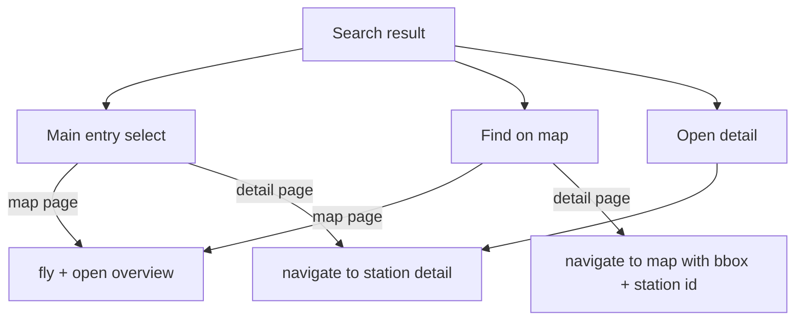

# 36 - Detail page fixes: header/search actions, chart resolutions, tooltip locale, legends

Status: completed

## Problem

The counting-station detail page ([`StationDetail.tsx`](../frontend/src/features/stationDetail/StationDetail.tsx:67))
has several defects discovered after plan 35:

1. **The header is missing on the detail page.** [`App.tsx`](../frontend/src/App.tsx:7)
   only renders the `TopBar` inside [`MapPage.tsx`](../frontend/src/features/map/MapPage.tsx:25),
   so `/stations/:id` has no header and no search. The header must stay active on
   every route.
2. **The time-series resolutions are wrong.** The detail service still buckets
   the current/last week at 15 minutes and the last 30 days at 30 minutes
   ([`station_detail_service.rs`](../backend/src/core/application/station_detail_service.rs:159)).
   Weekly charts should be **1-hour** buckets; the last 30 days should be
   **1-day** buckets. The last year is already 1-day but its origin is the wrong
   year start ([`station_detail_service.rs`](../backend/src/core/application/station_detail_service.rs:191)),
   which hides the daily grouping.
3. **The tooltip has no date reference.** The chart tooltip reuses the axis
   formatter, so hourly charts show only `HH:mm`, day charts only `dd.MM` and
   year charts only the month. It should show the full date reference
   (`31.12.1998`-style) using a **central locale** that can be changed later.
4. **"Share by channel" does not render.** [`ChannelPie.tsx`](../frontend/src/features/stationDetail/ChannelPie.tsx:40)
   places its `ChartContainer` inside a `flex flex-col items-center` wrapper, so
   the container collapses to zero width and the pie never draws.
5. **Legends are rendered for empty series.** [`channelSeries`](../frontend/src/features/stationDetail/StationDetail.tsx:46)
   emits one series per channel regardless of whether that channel has data, and
   [`TimeSeriesLineChart.tsx`](../frontend/src/features/stationDetail/TimeSeriesLineChart.tsx:86)
   always renders the legend.
6. **Search results only offer "Find on map".** The user wants an additional
   "open detail" action on each result while keeping the existing map action.

## Scope

In scope:

- A shared header + search shell used by both the map and the detail page.
- A new `open_detail` search action (backend action map + frontend button).
- Correct backend bucket resolutions (week = 1 h, last 30 days = 1 day) and an
  explicit previous-year origin for `last_year`.
- Full-date tooltips driven by a single `LOCALE` constant in
  [`format.ts`](../frontend/src/lib/format.ts:1).
- Fix the `ChannelPie` layout collapse.
- Filter empty series and only show legends when there is more than one series
  with data.

Out of scope: changing the aggregate weekday radar / channel pie windows (both
stay "last 30 days"), zero-filling, and any non-detail-page chart changes.

## Decisions / assumptions

- The header may remount when navigating between routes; "stays active" means it
  is present and fully functional on the detail page, not necessarily stateful
  across navigation.
- The main search-result entry click keeps its page-specific behaviour (map page:
  select on map; detail page: navigate to that station's detail page). The two
  explicit buttons are "Find on map" (unchanged) and the new "Open detail".
- From the detail page, "Find on map" navigates to the map with a small bounding
  box centred on the station plus `station=<id>`, so the map flies there and
  opens the overview.
- A single-series chart does not need a legend; legends only render when at least
  two non-empty series are drawn.
- The central locale lives in [`format.ts`](../frontend/src/lib/format.ts:1) as an
  exported `LOCALE` constant; all existing and new formatting helpers use it.

## Search-action flow

## Backend changes

### 1. Detail bucket resolutions ([`station_detail_service.rs`](../backend/src/core/application/station_detail_service.rs:31))

- Add `const SECONDS_PER_HOUR: i64 = 60 * 60;`.
- Current week + last week: replace `SECONDS_PER_15_MINUTES` with
  `SECONDS_PER_HOUR` in both the aggregate sums and the per-channel accumulates.
- Last 30 days: replace `SECONDS_PER_30_MINUTES` with `SECONDS_PER_DAY` in both
  the aggregate sum and the per-channel accumulate.
- Last year: pass `last_year_from` as the bucketing `origin` instead of
  `year_start` (aggregate and per-channel) so the daily buckets are explicitly
  aligned to the previous calendar year's local midnight.
- Update the `weekday_totals` doc comment: it now folds **1-day** buckets, which
  still yields correct per-weekday sums because every day bucket belongs to a
  single local weekday.

### 2. Domain docs ([`station_detail/mod.rs`](../backend/src/core/domain/station_detail/mod.rs:30))

- Update the `current_week` / `last_week` doc comments to "1-hour buckets".
- Update the `last_30_days` doc comment to "1-day buckets".
- Update the `last_year` doc comment to mention the previous-year origin.

### 3. Search action map ([`handlers.rs`](../backend/src/adapter/driving/bff/handlers.rs:166))

- In `get_bff_stations_search`, insert
  `actions.insert("open_detail".to_string(), ActionDto { enabled: true });`
  next to the existing `find_on_map` action.
- Update the utoipa description for the endpoint to mention both actions.

### 4. Tests

- [`bff.rs`](../backend/src/adapter/driving/rest/tests/bff.rs:212): assert
  `body["actions"]["open_detail"]["enabled"] == true` in
  `bff_search_returns_all_stations_and_the_action_map`.
- [`station_detail_service.rs`](../backend/src/core/application/station_detail_service.rs:627):
  add assertions that lock the new resolutions (e.g. consecutive
  `current_week` bucket starts differ by 1 hour and consecutive
  `last_30_days` bucket starts differ by 1 day, with `last_year` buckets aligned
  to the previous year's local midnight). Existing sum-based assertions stay.

## Frontend changes

### 5. Central locale + full-date formatters ([`format.ts`](../frontend/src/lib/format.ts:1))

- `export const LOCALE = 'de-DE'`.
- Use `LOCALE` in `formatNumber` and `formatTimestamp` (replace the hard-coded
  `'de-DE'`).
- Add:
  - `formatFullDate(time: number)` → `dd.MM.yyyy` via `toLocaleDateString(LOCALE, …)`.
  - `formatFullDateTime(time: number)` → `dd.MM.yyyy, HH:mm` via
    `toLocaleString(LOCALE, …)`.

### 6. Time-series tooltip + legend ([`TimeSeriesLineChart.tsx`](../frontend/src/features/stationDetail/TimeSeriesLineChart.tsx:42))

- Add optional prop `tooltipFormatter?: (time: number) => string`; use it in the
  `ChartTooltipContent.labelFormatter`, falling back to `xFormatter`.
- Filter the input to `visibleSeries = series.filter((s) => s.data.length > 0)`.
  Use `visibleSeries` for the config, the `<Line>` entries and the legend.
- Render `<ChartLegend>` only when `visibleSeries.length > 1`.
- When `visibleSeries.length === 0`, render a muted "No data for this period."
  message instead of an empty chart.

### 7. Detail page wiring ([`StationDetail.tsx`](../frontend/src/features/stationDetail/StationDetail.tsx:1))

- Import `LOCALE` / full-date helpers from [`format.ts`](../frontend/src/lib/format.ts:1)
  and build `timeAxis` on `LOCALE` (drop the hard-coded `'de-DE'`).
- Add `timeTooltip(unit)` returning the full-date (hour → full date + time, day
  and month → full date) and pass it as `tooltipFormatter` on every
  `TimeSeriesLineChart`.
- Update subtitles: "15-minute buckets" → "1-hour buckets" (both current/last
  week cards) and "30-minute buckets" → "1-day buckets" (both last-30-days
  cards).
- `channelSeries`: keep only channels whose per-channel series has at least one
  bucket across the requested windows.
- `channelRadar`: keep only channels with a non-empty `weekday_radar`.

### 8. Channel pie layout ([`ChannelPie.tsx`](../frontend/src/features/stationDetail/ChannelPie.tsx:40))

- Give the `ChartContainer` a real width:
  `className={cn('aspect-square w-full max-w-[280px]', className)}` so it fills
  the card and keeps its square aspect ratio (the outer flex wrapper stays).

### 9. Search dialog with a detail action ([`StationListItem.tsx`](../frontend/src/features/stations/StationListItem.tsx:8))

- Add optional props `onDetail` and `showDetail` (default `false`); render an
  "Open detail" button next to "Find on map" when `showDetail` is true.

[`SearchDialog.tsx`](../frontend/src/features/search/SearchDialog.tsx:17)

- Add an `onDetail` prop and pass `showDetail` + `onDetail` to each
  `StationListItem`.

[`useStationSearch.ts`](../frontend/src/features/stations/useStationSearch.ts:8)

- Return `openDetailEnabled = actions.open_detail?.enabled ?? false` and pass it
  through.

### 10. Shared header shell ([`SearchableHeader.tsx`](../frontend/src/features/header/SearchableHeader.tsx:1))

- New component that owns the `searchOpen` state and the `Escape` close handler,
  renders `TopBar` + `SearchDialog`, and accepts three callbacks:
  `onSelect`, `onFind`, `onDetail`.

[`MapPage.tsx`](../frontend/src/features/map/MapPage.tsx:25)

- Replace the inline `TopBar` + `SearchDialog` with `SearchableHeader`, keeping
  `findAndClose` for select/find and adding `onDetail` that navigates to
  `/stations/:id`.

[`StationDetail.tsx`](../frontend/src/features/stationDetail/StationDetail.tsx:67)

- Wrap the page in a `flex h-screen flex-col` shell that renders `SearchableHeader`
  above the existing `<main>` (now `min-h-0 flex-1 overflow-y-auto`).
- `onSelect` / `onDetail` navigate to `/stations/:id`; `onFind` navigates to the
  map with a bbox around the station (small helper in
  [`geo.ts`](../frontend/src/lib/geo.ts:1)) plus `station=<id>`.

### 11. Playwright coverage ([`detail.spec.ts`](../frontend/e2e/detail.spec.ts:1))

- Assert the header/search trigger is visible on the detail page.
- Assert a search result offers "Open detail" and navigating via it lands on the
  station's detail URL.
- Assert the "Share by channel" pie renders a `.recharts-wrapper` (regression for
  the layout collapse). Keep existing map-behaviour assertions intact.

## Definition of done

- [x] Plan file registered in [`plans/README.md`](../plans/README.md:11)
- [x] `make check` green
- [x] `make test` (327) and `make test-rest` (82) green
- [x] `make coverage` green (overall 83.74%, core 95.34%)
- [x] `make test-playwright` green (12 specs)
- [x] Docs updated (`ToDo.md`, `plans/README.md`, this plan)

## Result

Implemented all six fixes:

- **Header stays active**: a shared [`SearchableHeader`](../frontend/src/features/header/SearchableHeader.tsx:1)
  (TopBar + search dialog) is now used by both [`MapPage`](../frontend/src/features/map/MapPage.tsx:1)
  and [`StationDetail`](../frontend/src/features/stationDetail/StationDetail.tsx:1).
- **New search action**: the BFF search action map exposes `open_detail`, and
  [`StationListItem`](../frontend/src/features/stations/StationListItem.tsx:1) shows an
  "Open detail" button next to "Find on map". On the detail page, "Find on map"
  flies back to the map via [`stationBounds`](../frontend/src/lib/geo.ts:1).
- **Resolutions**: the detail service buckets the week at 1 hour, the last 30
  days at 1 day, and aligns `last_year` to its own Jan 1 (with a unit test
  locking the widths).
- **Overlapping comparisons (follow-up)**: "Current + last week" and
  "Current + last year" (and their per-channel variants) now overlap: buckets are
  re-anchored to the current week's Monday / the current year's Jan 1
  ([`alignSeries`](../frontend/src/features/stationDetail/StationDetail.tsx:1)),
  so both periods share one axis and their curves align by position-in-period.
- **Tooltip date reference**: [`format.ts`](../frontend/src/lib/format.ts:1) exports a
  central `LOCALE` and full-date helpers; every chart tooltip shows the full date
  (`31.12.1998`-style) instead of the short axis label.
- **Share by channel renders**: the [`ChannelPie`](../frontend/src/features/stationDetail/ChannelPie.tsx:1)
  `ChartContainer` now has `w-full` so it no longer collapses to zero width.
- **Legends with data only**: empty channel series are dropped and the line-chart
  legend only renders when more than one non-empty series exists.
