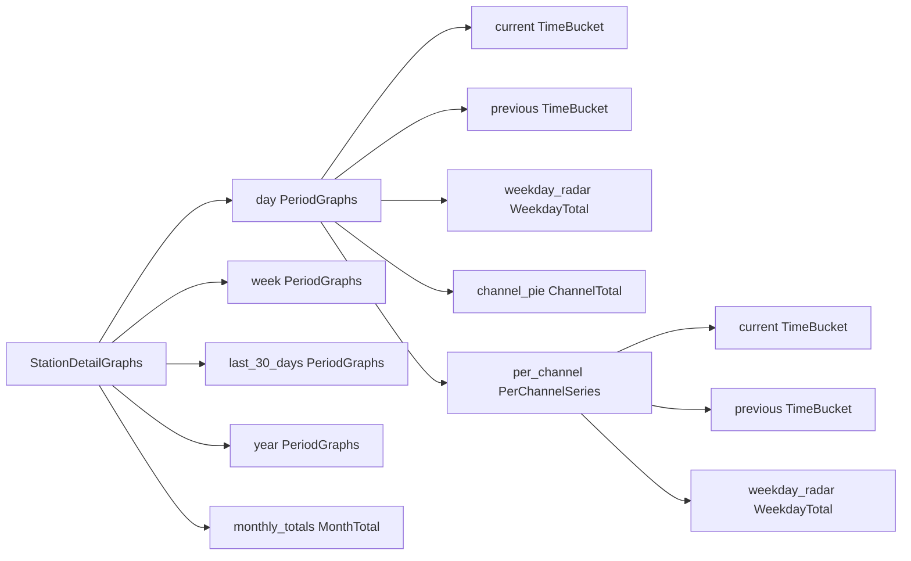

# 37 - Detail page: shared timeframe selector, previous-period overlay and monthly bar chart

Status: completed

## Problem

The counting-station detail page ([`StationDetail.tsx`](../frontend/src/features/stationDetail/StationDetail.tsx:1))
renders each time window as its own half-width card (24 h, current + last week,
last 30 days, current + last year) plus a fixed "last 30 days" weekday radar and
channel pie. The user wants a single shared timeframe control instead:

1. The **main chart spans the full width** (no two-column grid for it).
2. A **shared dropdown** at the top of the statistics section selects one of
   *24 hours*, *Current + last week*, *Last 30 days*, *Last year*; the choice
   drives **all** graphs (main line chart, weekday radar, channel pie and the
   per-channel "nerd stats") — except the new monthly bar chart.
3. A **checkbox** toggles the previous period of the selected timeframe so the
   current and previous periods can be compared by **overlap**.
4. The line charts that are now bundled into the main chart are **dropped**.
5. Underneath the detailed statistics there is a **bar chart with one bar per
   calendar month across all available years** (x-axis like "Jan 2024") with the
   grand total shown in the top-right corner (single total per month, not
   repeated per channel).

## Scope

In scope:

- Backend: restructure the station-detail graph payload around four timeframes
  (each with a current + previous period, weekday radar and channel pie), add the
  missing previous windows for "24 hours" and "last 30 days", and add a new
  "sum per calendar month" aggregate for the monthly bar chart.
- Frontend: a timeframe dropdown + "compare previous period" checkbox driving the
  main full-width line chart, the weekday radar, the channel pie and the nerd
  stats; a new monthly bar chart component; the removal of the now-bundled cards.
- Tests: backend unit/integration tests for the new windows + monthly totals, and
  Playwright coverage for the dropdown/checkbox/bar chart.

Out of scope: the monthly bar chart is **not** repeated per channel and does not
react to the dropdown (confirmed with user); zero-filling (buckets are still only
emitted where data exists); the overview stat boxes; the header/search shell.

## Decisions / assumptions

- **Timeframe mapping** (label → current period → previous period):

  | Dropdown | Current period | Previous period | Buckets | Axis |
  |---|---|---|---|---|
  | 24 hours | last complete local day | the day before | 5 min | time of day |
  | Current + last week | current week (Mon..now) | last week | 1 h | weekday |
  | Last 30 days | previous 30 local days | the 30 days before | 1 day | day index |
  | Last year | current year (Jan 1..now) | last calendar year | 1 day | month |

- **The checkbox only affects the line charts** (main + per-channel): it adds the
  previous period as an overlapped second series. The weekday radar and the
  channel pie always reflect the selected timeframe's **current** period.
- **Weekday radar per timeframe** is computed over the current period: for
  "24 hours" this is a single weekday (the radar simply shows one filled spoke),
  for "Current + last week" the current week, for "Last 30 days" 30 days, for
  "Last year" the current year. Same rule for the per-channel radar.
- **Channel pie per timeframe** uses `sum_by_channel` over the current period.
- **Overlap alignment stays client-side** (like today's week/year overlay) via a
  generalized `alignSeries` helper: each series is shifted so its own period
  start maps onto the current period's start. This keeps the payload as raw
  time-buckets (actual timestamps) and only repositions them for display.
- **Monthly bar chart** groups by the station's **local** calendar month
  (`EXTRACT(YEAR ...)` + `EXTRACT(MONTH ...)` from `timestamp AT TIME ZONE tz`)
  and returns only months that have data (consistent with the existing
  no-zero-fill rule), ascending by year then month. The top-right total is the
  sum over all returned months.
- **shadcn components**: add `select`, `checkbox` and `label` (the repo currently
  has none of these; see [`components.json`](../frontend/components.json:1)).

## Data model



## Backend changes

### 1. Offset day-window helper ([`counting_station.rs`](../backend/src/core/domain/counting_stations/counting_station.rs:77))

Add a helper that computes the `n` complete local days ending `offset_days`
before today (closed UTC interval, DST-aware, inclusive upper bound):

```rust
pub fn local_days_window(tz: Tz, now: DateTime<Utc>, n: u32, offset_days: u32)
    -> Result<(DateTime<Utc>, DateTime<Utc>), DomainError>
```

`from` is local midnight `(offset_days + n)` days before today, `to` is one
microsecond before local midnight `offset_days` days before today. Reimplement
`previous_local_days(tz, now, n)` as `local_days_window(tz, now, n, 0)` so the
existing callers keep working unchanged. Used for:

- `previous_day` = `local_days_window(tz, now, 1, 1)` (the day before last).
- `previous_30_days` = `local_days_window(tz, now, 30, 30)`.

### 2. Monthly aggregate on the repository ([`repository_port.rs`](../backend/src/core/domain/measurements/repository_port.rs:4))

Add a value type and a method:

```rust
pub struct MonthTotal { pub year: i32, pub month: u8, pub total: i64 }

fn sum_by_month(&self, timezone: &str, channel_ids: &[value_objects::ChannelId])
    -> Result<Vec<MonthTotal>, DomainError>;
```

### 3. Postgres implementation ([`measurement_repository.rs`](../backend/src/adapter/driven/postgres/measurement_repository.rs:22))

Implement `sum_by_month` grouping by the station's local year and month:

```sql
SELECT EXTRACT(YEAR FROM (timestamp AT TIME ZONE $1))::int AS year,
       EXTRACT(MONTH FROM (timestamp AT TIME ZONE $1))::int AS month,
       COALESCE(SUM(value), 0)::bigint AS total
FROM measurements
WHERE channel_id = ANY($2::uuid[])
GROUP BY year, month
ORDER BY year, month
```

Add a testcontainers test next to the existing bucketed tests. Update the other
`MeasurementRepository` implementors (in-memory test doubles) with a trivial
`Ok(Vec::new())` body, except the detail-service test double which implements the
real bucketing/grouping needed by its tests.

### 4. Domain restructure ([`station_detail/mod.rs`](../backend/src/core/domain/station_detail/mod.rs:20))

Replace the flat `StationDetailGraphs`/`PerChannelSeries` with a timeframe-keyed
model:

```rust
pub struct PeriodGraphs {
    pub current: Vec<TimeBucket>,
    pub previous: Vec<TimeBucket>,
    pub weekday_radar: Vec<WeekdayTotal>,
    pub channel_pie: Vec<ChannelTotal>,
    pub per_channel: Vec<PerChannelSeries>,
}

pub struct PerChannelSeries {
    pub channel_id: uuid::Uuid,
    pub current: Vec<TimeBucket>,
    pub previous: Vec<TimeBucket>,
    pub weekday_radar: Vec<WeekdayTotal>,
}

pub struct StationDetailGraphs {
    pub day: PeriodGraphs,
    pub week: PeriodGraphs,
    pub last_30_days: PeriodGraphs,
    pub year: PeriodGraphs,
    pub monthly_totals: Vec<MonthTotal>,
}
```

`MonthTotal` is re-exported from the measurements repository port.

### 5. Service ([`station_detail_service.rs`](../backend/src/core/application/station_detail_service.rs:58))

Compute the six windows (day current/previous, week current/previous, 30-day
current/previous, year current/previous) and, for each timeframe:

- `sum_buckets` for `current` (5 min / 1 h / 1 day / 1 day).
- `sum_buckets` for `previous` with the matching previous-window origin
  (`previous_day_from`, current `week_start`, `previous_30_from`, `last_year_from`).
- `sum_weekdays(current_from, current_to, tz, channels)` → `weekday_radar`.
- `sum_by_channel(current_from, current_to, channels)` → `channel_pie`.
- `sum_buckets_by_channel` for `current` and `previous`, folded per channel and
  reduced to `weekday_radar` via the existing `weekday_totals` (its doc comment
  becomes timeframe-agnostic: it folds any buckets — 5 min/1 h/1 day — into
  weekday totals).

Finally `sum_by_month(tz, channels)` → `monthly_totals`.

The per-channel pivot now emits `current` + `previous` instead of the six named
windows.

### 6. BFF DTO + handler ([`bff/dto.rs`](../backend/src/adapter/driving/bff/dto.rs:189))

Replace `StationDetailGraphsDto` / `PerChannelSeriesDto` with `PeriodGraphsDto`,
`PerChannelSeriesDto` (current + previous + weekday_radar), `MonthTotalDto` and a
`StationDetailGraphsDto` holding `day`/`week`/`last_30_days`/`year` +
`monthly_totals`. The handler
([`get_bff_station_detail`](../backend/src/adapter/driving/bff/handlers.rs:285))
is unchanged apart from the `From` mapping it already delegates to.

## Frontend changes

### 7. Types ([`types.ts`](../frontend/src/features/stationDetail/types.ts:1))

Mirror the new payload: `Timeframe = 'day' | 'week' | 'last_30_days' | 'year'`,
`PeriodGraphs`, `PerChannelSeries` (current/previous/weekday_radar),
`MonthTotal` and `StationDetailGraphs` with the four periods + `monthly_totals`.

### 8. shadcn primitives

Add `select`, `checkbox` and `label` components under
[`frontend/src/components/ui/`](../frontend/src/components/ui) (updates
[`package.json`](../frontend/package.json:15) with `@radix-ui/react-select`,
`@radix-ui/react-checkbox` and `@radix-ui/react-label`).

### 9. Timeframe config + overlap alignment ([`StationDetail.tsx`](../frontend/src/features/stationDetail/StationDetail.tsx:47))

- Add `useState<Timeframe>('day')` and `useState(false)` for the checkbox in
  `DetailContent`.
- Define a `TIMEFRAMES` config array with, per key: label, axis formatter
  (`timeAxis('hour'|'day'|'month')`), tooltip formatter, `periodStart` function
  and the fixed axis-domain width:
  - `day` → `dayStartOf`, domain `+24 h`
  - `week` → `weekStartOf`, domain `+7 days`
  - `last_30_days` → `dayStartOf`, domain `+30 days`
  - `year` → `yearStartOf`, domain = actual next Jan 1 (exact, like today)
- Generalize `alignSeries` so each series is shifted by its **own** first
  bucket's `periodStart` onto the current-period anchor (replaces the two
  bespoke week/year calls).
- Replace `aggregateSeries`/`channelSeries`/`channelOverlaySeries`/
  `channelRadar` with helpers that read the selected timeframe's `current` +
  (conditionally) `previous` and `weekday_radar`.

### 10. Detail page layout ([`StationDetail.tsx`](../frontend/src/features/stationDetail/StationDetail.tsx:276))

Detailed statistics section becomes:

- A header row: section title + timeframe `Select` + "Compare previous period"
  `Checkbox`.
- Full-width `ChartCard` with the main `TimeSeriesLineChart` (selected timeframe,
  current series plus the previous series when the checkbox is on, aligned).
- A `WeekdayRadar` card fed by the selected timeframe's `weekday_radar`.

Below it, a new standalone `MonthlyBarChart` card fed by `graphs.monthly_totals`.

Nerd stats section becomes (all driven by the same dropdown + checkbox):

- "By channel" `TimeSeriesLineChart` (selected timeframe, current + optional
  previous).
- "Weekdays by channel" `WeekdayRadar`.
- "Share by channel" `ChannelPie` (selected timeframe's `channel_pie`; drop the
  hard-coded "last 30 days" copy in [`ChannelPie.tsx`](../frontend/src/features/stationDetail/ChannelPie.tsx:15)).

### 11. Monthly bar chart ([`MonthlyBarChart.tsx`](../frontend/src/features/stationDetail/MonthlyBarChart.tsx:1))

New component following the shadcn interactive bar-chart pattern: a `CardHeader`
with the title/description on the left and the grand total (sum of all months) on
the right, and a `BarChart` with one `Bar` per month (`dataKey="month"`,
`fill="var(--color-chart-1)"`), an `XAxis` labeled "Jan 2024"-style and a tooltip
showing the full month + year. No per-channel buttons — a single total series.

## Testing / gates

- Update [`station_detail_service.rs`](../backend/src/core/application/station_detail_service.rs:322)
  unit tests: previous-day / previous-30-day boundaries, per-timeframe weekday
  radar + channel pie, per-channel current/previous pivoting, `monthly_totals`.
- Add a Postgres testcontainers test for `sum_by_month`.
- Update any BFF DTO assertions and the sample/mock repositories.
- Extend [`detail.spec.ts`](../frontend/e2e/detail.spec.ts:1): changing the
  dropdown swaps the visible chart, the checkbox toggles a second series, the
  monthly bar chart renders with a total, and the pie follows the selected
  timeframe.
- Run `make check`, `make test` / `make test-rest`, `make coverage` and
  `make test-playwright` (see [`agents.md`](../agents.md:25)).

## Definition of done

- [x] Plan registered in [`plans/README.md`](../plans/README.md:1)
- [x] Backend domain/service/DTO/repository changes implemented and tested
- [x] Frontend timeframe selector, checkbox, main chart, radar, pie and nerd
      stats wired to the dropdown
- [x] Monthly bar chart rendered with the grand total
- [x] `make check`, `make test`/`make test-rest`, `make coverage` green
- [x] `make test-playwright` green
