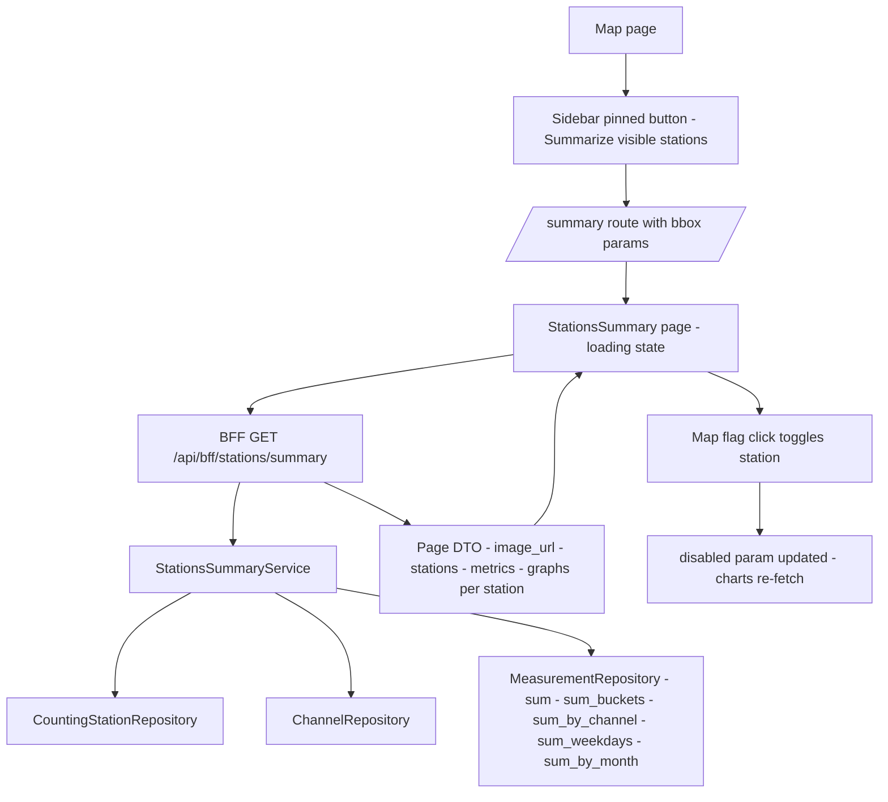

# Station summary view — aggregate the visible stations into a shareable detail-like page

Status: implemented

## Summary

Add a "Summary-Detail-View": while flying over the map the user sees the visible
stations in the sidebar. A new **"Summarize visible stations"** action in the
sidebar (pinned footer, the station list stays scrollable) opens a new
`/summary` page. That page shows:

- the fallback image (builtin default asset),
- every station in the same map view the user had selected (interactive Leaflet
  map, same bounds),
- the **aggregated** stats (day / 7 days / month / year trends plus the
  time-series, weekday, pie and monthly charts) computed **in the backend BFF**,
- a **Nerd-stats section keyed by station** (not by channel, as on the detail
  page),
- click-to-disable per station on the map flag — disabled stations are grayed
  out and excluded from the charts.

The map view and the selected/disabled stations are encoded in the URL so the
view can be navigated (browser back) and shared. The page can be slow, so it
gets a loading state. No Redis caching yet, but the design reuses the existing
aggregation primitives behind the BFF so a cache can be dropped in later, and no
new data fields are introduced into the view.

## Context / current architecture

- Hexagonal layout: [`backend/src/core/domain/`](backend/src/core/domain) owns
  pure models + ports; [`backend/src/core/application/`](backend/src/core/application)
  implements the inbound services; [`backend/src/adapter/driving/bff/`](backend/src/adapter/driving/bff)
  exposes the frontend-only JSON.
- `StationSummaryService` (sidebar/search) computes per-station channel count +
  `bikes_last_day` over a `GeoBounds`.
- `StationOverviewService` computes one station's four trend metrics
  (day / 7 days / month / year) over its own timezone.
- `StationDetailService` computes one station's bucketed graphs
  (`PeriodGraphs`: current/previous series, weekday radar, channel pie,
  per-channel series) and `monthly_totals`, all over one station timezone.
- `MeasurementRepository` already exposes the reusable primitives:
  [`sum`](backend/src/core/domain/measurements/repository_port.rs:70),
  [`sum_buckets`](backend/src/core/domain/measurements/repository_port.rs:81),
  [`sum_buckets_by_channel`](backend/src/core/domain/measurements/repository_port.rs:93),
  [`sum_weekdays`](backend/src/core/domain/measurements/repository_port.rs:105),
  [`sum_by_channel`](backend/src/core/domain/measurements/repository_port.rs:114),
  [`sum_by_month`](backend/src/core/domain/measurements/repository_port.rs:123).
- Frontend detail page: [`StationDetail.tsx`](frontend/src/features/stationDetail/StationDetail.tsx)
  owns the timeframe config + alignment helpers and renders
  [`ChartCard`](frontend/src/features/stationDetail/ChartCard.tsx),
  [`TimeSeriesLineChart`](frontend/src/features/stationDetail/TimeSeriesLineChart.tsx),
  [`WeekdayRadar`](frontend/src/features/stationDetail/WeekdayRadar.tsx),
  [`MonthlyBarChart`](frontend/src/features/stationDetail/MonthlyBarChart.tsx),
  [`ChannelPie`](frontend/src/features/stationDetail/ChannelPie.tsx) and
  [`MetricCard`](frontend/src/features/stationOverview/MetricCard.tsx).
- URL state already mirrors the map bbox + open overview via
  [`lib/geo.ts`](frontend/src/lib/geo.ts).

## Naming & UX decisions

| Concern | Decision |
|---|---|
| Action label | **Summarize visible stations** |
| Route | `/summary` |
| BFF endpoint | `GET /api/bff/stations/summary` |
| Domain module | `stations_summary` (`StationSummary` name is taken) |
| Service / port | `StationsSummaryService` / `StationsSummaryServicePort` |
| Page DO | `StationsSummary` (the expected new DO) |
| URL selection model | bounds (`min_lat/min_lng/max_lat/max_lng`) + `disabled=<csv station ids>`; enabled = stations in bounds minus disabled |
| Timezone for bucketed charts | the first included station's timezone (documented limitation; overview metrics are still computed per station timezone) |

## Backend design (hexagonal)

### 1. New domain module `stations_summary`

New files under [`backend/src/core/domain/stations_summary/`](backend/src/core/domain/stations_summary):

- `mod.rs` — the DO:
  - `StationsSummary { stations: Vec<SummaryStation>, channel_count: usize, metrics: Vec<MetricWindow>, last_update: Option<DateTime<Utc>>, graphs: StationsSummaryGraphs }`
  - `SummaryStation { id: Uuid, name: String, channel_count: usize }`
  - `StationsSummaryGraphs { day, week, last_30_days, year: SummaryPeriodGraphs, monthly_totals: Vec<MonthTotal> }`
  - `SummaryPeriodGraphs { current, previous: Vec<TimeBucket>, weekday_radar: Vec<WeekdayTotal>, station_pie: Vec<StationTotal>, per_station: Vec<PerStationSeries> }`
  - `PerStationSeries { station_id: Uuid, current, previous: Vec<TimeBucket>, weekday_radar: Vec<WeekdayTotal> }`
  - `StationTotal { station_id: Uuid, total: i64 }`
  - Reuses `MetricWindow`/`MetricKey` from `station_overview`, and
    `TimeBucket`/`WeekdayTotal`/`MonthTotal` from `measurements::repository_port`
    (no new value-object fields).
- `service_port.rs` — `StationsSummaryServicePort::summarize(bounds: GeoBounds, exclude: &[Id], now: DateTime<Utc>) -> Result<StationsSummary, DomainError>`.

### 2. New application service `StationsSummaryService`

New file [`backend/src/core/application/stations_summary_service.rs`](backend/src/core/application/stations_summary_service.rs),
wired in [`core/application/mod.rs`](backend/src/core/application/mod.rs).

Behaviour:

1. Load all counting stations via `find_filtered(None)` and keep the positioned
   ones inside `bounds` (reuse `GeoBounds::contains`). The full in-bounds list
   becomes `stations` (rendering list); the aggregation uses the subset that is
   not in `exclude`.
2. Load all channels once via `find_filtered(None, None)` and group by station
   (`station -> Vec<Channel>`); build the included `Vec<ChannelId>`.
3. Overview metrics: loop the **included** stations and compute each station's
   own day / 7 days / month / year windows with the existing DST-aware helpers
   (`previous_local_days`, `previous_calendar_month`/`calendar_month_window`,
   `previous_calendar_year`/`calendar_year_window`) and sum its channels with
   `MeasurementRepository::sum`. Sum the `current`/`previous` per metric across
   stations into four `MetricWindow`s; `last_update` from
   `find_last_finished_by_type(DATA_SOURCE_UPDATE_JOB_TYPE)` (same as the
   overview service).
4. Graphs: mirror `StationDetailService::period_graphs` but over the union of
   included channels:
   - aggregate series via `sum_buckets` (current + previous),
   - aggregate weekday radar via `sum_weekdays`,
   - monthly totals via `sum_by_month`,
   - station pie via `sum_by_channel` then group `channel -> station`,
   - per-station series via `sum_buckets_by_channel` (current + previous) then
     group `channel -> station` and fold each station's buckets into its
     weekday radar.
   - Bucketed reads use the first included station's timezone (documented).
5. Error paths: invalid station timezone or repository errors propagate as
   `DomainError`.

Suggested (scoped, optional) refactors to reduce duplication:

- Extract the four-metric window computation shared by
  `StationOverviewService` and `StationsSummaryService` into a small helper.
- Extract `period_graphs`/`weekday_totals` bucketing shared by
  `StationDetailService` and `StationsSummaryService`.
- Record the mixed-timezone bucketing limitation as known technical debt.

### 3. BFF DTO + handler + routing

- [`backend/src/adapter/driving/bff/dto.rs`](backend/src/adapter/driving/bff/dto.rs):
  add `StationsSummaryPageDto`, `SummaryStationDto`, `StationsSummaryGraphsDto`,
  `SummaryPeriodGraphsDto`, `PerStationSeriesDto`, `StationTotalDto`, and a
  `BffStationSummaryQueryParams { min_lat, min_lng, max_lat, max_lng, exclude: Option<String> }`
  (comma-separated UUIDs). Reuse existing `TimeBucketDto`, `WeekdayTotalDto`,
  `MonthTotalDto`, `MetricDto`. `image_url` resolves from
  `asset_service.default_asset()`.
- [`backend/src/adapter/driving/bff/handlers.rs`](backend/src/adapter/driving/bff/handlers.rs):
  add `get_bff_stations_summary` (utoipa path + tag `BFF API`), parse bounds via
  the existing `parse_required_bounds`, parse `exclude`, call the new service
  through `blocking`, resolve the fallback image, map to the page DTO.
- [`backend/src/adapter/driving/bff/mod.rs`](backend/src/adapter/driving/bff/mod.rs):
  re-export the new handler + DTOs.
- [`backend/src/adapter/driving/rest/mod.rs`](backend/src/adapter/driving/rest/mod.rs):
  register `/api/bff/stations/summary` and add the service to `AppState` +
  `RestApiAdapter::new`.
- [`backend/src/adapter/driving/rest/openapi.rs`](backend/src/adapter/driving/rest/openapi.rs):
  add the path + schemas.
- [`backend/src/main.rs`](backend/src/main.rs):
  construct `StationsSummaryService` and pass it through.

## Frontend design

### 1. Routing + URL state

- [`App.tsx`](frontend/src/App.tsx): add `<Route path="/summary" element={<StationsSummary />} />`.
- [`lib/geo.ts`](frontend/src/lib/geo.ts) (or a small `lib/summaryUrl.ts`): add
  `serializeDisabled(ids: string[])` / `parseDisabled(searchParams: URLSearchParams)`.
- [`MapPage.tsx`](frontend/src/features/map/MapPage.tsx): pass an
  `onSummarize` callback to the sidebar that builds
  `/summary?min_lat=…&min_lng=…&max_lat=…&max_lng=…` from the current `bounds`
  and `navigate`s there.
- [`Sidebar.tsx`](frontend/src/features/sidebar/Sidebar.tsx): add a pinned
  footer button **"Summarize visible stations"** below the `ScrollArea` (the
  list keeps its own scroll), disabled when there are no visible stations.

### 2. New feature folder `features/stationsSummary/`

- `types.ts` — mirror of the new BFF DTO (reuses `StationOverviewMetric`).
- `api.ts` — `fetchStationsSummary(bounds, exclude)`.
- `useStationsSummary.ts` — loads for `(bounds, disabled)`; exposes
  `{ summary, loading, error }`; re-fetches when `disabled` changes.
- `StationsSummary.tsx` — the page:
  - `SearchableHeader` stays active (same callbacks as the detail page).
  - back-to-map link + a loading state (`Loader2` spin + "Summarizing visible
    stations…") while `loading`.
  - hero = `image_url` fallback image; name/description row = "Summary of N
    stations" + total channel count + last update.
  - overview `MetricCard`s (reused) from `metrics`.
  - the same chart sections as the detail page (timeframe selector + compare
    checkbox, monthly bar, Nerd stats), driven by the shared timeframe config.
  - Nerd stats: per-**station** line chart, per-station weekday radar, and a
    station pie (see `SharePie` below).
- `SummaryMap.tsx` — interactive Leaflet map (reuse `stationIcon`), fitted to
  the URL bounds, one marker per `summary.stations`; clicking a marker toggles
  that station's disabled state (gray marker via a muted/grayed icon + not part
  of the charts); the toggle updates the `disabled` URL param with `replace`.

### 3. Component reuse / small refactors

- Generalize [`ChannelPie.tsx`](frontend/src/features/stationDetail/ChannelPie.tsx)
  into a `SharePie` taking `slices: { id, name, total }[]` (detail page maps
  `channel_pie`+`channels`; summary maps `station_pie`+`stations`). Reuses the
  same donut, empty state, tooltip and color palette.
- Extract the timeframe config + alignment helpers from
  [`StationDetail.tsx`](frontend/src/features/stationDetail/StationDetail.tsx)
  (`TIMEFRAMES`, `TIMEFRAME_ORDER`, axis/tooltip/periodStart functions,
  `timeframeDomain`, `alignSeries`) into a shared module (e.g.
  `features/stationDetail/timeframes.ts`) so the summary page reuses them
  verbatim. Pure refactor — `detail.spec.ts` must stay green.
- Reuse `ChartCard`, `TimeSeriesLineChart`, `WeekdayRadar`, `MonthlyBarChart`,
  `MetricCard`, `ChartEmptyState`, `ErrorBoundary`, `SearchableHeader`,
  `format.ts`, `geo.ts`, `leaflet.ts`.

## Testing strategy

Coverage is high (overall 80% / core 95%), so business tests must land with the
code before the coverage gate.

- **Core unit tests** (`stations_summary_service.rs`): bounds in/out filtering,
  `exclude` filtering, channel-count aggregation, per-metric aggregation
  (day/7d/month/year with correct windows + trends), graph aggregation
  (aggregate series, station pie grouping, per-station series grouping,
  per-station weekday radar, monthly totals), empty-bounds result, mixed/absent
  timezone error path.
- **BFF tests** (`rest/tests/bff.rs`): 200 payload shape, 400 on missing/invalid
  bounds, `exclude` parsing, fallback image URL present.
- **Postgres test** if any repository method is touched (none expected — the new
  service reuses existing repo methods).
- **e2e** `frontend/e2e/summary.spec.ts`:
  - sidebar button navigates to `/summary` with bbox params,
  - page renders fallback image, map markers, overview cards, charts, Nerd stats,
  - clicking a map flag disables a station (grayed + excluded) and updates the
    `disabled` URL param,
  - a shared `/summary?...&disabled=…` URL restores the view with the station
    grayed/excluded,
  - back-to-map returns to the map.
  - Keep assertions robust to a still-importing dataset (as in `detail.spec.ts`).
- Re-run: `make check`, `make test`, `make test-rest`, `make coverage`,
  `make frontend-build`, `make test-playwright`.

## Technical debt

Do **not** create a new backlog file. The existing backlog is
[`ToDo.md`](ToDo.md). Only if the implementer detects **genuine** issues during
this work, append them **once** to `ToDo.md` (and do not invent speculative
entries). The mixed-timezone bucketing limitation for grouped stations is the
expected candidate entry.

## Status / definition of done

- [x] `make check` green (fmt + clippy `-D warnings`).
- [x] `make test` (351) and `make test-rest` (87) green.
- [x] `make coverage` green — overall 84.98%, core 95.78% (thresholds unchanged).
- [x] `make frontend-build` green (tsc + vite).
- [x] e2e `summary.spec.ts` written (navigation, render, disable toggle + URL,
      shared URL restore, back-to-map), scoped to one station so the browser
      stays fast.
- [x] `make test-playwright` green — **19 specs pass (20.1s)**, including the 5
      new summary specs. Root cause of the earlier failures: an infinite reload
      loop in `StationsSummary` (un-memoized `parseBoundsQuery` re-created the
      bounds object every render, so the data hook reset `summary`/`loading` on
      each render and the page never left the loading state). Fixed by memoizing
      `bounds` on the search params; verified the endpoint returns in ~4–8 s for
      the full 23-station view.
- [x] Disabled-map-flag gray-out fixed: Leaflet applies the icon's `className`
      directly on the marker ``, so `.leaflet-disabled-marker img` matched
      nothing; the CSS rule now targets `.leaflet-disabled-marker`. The e2e
      asserts the computed `filter: grayscale` (`toHaveCSS`) in both the toggle
      and shared-URL specs. Re-verified: `make test-playwright` green again
      (**19 specs pass**).
- [x] README / plan docs updated (new BFF endpoint + route + URL params).

## Flow

