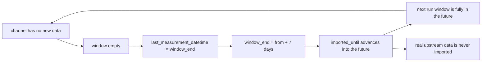

# 47 - Fix Münster import cursor overshoot that silently stops importing plan

Status: implemented

## Problem

The Münster adapter stops importing measurements even though the data-source
update job keeps reporting success. The frontend shows the symptom directly:

> 23 stations · 70 channels · 0 bikes / last day · updated 26.08.26, 11:55

The job *finishes* (so `updated` keeps advancing), but no new measurements are
written, and the "last day" sum is 0 because the imported data is stale.

### Root cause

The incremental watermark `data_sources.imported_until` is a single shared
timestamp that the update job advances to "everything on/before this timestamp
has been imported". [`MuensterGithubAdapter::get_measurements`](backend/src/adapter/driven/muenster_github/adapter.rs:523)
picks a 7-day window per call and, when the window holds **no** rows, reports
the window **end** as the next cursor — "advance past gaps":

```rust
// backend/src/adapter/driven/muenster_github/adapter.rs:566
let last_measurement_datetime = if records.is_empty() {
    Some(window_end)
} else {
    records.last().map(|record| record.timestamp)
};
```

`window_end` is `query.from + max_measurement_timeframe` (default 7 days). When
a channel has no *new* data after the watermark (upstream has simply not
published anything yet, or the counter is temporarily down), this returns a
timestamp **7 days in the future** as the cursor. The core then persists it:

- [`DataImportService::update_data_source`](backend/src/core/application/data_import_service.rs:368)
  matches `(Some(last), false)` and sets `last_measurement_timestamp = Some(last)`.
- [`DataSourceUpdateService::run_updates`](backend/src/core/application/data_source_update_service.rs:241)
  calls `update_imported_until(..., last_timestamp)`, so `imported_until` jumps
  forward ~7 days.

On the next run `from` is already in the future, so the window `[from, from+7d]`
is entirely beyond all CSVs: every channel returns no rows and the cursor jumps
another 7 days forward. The job "finishes" each time while importing nothing.
Once `imported_until` is past the most recent data, even the data that the
upstream *does* publish (currently ~7 hours old) is skipped forever.

This only requires one channel without fresh data to trigger, because
[`update_data_source`](backend/src/core/application/data_import_service.rs:400)
overwrites the shared `last_measurement_timestamp` per channel instead of taking
the minimum, so whichever channel is iterated last decides the final watermark.



## Goals

- Stop the watermark from advancing into the future when there is no new data.
- Preserve the gap-skip behavior for genuinely missing data *between* existing
  samples (a later file/row still exists).
- Never fabricate `0` measurements: an absent cell is skipped, not stored as 0
  (already the behavior of [`parse_measurement_csv`](backend/src/adapter/driven/muenster_github/parsing.rs:182),
  which must stay unchanged).
- Let the station/channel import continue when some data is unavailable (already
  handled: a missing channel column or station folder yields an empty batch, not
  a job failure).
- Provide a recovery path for the already-corrupted `imported_until`.

## Fix design

### 1. Adapter: only advance the cursor when data exists beyond the window

In [`MuensterGithubAdapter::get_measurements`](backend/src/adapter/driven/muenster_github/adapter.rs:523)
the empty-window cursor is only a *paging* hint to skip a gap. It must not be
produced when nothing follows:

```rust
let last_measurement_datetime = if records.is_empty() {
    if data_beyond {
        // A later monthly file or row exists: skip the gap.
        Some(window_end)
    } else {
        // No more data anywhere: do NOT advance, so the persisted watermark
        // never jumps past data that may arrive later.
        None
    }
} else {
    records.last().map(|record| record.timestamp)
};
```

`data_beyond` is already computed by [`windowed_series`](backend/src/adapter/driven/muenster_github/adapter.rs:450)
as "a later monthly file, or later rows in the overlapping files".

### 2. Core: persist only real measurement timestamps (defense-in-depth)

The core owns the watermark, so it must not trust a synthetic cursor. In
[`DataImportService::update_data_source`](backend/src/core/application/data_import_service.rs:368),
capture whether the batch actually held measurements before it is moved, and only
set `last_measurement_timestamp` from a batch that contained rows:

```rust
let batch_had_measurements = !batch.measurements.is_empty();
// ... processed += ...; save_batch(...) ...
match (
    batch.last_measurement_datetime,
    batch.batch_size_limit_reached || batch.timeframe_limit_reached,
) {
    (Some(last), true) => {
        current_from = Some(last); // in-run paging may skip gaps
        if batch_had_measurements {
            last_measurement_timestamp = Some(last);
        }
    }
    (Some(last), false) => {
        if batch_had_measurements {
            last_measurement_timestamp = Some(last);
        }
        break;
    }
    (None, _) => break,
}
```

With this, `imported_until` is only ever advanced to a timestamp of a real
measurement; a run that imports nothing leaves it untouched.

Both changes are independent and each alone fixes the overshoot; they are applied
together so the contract in [`MeasurementBatch`](backend/src/core/domain/data_source/provider_port.rs:134)
("`None` if empty") is honoured and the watermark is robust to any provider.

## File changes

- [`backend/src/adapter/driven/muenster_github/adapter.rs`](backend/src/adapter/driven/muenster_github/adapter.rs)
  — fix the empty-window cursor in `get_measurements` (item 1).
- [`backend/src/core/application/data_import_service.rs`](backend/src/core/application/data_import_service.rs)
  — only persist real measurement timestamps in `update_data_source` (item 2).
- [`backend/src/adapter/driven/muenster_github/tests.rs`](backend/src/adapter/driven/muenster_github/tests.rs)
  — add a regression test: querying from the last sample returns an empty batch
  with `last_measurement_datetime == None` and no limit flags (cursor does not
  advance), while a window over a real gap still advances to `window_end`.
- [`backend/src/core/application/data_import_service.rs`](backend/src/core/application/data_import_service.rs)
  (tests) — add a regression test: an empty batch with a synthetic
  `last_measurement_datetime` and no limit flags does not advance the returned
  `last_measurement_timestamp`.

No migrations, no REST changes, no frontend changes.

## Recovery for the affected deployment

The running database already has a corrupted `imported_until` in the future.
After deploying the fix, clear it so the missed data is re-imported (idempotent
`ON CONFLICT DO NOTHING`, migration V5):

- Use the existing endpoint `DELETE /api/v1/data-sources/{id}/imported_until`
  (from plan 16), or
- Run `UPDATE data_sources SET imported_until = NULL;` directly against the DB.

The next scheduled run (or a restart) then performs a full re-import and lands
`imported_until` on the latest real sample (~7 hours old), after which hourly
incremental runs pick up new data normally.

## Testing

- Adapter: new regression test as described above; the existing
  `get_measurements_windows_by_timeframe_and_advances_past_gaps` test keeps
  passing (its gap pages have `data_beyond == true`, so they still advance).
- Core: new regression test for `update_data_source`; existing paging tests keep
  passing.
- Gates: `make check`, `make test`, `make test-rest`, `make coverage`.
- Manual smoke: reset `imported_until`, run the update job, and confirm the
  summary flips from "0 bikes / last day" to the imported counts and the
  `imported_until` timestamp stabilizes at the latest real sample instead of
  moving forward.

## Acceptance criteria

- A channel with no new data returns `last_measurement_datetime == None` and no
  limit flags; `imported_until` stays where it was.
- A channel with a real gap but later data still advances past the gap and keeps
  paging until the last real sample.
- No `0`-valued rows are inserted for absent cells; genuine `0` values in the
  CSV are still imported.
- Missing station folders / channel columns continue to import other stations
  and channels without failing the job.
- All gates green.
