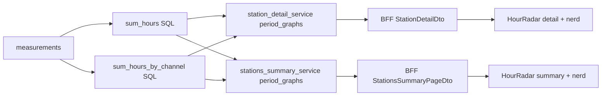

# 48 - Hour-of-day radar chart, weekday axis label fix + radar compare-previous plan

Status: implemented

## Problem

The detail page ([`StationDetail.tsx`](frontend/src/features/stationDetail/StationDetail.tsx))
and the station-summary page
([`StationsSummary.tsx`](frontend/src/features/stationsSummary/StationsSummary.tsx))
render a "Weekdays" radar next to a line chart, but there is no "separation by
hours" chart. The user wants an hour-of-day radar next to the Weekdays radar
(split in half), both in the "Detailed statistics" section and in the "Nerd
stats" section (per channel on the detail page, per station on the summary
page).

Two additional issues:

1. The first line chart's X-axis repeats the short weekday label for every
   tick of the week timeframe (e.g. `Mo Mo Mo Mo Di Di Di Di …`), because
   [`weekdayAxis()`](frontend/src/features/stationDetail/timeframes.ts:29)
   only formats the weekday name while the week timeframe uses 1-hour buckets.
2. The "Compare previous period" checkbox has no effect on the Weekdays radar —
   the radar only ever receives the current period. The new hour radar must
   support the compare checkbox too, and the Weekdays radar must be fixed to
   honor it.

## Goals

- Add a 24-hour radar (hour-of-day distribution) next to the Weekdays radar on
  the detail and summary pages, split half/half in one row, for the aggregate
  "Detailed statistics" section and for the "Nerd stats" section (per channel /
  per station).
- Fix the week line-chart X-axis so every tick label is unique (weekday + time).
- Make both the Weekdays radar and the new hour radar honor the "Compare
  previous period" checkbox (aggregate and per channel/station).

## Non-goals

- No change to the time-series line charts, the pie charts or the monthly bar
  chart (beyond the axis-label fix).
- No change to bucket widths or the timeframe selector.

## Data model

The hour-of-day totals must be aggregated directly from raw measurements (like
`sum_weekdays`), **not** folded from the already-fetched time buckets, because
the `last_30_days` and `year` timeframes use 1-day buckets that cannot be split
into hours.

New repository-level primitives in
[`repository_port.rs`](backend/src/core/domain/measurements/repository_port.rs):

- `HourTotal { hour: u8, total: i64 }` (local hour 0..=23).
- `ChannelHourTotal { channel_id: Uuid, hour: u8, total: i64 }` (per-channel
  hour totals for the nerd-stats radar).
- `MeasurementRepository::sum_hours(from, to, timezone, channel_ids) -> Vec<HourTotal>`.
- `MeasurementRepository::sum_hours_by_channel(from, to, timezone, channel_ids) -> Vec<ChannelHourTotal>`.

## Backend changes

### 1. Repository port
[`backend/src/core/domain/measurements/repository_port.rs`](backend/src/core/domain/measurements/repository_port.rs)

- Add the two structs and the two trait methods (analogous to `sum_weekdays` /
  `sum_buckets_by_channel`).

### 2. Postgres repository
[`backend/src/adapter/driven/postgres/measurement_repository.rs`](backend/src/adapter/driven/postgres/measurement_repository.rs)

- Implement `sum_hours`:
  `SELECT EXTRACT(HOUR FROM (timestamp AT TIME ZONE $2))::int AS hour, COALESCE(SUM(value),0)::bigint AS total … GROUP BY hour ORDER BY hour`.
- Implement `sum_hours_by_channel`:
  `SELECT channel_id, EXTRACT(HOUR FROM (timestamp AT TIME ZONE $2))::int AS hour, COALESCE(SUM(value),0)::bigint AS total … GROUP BY channel_id, hour ORDER BY channel_id, hour`.
- Add unit tests mirroring the existing `sum_weekdays` test.

### 3. Domain models
[`backend/src/core/domain/station_detail/mod.rs`](backend/src/core/domain/station_detail/mod.rs)

- `PeriodGraphs`: add
  - `weekday_radar_previous: Vec<WeekdayTotal>`
  - `hourly: Vec<HourTotal>`
  - `hourly_previous: Vec<HourTotal>`
- `PerChannelSeries`: add the same three fields.

[`backend/src/core/domain/stations_summary/mod.rs`](backend/src/core/domain/stations_summary/mod.rs)

- `SummaryPeriodGraphs`: add the same three fields.
- `PerStationSeries`: add the same three fields.

### 4. Detail service
[`backend/src/core/application/station_detail_service.rs`](backend/src/core/application/station_detail_service.rs)

- In [`period_graphs()`](backend/src/core/application/station_detail_service.rs:91):
  - `weekday_radar_previous = sum_weekdays(previous_from, previous_to, …)`.
  - `hourly = sum_hours(current_from, current_to, …)`.
  - `hourly_previous = sum_hours(previous_from, previous_to, …)`.
  - Per channel: `weekday_radar_previous = weekday_totals(&previous, tz)`,
    `hourly` / `hourly_previous` from `sum_hours_by_channel` for the current /
    previous window (keyed by `channel_id`).
- Populate the new fields in the returned `PeriodGraphs` / `PerChannelSeries`.
- Add unit tests for the new fields (mirror the existing weekday-radar tests).

### 5. Summary service
[`backend/src/core/application/stations_summary_service.rs`](backend/src/core/application/stations_summary_service.rs)

- In [`period_graphs()`](backend/src/core/application/stations_summary_service.rs:204):
  - `weekday_radar_previous = weekday_totals(&previous, tz)` (fold the already
    aggregated previous buckets, like the current weekday radar).
  - `hourly` / `hourly_previous` from `sum_hours` (aggregate).
  - Per station: `weekday_radar_previous` folds the previous per-station
    buckets; `hourly` / `hourly_previous` from `sum_hours_by_channel` mapped
    through `station_of_channel`.
- Update [`empty_graphs()`](backend/src/core/application/stations_summary_service.rs:326)
  and the `PerStationSeries` construction.
- Add unit tests.

### 6. BFF DTOs
[`backend/src/adapter/driving/bff/dto.rs`](backend/src/adapter/driving/bff/dto.rs)

- Add `HourTotalDto { hour: u8, total: i64 }` and
  `ChannelHourTotalDto { channel_id: Uuid, hour: u8, total: i64 }` (or map the
  per-channel rows to per-series `Vec<HourTotalDto>`).
- Add the new fields to `PeriodGraphsDto`, `PerChannelSeriesDto`,
  `SummaryPeriodGraphsDto`, `PerStationSeriesDto` and their `From` impls.

### 7. BFF test mocks + all in-memory repository mocks
Every `impl MeasurementRepository` must add the two new methods (empty `Ok(Vec::new())`
for the test mocks). Locations:

- [`backend/src/adapter/driving/rest/tests/mocks.rs`](backend/src/adapter/driving/rest/tests/mocks.rs:201)
- [`backend/src/core/application/station_detail_service.rs`](backend/src/core/application/station_detail_service.rs:465)
- [`backend/src/core/application/stations_summary_service.rs`](backend/src/core/application/stations_summary_service.rs:716)
- [`backend/src/core/application/measurement_service.rs`](backend/src/core/application/measurement_service.rs:73)
- [`backend/src/core/application/station_summary_service.rs`](backend/src/core/application/station_summary_service.rs:231)
- [`backend/src/core/application/global_summary_service.rs`](backend/src/core/application/global_summary_service.rs:241)
- [`backend/src/core/application/station_overview_service.rs`](backend/src/core/application/station_overview_service.rs:296)
- [`backend/src/core/application/data_import_service.rs`](backend/src/core/application/data_import_service.rs:850) and [`…:1386`](backend/src/core/application/data_import_service.rs:1386)
- [`backend/src/core/application/data_source_update_service.rs`](backend/src/core/application/data_source_update_service.rs:685)

### 8. OpenAPI registry
[`backend/src/adapter/driving/rest/openapi.rs`](backend/src/adapter/driving/rest/openapi.rs)

- Register the new DTO types in the schema list.

### 9. REST/BFF tests
[`backend/src/adapter/driving/rest/tests/bff.rs`](backend/src/adapter/driving/rest/tests/bff.rs)

- Extend the summary/detail payload assertions to include the new `hourly`,
  `hourly_previous` and `weekday_radar_previous` keys.

## Frontend changes

### 10. Types
[`frontend/src/features/stationDetail/types.ts`](frontend/src/features/stationDetail/types.ts)

- Add `HourTotal { hour: number; total: number }`.
- Add `weekday_radar_previous`, `hourly`, `hourly_previous` to `PeriodGraphs`
  and `PerChannelSeries`.

[`frontend/src/features/stationsSummary/types.ts`](frontend/src/features/stationsSummary/types.ts)

- Same additions to `SummaryPeriodGraphs` and `PerStationSeries`.

### 11. New `HourRadar` component
[`frontend/src/features/stationDetail/HourRadar.tsx`](frontend/src/features/stationDetail/HourRadar.tsx)

- A fixed 24-slot radar (labels `00` … `23`) that reuses the
  [`WeekdayRadar`](frontend/src/features/stationDetail/WeekdayRadar.tsx) pattern
  (multi-series `RadarSeries`-like shape over `HourTotal[]`, fill missing hours
  with 0, empty-state fallback). Extract a shared radar helper if that keeps the
  code DRY, otherwise a sibling component.

### 12. Fix the week X-axis labels
[`frontend/src/features/stationDetail/timeframes.ts`](frontend/src/features/stationDetail/timeframes.ts:29)

- Change [`weekdayAxis()`](frontend/src/features/stationDetail/timeframes.ts:29)
  to append the local time (e.g. `Mo 00:00`) so hour-level ticks are unique
  (the week timeframe is 1-hour buckets). Keep the tooltip on the full datetime.

### 13. Wire the detail page
[`frontend/src/features/stationDetail/StationDetail.tsx`](frontend/src/features/stationDetail/StationDetail.tsx)

- "Detailed statistics": put the Weekdays radar and the new Hours radar in one
  `grid grid-cols-1 gap-4 md:grid-cols-2` row (split half).
- "Nerd stats": put "Weekdays by channel" and "Hours by channel" side by side;
  keep "Share by channel" in the same two-column grid (or full width below).
- Pass the previous-period series to the radars when `comparePrevious` is on:
  aggregate weekday radar = current `Bikes` + previous `Bikes`,
  aggregate hour radar = current + previous,
  per-channel weekday/hour radars = current + previous per channel (labelled
  `name (previousLabel)`).

### 14. Wire the summary page
[`frontend/src/features/stationsSummary/StationsSummary.tsx`](frontend/src/features/stationsSummary/StationsSummary.tsx)

- Mirror the detail-page layout and compare wiring, keyed by station instead of
  channel.

### 15. Playwright e2e
[`frontend/e2e/detail.spec.ts`](frontend/e2e/detail.spec.ts) and
[`frontend/e2e/summary.spec.ts`](frontend/e2e/summary.spec.ts)

- Add/adjust assertions for the new "Hours" card(s) (title + one rendered
  chart). Keep assertions robust to a still-importing dataset.

## Data flow

## Definition of done

- [x] Plan registered in [`plans/README.md`](plans/README.md)
- [x] `make check` green
- [x] `make test` and/or `make test-rest` green
- [x] `make coverage` green
- [x] `make test-playwright` green
