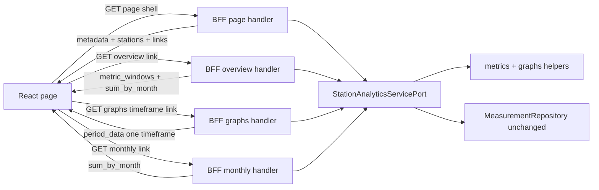

# 51 - Stats sub-requests (per-card) behind the BFF

Status: implemented

## Problem

The BFF serves two "fat" page payloads that compute everything in one response,
even though the UI only renders part of it at a time:

- [`GET /api/bff/station-detail/{id}`](backend/src/adapter/driving/bff/handlers.rs:361)
  returns station metadata + the four overview metrics + **all four** timeframe
  graphs + the monthly totals + the per-channel nerd stats in one
  [`StationDetailDto`](backend/src/adapter/driving/bff/dto.rs:196).
- [`GET /api/bff/stations/summary`](backend/src/adapter/driving/bff/handlers.rs:240)
  returns the same aggregated shape over every visible station in one
  [`StationsSummaryPageDto`](backend/src/adapter/driving/bff/dto.rs:514).

The detail page renders one timeframe at a time (default "week", see
[`StationDetail.tsx`](frontend/src/features/stationDetail/StationDetail.tsx:220)),
yet the backend eagerly computes `day`, `week`, `last_30_days` and `year`. The
summary page has the same waste, plus it recomputes the whole page whenever a
station is excluded via the map flag.

We want the BFF to keep a **main page call** (a light "shell" with metadata plus
HATEOAS links) and split the heavy stats into **sub-resources per stats-card**,
so the frontend fetches each card independently as it renders.

## Goals

- Keep the existing page-shaped main calls, but make them return a light shell
  (metadata + HATEOAS `_links`) instead of the full aggregation.
- Add card-level sub-resource endpoints for:
  - the overview stats (total bikes + the four metrics),
  - one selected timeframe of the detailed/nerd graph data,
  - the monthly totals.
- Split along the existing application seams
  ([`metric_windows`](backend/src/core/application/station_analytics/metrics.rs:51),
  [`period_data`](backend/src/core/application/station_analytics/graphs.rs:189),
  `sum_by_month`) so each sub-request computes only its own card — no more
  eager four-timeframe work.
- Keep the domain measurement models and [`MeasurementRepository`](backend/src/core/domain/measurements/repository_port.rs:62)
  **100% unchanged**; reuse the existing per-timeframe types (`PeriodGraphs`,
  `SummaryPeriodGraphs`, `MetricWindow`, `MonthTotal`) as the return types.
- Design every new method to be cache-ready (see [Caching-readiness](#caching-readiness)):
  pure, `now`-parameterized, deterministic-key GETs so a future Redis/Valkey
  decorator can wrap the port with per-method TTLs.

## Non-goals

- No caching implementation in this plan (it is the next step; this plan only
  keeps the seam open and makes the keys natural).
- No changes to the public `/api/v1` REST API, the sidebar/search/map BFF
  endpoints, the global summary, the asset stream or the `station-overview`
  endpoint.
- No changes to the domain measurement models or any driven (repository)
  adapter.
- No date-picker work.

## Architectural decision

Use a **HATEOAS page shell + card-level sub-resources**, with the seam being the
application service port. Each stats-card maps 1:1 onto an existing helper, so
no repository query changes are needed:

- Overview card → [`metrics::metric_windows`](backend/src/core/application/station_analytics/metrics.rs:51)
  + one `sum_by_month` (all-time total).
- Detailed statistics + Nerd stats cards (same timeframe selector) →
  [`graphs::period_graphs_per_channel`](backend/src/core/application/station_analytics/graphs.rs:336)
  (detail) or [`graphs::period_graphs_per_station`](backend/src/core/application/station_analytics/graphs.rs:396)
  (summary), one timeframe at a time.
- Monthly bar chart → one `sum_by_month`.

The single timeframe graph sub-resource returns the aggregate series + radars +
pie + per-channel/per-station series together, because both the "Detailed
statistics" and "Nerd stats" sections are driven by the same timeframe selector
and consume the same [`PeriodGraphs`](backend/src/core/domain/station_analytics/mod.rs:140) /
[`SummaryPeriodGraphs`](backend/src/core/domain/station_analytics/mod.rs:259) data.



### Why this beats a BFF-only slice

Slicing the existing `detail()` / `stations_summary()` in the handler would keep
the core untouched but would recompute the full four-timeframe aggregation on
every sub-request — defeating the performance goal. Extending the port with
per-card methods keeps the split in the hexagonal core, where the helpers already
live, and makes the computation match the request.

### Why per-card is cache-friendly

A fat payload forces one TTL for everything. With sub-resources, each card has
its own key and natural lifetime (station metadata is stable, graphs change on
import), which is exactly what the upcoming cache decorator wants.

## Endpoint surface (all under the `BFF API` tag)

### Detail page

| Method | Path | Purpose | Response |
|---|---|---|---|
| GET | `/api/bff/station-detail/{id}` | page shell | `StationDetailPageDto` |
| GET | `/api/bff/station-detail/{id}/overview` | overview stats | `StationOverviewStatsDto` |
| GET | `/api/bff/station-detail/{id}/graphs/{timeframe}` | one timeframe graphs | `PeriodGraphsDto` |
| GET | `/api/bff/station-detail/{id}/monthly` | monthly totals | `MonthlyTotalsDto` |

`timeframe` ∈ `day | week | last_30_days | year`.

The time-windowed sub-resources (`overview` and `graphs`) take an optional
`as_of` query parameter (ISO-8601 UTC instant) that pins the window reference
instead of the server's `now`. The shell embeds this `as_of` in its links, so
each card URL is a pure function of the reference time — and therefore
cacheable. `monthly` is whole-history and takes no `as_of`.

### Summary page

| Method | Path | Purpose | Response |
|---|---|---|---|
| GET | `/api/bff/stations/summary` | page shell | `StationsSummaryPageDto` |
| GET | `/api/bff/stations/summary/overview` | aggregated overview | `StationsSummaryOverviewDto` |
| GET | `/api/bff/stations/summary/graphs/{timeframe}` | one timeframe graphs | `SummaryPeriodGraphsDto` |
| GET | `/api/bff/stations/summary/monthly` | monthly totals | `MonthlyTotalsDto` |

The summary sub-resources take the same bounds query as the shell
(`min_lat`, `min_lng`, `max_lat`, `max_lng`), the optional comma-separated
`exclude` list, and — for `overview` and `graphs` — the same `as_of` reference
time.

### HATEOAS links

The shells carry a `_links` map built with the existing
[`LinkDto`](backend/src/adapter/driving/rest/dto/mod.rs:31) (already registered
in the OpenAPI doc):

- Detail shell: `self`, `overview`, `graphs_day`, `graphs_week`,
  `graphs_last_30_days`, `graphs_year`, `monthly` — all concrete URLs. The
  `overview` and `graphs_*` links carry `?as_of=<shell reference time>`;
  `monthly` has no query.
- Summary shell: `self`, `overview`, `graphs_day`, `graphs_week`,
  `graphs_last_30_days`, `graphs_year`, `monthly` — concrete URLs with the
  current bounds and `?as_of=<shell reference time>`; the frontend appends
  `&exclude=...` from its local disabled state when it has exclusions.

The shell's reference time is server `now` by default and is also accepted as an
inbound `as_of` query parameter, so the date picker can pin the whole page to an
arbitrary reference (see [Date/time picker seam](#datetime-picker-seam)).

## Backend changes

### 1. Domain models ([`station_analytics/mod.rs`](backend/src/core/domain/station_analytics/mod.rs:1))

Additions (no existing model is modified):

- `GraphTimeframe` enum (`Day`, `Week`, `Last30Days`, `Year`) with
  `as_str()` matching the frontend keys.
- `StationDetailPage { station, channels, last_update }` — detail shell.
- `StationsSummaryPage { stations, last_update }` — summary shell.
- `StationsSummaryOverview { channel_count, total_bikes, metrics }` — summary
  overview card.

Removals (dead after the split — they were only assembled by the old
`detail()` / `stations_summary()` methods):

- [`StationDetail`](backend/src/core/domain/station_analytics/mod.rs:131),
  [`StationDetailGraphs`](backend/src/core/domain/station_analytics/mod.rs:184),
  [`StationsSummary`](backend/src/core/domain/station_analytics/mod.rs:206),
  [`StationsSummaryGraphs`](backend/src/core/domain/station_analytics/mod.rs:241).

`PeriodGraphs`, `SummaryPeriodGraphs`, `MetricWindow`, `MetricKey`, `MonthTotal`,
`StationOverview`, `StationSummary`, `GlobalSummary`, `GeoBounds` all stay.

### 2. Port ([`service_port.rs`](backend/src/core/domain/station_analytics/service_port.rs:12))

Keep `summaries`, `global_summary`, `overview`. Replace `detail` and
`stations_summary` with:

```rust
fn detail_page(&self, station_id: Id, now: DateTime<Utc>) -> Result<StationDetailPage, DomainError>;
fn detail_graphs_timeframe(&self, station_id: Id, timeframe: GraphTimeframe, now: DateTime<Utc>) -> Result<PeriodGraphs, DomainError>;
fn detail_monthly(&self, station_id: Id, now: DateTime<Utc>) -> Result<Vec<MonthTotal>, DomainError>;
fn stations_summary_page(&self, bounds: GeoBounds, now: DateTime<Utc>) -> Result<StationsSummaryPage, DomainError>;
fn stations_summary_overview(&self, bounds: GeoBounds, exclude: &[Id], now: DateTime<Utc>) -> Result<StationsSummaryOverview, DomainError>;
fn stations_summary_graphs_timeframe(&self, bounds: GeoBounds, exclude: &[Id], timeframe: GraphTimeframe, now: DateTime<Utc>) -> Result<SummaryPeriodGraphs, DomainError>;
fn stations_summary_monthly(&self, bounds: GeoBounds, exclude: &[Id], now: DateTime<Utc>) -> Result<Vec<MonthTotal>, DomainError>;
```

The detail overview sub-resource reuses the existing `overview()` and slices
`total_bikes` + `metrics`; no extra method is needed there.

### 3. Service ([`service.rs`](backend/src/core/application/station_analytics/service.rs:71))

- `detail_page`: fetch station + full channels + `last_update`; return the
  shell. No graph aggregation.
- `detail_graphs_timeframe`: fetch station/channels, compute
  `graphs::graph_windows(tz, now)` (cheap date math), call
  `graphs::period_graphs_per_channel` for the selected timeframe only.
- `detail_monthly`: fetch station/channels, call `sum_by_month`.
- `stations_summary_page`: resolve in-bounds stations + `SummaryStation` list +
  `last_update`; no metric/graph aggregation.
- `stations_summary_overview`: resolve included stations, run
  `metrics::metric_windows`, count channels, derive `total_bikes` from one
  `sum_by_month`.
- `stations_summary_graphs_timeframe`: resolve included stations + the
  channel→station map, call `graphs::period_graphs_per_station` for the selected
  timeframe.
- `stations_summary_monthly`: resolve included channel ids, call `sum_by_month`.

Extract a private `included_stations(bounds, exclude)` helper to avoid the
repeated bounds/exclude filtering. Delete `detail()` and `stations_summary()`.

### 4. Graph/metrics helpers

[`graphs.rs`](backend/src/core/application/station_analytics/graphs.rs:1) and
[`metrics.rs`](backend/src/core/application/station_analytics/metrics.rs:1)
keep their free functions unchanged. Delete the now-unused
`stations_summary_graphs` + `empty_graphs` wrappers (only the old
`stations_summary()` called them).

### 5. BFF DTOs ([`bff/dto.rs`](backend/src/adapter/driving/bff/dto.rs:1))

- Replace [`StationDetailDto`](backend/src/adapter/driving/bff/dto.rs:196) with
  `StationDetailPageDto` (metadata + `channels` + `_links`).
- Replace [`StationsSummaryPageDto`](backend/src/adapter/driving/bff/dto.rs:514)
  with the shell `StationsSummaryPageDto` (`image_url` + `stations` +
  `last_update` + `_links`).
- Add `StationOverviewStatsDto { total_bikes, metrics }`,
  `StationsSummaryOverviewDto { channel_count, total_bikes, metrics }`,
  `MonthlyTotalsDto { monthly_totals }`.
- Remove `StationDetailGraphsDto` and `StationsSummaryGraphsDto` and their
  `From` conversions; `PeriodGraphsDto` and `SummaryPeriodGraphsDto` remain.
- Import and reuse [`LinkDto`](backend/src/adapter/driving/rest/dto/mod.rs:31).

### 6. BFF handlers ([`bff/handlers.rs`](backend/src/adapter/driving/bff/handlers.rs:1))

- Rewrite the detail and summary page handlers to return the shells, compute a
  single reference `now` (or use the inbound `as_of`), and build the `_links`
  map with `?as_of=...` on the overview and graphs links.
- Add the overview / graphs / monthly sub-resource handlers (parse `timeframe`
  from the path, reject unknown values with 400; parse the optional `as_of`
  query parameter and forward it to the service as `now`).
- Keep the existing `station-overview`, sidebar, search, map, global-summary and
  asset handlers unchanged.

### 7. Router + OpenAPI

- [`rest/mod.rs`](backend/src/adapter/driving/rest/mod.rs:84): replace the two
  old routes with the eight shell/sub-resource routes.
- [`openapi.rs`](backend/src/adapter/driving/rest/openapi.rs:31): register the
  new paths and schemas; remove the obsolete detail/graph DTO schemas.

### 8. Tests

- Refactor [`station_analytics/tests.rs`](backend/src/core/application/station_analytics/tests.rs:1)
  to cover each new method; drop the old `detail`/`stations_summary` cases.
  Keep core coverage ≥ 95%.
- Update [`bff.rs`](backend/src/adapter/driving/rest/tests/bff.rs:1) for the
  shell + sub-resource shapes, the `_links` contents and the OpenAPI paths/
  schemas.

## Frontend changes

### Types + API

- Split [`stationDetail/types.ts`](frontend/src/features/stationDetail/types.ts:1)
  and [`stationsSummary/types.ts`](frontend/src/features/stationsSummary/types.ts:1)
  into shell + overview-stats + graph + monthly types, with a `links` record on
  the shells.
- Add `fetchStationDetailPage`, `fetchStationOverviewStats`,
  `fetchStationGraphs(id, timeframe)`, `fetchStationMonthly(id)` and the
  summary equivalents in the `api.ts` modules.

### Hooks

- Replace [`useStationDetail`](frontend/src/features/stationDetail/useStationDetail.ts:6)
  with `useStationDetailPage` + card hooks (`useStationOverviewStats`,
  `useStationGraphs(timeframe)`, `useStationMonthly`).
- Replace [`useStationsSummary`](frontend/src/features/stationsSummary/useStationsSummary.ts:9)
  with `useStationsSummaryPage(bounds)` (shell, bounds-only) + card hooks that
  also depend on `disabled`. Toggling a station re-fetches only the overview /
  graphs / monthly cards, not the shell.

### Components

- [`StationDetail.tsx`](frontend/src/features/stationDetail/StationDetail.tsx:160)
  and [`StationsSummary.tsx`](frontend/src/features/stationsSummary/StationsSummary.tsx:171):
  render the shell immediately, then render each stats-card from its own hook
  with a per-card loading/error state. The "Detailed statistics" and "Nerd
  stats" sections share the single timeframe graph fetch.

## E2E changes

- Update [`detail.spec.ts`](frontend/e2e/detail.spec.ts:1) and
  [`summary.spec.ts`](frontend/e2e/summary.spec.ts:1) to wait for the shell
  first, then for each card's data (the existing 240 s timeouts stay).
- Keep assertions robust to progressive loading; optionally add one assertion
  that the shell renders before a card populates.

## Caching-readiness

The hour-of-day radar and every other time-windowed card change as the "current"
window rolls forward, so they cannot be cached if computed from server `now`.
Pinning the reference time into the request fixes this:

- Every windowed sub-resource URL carries `?as_of=<reference>`, so the response
  becomes a pure function of that URL. A cache keyed on the URL (or the
  normalized `as_of` + station/bounds/exclude/timeframe tuple) is immutable for
  a given reference and only invalidates when new measurements are imported.
- The shell is stable per station/bounds and can use a longer TTL; the graph
  cards use the pinned `as_of` and import-based invalidation. A decorator can
  set per-method TTLs without recomputing window math.
- Every new port method is pure and already takes `now: DateTime<Utc>` (the seam
  [`graph_windows`](backend/src/core/application/station_analytics/graphs.rs:86)
  and [`metric_windows`](backend/src/core/application/station_analytics/metrics.rs:51)
  use), so the handler simply forwards the parsed `as_of` — no service change is
  needed for the cache key.
- The BFF handlers stay thin, so the cache decorator wraps
  [`StationAnalyticsServicePort`](backend/src/core/domain/station_analytics/service_port.rs:12)
  without touching the domain or the adapter routes.

## Date/time picker seam

`as_of` is exactly the parameter the future date/time picker will set. Selecting
a past reference reuses the same sub-resource endpoints unchanged; the service
already derives all windows from `now`, so a past `as_of` flows through
[`graph_windows`](backend/src/core/application/station_analytics/graphs.rs:86)
and [`metric_windows`](backend/src/core/application/station_analytics/metrics.rs:51)
without new plumbing. Window semantics for historical periods (full period vs
truncated "up to `as_of`") are deferred to the date-picker plan.

## Definition of done

- [x] Page endpoints return shells with HATEOAS `_links`; sub-resource endpoints
      return exactly one card each.
- [x] `MeasurementRepository` and the measurement domain models unchanged.
- [x] `make check`, `make test-rest`, `make test`, `make coverage` green
      (core ≥ 95%).
- [x] `make frontend-build` green.
- [x] `make test-playwright` green.
