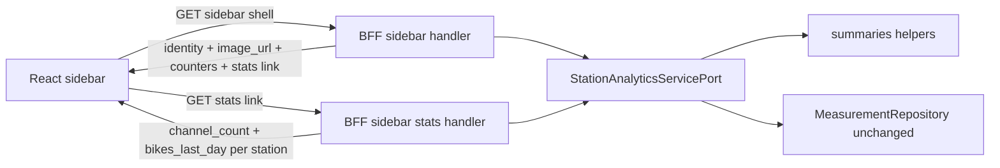

# 52 - Sidebar shell + stats sub-resource and shadcn Skeleton loading states

Status: implemented

## Problem

Two loading-UX issues remain after the plan-51 per-card split:

1. The detail and summary pages still replace every stats card with a plain
   `Loading …` text line while its sub-resource is in flight, and the detail
   page shell itself shows a bare `Loading counting station…` line. This looks
   unfinished and causes layout jump when the content arrives.
2. The map sidebar loads **at once**: [`GET /api/bff/stations/sidebar`](backend/src/adapter/driving/bff/handlers.rs:193)
   bundles the station identity with the per-station stats (`channel_count`,
   `bikes_last_day`) in one payload, and the sidebar shows a single
   `Loading counting stations…` line until the whole payload arrives. There is
   no image, and the stats block the identity from rendering even though the
   stats are the expensive part (one local-day measurement sum per station).

We want the same treatment plan 51 gave the detail/summary pages:

- Render a **shadcn `Skeleton` shell** (the UI without content) immediately, and
  fill it when each response arrives.
- Split the sidebar into a light **shell** (image + name + description +
  visible/total counters) that loads directly, and a **stats sub-resource**
  (`channel_count` + `bikes_last_day`) fetched in parallel — mirroring the
  detail/summary card pattern.

## Goals

- Add the shadcn [`Skeleton`](frontend/src/components/ui/skeleton.tsx) primitive
  and use it (with `Card` / `CardHeader` / `CardContent`) to render stable,
  non-jumping loading placeholders for:
  - the detail page shell + its four stats cards,
  - the summary page shell + its four stats cards,
  - the sidebar list (identity rows + per-row stats).
- Split [`get_bff_stations_sidebar`](backend/src/adapter/driving/bff/handlers.rs:193)
  into:
  - a **shell** endpoint returning identity + `image_url` + `visible_count` /
    `total_count` + a HATEOAS `stats` link, and
  - a **stats** sub-resource returning `channel_count` + `bikes_last_day` per
    visible station.
- Keep the measurement domain models and
  [`MeasurementRepository`](backend/src/core/domain/measurements/repository_port.rs:62)
  **100% unchanged**; the split lives entirely in the analytics service seam, the
  BFF DTOs/handlers and the frontend.
- Keep the search dialog (`/api/bff/stations/search` +
  [`StationListItem`](frontend/src/features/stations/StationListItem.tsx:9))
  **unchanged** (no image, inline stats) — confirmed scope.

## Non-goals

- No change to the search dialog payload or the `StationSummary` model it uses.
- No change to the map-marker endpoint, the global summary, the overview panel,
  the detail/summary card sub-resources or the asset stream endpoint.
- No caching implementation (this plan only keeps the seam natural; the stats
  sub-resource can gain an `as_of` reference later, exactly like plan 51).
- No date-picker work.

## Architectural decision

Extend the plan-51 HATEOAS pattern to the sidebar. The expensive part of the
sidebar is the per-station `bikes_last_day` sum; the identity + counters are
cheap, so the shell can render immediately and the stats arrive on their own:



The sidebar shell handler resolves each station's image URL with the existing
[`station_image_url`](backend/src/adapter/driving/bff/handlers.rs:115) logic and
returns a lean `SidebarStationDto` (no `data_source_id`, no `_links` noise).
The stats handler reuses the summaries computation but returns only the
`channel_count` + `bikes_last_day` per station.

### Why split along the service seam

Slicing only in the handler would keep the single `summaries()` call, which
recomputes the expensive measurement sums for every station even though the
frontend only wanted identity first. Adding `sidebar_shell` / `sidebar_stats` to
[`StationAnalyticsServicePort`](backend/src/core/domain/station_analytics/service_port.rs:14)
keeps the split in the hexagonal core where the helpers already live, matching
plan 51's philosophy: each request computes only its own response.

## Endpoint surface (all under the `BFF API` tag)

| Method | Path | Purpose | Response |
|---|---|---|---|
| GET | `/api/bff/stations/sidebar` | sidebar shell | `SidebarShellDto` |
| GET | `/api/bff/stations/sidebar/stats` | per-station stats | `SidebarStatsDto` |

Both take the four required bounds (`min_lat`, `min_lng`, `max_lat`, `max_lng`).
The shell's `_links.stats` is a concrete URL with those bounds embedded, so the
frontend never reconstructs the query.

The stats sub-resource computes `bikes_last_day` against the server `now`
(previous complete local day in each station's timezone). It does **not** take
`as_of` in this plan; when the cache decorator arrives it can add the same
optional `as_of` query the detail/summary cards already use, without touching the
domain.

## Backend changes

### 1. Domain models ([`station_analytics/mod.rs`](backend/src/core/domain/station_analytics/mod.rs:1))

Additions (no existing model is modified):

- `SidebarStationStats { station_id: Id, channel_count: usize, bikes_last_day: i64 }`
  — the per-station stats payload.

[`StationSummary`](backend/src/core/domain/station_analytics/mod.rs:35) stays
(search still consumes it). No removals.

### 2. Port ([`service_port.rs`](backend/src/core/domain/station_analytics/service_port.rs:14))

Keep `summaries` (search). Add:

```rust
fn sidebar_shell(&self, bounds: GeoBounds) -> Result<Vec<CountingStation>, DomainError>;
fn sidebar_stats(&self, bounds: GeoBounds, now: DateTime<Utc>) -> Result<Vec<SidebarStationStats>, DomainError>;
```

`sidebar_shell` returns the in-bounds stations sorted by name (the handler turns
them into `SidebarStationDto` with image URLs). Import `CountingStation` and
`SidebarStationStats`.

### 3. Service ([`service.rs`](backend/src/core/application/station_analytics/service.rs:170))

Extract the parts of `summaries` that the three methods share, then implement:

- Private `stations_for_bounds(bounds: Option<GeoBounds>) -> Result<Vec<CountingStation>, DomainError>`
  — the `find_filtered` + bounds filter + name sort already in `summaries`.
- Private `bikes_last_day_by_station(...)` — the per-station local-day sum loop
  already in `summaries`.
- `sidebar_shell(bounds)` → `stations_for_bounds(Some(bounds))` (no channel or
  measurement work).
- `sidebar_stats(bounds, now)` → stations + channels + the bikes map, projected
  to `Vec<SidebarStationStats>` (with the channel counts).
- Rewrite `summaries` to reuse `stations_for_bounds` + `bikes_last_day_by_station`
  (behavior unchanged).

### 4. BFF DTOs ([`bff/dto.rs`](backend/src/adapter/driving/bff/dto.rs:1))

Replace [`StationSummarySidebarDto`](backend/src/adapter/driving/bff/dto.rs:77)
with:

```rust
pub struct SidebarStationDto {
    pub id: Uuid,
    pub name: String,
    pub description: String,
    pub latitude: Option<f64>,
    pub longitude: Option<f64>,
    pub image_url: String,
}

pub struct SidebarShellDto {
    pub items: Vec<SidebarStationDto>,
    pub visible_count: usize,
    pub total_count: usize,
    #[serde(rename = "_links")]
    pub links: HashMap<String, LinkDto>,
}

pub struct SidebarStationStatsDto {
    pub station_id: Uuid,
    pub channel_count: usize,
    pub bikes_last_day: i64,
}

pub struct SidebarStatsDto {
    pub items: Vec<SidebarStationStatsDto>,
}
```

Add `From<SidebarStationStats> for SidebarStationStatsDto`. `SidebarStationDto`
is built in the handler (it needs the resolved image URL); keep
[`StationSummaryDto`](backend/src/adapter/driving/bff/dto.rs:37) for search.

### 5. BFF handlers ([`bff/handlers.rs`](backend/src/adapter/driving/bff/handlers.rs:193))

- Rewrite `get_bff_stations_sidebar` to return the shell:
  - `parse_required_bounds` as today;
  - `stations = sidebar_shell(bounds)` via `blocking`;
  - resolve each station's image URL (default asset once, then per-station linked
    asset via `station_image_url`, reusing the default asset id where possible);
  - `total_count = counting_station_service.list(None).len()`;
  - `links.stats = /api/bff/stations/sidebar/stats?<bbox>` (concrete URL).
- Add `get_bff_stations_sidebar_stats`: parse bounds, `now = Utc::now()`, call
  `sidebar_stats(bounds, now)`, return `SidebarStatsDto`.

### 6. Router + OpenAPI

- [`rest/mod.rs`](backend/src/adapter/driving/rest/mod.rs:90): add the
  `/api/bff/stations/sidebar/stats` route next to the sidebar route.
- [`openapi.rs`](backend/src/adapter/driving/rest/openapi.rs:8): register the new
  path + handler and the `SidebarStationDto` / `SidebarShellDto` /
  `SidebarStationStatsDto` / `SidebarStatsDto` schemas; remove the
  `StationSummarySidebarDto` schema reference.

### 7. Tests

- [`station_analytics/tests.rs`](backend/src/core/application/station_analytics/tests.rs:485):
  cover `sidebar_shell` (bounds filter + name sort, no measurement work) and
  `sidebar_stats` (channel count + bikes_last_day, empty bounds). Keep the
  existing `summaries` cases. Core coverage ≥ 95%.
- [`bff.rs`](backend/src/adapter/driving/rest/tests/bff.rs:104): update the
  sidebar tests to assert the shell shape (items carry `image_url`, no
  `channel_count` / `bikes_last_day`, `_links.stats` present), and add a stats
  endpoint test (per-station `channel_count` + `bikes_last_day`, `400` on
  missing bounds). Keep the search test unchanged.

## Frontend changes

### 0. Skeleton primitive (new)

Create [`frontend/src/components/ui/skeleton.tsx`](frontend/src/components/ui/skeleton.tsx)
(standard shadcn `Skeleton`, using `bg-accent animate-pulse rounded-md`), matching
the already-present shadcn component style in
[`components/ui/card.tsx`](frontend/src/components/ui/card.tsx:1).

### 1. Shared skeleton components (new)

Add [`frontend/src/features/stationDetail/Skeletons.tsx`](frontend/src/features/stationDetail/Skeletons.tsx)
exported from the detail feature (the summary page already imports chart helpers
from here), containing small `Card`-wrapped `Skeleton` pieces used by both pages:

- `PageShellSkeleton` — image block + title/lines (the shell placeholder).
- `OverviewSkeleton` — a total-bikes card skeleton + a 4-up grid of metric card
  skeletons.
- `ChartsSkeleton` — a full-width chart-card skeleton + two radar-card skeletons
  (used for both "Detailed statistics" and "Nerd stats").
- `MonthlyBarSkeleton` — a bar-chart card skeleton.

### 2. Sidebar types + API

[`stations/types.ts`](frontend/src/features/stations/types.ts:25):

- Add `SidebarStation { id, name, description, latitude, longitude, image_url }`.
- Add `SidebarStationStats { station_id, channel_count, bikes_last_day }`.
- Add `SidebarShell { items: SidebarStation[], visible_count, total_count, _links: { stats: string } }`.
- Add `SidebarStats { items: SidebarStationStats[] }`.
- Remove `StationSummarySidebar` (keep `StationSummary` for search).

[`stations/api.ts`](frontend/src/features/stations/api.ts:12):

- Split `fetchVisibleStations` into `fetchSidebarShell(bounds)` (GET
  `/api/bff/stations/sidebar`) and `fetchSidebarStats(statsUrl)` (GET the shell's
  `stats` link). Keep the map-marker fetch.
- `fetchSidebarShell` unwraps `_links.stats.href` into the shell type.

### 3. Sidebar hook ([`useVisibleStations.ts`](frontend/src/features/stations/useVisibleStations.ts:8))

- Fetch map markers + sidebar shell in parallel (as today), but also kick off the
  stats fetch from `shell._links.stats` once the shell resolves.
- Return `{ mapStations, shell, stats, error, loading }`, where `stats` is a
  `Map<string, SidebarStationStats>` (or `SidebarStats | null`) keyed by
  `station_id`. Shell and stats have independent loading/error states.

### 4. Sidebar components

- New [`frontend/src/features/sidebar/SidebarListItem.tsx`](frontend/src/features/sidebar/SidebarListItem.tsx):
  renders the image thumbnail + name + description immediately, and the
  `channel_count` / `bikes_last_day` line from `stats` — showing a `Skeleton` for
  the stats line until the stats response arrives. (Search keeps using
  [`StationListItem`](frontend/src/features/stations/StationListItem.tsx:9).)
- [`Sidebar.tsx`](frontend/src/features/sidebar/Sidebar.tsx:12):
  - render a few `SidebarListItem`-shaped skeleton rows while the shell loads
    (instead of the `Loading counting stations…` line);
  - render real rows from the shell (image + name direct), passing each row's
    stats from the parallel stats map;
  - keep the visible/total badge driven by the shell.

### 5. Detail page ([`StationDetail.tsx`](frontend/src/features/stationDetail/StationDetail.tsx:164))

- Use the shell's `loading`/`error` state (already returned by
  [`useStationDetailPage`](frontend/src/features/stationDetail/useStationDetailPage.ts:8))
  to render `PageShellSkeleton` instead of `Loading counting station…`.
- Destructure `loading`/`error` from the card hooks (they already expose them via
  [`useResource`](frontend/src/features/stationDetail/useResource.ts:6)) and
  render `OverviewSkeleton` / `ChartsSkeleton` / `MonthlyBarSkeleton` while
  loading, a small error message on failure, and the real content when data has
  arrived.

### 6. Summary page ([`StationsSummary.tsx`](frontend/src/features/stationsSummary/StationsSummary.tsx:176))

- Replace the full-page `Loader2` spinner with `PageShellSkeleton`.
- Use the already-returned `loading`/`error` from
  [`useStationsSummaryOverview`](frontend/src/features/stationsSummary/useStationsSummaryOverview.ts:8),
  `useStationsSummaryGraphs`, `useStationsSummaryMonthly` to render the same
  skeleton components instead of the `Loading …` text.

## E2E changes

- [`sidebar.spec.ts`](frontend/e2e/sidebar.spec.ts:9): the `sidebarStationItems`
  locator (`li:has(button)`) and `sidebarBadge` still match the new shell, so the
  existing assertions hold. Add an assertion that a station image renders in a
  sidebar row and that the stats line populates after the shell (progressive
  load). Update [`waitForStations`](frontend/e2e/helpers.ts:44) if needed so it
  waits for the shell rather than the stats.
- [`detail.spec.ts`](frontend/e2e/detail.spec.ts:15) and
  [`summary.spec.ts`](frontend/e2e/summary.spec.ts): keep the existing waits
  (Playwright auto-waits for the final content); optionally add one assertion
  that the shell renders before a card populates. No change to the final-content
  assertions.

## Definition of done

- [x] Sidebar shell returns identity + `image_url` + counters + `_links.stats`;
      the stats sub-resource returns `channel_count` + `bikes_last_day` per
      station.
- [x] `MeasurementRepository` and the measurement domain models unchanged;
      search endpoint + `StationListItem` unchanged.
- [x] shadcn `Skeleton` used for all detail/summary/sidebar loading states (no
      bare `Loading …` text left in these views).
- [x] `make check`, `make test-rest`, `make test`, `make coverage` green
      (core ≥ 95%).
- [x] `make frontend-build` green.
- [x] `make test-playwright` green.
