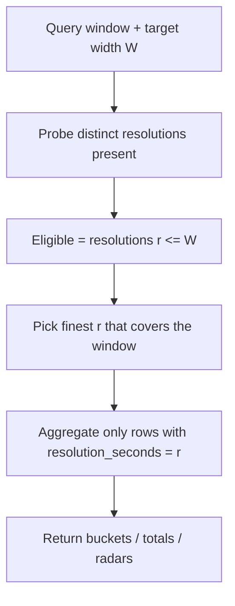

# 57 - Hamburg SensorThings adapter + measurement resolution dimension

Status: implemented

## Problem

Add **Hamburg** as a new bicycle-counting data source, using only the official
Hamburg SensorThings API (`https://iot.hamburg.de/v1.0/`, service
`HH_STA_Verkehrsdaten_Rad_Infrarotdetektoren`) — no Eco-Counter, no scraping, no
undocumented endpoints.

The existing data model stores one additive integer per
`(channel, timestamp)` with **no resolution**, and the analytics layer sums raw
values into 5-minute / 1-hour / 1-day buckets. Hamburg publishes the *same*
counter at several resolutions (`Anzahl_Fahrraeder_Zaehlfeld_5-Min`,
`Zaehlstelle_5-Min`, `Zaehlstelle_15-Min`, `Zaehlstelle_1-Stunde`,
`Zaehlstelle_1-Tag`, `Zaehlstelle_1-Woche`) with **different retention
windows**. To combine them without double counting, the domain must record
**which resolution** each measurement represents, and the analytics must pick
the right resolution per requested bucket width.

## Design

### 1. Resolution lives on each measurement, as an open value

Add a [`ResolutionSeconds`](backend/src/core/domain/measurements/measurement.rs:9)
value object — a plain positive `i64` seconds. Because it is an open number, the
core supports **any** bucket size (300, 900, 3600, 86400, 604800, or arbitrary
values) without ever hardcoding a fixed set. The frontend's existing bucket
widths are just three of infinitely many values.

Every [`Measurement`](backend/src/core/domain/measurements/measurement.rs:1)
carries `resolution_seconds`; `timestamp` remains the **interval start** (the
existing convention: Bonn stores the hour start, Münster the 15-minute start).

**Channels are allowed to hold multiple resolutions.** Resolution is a property
of the measurement, not the channel, so the model does not force a one-to-one
channel/resolution mapping. In practice each Hamburg datastream still maps to
its own channel, but the schema does not assume that.

Known resolutions (verified):

| Provider | `resolution_seconds` |
|---|---|
| Münster | `900` (15 min, see [`tests.rs`](backend/src/adapter/driven/muenster_github/tests.rs:362)) |
| Bonn | `3600` (hourly) |
| Hamburg | `300`, `900`, `3600`, `86400` per datastream |

### 2. The adapter declares resolution; unknown duration is dropped

[`MeasurementRecord`](backend/src/core/domain/data_source/provider_port.rs:128)
gains a required `resolution_seconds: i64`. Each provider determines the
duration from the source (for Hamburg: the Datastream's `phenomenonTime` interval
or the observation's own `[start, end)`). An observation whose duration cannot
be determined is **dropped at ingest** — the adapter skips it and emits a
`WARNING` message, and a later re-import picks it up once the source/adapter
knows the duration. The core therefore only ever receives measurements with a
known resolution.

### 3. Storage — no silent default

Migration `V14__add_measurements_resolution.sql`:

```sql
-- nullable, no default
ALTER TABLE measurements ADD COLUMN resolution_seconds BIGINT;

-- explicit backfill by data-source name
UPDATE measurements m SET resolution_seconds = 900
 WHERE m.channel_id IN (SELECT c.id FROM channels c
   JOIN counting_stations s ON s.id = c.counting_station_id
   JOIN data_sources d ON d.id = s.data_source_id WHERE d.name = 'Münster');
UPDATE measurements m SET resolution_seconds = 3600
 WHERE m.channel_id IN (SELECT c.id FROM channels c
   JOIN counting_stations s ON s.id = c.counting_station_id
   JOIN data_sources d ON d.id = s.data_source_id WHERE d.name = 'Bonn');

-- drop any remaining unknown-resolution rows (a re-import recovers them)
DELETE FROM measurements WHERE resolution_seconds IS NULL;

ALTER TABLE measurements ALTER COLUMN resolution_seconds SET NOT NULL;
ALTER TABLE measurements ADD CONSTRAINT measurements_resolution_positive
  CHECK (resolution_seconds > 0);
```

The natural key widens to include resolution, so a channel can carry two
resolutions at the same timestamp without conflict, and idempotent upserts stay
correct:

```sql
ALTER TABLE measurements DROP CONSTRAINT measurements_channel_id_timestamp_key;
ALTER TABLE measurements ADD CONSTRAINT measurements_channel_timestamp_resolution_key
  UNIQUE (channel_id, timestamp, resolution_seconds);
```

The `ON CONFLICT` clauses in
[`save`](backend/src/adapter/driven/postgres/measurement_repository.rs:24) and
[`save_batch`](backend/src/adapter/driven/postgres/measurement_repository.rs:39)
are updated to the new key.

### 3b. DB-level integrity — reject overlapping or mis-spaced rows

Beyond `CHECK (resolution_seconds > 0)`, a hard guard prevents the corruption
class of "a 60-second row followed by another one second later": a
**`BEFORE INSERT OR UPDATE` trigger** rejects any row whose interval intersects
an existing row of the same channel **at the same resolution**, backed by a cheap
btree index:

```sql
-- interval_end stays nullable: set DST-aware only for calendar-anchored
-- resolutions (daily/weekly); fixed-second resolutions leave it NULL and the
-- guard derives the end as `timestamp + resolution_seconds`.
ALTER TABLE measurements ADD COLUMN interval_end TIMESTAMPTZ;

CREATE INDEX measurements_channel_resolution_time_idx
  ON measurements (channel_id, resolution_seconds, timestamp);

CREATE FUNCTION measurements_no_overlap_guard() RETURNS trigger ... AS $$
  -- overlap ⇔ EXISTS same (channel_id, resolution_seconds) row with
  --   m.timestamp < COALESCE(NEW.interval_end, NEW.timestamp + res)
  --   AND COALESCE(m.interval_end, m.timestamp + res) > NEW.timestamp
  --   AND NOT (same natural key)          -- left to ON CONFLICT / UNIQUE
$$;
CREATE TRIGGER measurements_no_overlap BEFORE INSERT OR UPDATE OF
  timestamp, interval_end, resolution_seconds
  ON measurements FOR EACH ROW EXECUTE FUNCTION measurements_no_overlap_guard();
```

Why a trigger and not a GiST exclusion constraint?

- **Migration speed.** A GiST `EXCLUDE` index build is ~30x slower than a btree
  build (22.5 s vs 0.73 s per 1M rows in a benchmark) and grows super-linearly,
  making the migration impractical on large histories. The btree index is the
  only structure built here; the trigger does not rebuild anything.
- **Same semantics for inserts.** The trigger rejects the `60s`-then-`+1s` case,
  allows adjacent (back-to-back) intervals, allows different resolutions at the
  same timestamp (a 5-min row contained in the hourly row is fine — the check is
  per-resolution), and leaves the identical natural key to `ON CONFLICT`/UNIQUE.
  It also catches overlaps *within a single multi-row batch insert* (verified).
- The `channel_id`-leading btree index makes each per-row check an index seek
  bounded by `timestamp < stop`, so import overhead stays small.
- A violation fails the insert; the import surfaces it (skip the row with a
  `WARNING` or fail the batch) rather than silently writing corrupt data.
- The domain keeps `interval_end: Option<DateTime<Utc>>` (`None` ⇔ end = `timestamp
  + resolution_seconds`) and the repository passes it through unchanged.
- One trade-off vs. the constraint: existing rows are not retroactively
  validated; the guard protects everything that is inserted or updated from now
  on (the corruption risk lives at import time).

### 4. Resolution-aware aggregation (the "combine" rule)

The generic rule, expressed purely in seconds, is:

> For a query window and a target width `W`, use the **finest** resolution
> `r <= W` whose measurements **cover the window**; aggregate only that
> resolution.

`W` is already passed to the repository as `bucket_seconds` (or derived as the
natural granularity of the hour/weekday/month aggregations: `3600` / `86400` /
calendar month). This rule:

- never double counts (one resolution per query),
- never mis-buckets coarse rows (a resolution coarser than `W` is excluded, so a
  daily/weekly value can never land in an hour bucket),
- picks the right resolution automatically per timeframe, e.g. Hamburg:
  - 24 h (`W=300`) → 5-min
  - week (`W=3600`) → 15-min (or 5-min)
  - last 30 days (`W=86400`) → hourly
  - year (`W=86400`) → daily (5-min/hourly don't cover a full year)



`covers the window` is a core helper (pure Rust, unit-tested): the resolution's
earliest timestamp is within one interval of `from` and its latest within one
interval of `to` (`first <= from + r AND last >= to - r`). This is a heuristic
to be validated against live Hamburg data; it keeps the core free of named
resolutions and free of a fixed bucket list.

### 5. Repository changes

Extend the aggregation methods in
[`MeasurementRepository`](backend/src/core/domain/measurements/repository_port.rs:62)
with a `resolution_seconds: Option<i64>` parameter (`None` = sum all rows, the
legacy behaviour) plus a `resolution_coverage(from, to, channel_ids)` probe that
returns the distinct resolutions present in a window with their first/last
timestamp and count. The Postgres implementation adds
`AND ($n::bigint IS NULL OR measurements.resolution_seconds = $n::bigint)` when a
resolution is selected. The core helper
[`select_resolution`](backend/src/core/application/station_analytics/resolution.rs:1)
implements the "finest resolution that covers the window" rule and is unit-tested
in isolation; the analytics services currently pass `None` (correct for
single-resolution sources) and the resolution-selected aggregation is available
for when a source publishes multiple resolutions.

## Hamburg adapter

New module `backend/src/adapter/driven/hamburg_sta/`, mirroring the Bonn module
split. Provider type `hamburg_sta_http_provider`.

- **Discovery** (not hardcoded): fetch `Things` and `Datastreams`, filter by the
  service/layer name `HH_STA_Verkehrsdaten_Rad_Infrarotdetektoren`, and read the
  actual station id, name, coordinates, observed property, unit and measurement
  interval from the live response.
- **Stations** = Zählstellen. **Channels** = one per imported datastream
  (`5-Min`, `15-Min`, `1-Stunde`, `1-Tag`). Zählfeld (`Zaehlfeld_5-Min`) is
  **not** imported initially: the distinction is preserved because a field is
  never promoted to a station; field-level channels are a documented follow-up.
  Weekly (`1-Woche`) is deferred for the same reason (calendar-month straddling
  has no current consumer).
- **Observations**: page via `$filter`/`$orderby`/`$top`/`$skip` and follow
  `@iot.nextLink`; map `phenomenonTime` start → `timestamp` (verify instant vs
  interval), `result` → `value`, datastream interval → `resolution_seconds`.
  For calendar-anchored datastreams (`1-Tag`) also set `interval_end` from the
  DST-aware `phenomenonTime` end. Observations without a determinable duration
  are skipped with a `WARNING`.
- **Config vars**: `base_url` (default `https://iot.hamburg.de/v1.0/`), optional
  datastream filter, `max_measurement_batch_size`, `cache_duration`. A future
  `historical_urls` seam matches Bonn for the CSV dataset.
- **Health**: TCP connect to `iot.hamburg.de:443`.
- **Cursor safety**: only advance `last_measurement_datetime` on real
  measurements (plan 47 behaviour); retention windows are respected.

## File changes

New:

- `backend/src/adapter/driven/hamburg_sta/{mod,fetcher,parsing,adapter,tests,README}.rs`
- `backend/migrations/V14__add_measurements_resolution.sql`
- `plans/57_hamburg_adapter_and_resolution_plan.md`

Modified:

- `backend/src/core/domain/measurements/measurement.rs` — `ResolutionSeconds` + field
- `backend/src/core/domain/data_source/provider_port.rs` — `MeasurementRecord.resolution_seconds`
- `backend/src/core/domain/measurements/repository_port.rs` — resolution-aware methods + `resolution_coverage`
- `backend/src/adapter/driven/postgres/measurement_repository.rs` — persist/read + resolution filter (`$n::bigint`) + 3-column key + `interval_end` materialisation
- `backend/src/core/application/data_import_service.rs` — copy resolution through
- `backend/src/core/application/station_analytics/resolution.rs` — `select_resolution` helper (new)
- `backend/src/core/application/station_analytics/{graphs,metrics,service}.rs` — pass `None` (single-resolution sources)
- `backend/src/adapter/driven/muenster_github/*` — report `900`
- `backend/src/adapter/driven/bonn_opendata/*` — report `3600`
- `backend/src/adapter/driven/{mod,data_provider_factory}.rs` — register Hamburg
- `config.toml.example` — Hamburg data source
- `README.md`, `CONTRIBUTING.md` — docs
- `plans/README.md` — register this plan
- all mocks/tests that construct `MeasurementRecord` / `Measurement`

No frontend changes (bucket widths stay 5-min/1-hour/1-day; the resolution
selection is backend-only).

## Testing

- Core: `ResolutionSeconds` parsing; coverage helper (`first <= from + r`,
  `last >= to - r`, empty set, ties, coarser-than-W exclusion).
- Repository: resolution filter in `sum`, `sum_buckets*`, `sum_hours*`,
  `sum_weekdays`, `sum_by_month`; 3-column natural key idempotency.
- Analytics: mixed-resolution fixture selects 5-min for the day view, 15-min/h
  for week, hourly for 30 days, daily for year; daily rows are excluded from the
  hour radar.
- Hamburg parsing (fixtures, no network): Things/Datastreams discovery, station
  id/name/coordinates, datastream interval → resolution, observation
  timestamp/value, pagination (`@iot.nextLink`), malformed rows skipped,
  missing value/timestamp/duration skipped with a `WARNING`.
- Gates: `make check`, `make test`, `make test-rest`, `make coverage`.

## Acceptance criteria

- A configured Hamburg source imports Zählstellen with coordinates and one
  channel per datastream; each measurement carries its datastream's resolution.
- Measurements without a determinable duration are dropped at ingest and
  recovered on re-import.
- Aggregation never double counts and never places a coarse value in a fine
  bucket; the hour radar excludes daily/weekly rows.
- Existing Münster/Bonn imports and charts are unchanged in output.
- Live API structure is inspected first; no station/datastream ids or field
  names are hardcoded.
- `make check`, `make test`, `make test-rest`, `make coverage` green.

## Addendum: live API inspection (2026-08-27)

Inspected `https://iot.hamburg.de/v1.0/` directly. Findings supersede the
pre-analysis where they differ; nothing is assumed.

### Datastream / Thing structure

- **Datastreams**: `@iot.id` (int), `name`, `description`, `unitOfMeasurement`
  (`Anzahl`, empty symbol), `observationType` (`OM_CountObservation`),
  `phenomenonTime` (an **interval** `[start/end]`), `resultTime`.
- **Observations**: `phenomenonTime` is an interval (e.g.
  `2026-08-27T13:45:00Z/2026-08-27T13:49:59Z`), `result` is the integer count for
  the interval, `resultTime` is the processing timestamp. → `timestamp` = interval
  start, `resolution_seconds` = `end - start`, `interval_end` = end.
- **Things** for the live data are `Verkehrszählfeld …` with
  `properties.art = "Zählfeld"`, `assetID` (e.g. `B_11.1_1_G`, `Z.8`), `internID`
  (`ZF_7991`), `richtung` (e.g. `Richtung 1`), `operationStart`, `ownerThing`,
  `keywords` (`HaRaZäN`, `aVME`, `Infrarotdetektor`, …).
- **Coordinates** come from `Thing/Locations` → GeoJSON `Point`
  `coordinates: [lon, lat]` (EPSG:4326).
- **Pagination**: `@iot.nextLink` with `$skip`/`$skipFilter`. The server only
  reliably parses `eq`/`startswith` filters (`contains(...)` is rejected).

### Critical: the live data is field-level, station-level is deprecated

- **Current, live datastreams**: `Rad-Aufkommen an Verkehrszählfeld <F> im
  5-Min-Intervall am <MQ>` — **302 field-level 5-min datastreams** with live
  observations (minutes old).
- **Station-level** `Fahrradaufkommen an Verkehrszählstelle <id> im
  <15-Min|1-Stunde|1-Tag|1-Woche>-Intervall (veraltet)` — **1,244 datastreams,
  all deprecated**, last observations ~2026-03-01. The 2,225
  `Verkehrszählstelle … (veraltet)` Things confirm the station model is
  deprecated.
- So the official metadata names (`Anzahl_Fahrraeder_Zaehlstelle_…`) are **layer
  names**, not the API datastream names, and the station-level series is **not a
  current source**. The only live current source is field-level 5-min.

### Quirk

- The oldest observation of a live field datastream is a **sentinel** single
  instant `phenomenonTime: "1990-06-01T00:00:00Z"` with `result: 0`. The adapter
  must skip non-interval / sentinel rows rather than importing them.

### Mapping decision (confirmed)

**Station = measurement cross-section (MQ), channel = `Zählfeld` (direction in
the name), each channel merges the old + current field 5-min series by field id.**

- MQ = *Messquerschnitt*: the 302 live field datastreams span **175 distinct
  MQs**; per-MQ channels: 122 MQs × 2 fields (two directions), 51 × 1, 1 × 3,
  1 × 4. The `am <MQ>` suffix of the datastream name is the grouping key; the
  current field Thing (via its Datastream) provides coordinates and `richtung`.
- **Field-id link (verified)**: the deprecated field series
  `Fahrradaufkommen an Zählfeld <F> (veraltet)` and the current
  `Rad-Aufkommen an Verkehrszählfeld <F> im 5-Min-Intervall am <MQ>` share the
  exact `Zählfeld` id (e.g. `J_87.1_1_I`: old ds 26140 2025-08-08→2026-03-02,
  current ds 28410 continuing). Merge per field (dedup keep-last on
  `(channel, timestamp, resolution)`), exactly like Bonn's Vortag+yearly merge.
- **Station-level link: rejected.** `Verkehrszählstelle <id>` (assetID `0295970`,
  `richtung Querschnitt`, location = stretch centroid) and `Zählfeld`/`MQ`
  (per-direction sensor points, `B_…`/`MQ…` ids) share no id and differ in
  granularity, so they cannot be linked by location reliably. The deprecated
  station daily/weekly series (2020→2026-03) stays a separate future concern
  (CSV dataset / future station feed), not part of this adapter.
- All Hamburg channels are 5-min (`300`); the resolution dimension is exercised
  but each channel carries `resolution_seconds = 300` and `interval_end` from the
  `phenomenonTime` end (derived `end - start + 1s`; DST-safe for the daily
  station series only if that is ever imported).
