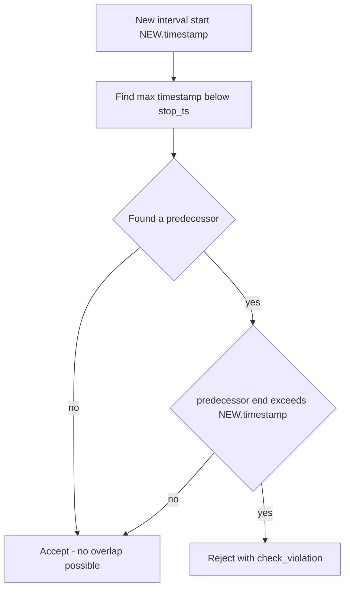

# 58 - Optimize the measurements overlap guard (fix slow inserts after V14)

Status: done

## Problem

Since migration [`V14__add_measurements_resolution.sql`](backend/migrations/V14__add_measurements_resolution.sql:1),
measurement inserts became noticeably slower, and the slowdown grows with the
amount of history already in the `measurements` table. This affects every
ingest path that writes measurements: [`save_batch()`](backend/src/adapter/driven/postgres/measurement_repository.rs:47)
(used by the incremental data-source update in
[`update_data_source()`](backend/src/core/application/data_import_service.rs:368))
and [`save()`](backend/src/adapter/driven/postgres/measurement_repository.rs:24).

## Root cause

V14 introduced a `BEFORE INSERT OR UPDATE` row trigger,
[`measurements_no_overlap_guard()`](backend/migrations/V14__add_measurements_resolution.sql:74),
that rejects any row whose interval intersects an existing row of the same
`(channel_id, resolution_seconds)`. The guard runs for **every inserted row** —
including rows later skipped by `ON CONFLICT DO NOTHING` — and its body does:

```sql
IF EXISTS (
    SELECT 1 FROM measurements m
    WHERE m.channel_id = NEW.channel_id
      AND m.resolution_seconds = NEW.resolution_seconds
      AND m.timestamp < stop_ts
      AND COALESCE(m.interval_end, m.timestamp + m.resolution_seconds * interval '1 second') > NEW.timestamp
      AND NOT (m.timestamp = NEW.timestamp AND m.resolution_seconds = NEW.resolution_seconds)
) THEN ...
```

The predicate `m.timestamp < stop_ts` is an **unbounded range** on the leading
timestamp column of [`measurements_channel_resolution_time_idx`](backend/migrations/V14__add_measurements_resolution.sql:67).
The `COALESCE(...) > NEW.timestamp` term is derived and therefore not indexable,
so Postgres cannot stop at the nearest row; it scans forward through the entire
`(channel_id, resolution_seconds)` history looking for the first row that
satisfies both conditions. Since almost no historical row satisfies the interval
condition, that is effectively a full scan of that channel's history per row.

Net effect: each inserted row costs `O(history)`, and a multi-row batch costs
`O(batch_size × history)`. During a fresh multi-year import this compounds
batch-over-batch into roughly quadratic behavior, which matches "a bit slow
after Migration 14".

## Fix

Replace the trigger body with a **single nearest-predecessor lookup**. Because
the guard itself keeps intervals non-overlapping per
`(channel_id, resolution_seconds)`, interval ends are monotonically
non-decreasing with timestamp. It is therefore sufficient to look only at the
row with the greatest `timestamp` below the new interval end:

- if that row starts inside the new interval (`>= NEW.timestamp`), it overlaps;
- if it starts before the new interval, it overlaps iff its interval end
  exceeds `NEW.timestamp`; since it is the nearest predecessor it has the
  largest end, so if it does not overlap no earlier row can.

That single lookup is served by the existing btree index
[`measurements_channel_resolution_time_idx`](backend/migrations/V14__add_measurements_resolution.sql:67)
via `ORDER BY m.timestamp DESC LIMIT 1`, turning each row check from `O(history)`
into `O(log n)`.



## Change

### 1. New migration `V15__optimize_measurements_overlap_guard.sql`

Do **not** edit V14 — it is already applied to existing databases. Add a new
migration that only replaces the function (the trigger already references it by
name, so no trigger drop/recreate is required):

```sql
-- Optimized overlap guard: replace V14's unbounded EXISTS scan with a single
-- nearest-predecessor lookup served by measurements_channel_resolution_time_idx.
CREATE OR REPLACE FUNCTION measurements_no_overlap_guard() RETURNS trigger
LANGUAGE plpgsql AS $$
DECLARE
    stop_ts timestamptz := COALESCE(
        NEW.interval_end,
        NEW.timestamp + NEW.resolution_seconds * interval '1 second'
    );
    predecessor timestamptz;
    predecessor_stop timestamptz;
BEGIN
    SELECT m.timestamp,
           COALESCE(
               m.interval_end,
               m.timestamp + m.resolution_seconds * interval '1 second'
           )
      INTO predecessor, predecessor_stop
      FROM measurements m
     WHERE m.channel_id = NEW.channel_id
       AND m.resolution_seconds = NEW.resolution_seconds
       AND m.timestamp < stop_ts
       AND NOT (
           m.timestamp = NEW.timestamp
           AND m.resolution_seconds = NEW.resolution_seconds
       )
     ORDER BY m.timestamp DESC
     LIMIT 1;

    IF FOUND AND predecessor_stop > NEW.timestamp THEN
        RAISE EXCEPTION 'overlapping measurement interval (channel %, resolution %, timestamp %)',
            NEW.channel_id, NEW.resolution_seconds, NEW.timestamp
            USING ERRCODE = 'check_violation';
    END IF;
    RETURN NEW;
END $$;
```

Semantics preserved:

- **Back-to-back rows** (predecessor end `<=` new start) are still accepted.
- **Different resolutions at the same timestamp** are still independent, because
  the lookup is scoped to `resolution_seconds = NEW.resolution_seconds`.
- **Idempotent re-import** is still silent: the `NOT (m.timestamp = NEW.timestamp
  AND m.resolution_seconds = NEW.resolution_seconds)` filter skips the identical
  row so `ON CONFLICT DO NOTHING` can swallow it, and the scan stops at the true
  previous row.
- The error message and `ERRCODE = 'check_violation'` stay identical.

### 2. No Rust code change

[`measurement_repository.rs`](backend/src/adapter/driven/postgres/measurement_repository.rs:47)
and the import service are unchanged; the optimization is entirely inside the
database.

## Alternatives considered (rejected)

- **GiST exclusion constraint** (the "proper" solution): requires the
  `btree_gist` extension and a `tstzrange` exclusion over a large history. V14
  deliberately avoided this because building the index is ~30x slower than a
  btree build. More moving parts for no additional benefit here.
- **Disabling the guard during batch import**: unsafe — it would drop the only
  corruption protection.
- **A partial/timestamp-bounded index**: unnecessary; the existing btree index
  already supports the targeted lookup.

## Verification

- [`make test`](Makefile) runs the Postgres repository tests against a Docker
  test container, including
  [`rejects_overlapping_intervals_at_the_same_resolution()`](backend/src/adapter/driven/postgres/measurement_repository.rs:1497),
  the adjacent-row acceptance case, and idempotent re-insert cases — these
  exercise the replaced function directly.
- Optionally confirm on a populated DB: `EXPLAIN (ANALYZE) INSERT INTO
  measurements ...` should now show an index-only/backward index scan on
  `measurements_channel_resolution_time_idx` instead of a wide range scan.

## Definition of done

- [x] `V15__optimize_measurements_overlap_guard.sql` added
- [x] `make check` green
- [x] `make test` green (repository tests exercise the new trigger)
- [x] `make coverage` green
