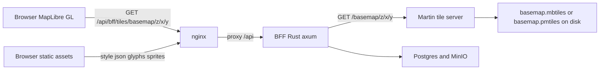

# 59 - Self-hosted vector basemap (Martin + MapLibre GL) behind the BFF

Status: implemented

## Problem

The map loads CARTO Voyager raster tiles straight from
`https://{s}.basemaps.cartocdn.com/rastertiles/voyager/...` in three Leaflet
components:

- [`MapView.tsx`](../frontend/src/features/map/MapView.tsx:75)
- [`DetailMap.tsx`](../frontend/src/features/stationDetail/DetailMap.tsx:60)
- [`SummaryMap.tsx`](../frontend/src/features/stationsSummary/SummaryMap.tsx:37)

That CDN is free and keyless today, but it is a third-party dependency outside
the stack. The backlog asks to stop relying on a hosted tile provider (which may
start requiring an API key) and self-host the basemap. The chosen direction is
**modern vector tiles served by Martin behind the BFF**, with the frontend moved
from Leaflet to **MapLibre GL**.

## Decision

- **Tile server:** Martin (`ghcr.io/maplibre/martin:1.14.0`), a Rust tile server
  that serves Mapbox Vector Tiles (MVT) from an `.mbtiles` / `.pmtiles` file. It
  runs as an internal docker-compose service reachable only by the backend.
  Version 1.14.0 is pinned because the older `v0.16.0` had file-source bugs that
  rejected hand-built tiles and even 404'd a valid `.mbtiles`.
- **Frontend:** MapLibre GL JS via `@vis.gl/react-maplibre` + `maplibre-gl`,
  replacing `leaflet`, `react-leaflet` and `@types/leaflet`. `maplibre-gl` is
  `^6.6.0` (newest). maplibre-gl 6 runs its tile parsing in a separate Web
  Worker asset that the bundler does not emit on its own; [`lib/map.tsx`](../frontend/src/lib/map.tsx:1)
  bundles it with Vite (`?worker&url`) and registers it via `setWorkerUrl()`
  before any map is created.
- **Request path:** Browser → nginx (`/api/`) → BFF (Rust) → Martin. nginx
  already forwards `/api/` to the backend, so the existing nginx location covers
  the new tile route with no nginx change.
- **Two vector sources.** A coarse **world** source (zoom 0–10: oceans +
  continents from Natural Earth via the `world-atlas` devDependency) so the map
  is never blank when zoomed out and Germany is covered up to the zoom where the
  detailed basemap takes over, and a detailed **basemap** source (OpenMapTiles
  schema, zoom 5–14) covering Germany. Martin serves both files as separate
  sources (`world`, `basemap`) and the style paints world water/land first, then
  the Germany layers on top.
- **Germany OSM data:** an OpenMapTiles-schema `.pmtiles` built once from a
  Geofabrik **Germany** extract with Planetiler and mounted read-only into
  Martin. OpenFreeMap pre-built tiles are the documented fallback when a local
  build is not desired.
- **Deterministic e2e tiles:** for the test gate, the generator produces a
  synthetic `world.mbtiles` (~1.4M tiles, z0-10) **and** `basemap.mbtiles`
  (Münster, z12-14) via `vt-pbf` + `topojson-client` + `node:sqlite`, so the e2e
  suite asserts real tile responses for both sources through the BFF proxy
  without downloading gigabytes of data. The world archive is **cached** (inserts
  run in a single transaction; the generator skips regeneration when the MBTiles
  `maxzoom` metadata is already ≥ 10), so repeated runs skip the ~50 s / 139 MB
  build.
- **Style, glyphs and sprites** are vendored into `frontend/public/` and served
  by nginx as static assets; the style points its tiles at the same-origin BFF
  proxy.

## Architecture

Martin serves the file source under the id derived from the file name, so the
upstream tile URL is `http://martin:3000/basemap/{z}/{x}/{y}` (extension-less)
and the browser-facing URL is `/api/bff/tiles/basemap/{z}/{x}/{y}`.

## Tile data provisioning (external prerequisite)

Martin does not render a basemap; it serves tiles from data the repo provides.
For local/e2e runs this is either a generated fixture or a one-time data
preparation step:

1. **Synthetic e2e fixture (zero-download).** Run
   `node frontend/scripts/generate-test-tiles.mjs` to produce
   `tiles/world.mbtiles` (z0-10 Natural Earth world, cached) **and**
   `tiles/basemap.mbtiles` — a small basemap (a clean full-extent `landcover`
   fill; the placeholder `transportation` line was removed) covering Münster at
   zoom 12-14 via `vt-pbf` and `node:sqlite`. The e2e orchestrator generates it
   before `docker compose up` and removes only `basemap.mbtiles` in cleanup,
   keeping the cached world archive.
2. **Build the pmtiles (recommended for real use).** Download the Geofabrik
   Germany `.osm.pbf` and run Planetiler to produce `tiles/basemap.pmtiles` in
   the OpenMapTiles schema. This is a local build with a documented script
   committed under `scripts/build_tiles.sh`; the resulting file is git-ignored
   and mounted by docker-compose.
3. **Alternative.** Download a pre-built OpenFreeMap or OpenMapTiles pmtiles and
   place it at the same path. The rest of the stack is identical.
4. **Vendor the style assets.** Copy the chosen style JSON into
   `frontend/public/styles/basemap.json`, rewrite its `sources` tile URL to
   `/api/bff/tiles/basemap/{z}/{x}/{y}`, and vendor the matching glyphs
   (`frontend/public/glyphs/...`) and sprites (`frontend/public/sprites/...`)
   with their URLs rewritten to local `/glyphs/...` and `/sprites/...`.

## Backend changes

### 1. Martin service in [`docker-compose.yml`](../docker-compose.yml)

Add a `martin` service:

- `image: ghcr.io/maplibre/martin:1.14.0` (pinned; `v0.16.0` fails on file
  sources).
- `volumes: ["./tiles:/data:ro"]`.
- `entrypoint`: a small `sh` guard that `exec martin /data/basemap.mbtiles`
  (preferred) or `/data/basemap.pmtiles`, or prints a clear "waiting for tile
  data" message and sleeps while no tile file is present (the image `ENTRYPOINT`
  is `martin`, so positional args are connection strings — a missing file would
  otherwise crash-loop on `Unrecognizable connection string`).
- `networks: [tile_network]` (new internal network, no host port published).
- `healthcheck`: `wget -q -O /dev/null http://localhost:3000/catalog`.
- Add the backend service to `tile_network` so it can resolve `martin`.
- Declare the new `tile_network` with `internal: true` next to `asset_network`.

### 2. BFF tile proxy

Add a new driving-adapter module `src/adapter/driving/rest/tiles.rs`:

- Constant `MARTIN_UPSTREAM: &str = "http://martin:3000"` (the internal service
  name/port, like the fixed `addr` and DB hostname).
- Handler `get_tile_proxy(Path(path): Path<String>) -> impl IntoResponse` that:
  1. Rejects a path containing `..`, `\`, or characters outside
     `[A-Za-z0-9/._-]` (open-proxy/path-traversal guard).
  2. Builds `http://martin:3000/{path}`.
  3. Fetches it with `ureq` inside `tokio::task::spawn_blocking` (matching the
     existing blocking HTTP/database pattern; tiles are small so buffering is
     fine and avoids a new HTTP client dependency).
  4. Returns the bytes with the upstream `Content-Type` passed through, plus a
     `Cache-Control: public, max-age=86400` header. Non-2xx upstream responses
     map to `502 Bad Gateway`; empty vector tiles from Martin arrive as `204`
     and are passed through.
- Register `.route("/api/bff/tiles/*path", get(get_tile_proxy))` in
  [`rest/mod.rs`](../backend/src/adapter/driving/rest/mod.rs:87) (axum 0.7
  wildcard syntax `*path`, matching the existing `:id` style).

No core/domain change: the tile proxy is pure infrastructure in the driving
adapter and needs no port or service.

### 3. Backend test

In [`rest/tests/`](../backend/src/adapter/driving/rest/tests/mod.rs), add a unit
test for the path validation and upstream-URL mapping (inject the upstream as a
function parameter or test the pure helper directly), covering the traversal
rejection and the `/api/bff/tiles/basemap/1/2/3` mapping.

## Frontend changes

### 4. Dependencies and bootstrap

- `package.json`: add `maplibre-gl` and `@vis.gl/react-maplibre`; remove
  `leaflet`, `react-leaflet`, `@types/leaflet`.
- Delete [`lib/leaflet.ts`](../frontend/src/lib/leaflet.ts:1); add
  `lib/map.ts` importing `maplibre-gl/dist/maplibre-gl.css`, re-exporting the
  marker asset, and building the DOM marker element (an `` carrying `alt`
  and `title` set to the station name for the e2e locators and a11y).

### 5. Shared base map

Add `features/map/BaseMap.tsx` as the single MapLibre wrapper used by all three
maps. It owns the MapLibre lifecycle (via `@vis.gl/react-maplibre`, which handles
React StrictMode), loads `/styles/basemap.json`, renders an attribution control,
reports bounds on `moveend`, and exposes the map instance via `onReady`.

### 6. Per-view rewrites

- [`MapView.tsx`](../frontend/src/features/map/MapView.tsx:35): MapLibre map +
  `<Marker>` per station (DOM marker with `alt`/`title`); marker click stops
  propagation, opens the popup and calls `onSelectStation`; map void click clears
  the popup and calls `onDeselect`. The popup keeps the station-name link and
  the "Open detail page" icon link. The navigation/zoom control moves to the
  top-right as today.
- [`MapController.tsx`](../frontend/src/features/map/MapController.tsx:9): fold
  its bounds/ready reporting into `BaseMap` (or keep as a thin `useMapEvents`
  equivalent on the MapLibre `moveend` event).
- [`DetailMap.tsx`](../frontend/src/features/stationDetail/DetailMap.tsx:18):
  non-interactive MapLibre preview (no drag/zoom) centered on the station with
  the highlighted marker; clicking anywhere opens the map view at the preview
  bounds.
- [`SummaryMap.tsx`](../frontend/src/features/stationsSummary/SummaryMap.tsx:11):
  MapLibre map fitted to the URL bounds; clicking a flag toggles the disabled
  state (stop propagation) and applies the grayscale class to the marker element.

### 7. Shared helpers and CSS

- [`lib/geo.ts`](../frontend/src/lib/geo.ts:70): change `mapBounds` to accept a
  `maplibregl.Map` and read `getBounds().getWest()/getSouth()/getEast()/getNorth()`;
  keep the `Bounds` interface unchanged so the BFF query params and URL helpers
  stay stable.
- [`MapPage.tsx`](../frontend/src/features/map/MapPage.tsx:36): type `mapRef` as
  `maplibregl.Map | null` and use `map.flyTo({ center, zoom, duration })`.
- [`index.css`](../frontend/src/index.css:96): remove the Leaflet-specific
  overrides (`.leaflet-container img`, `.leaflet-disabled-marker`); add marker
  sizing overrides and a `.station-marker--disabled` grayscale rule.

## e2e changes

Update [`helpers.ts`](../frontend/e2e/helpers.ts:25) and the specs so locators
match MapLibre instead of Leaflet:

- `mapMarkers` selects the new `.station-marker` element instead of
  `.leaflet-marker-icon`.
- Replace `.leaflet-container` with the map container class (e.g. `.map-canvas`
  or the MapLibre container) in `map.spec.ts`, `sidebar.spec.ts` and
  `detail.spec.ts`.
- Replace `.leaflet-popup-content` with the new popup class in `map.spec.ts`.
- Replace `.leaflet-disabled-marker` with `.station-marker--disabled` in
  `summary.spec.ts` (the grayscale CSS assertion stays).
- Keep the keyboard `+` zoom assertions working by enabling MapLibre keyboard
  navigation explicitly on the map options.

## Definition of done

- [x] `docker compose up` starts Martin; the BFF tile proxy route
      `/api/bff/tiles/*path` is wired and forwards to Martin (returns `502`
      while no tile file is mounted, see
      [`tiles/README.md`](../tiles/README.md:1)).
- [x] The three maps render the vector basemap and station markers/popups via
      MapLibre GL with no Leaflet dependency left.
- [x] `make frontend-build` green (tsc + vite).
- [x] `make check`, `make test` (431) and `make test-rest` (95) green.
- [x] `make coverage` green (overall 87.43%, core 95.70%).
- [x] `make test-playwright` green (22/22) including the tile-load assertion
      (`map.spec.ts`) that waits for a `200` `/api/bff/tiles/basemap/` response
      and checks the protobuf body, plus a `200` world tile
      (`/api/bff/tiles/world/2/2/1`) for the coarse global source.
- [x] The zoomed-out world view renders from the coarse `world` source (z0-10)
      and the Germany detail renders from the `basemap` source, with the frontend
      on `maplibre-gl@^6.6.0` (worker bundled via `?worker&url`).
- [x] `README.md` and the plan status updated.

## Implementation notes / risks

- **Tile data is a local asset, not a git artifact.** `.mbtiles` / `.pmtiles`
  are git-ignored; `scripts/build_tiles.sh` documents how to produce the real
  basemap and `generate-test-tiles.mjs` produces the synthetic e2e fixture. The
  e2e gate stays meaningful because the fixture is generated before the stack
  starts and the tile assertion checks a real `200` protobuf response.
- **Attribution.** OSM attribution must remain visible; keep it in the style
  source or the MapLibre attribution control.
- **Axum wildcard.** Use the axum 0.7 wildcard form `*path` (the codebase already
  uses the 0.7 `:id` form).
- **Glyphs/sprites.** These are needed for text labels and icons on the vector
  style; vendoring them into `frontend/public/` keeps the basemap fully
  self-hosted.
- **Marker clicks bubble to the map (found by the e2e gate).** In MapLibre the
  markers are DOM children of the map container, so a marker click also bubbles
  to the container and `@vis.gl/react-maplibre` fires the map `onClick` — which
  closed the popup/overview immediately after opening. Fixed by guarding the
  void-click in [`BaseMap.tsx`](../frontend/src/features/map/BaseMap.tsx:1)
  (ignore clicks landing on `.maplibregl-marker` / `.maplibregl-popup`) and
  calling `stopPropagation` in the marker handlers.
- **`@vis.gl/react-maplibre` 8.x has no `bounds` init prop.** The map is fitted
  to a shared/selected view with `map.fitBounds` in `BaseMap`'s `onLoad`.
- **Martin 1.14.0 over v0.16.0 (found when testing the container).** `v0.16.0`
  rejected hand-built tiles (`InvalidMetadata`, `UnsupportedCompression`) and
  even returned 404 for a valid `.mbtiles`; 1.14.0 serves the `.mbtiles` at
  extension-less `/basemap/{z}/{x}/{y}` with `application/x-protobuf`. The
  image's `ENTRYPOINT` is `martin`, so positional args are connection strings; a
  missing tile file crash-loops on `Unrecognizable connection string`. The
  compose service overrides `entrypoint` with a `sh` guard: it `exec martin
  /data/basemap.mbtiles` (preferred) or `/data/basemap.pmtiles`, or prints a
  clear "waiting for tile data" message and sleeps until a tile file is dropped
  into `./tiles`.
- **MapLibre v5 needs absolute tile URLs (found by the e2e tile assertion).**
  MapLibre fetches tiles with `new Request(...)`, which throws on a relative
  URL, while `new URL(relative, location.href)` percent-encodes the
  `{z}/{x}/{y}` placeholders (`%7Bz%7D` → 400). `BaseMap` therefore fetches the
  style at runtime and rewrites tile URLs to `window.location.origin + tile`.
- **Versions.** `@vis.gl/react-maplibre@^8.1.2` (peer `maplibre-gl >= 4`) with
  `maplibre-gl@^6.6.0`.
- **maplibre-gl 6 worker (root cause of "no tile requests").** With 6.x the map
  constructed and loaded the style/sources but issued **zero** tile requests and
  the `load` event never fired (verified with a headless probe + source trace):
  maplibre-gl 6 parses vector tiles in a separate Web Worker
  (`maplibre-gl-worker.mjs`), which also imports `./maplibre-gl-shared.mjs`, and
  computes the worker URL from the bundled chunk's `import.meta.url` — a URL the
  Vite build never served. Fixed in [`lib/map.tsx`](../frontend/src/lib/map.tsx:1)
  by `import maplibreWorkerUrl from 'maplibre-gl/dist/maplibre-gl-worker.mjs?worker&url'`
  (Vite bundles the worker + its shared import) and `setWorkerUrl(maplibreWorkerUrl)`.
  After the fix the probe shows both `world` and `basemap` tiles requested.
- **`make run` provisions tiles automatically.** `make run` depends on the new
  `make tiles` target (runs `generate-test-tiles.mjs`), so Martin always has data
  and the BFF never answers `502` after a clean checkout / stack reset. The
  generator writes `basemap.mbtiles` only when `basemap.pmtiles` is absent, so a
  real Germany OSM build is never shadowed. When using `docker compose up`
  directly, run `make tiles` once first.
- **Synthetic detail tiles are a clean land fill.** The dev/e2e
  `basemap.mbtiles` draws only a full-extent `landcover` polygon per tile. The
  earlier diagonal `transportation` placeholder line rendered as "flying lines"
  over the screen and was removed; real roads come from the Germany OSM build.
- **World + Germany in one style.** The style has two vector sources (`world`,
  `basemap`); `BaseMap` rewrites **every** vector source's `tiles` to absolute
  URLs at runtime (not just `basemap`).
- **Compose entrypoint guard.** The martin guard builds the source list from
  whichever of `world.mbtiles`, `basemap.mbtiles`, `basemap.pmtiles` exist and
  `exec martin "$@"`. Literal `$` in the sh script is written `$$` so
  docker-compose does not interpolate it from the host environment (the guard
  otherwise saw an empty `$SOURCES` and always waited).
- **Playwright waits capped at 10 s.** `expect.timeout` (config) and the tile
  `waitForResponse` are 10 s, so a single slow request cannot hang the suite for
  minutes (a 30 s wait plus the import polling previously made `make
  test-playwright` appear stuck).
- **Gate results.** `make check`, `make test` (431), `make test-rest` (95),
  `make coverage` (overall 87.43%, core 95.70%), `make frontend-build`
  (tsc + vite), `make test-playwright` (22/22) including the basemap and world
  tile-load assertions.
