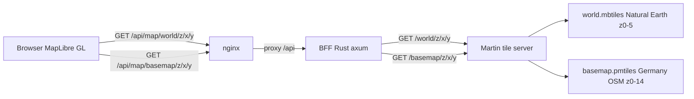

# 61 - Simplified self-hosted vector basemap (Martin + MapLibre)

Status: implemented — supersedes 59 and 60 (which were reverted)

## Problem

Plans 59 and 60 self-hosted the vector basemap but overcomplicated it, and the
result had rendering issues. They were reverted, so the repo is back to the
pre-59 Leaflet + CARTO raster-tile state. This plan rebuilds the self-hosted
basemap from scratch, keeping only the essentials:

- Latest stable versions of the frontend map stack and Martin.
- The architecture chain, unchanged:


- No caching (no `Cache-Control` on tiles, no cached tile archive).
- No pre-rendering (no synthetic placeholder tiles generated at build/test time).
- Zoom hierarchy: whole world when zoomed out, Germany at mid zoom, and the
  integrated cities (Münster, Bonn, Hamburg) at street zoom.

## Decisions

| Decision | Value |
|---|---|
| Tile route | `/api/map/*path` (the BFF proxy to Martin) |
| Martin version | latest stable `ghcr.io/maplibre/martin` (never `v0.16.0`, which rejects hand-built tiles) |
| Frontend map | `maplibre-gl` latest (6.x) + `@vis.gl/react-maplibre` latest, replacing `leaflet`/`react-leaflet` |
| World source | `tiles/world.mbtiles` — Natural Earth land/ocean, zoom **0–5** |
| Germany source | `tiles/basemap.pmtiles` — Germany OSM (OpenMapTiles schema), zoom **0–14**, built once by Planetiler |
| Cities | covered by the Germany extract at z12–14; no separate city extract |
| Caching | none |
| Synthetic detail tiles | removed entirely |

The world backdrop is Natural Earth (the only non-OSM layer). It is the standard
low-zoom context for OSM-based vector basemaps and the only practical way to show
the whole world without a ~100 GB planet build. The Germany/city detail is real
OSM-derived data.

## Zoom coverage

| Zoom | Source | Shows |
|---|---|---|
| 0–5 | `world` | whole world: ocean + continents (Natural Earth) |
| 5–12 | `basemap` | Germany: water, landcover, landuse, major/minor roads, boundaries |
| 12–14 | `basemap` | street detail of the integrated cities (within the Germany extract) |

## Architecture



Martin serves each file under the id derived from its file stem (extension-less):
`/world/{z}/{x}/{y}` and `/basemap/{z}/{x}/{y}`. The BFF exposes those at
`/api/map/world/{z}/{x}/{y}` and `/api/map/basemap/{z}/{x}/{y}`.

## Backend changes

### 1. BFF tile proxy (`backend/src/adapter/driving/rest/tiles.rs`, new)

- Constant `MARTIN_UPSTREAM: &str = "http://martin:3000"` (internal service
  name/port; the compose service `martin` is only on the internal `tile_network`).
- Handler `get_tile_proxy(Path(path): Path<String>) -> Response`:
  1. Rejects a path containing `..`, `\`, or characters outside
     `[A-Za-z0-9/._-]` (open-proxy/path-traversal guard).
  2. Builds `http://martin:3000/{path}`.
  3. Fetches it with `ureq` inside `tokio::task::spawn_blocking` (matches the
     existing blocking HTTP/database pattern; tiles are small so buffering is
     fine — `ureq` is already a dependency).
  4. Returns the bytes with the upstream `Content-Type` passed through.
     **No `Cache-Control` header** (no caching). Non-2xx upstream responses map
     to `502 Bad Gateway`; empty vector tiles from Martin arrive as `204` and are
     passed through.
- Unit tests: mapping `basemap/5/16/11` → `http://martin:3000/basemap/5/16/11`,
  allowing nested paths, and rejecting traversal/unsafe characters.

### 2. Register the route

[`backend/src/adapter/driving/rest/mod.rs`](../backend/src/adapter/driving/rest/mod.rs:88):
add `pub mod tiles;` to the module list, import `get_tile_proxy`, and register
`.route("/api/map/*path", get(get_tile_proxy))` (axum 0.7 wildcard `*path`).
nginx already forwards `/api/` wholesale, so no nginx change is needed.

## docker-compose changes

### 3. Martin service (`docker-compose.yml`)

Add a `martin` service:

- `image: ghcr.io/maplibre/martin:1.14.0` (or a newer stable release; never
  `v0.16.0`).
- `volumes: ["./tiles:/data:ro"]`.
- A minimal `entrypoint` guard that serves whichever of `/data/world.mbtiles`
  and `/data/basemap.pmtiles` exist, else prints a clear "waiting for tile data"
  message and sleeps (the image `ENTRYPOINT` is `martin`, so positional args are
  connection strings — a missing file would otherwise crash-loop on
  `Unrecognizable connection string`). `$` is written `$$` so docker-compose
  does not interpolate it.
- `networks: [tile_network]` (new internal network, no host port published);
  add the backend service to `tile_network` so it can resolve `martin`; declare
  `tile_network: { internal: true }` next to `asset_network`.
- `healthcheck`: `wget -q -O /dev/null http://localhost:3000/catalog`.
- `depends_on`: a one-shot `basemap` init container
  (`condition: service_completed_successfully`), so martin only starts once the
  Germany basemap exists.

### 3b. Germany basemap init container (`docker-compose.yml`)

A `basemap` service (the `minio-init` pattern) that builds
`tiles/basemap.pmtiles` with Planetiler into the shared `./tiles` volume:

- `image: eclipse-temurin:21-jre` (has Java 21 + curl + bash).
- `restart: "no"`; `volumes: ["./tiles:/data"]` (read-write for the build);
  `environment: [SKIP_BASEMAP]` (host passthrough).
- Inline `entrypoint` that: skips when `SKIP_BASEMAP=1` or
  `/data/basemap.pmtiles` already exists; downloads `planetiler.jar` on first
  run; then runs Planetiler with the low-RAM profile
  (`-Xmx8g`, `--nodemap-type=sparse`, `--storage=mmap`, overridable via
  `JAVA_MEM`/`NODEMAP_TYPE`/`STORAGE`) so the build fits a 14 GB host even while
  the rest of the stack runs.
- Java runs **only inside this container** — the host needs no Java/Rust
  toolchain (this is why the plan avoids a host-side build tool).

## Frontend changes

### 4. Dependencies (`frontend/package.json`)

- Add `maplibre-gl` and `@vis.gl/react-maplibre` (latest).
- Remove `leaflet`, `react-leaflet`, `@types/leaflet`.
- Add devDependencies `vt-pbf`, `topojson-client`, `world-atlas` (used only by
  the world backdrop builder).

### 5. Map bootstrap (`frontend/src/lib/map.tsx`, new; delete `lib/leaflet.ts`)

- Import `maplibre-gl/dist/maplibre-gl.css`.
- **Essential worker fix**: `import maplibreWorkerUrl from 'maplibre-gl/dist/maplibre-gl-worker.mjs?worker&url'`
  + `setWorkerUrl(maplibreWorkerUrl)` before any map is created (maplibre-gl 6
  parses tiles in a separate Web Worker the bundler does not emit on its own;
  without this zero tiles are fetched and `load` never fires).
- Export `markerUrl` (the brand pin SVG) and `stationMarkerImage(name, options)`:
  a DOM `` with classes `station-marker` (+ `station-marker--disabled` /
  `station-marker--large`) carrying `alt`/`title` = station name (used by the
  e2e locators and a11y).

### 6. Shared base map (`frontend/src/features/map/BaseMap.tsx`, new)

The single MapLibre wrapper used by all three maps (via `@vis.gl/react-maplibre`,
which handles React StrictMode):

- `MAP_STYLE = '/styles/basemap.json'`; `DEFAULT_CENTER = { longitude: 7.63,
  latitude: 51.96, zoom: 13 }`.
- Fetches the style at runtime and rewrites every vector source's `tiles` to
  absolute URLs (`window.location.origin + tile` via string concatenation, NOT
  `new URL`, which percent-encodes the `{z}/{x}/{y}` placeholders) — maplibre-gl
  6 throws on relative tile URLs.
- Map options: `renderWorldCopies={false}`, `maxZoom={14}` (world caps at z5,
  Germany at z14), attribution control, optional `interactive`/`scrollZoom`,
  `initialViewState`, `bounds` (fitted on `load` via `map.fitBounds`), keyboard
  zoom.
- Reports bounds on `moveend` (`mapBounds(map)`) and `onReady` with the map
  instance.
- **Marker-click guard**: ignore `onClick` events landing on
  `.maplibregl-marker` / `.maplibregl-popup` so the popup/overview does not close
  immediately after opening.
- `onVoidClick(map)` fired for clicks outside markers/popups.

### 7. Per-view rewrites

- [`MapView.tsx`](../frontend/src/features/map/MapView.tsx:1): MapLibre `BaseMap`
  + `<Marker>` per station (DOM marker via `stationMarkerImage`); marker click
  stops propagation, opens a `.station-popup` DOM popup (station-name link + the
  "Open detail page" icon link) and calls `onSelectStation`; map void click calls
  `onDeselect`; navigation control top-right; `onReady`/`onBounds` from `BaseMap`.
- Delete `MapController.tsx` (its bounds/ready reporting moves into `BaseMap`).
- [`DetailMap.tsx`](../frontend/src/features/stationDetail/DetailMap.tsx:1):
  non-interactive MapLibre preview (`interactive={false}`, `scrollZoom={false}`)
  centered on the station with the large highlighted marker; a click anywhere
  opens the map view at the preview bounds.
- [`SummaryMap.tsx`](../frontend/src/features/stationsSummary/SummaryMap.tsx:1):
  MapLibre map fitted to the URL bounds; clicking a flag toggles the disabled
  state (stop propagation) and applies the `station-marker--disabled` class to
  the marker element.

### 8. Shared helpers, page and CSS

- [`geo.ts`](../frontend/src/lib/geo.ts:70): change `mapBounds` to accept a
  `maplibregl.Map` and read `getBounds().getWest()/getSouth()/getEast()/getNorth()`;
  keep the `Bounds` interface and all other helpers unchanged.
- [`MapPage.tsx`](../frontend/src/features/map/MapPage.tsx:36): type `mapRef` as
  `maplibregl.Map | null` and use `map.flyTo({ center, zoom, duration })`.
- [`index.css`](../frontend/src/index.css:96): remove the Leaflet overrides
  (`.leaflet-container img`, `.leaflet-disabled-marker`); add marker sizing
  overrides and a `.station-marker--disabled { filter: grayscale(1) opacity(0.55) }`
  rule.

### 9. Style (`frontend/public/styles/basemap.json`, new)

```json
{
  "version": 8,
  "name": "Bike counter basemap (Natural Earth world + Germany OSM)",
  "sources": {
    "world": {
      "type": "vector",
      "tiles": ["/api/map/world/{z}/{x}/{y}"],
      "maxzoom": 5,
      "attribution": "© OpenStreetMap contributors, Natural Earth"
    },
    "basemap": {
      "type": "vector",
      "tiles": ["/api/map/basemap/{z}/{x}/{y}"],
      "maxzoom": 14,
      "attribution": "© OpenStreetMap contributors"
    }
  },
  "layers": [
    { "id": "background", "type": "background", "paint": { "background-color": "#e8e6e0" } },
    { "id": "world-water", "type": "fill", "source": "world", "source-layer": "water", "maxzoom": 5, "paint": { "fill-color": "#a5c6e3" } },
    { "id": "world-land", "type": "fill", "source": "world", "source-layer": "landcover", "maxzoom": 5, "paint": { "fill-color": "#e8e6e0" } },
    { "id": "de-water", "type": "fill", "source": "basemap", "source-layer": "water", "minzoom": 5, "paint": { "fill-color": "#a5c6e3" } },
    { "id": "de-landcover", "type": "fill", "source": "basemap", "source-layer": "landcover", "minzoom": 5, "paint": { "fill-color": "#d7dcc4" } },
    { "id": "de-landuse", "type": "fill", "source": "basemap", "source-layer": "landuse", "minzoom": 5, "paint": { "fill-color": "#e0e0d0" } },
    { "id": "de-transportation", "type": "line", "source": "basemap", "source-layer": "transportation", "minzoom": 5, "paint": { "line-color": "#ffffff", "line-width": 1.2 } },
    { "id": "de-boundary", "type": "line", "source": "basemap", "source-layer": "boundary", "minzoom": 5, "paint": { "line-color": "#9a9a9a", "line-width": 1 } },
    { "id": "de-building", "type": "fill", "source": "basemap", "source-layer": "building", "minzoom": 13, "paint": { "fill-color": "#d6c9b8" } }
  ]
}
```

Rendering notes: source-layer names must match the OpenMapTiles schema
(`water`, `landcover`, `landuse`, `transportation`, `boundary`, `building`);
`building` exists only at z≥13 so its `minzoom` is 13; the `world` layers cap at
`maxzoom: 5` and the `basemap` layers start at `minzoom: 5` (the handoff).

## Tile data provisioning

### 10. World backdrop builder (`frontend/scripts/build-world-tiles.mjs`, new)

Trim the old `generate-test-tiles.mjs` approach: build only `tiles/world.mbtiles`
at zoom **0–5** (~1,365 tiles, ~2 MB) from the Natural Earth land data
(`world-atlas` + `topojson-client`), written with `vt-pbf` + `node:sqlite`, with
`water` and `landcover` layers at MVT `version: 2`. No caching, no Münster
detail, no `maxzoom` cache check. Keep the generator's self-check (a z2 tile
over Europe must contain land).

### 11. Germany basemap builder (init container + host script)

The default path is the one-shot `basemap` init container (see 3b): `docker
compose up` builds `tiles/basemap.pmtiles` automatically. For a manual/offline
build the committed `scripts/build_tiles.sh` runs the same Planetiler command on
the host (Java 21+; defaults to the low-RAM `mmap`/`sparse` profile with
`-Xmx10g`, overridable via `JAVA_MEM`/`STORAGE`/`NODEMAP_TYPE`). Verify through
the BFF: `curl http://localhost:8081/api/map/basemap/13/4269/2707` →
`200 application/x-protobuf`. `tiles/` stays git-ignored.

## Makefile

### 12. `tiles` target

[`Makefile`](../Makefile:20): add a `tiles` target running
`node frontend/scripts/build-world-tiles.mjs`, and make `make run` depend on it
(so a clean checkout still has the tiny world backdrop — it is ~2 MB and fast).
`tiles` only ever builds the world backdrop; Germany is built by the `basemap`
init container on `docker compose up`.

## e2e changes

### 13. Locators (`frontend/e2e/helpers.ts`)

`mapMarkers` selects `.station-marker` (the MapLibre DOM marker ``)
instead of `.leaflet-marker-icon`. Keep `sidebarBadge`/`waitForStations`.

### 14. Specs

- [`map.spec.ts`](../frontend/e2e/map.spec.ts): replace `.leaflet-popup-content`
  with `.station-popup`; replace `.leaflet-container` with `.maplibregl-map`;
  add a world-tile assertion (`/api/map/world/2/2/1` → `200`, content-type
  `protobuf`, non-empty body) proving the BFF→Martin chain. Keep all
  marker/popup/overview tests.
- [`summary.spec.ts`](../frontend/e2e/summary.spec.ts): replace
  `.leaflet-disabled-marker` with `.station-marker--disabled` (the grayscale CSS
  assertion stays).
- [`detail.spec.ts`](../frontend/e2e/detail.spec.ts): `.leaflet-container` count
  → `.maplibregl-map`.
- [`sidebar.spec.ts`](../frontend/e2e/sidebar.spec.ts): `.leaflet-container` →
  `.maplibregl-map` if referenced.

### 15. Orchestrator (`scripts/e2e-playwright.sh`)

Before `docker compose up`, run the world backdrop builder (no caching, no
detail) so Martin has a `world.mbtiles` to serve. Run `docker compose up` with
`SKIP_BASEMAP=1` so the slow Germany build is skipped (the e2e asserts the world
tile only; no Germany fixture exists in CI).

## Rendering gotchas the coder must preserve

These were the actual root causes in 59/60 — do not regress them:

1. **maplibre-gl 6 worker**: bundle `maplibre-gl-worker.mjs` with
   `?worker&url` and register via `setWorkerUrl()`. Without it: zero tile
   requests, `load` never fires.
2. **Absolute tile URLs**: `BaseMap` rewrites relative `tiles` to
   `window.location.origin + tile` at runtime (string concat, not `new URL`).
3. **Marker click bubbling**: guard void-clicks that land on
   `.maplibregl-marker` / `.maplibregl-popup`, and `stopPropagation` in marker
   handlers. Without it: the popup/overview closes immediately.
4. **Martin serves extension-less** `/world/{z}/{x}/{y}` and
   `/basemap/{z}/{x}/{y}`; the style must not append `.pbf`/`.mvt`.
5. **Planetiler default profile = OpenMapTiles schema**: the style's
   `source-layer` names must match it exactly.
6. **Compose `$$`**: literal `$` in the martin entrypoint sh script must be
   written `$$` so docker-compose does not interpolate it.

## Definition of done

- [x] plans 59/60 marked superseded.
- [x] BFF route `/api/map/*path` wired; no `Cache-Control` header.
- [x] Martin serves `world.mbtiles` + `basemap.pmtiles`; frontend renders the
      world zoomed out, Germany at mid zoom, and city streets at z12–14.
- [x] `make frontend-build` green (tsc + vite).
- [x] `make check`, `make test`, `make test-rest`, `make coverage` green.
- [x] `make test-playwright` green (world tile assertion through `/api/map/...`).
- [x] `README.md`, `tiles/README.md`, and this plan updated.

## Provisioning notes (added during implementation)

- The Germany basemap is built by the one-shot `basemap` init container
  (`eclipse-temurin:21-jre` + Planetiler) into the shared `./tiles` bind mount;
  `martin` waits for it (`service_completed_successfully`). Java runs only
  inside the container — the host needs no Java/Rust toolchain.
- Planetiler flags that had to be right: `--download` (fetches the extract +
  auxiliary files) and `--nodemap-type=sortedtable` (valid values are `noop`,
  `sortedtable`, `sparsearray`, `array` — `sparse`/`chunkedtable` crash
  Planetiler) with `--storage=mmap` and `-Xmx4g` so the build fits a 14 GB host.
- First build completed: `tiles/basemap.pmtiles` (3.1 GB, OpenMapTiles schema,
  z0–14). Verified through the BFF: `/api/map/world/2/2/1`,
  `/api/map/basemap/10/531/345` and `/api/map/basemap/13/4269/2707` all return
  `200 application/x-protobuf`.
- The basemap is a static OSM snapshot; refresh with `make basemap-update`
  (drops the cached pmtiles + extract, rebuilds, restarts martin).

## Follow-up tweaks (review feedback)

- **World coastline**: the world backdrop now uses Natural Earth **50m** land
  data (was 110m) in `frontend/scripts/build-world-tiles.mjs`, so the zoomed-out
  coastlines are visibly finer. Rebuild with `make tiles` (the e2e world-tile
  assertion still passes; the Europe tile grew from ~1.8 KB to ~16 KB).
- **Extra zoom level**: `BaseMap` `maxZoom` is **15** (was 14) — MapLibre
  overzooms the existing z0–14 Germany pmtiles, so one more street-zoom step
  needs no new layer or data. This also lets the detail-page preview's intended
  zoom 15 actually apply (previously clamped to 14).
